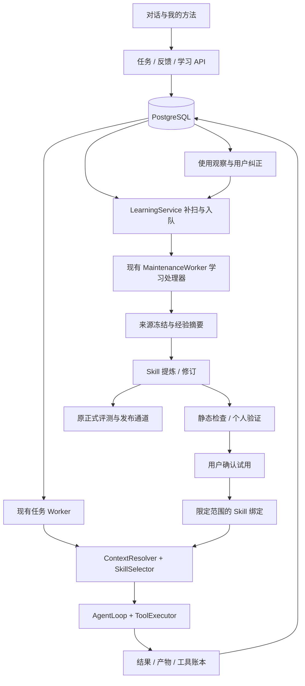

# EvoAgent：个人通用 Agent 与 Skill 自进化完整改造方案

> 日期：2026-10-08；本版已按 DSH 三轮评审复核并修订，逐项结论见第 19、19.1、19.2 节。源码核对基准：`583059a`；本文所有新类、新方法、新字段均为**待实施设计**，不是当前能力声明。
> 本文是本轮改造的设计与实施基准。原 M0～M7 计划保留为既有交付、评测与发布验收背景；冲突处按本文对本轮改造的明确决策执行，不能反向改写历史结果。本轮不替代、也不推进 M6/M7 正式验收；收益结论只能来自满足相应证据要求的 formal 路径，个人试用仅报告观察结果。
> 本次交付仅修改文档，不实施产品代码、不迁移数据库、不消耗模型预算。学习方式仍遵循[七天学习与教学计划](EvoAgent-七天面试学习与教学计划.md)。

## 0. 阅读方式与交付范围

- 第 1～3 节：产品目标、源码事实、整体设计。
- 第 4～10 节：数据模型、反馈、学习、使用、验证和持续修订，精确到类与方法。
- 第 11～14 节：执行效率、API、前端、配置和部署。
- 第 15～18 节：保留/删减清单、迁移、实施顺序与测试验收。
- 第 19 节：外部评审逐项处理、未直接采纳建议的理由。

文中的“新增路径”为目标文件名；未创建前不作为可点击文件链接。现有路径均按仓库根目录描述。类型签名是实施契约，DTO 放在对应模块 schema 文件，不能把示例直接当成已可运行代码。

## 1. 真实目标与设计决策

### 1.1 产品目标

构建单用户、本机优先的个人通用 Agent：能在授权范围内处理代码、个人资料和公开调研任务；从真实任务、用户纠正与结果核验中提炼和修订可复用 Skill；在新任务中选择适用方法；允许用户查看、停用和回退。

这里的自进化是**有证据的外部方法库更新**，不训练模型权重，不允许模型修改自身权限，也不把 Skill 数量增长当作进步。

必须形成以下连续过程：

```text
做任务 → 留下可核验结果 → 获得反馈 → 判断是否值得学习
  ↑                                     ↓
观察实际表现 ← 在新任务中正确使用 ← 验证、确认 ← 提炼或修订方法
```

### 1.2 本轮明确选定的方案

1. 保留 FastAPI、PostgreSQL、现有 Task/Run 与工具执行机制；不迁移到 JSONL，不重建一套通用 Agent 框架。
2. 执行与学习分成两条逻辑路径，共用数据库、模型适配器和工具基础设施。后台学习不阻塞已完成任务的交付。
3. 复用 `MaintenanceJobRecord` 和 `MaintenanceWorker` 作为后台任务基础，不再创建第二套学习队列表、第三套租约系统或新消息中间件。
4. 新增个人学习来源与个人试用绑定；保留正式评测发布路径，不能把“小样本试用有效”变成“正式评测已通过”。
5. Skill 仍为声明式操作参考，由模型使用现有工具完成。首轮不实现 Skill DAG 执行器、任意脚本包或自修改代码。
6. 合并两套 Skill 选择决策，使词法/混合检索共用作用域、适用性、预算和版本冻结规则。
7. 首个闭环使用一个真实任务家族做深，随后扩展到另外两类任务；架构保持通用，不在代码中硬编码“表格任务”。
8. 高频写库作为配套优化；自动提炼先关闭，显式“记住这次方法”先交付，随后再启用有预算的自动候选发现。

### 1.3 可判定的完成定义

下面是完整路线的验收；第 17 节首批范围止于生成并审查候选，不能提前勾选后续试用与复用。

| 勾选 | 阶段 | 必交产物 | 判定者与依据 |
| --- | --- | --- | --- |
| [ ] | 来源任务与纠正 | Run、具体目标、反馈修订号、产物/测试证据 | 机器检查引用和哈希；用户确认纠正内容与任务目标 |
| [ ] | v1 提炼 | DRAFT、冻结来源、提炼配置、适用/停止条件与反例 | 静态校验器检查契约；用户审查是否为可迁移的方法 |
| [ ] | 个人验证 | 不同输入正例结果、反例结果、逐项 machine/user 判据 | 按第 9.2 节冻结判据检查，未判定项不能默认为通过 |
| [ ] | 限定试用 | scope、绑定版本/hash、验证报告、确认记录 | 后端检查范围/报告一致性；用户明确同意试用 |
| [ ] | 新任务复用 | 新 Run 的冻结选择、实际步骤与最终产物 | 机器核对选择/产物；用户检查业务目标；selected 不等于执行正确 |
| [ ] | 边界与自动刹车 | 反例未选中证据、达到阈值自动挂起证据 | 集成测试及数据库状态，挂起不依赖用户操作 |
| [ ] | v2 修订 | 关联反馈、父版本、diff、独立验证报告 | 后端检查血缘与哈希；按冻结判据验收修订 |
| [ ] | 切换与回退 | 新绑定、旧版本保留、回退事件、恢复结果 | 机器验证版本和作用域；用户确认当前方法可使用 |

每项报告明确代码已实现、Mock 功能验证、真实任务验证中的哪一级；一次演示不代替故障和并发验收。完整路线最终覆盖代码、资料、公开调研三类代表性任务，不把个人观察作为统计收益声明。

## 2. 源码核对与问题定位

| 事实 | 现有位置 | 改造结论 |
| --- | --- | --- |
| 提炼服务以 EvalRun ID 为入口 | `skills/extraction.py::SkillExtractionService.extract`、`api/routes/skills.py::SkillExtractionRequest` | 保留正式入口，增加面向普通 Run 和反馈的个人入口 |
| TRAIN 来源检查要求通过验证、且拒绝使用过 Skill 的运行 | `skills/provenance.py::TraceEligibilityChecker.check` | 不放宽原正式规则；个人修订路径允许带 Skill 的来源并保留血缘 |
| Skill schema 有停止条件、审批点、反例，Renderer 未把这些字段渲染出来 | `skills/schema.py::SkillDefinition`、`skills/rendering.py::SkillContextRenderer.render` | 第一批修复：让适用边界实际进入上下文 |
| 模型命名决定按 slug 新建或追加版本，版本号依赖 max+1 | `skills/extraction.py::SkillExtractionService.extract`、`db/repositories/skills.py::next_version` | 后端显式指定目标 Skill；并发下锁住 Skill 后分配版本号 |
| 存在简单 SkillRetrievalService 与 ContextResolver 两条选择路径 | `runtime/persistent_runner.py::_handle_owned` | 统一决策，避免个人试用仅在一个后端生效 |
| SkillRecord 缺少 Workspace/Project 归属，活动版本查询为全局 | `db/models.py::SkillRecord`、`SkillRepository.active_versions` | 增加归属并在检索前过滤；作用域不是向量召回后的补救措施 |
| Skill 来源绑定要求 source_eval_run_id 非空 | `db/models.py::SkillSourceRecord` | 增加个人来源分支与数据库一致性约束 |
| 正式评测只接受 DRAFT 与 HOLDOUT，并推进版本生命周期 | `evals/coordinator.py::EvalCoordinator.create_experiment` | 新增独立的 personal_validation 类型，不伪造 HOLDOUT 或放宽正式分支 |
| 发布与回滚要求正式 gate_report_hash | `skills/service.py::_publish`、`rollback` | 原 API 保留；个人试用使用另一张绑定表与另一组 API |
| 候选模型 Provider 在 API 中装配，202 入口内部仍等待提炼 | `api/app.py::create_app`、`api/routes/skills.py::_extract` | 新个人入口只持久化请求、真实返回后台 job；旧入口兼容保留 |
| 默认 Skill 风险上限为 R1，而本机命令可能需要 R2 审批 | `config.py`、工具策略与 Skill 校验 | 区分“允许记录已审批操作的方法”与“批准执行操作”；个人策略单独配置 |
| 每个模型 delta 单独提交并校验租约；SSE 默认 0.5 秒轮询 | `core/loop.py::_consume_response`、`trace/persistent_sink.py`、`trace/sse.py` | 有界批次提交和通知补读，保留正式事件序号 |

这些事实不能推出项目整体不可用；它们说明当前工程偏重正式生命周期，个人经验入口和持续修订连接不足。[当前状态](当前状态.md)仍是既有验证证据来源，本文不将历史测试数字当成新方案已验收。

### 2.1 必须先修的现有问题与正文处理边界

`MemoryService.propose()` 当前用黑名单和来源原文包含关系校验，然后直接存 proposal.content；`redact()` 当前也未覆盖裸 JWT 与带凭据 DSN。仅把 redact 调用补进 propose 不能解决检测覆盖不足，还会使已脱敏内容不再匹配原文来源。因此作为 S0 前置修复明确以下实现：

1. 新增 `privacy/redaction.py`，集中 `detect_sensitive()`、`redact_text()`、`redact_value()`、`RedactionResult` 和策略版本；覆盖测试中的凭据 URL/DSN、JWT、Bearer、私钥、常见 key/value 密钥及敏感字段。检测结果是支持的规则集，不承诺识别任意未知秘密。
2. `memory/policy.py::redact/redact_value` 改为兼容包装，保留 validate_content 的一次性指令/内容门禁；`TraceSanitizer`、`core/events.sanitize_payload`、工具输出、归档和学习正文共用敏感检测原语，各自保留结构脱敏、路径替换、隐藏推理与截断规则。
3. `MemoryService.propose()` 先核对原来源与 quote，再检查 proposal：若共享规则会修改提议正文，返回 `sensitive_memory_content`，不把秘密替换成占位符后当成用户事实。未受影响的纯事实可继续按原文来源验证。确认与检索前 `verify_version()` 也复查敏感规则；旧不合格版本隔离，重新索引前不可注入。
4. 新的反馈、LearningSource、候选正文、Observation、验证报告等**将被重新注入模型的持久化资料**必须经过同一敏感检测/脱敏基础。Memory/Skill 语义正文被改写时拒绝或进入待审新候选，事件/日志可保存脱敏投影；哈希始终绑定实际保存的安全正文，不能仍用原秘密正文 hash。
5. 不对**磁盘上的授权用户文件**、执行参数、二进制产物和校验用原始 bytes 作全局字符串替换。此句不保证模型能看到未经脱敏的文件正文：工具输出是独立的模型视图，默认检测并隐藏命中的凭据，产品取舍和编辑限制见第 2.3 节。源 Message/Task 中检测到秘密时禁止直接成为长期资料；通过来源引用保留受限身份，冻结的学习正文只保存安全投影。此修复不声称清除了历史原始会话中的全部秘密，历史清理须显式请求并核对引用。
6. 同一参数化测试覆盖全部派生资料入口，并分别断言拒绝/脱敏、hash 与 provenance 一致、错误和日志不泄露测试秘密；保留正常代码/文件内容不被误改的对照样本。

7. **旧 artifact 再注入门禁也是 S0 完成条件，不能等历史清理。** `ArtifactRecord` 增加 `redaction_policy_version`（可空，旧行 NULL 表示未知，不能回填成已通过当前策略）、`redaction_checked_hash`、`redaction_status(unchecked/verified/quarantined/not_applicable)`。策略版本是只增的规则包版本，规则扩容必须升版；只有当前版本与当前 content_hash 的完整检查均通过，才可复用检查结果。用户文件/二进制标记 not_applicable 不授予模型注入权限。
8. 新增 `privacy/artifact_access.py::ArtifactInjectionGuard.read_verified_text(artifact_id, run_id, purpose)`：先核对 Run/scope、撤销/擦除与 artifact 类型白名单，再读取完整文本核对 hash；版本未知、过旧或检查 hash 不匹配时，对**整份正文**复查后再分页，防止 offset/limit 切碎秘密绕过检测。当前版写入只在安全正文落盘且 hash 一致后登记 verified。复查通过可更新检查元数据，不修改 bytes/hash；不合格则隔离并返回 `artifact_sensitive_content`，只追加含 ID、hash、策略版本及规则类别的 `artifact.injection_blocked` 事件，不含正文。事件在独立短事务提交后才抛错，幂等去重为 `(artifact_id, content_hash, policy_version, event_type)`，读取失败事务回滚不能吞掉隔离记录。提交和返回前复验授权及 content_hash；失败、未知新版本或检查不可用均拒绝注入，不返回旧正文兜底。
9. `ToolOutputStore.read()`、`ContextStore.prepare()` 的既有 artifact 校验、`PersonalSourceService` 的快照读取和任何 archive/context_source→模型读取路径统一经过上述 Guard；恢复还须检查即将注入的旧派生摘要/工具结果，不能只检查磁盘附件却放过已存入快照的同一内容。已发送给远端的请求不可追回；新请求重新过门禁。审计下载不等于模型注入，保留独立授权。隔离时不原地重写旧 artifact，也不重算历史证据 hash；需要修订则新建安全 artifact、明确父引用与新 hash，并重新校验候选身份。历史磁盘擦除仍是另一个显式操作。

   Guard 同时提供 `verify_derived_text(text, source_id, source_hash, purpose)`，供数据库里的 archive.summary、恢复摘要/派生工具消息等非 artifact 载体调用；这些路径不能靠虚构 artifact ID 复用接口。首版非 artifact 文本每次注入都检查当前规则，不新增未经设计的缓存列；命中则跳过可选召回项，必需恢复项拒绝继续并提示重新准备上下文，保留不含正文的来源阻断证据。quarantined artifact 不自动解除；第 2.4 节定义单件人工复核与重新扫描，第 2.5 节定义扫描预算。
10. **共享原语重构须通过行为等价性对照。** 固定重构前提交的实现作为仅测试用 oracle，以现有测试的无秘密语料和 `docs/reports/` 的安全 payload 作为黄金输出，运行旧路径与新路径。脱敏输出不可逆，不能从报告还原秘密；缺少输入时构造带假凭据的合成 fixture 并记录其出处与假设，不冒充真实历史输入。对不涉及新增规则的样本，字段、类型、路径替换、推理删除、截断顺序与输出 UTF-8 字节完全一致；JSON 采用原路径同一序列化方式比较，不通过重新排序掩盖变化。新增 DSN/JWT 等类别可有差异，但每例必须列入 `tests/fixtures/redaction/expected_changes.json`（样本 ID、规则版本、原因、旧/新安全输出 hash）；未登记的差异一律算回归。旧证据文件不改写，不放真实密钥进 fixture/oracle/差异日志。

另两项 S0 任务：第 10.4 节澄清命令重执行边界；第 13.3/18.1 节保证默认关闭不发起学习模型调用。均在新增个人学习写入路径之前完成。

### 2.2 已知遗留缺陷登记：当前未修，不等于已验收

以下为 2026-10-08 的源码静态核对，未新增运行实验。低成本配置问题纳入 S0；其余独立登记后按使用场景处理，不以本次设计文档宣称修复。

| 编号 | 源码事实与影响 | 处理与放行限制 |
| --- | --- | --- |
| K1 配置陷阱 | `config.py::Settings.validate_provider_requirements()` 未拦 `context_policy=bounded + context_strict=true + openai_compatible`；`core/context_policy.py::policy_from_settings()` 为真实 Provider 配置 ConservativeTokenCounter，其估算不是 verified，因此 prepare 以 `context_count_unverified` 拒绝调用。legacy 模式不走该判断，不能扩大成所有模式不可用 | 纳入 S0：Settings 启动校验明确拒绝该组合，保留运行时 strict 闸门；新增配置矩阵用例。未来有 verified counter 后改为能力校验，不能为了可用性把估算标成 verified；本次尚未修代码 |
| K2 `/proc/` 进程配额 | `projects/commands.py::_session_process_count()` 在 `/proc` 不可读时返回 0，单项读取失败也跳过；监控为会话计数轮询，存在漏计和短暂超额，不能等同内核硬配额；Windows trusted host 无此 Linux 保证 | S0b 纳入 Worker 启动预检与执行期间失去可观测性的拒绝/终止（见 §13.4），不能仅靠运维纪律；内核 pids/cgroup 配额与会话逃逸完整验证仍属后续沙箱专项。此前容器 fork 验证仅适用于已测环境，不把未修路径用于不受信命令 |
| K3 删除与大文件 | `DeleteFileTool._run()` 的 `expected_sha256` 可空，提供时也是先整读校验再删，存在校验—删除窗口；`ProjectFileReadTool._read()` 先 read_bytes 整读再分行，max_lines/max_chars 只限返回，不限内存。工作区 `FileReadTool` 已用 max_bytes+1 有界读，不能误报同样漏洞 | 延后文件工具专项：明确删除必须携带前置 hash、协作写入锁及外部写入的剩余竞态；文件整读前字节硬上限与有界读，进一步分页/流式方案单独评估。当前只用于受信、有尺寸约束的测试项目，不宣称并发安全删除或超大文件支持；若真实学习任务需要删除/大文件则提前处理，不等待 P7 |
| 登记规则 | K1–K3 均是遗留问题，不被个人学习开关消除 | 在 `docs/当前状态.md` 同步事实与待修状态；未来提交必须附行为测试/环境证据，再把状态改成已修，不用历史验收数字代替 |

### 2.3 模型所见工具视图与精确编辑（S0b）

**当前事实：** `ToolExecutor._execute()` 在装配了 output_store 时，把成功输出无论长短都交给 `ToolOutputStore.preserve()`；preserve 先 redact，短输出直接返回，长输出再归档。`PersistentAgentRunner` 接了此路径，`core/runner.py` 的普通执行器没有同样装配，middleware 复用结果还会提前返回。因此不能宣称“所有模式、所有返回路径均已脱敏”。现有 `attributes.redacted=True` 也只是归档写入标识，不能证明正文实际被改写；模型没有可靠的视图元数据。

**选定的产品行为：** 正常用户文件内容可供模型读取；命中当前敏感规则的片段默认隐藏。首版不提供模型自行申请的 raw 模式，也不通过缩小行范围绕过检测。确需识别原始凭据值或修改被隐藏片段时，交由用户本地处理，或先纠正规则误报后重新读取。由此产生的能力限制必须显示：Agent 可报告疑似硬编码凭据的位置与类别，不能仅凭占位符断言秘密有效，也不能保证依赖隐藏值的任务自动完成。读取视图有损不修改源文件，但可能影响推理与编辑成功率。

具体修改如下：

- `privacy/redaction.py::RedactionResult` 增加 changed、rule_categories 和仅进程内使用的命中区间；不向事件/模型返回命中的原值。规则类别不使用任意原文作为名称。
- `tools/output_store.py::ToolOutputStore.preserve()` 返回新 DTO `PreparedToolOutput(content, view_metadata, artifact_ref?)`。`view_metadata` 至少含 `schema_version=1, redacted, rule_categories, policy_version, truncated, source_view=redacted|verbatim|unknown`；redacted 仅在实际替换时为 true，verbatim 只表示该检测策略未改变文本，不保证不存在未知秘密。
- `core/models.py::ToolResult` 增加可空 `view_metadata`，旧记录缺字段读为 unknown；`ToolExecutor` 为短输出、长输出、归档分页和复用结果统一填充。新执行路径必须装配同一投影服务，旧缓存结果发送前重新检查；不能只修改 preserve 而漏掉提前返回分支。失败信息也经过安全输出处理。
- `core/loop.py` 的工具消息构造调用新 `tools/output_view.py::render_model_view(result)`，把宿主生成的 JSON 元数据和安全正文一起放入模型实际收到的 content。只给 ToolResult 加字段、只写日志或 SSE 均不满足验收。元数据先保留输出预算，正文再截断；预算不足以容纳完整头部时返回明确不可用错误，不能剪掉提示或回退原文。Provider 适配器发送的最终消息是测试观察点，恢复时不能丢失标记。
- 提示固定为“此视图已隐藏敏感片段，不可将占位符当原文写回；缩小行范围不会解除隐藏，涉及隐藏片段请停止并请求用户本地处理”。正常未隐藏的邻近代码仍可按行读取。模型应在收到相同视图约束后停止同一冲突操作，不通过反复换参数猜秘密。

**编辑约定不能只依赖 old_text 失败。** `projects/editing.py::_locate()` 的 old_text 模式在占位符不匹配时会报 edit_conflict，但 line_range 模式直接定位真实行；expected_sha256 即使匹配，也不证明模型见过完整内容。新增 `projects/editing.py::check_sensitive_edit(snapshot, request, located_span)`，在写盘前用当前规则检查实际被替换的区间；命中隐藏区间的 old_text/行范围/apply_patch 编辑一律以 `redacted_edit_requires_review` 拒绝，不靠模型自觉。old_text 不存在且当前目标确有敏感命中时，保留 edit_conflict 并补“你可能读到了脱敏视图”的提示；不要把所有冲突都归咎脱敏。批量补丁任一项拒绝则整批不写；未涉及隐藏区间的编辑仍允许。此门禁防止经这些编辑工具回写有损视图，不宣称阻止获批 run_command 的任意写文件行为。

安全视图 hash 与源文件原始 SHA-256 分开命名，不能拿 artifact 的安全正文 hash 作为编辑 expected_sha256。测试必须含：短/长输出标记、真实 Provider 请求体、旧缓存、合法字面量 `[REDACTED]`、old_text 失败提示、行范围覆盖隐藏片段拒绝、邻近正常编辑成功，以及失败前后磁盘 bytes 相同。

### 2.4 隔离复核与解除（S0b）

新增 `ArtifactInjectionGuard.clear_quarantine(artifact_id, actor, reason, expected_policy_version, expected_content_hash, client_request_id)`，配套 `POST /artifacts/{id}/quarantine-review`，仅供受信本机用户的产物详情页发起，模型工具和后台学习任务不可调用。actor 来自服务端可信用户上下文，不接受请求体伪造身份；一次只能处理一个 ID，reason 必填并脱敏保存。

操作锁定 artifact，核对当前 scope/授权、未撤销未擦除、预期内容 hash 与**当前**策略版本；过期条件返回 409。先持久化 `artifact.quarantine_review_requested`（审查者、理由、依据引用、版本/hash、请求 ID），释放长事务后在扫描预算内全量复查；随后加锁复验同一条件并提交结果。通过才写 verified、当前 redaction_policy_version 和实际复查的 redaction_checked_hash，追加 `artifact.quarantine_cleared`；失败/超时继续隔离，追加 `artifact.quarantine_review_rejected` 及无正文原因。幂等重试不重复解封和事件；解封不恢复已撤销授权、不自动重启任务。

**人工按钮不能消除仍命中的规则。** 首版没有“用户点一下就忽略此秘密”的通用白名单。同规则、同正文的误报仍可能被拒：用户本地核对后提交带合成 fixture 的规则修正并升策略版本，再复核原 artifact；也可创建新的安全 artifact 和新的学习/恢复请求。新 artifact 不偷偷替换冻结引用。若暂时不能纠正规则，则明确保持该项不可注入，而不是假称解除接口已解决所有误报。历史 artifact 的 bytes/content_hash 永不因解除重算；更新的是绑定原内容的检查 hash。

### 2.5 扫描预算与升级影响（S0b）

以下是待验证的初始配置值，不是测得的性能保证；超限不得按“安全”处理：

| 设置 | 默认值与行为 |
| --- | --- |
| `artifact_scan_inline_max_bytes` | 8 MiB；按实际读取字节有界读取，最多上限+1，不能只信记录 size_bytes |
| `artifact_scan_cpu_ms` / `artifact_scan_wall_ms` | 单件检测 CPU 250 ms、含读取/排队的墙钟 1,000 ms；独立受限扫描进程可终止，不能只取消 await 而让危险正则继续跑 |
| `artifact_scan_concurrency` | 每 Worker 最多 2 个扫描任务；有界队列 16 个，满则明确 `artifact_scan_busy`，不挤占清理 lane |
| 离线扫描 | 用户单件发起，最多 64 MiB、CPU 2,000 ms、墙钟 5,000 ms，独立有界执行；仍使用同一规则，超过则保持不可读并提示创建较小安全来源，不分块漏检跨块秘密 |

资源拒绝写 `artifact_scan_limit/timeout`，状态保留 unchecked（已有 quarantine 不改变），不误记为发现秘密；模型只收到不可用原因。离线通过后可缓存同 hash/同版本的扫描结论；后续读取仍要核对内容完整性和授权，不能将扫描缓存当作无限制整读许可。超过 inline 上限的正文只允许在离线校验后由有界读取器验证不可变对象并分页，否则继续拒绝。

新增待实施脚本 `scripts/artifact_scan_baseline.py`：第一步只读取指定验收库的 ArtifactRecord 元数据及受控 stat，不读取正文；输出按类型/版本的 N、P50/P95/P99/max、尺寸缺失/不一致数量、超过 8 MiB/64 MiB 数量和比例。第二步仅对明确选定的无秘密验收 fixture 跑实际扫描，记录超时、敏感命中、隔离和通过比例。尺寸超限比例是最低离线需求，不能当成总体拒绝率；缺元数据/损坏/超时分别列出，N=0 的比例记 N/A。

本轮只做了本地目录的只读尺寸抽样：`workspace` 下 7 个 artifacts 目录，共 112 个文件；P50=153 B、P95=14,200 B、P99/max=43,906 B，超过 8 MiB 为 **0/112（0%）**，stat 错误 0。该样本没有与验收数据库关联，也未扫描内容，不能推出“升级后零隔离/零失败”。记录见[本地 artifact 尺寸抽样](reports/artifact-size-inventory-2026-10-08.json)。验收库覆盖率当前为**待测**，S0b 发布前必须给出指定库/快照身份、真实分母和尺寸/扫描结果，缺报告不放行 M-A0 升级。不得把尚未实现的新扫描器耗时编成已测数字。

## 3. 整体架构与职责



### 3.1 四个边界

- **任务执行**：`AgentLoop` 决定模型与工具循环；不负责生成 Skill、不访问学习队列。
- **上下文选择**：`ContextResolver` 负责统一装配和冻结；`SkillSelector` 负责哪些 Skill 有资格、是否适用。
- **学习编排**：新增 `learning/`，负责反馈、来源、请求和后台步骤；调用现有 Skill 服务，不复制版本管理代码。
- **Skill 资产管理**：`skills/` 负责定义、内容哈希、版本、检索、试用、发布和观察；正式实验继续属于 `evals/`。

### 3.2 三条不可混淆的状态线

1. Task/Run 完成，只说明执行结束；用户可能仍不满意。
2. LearningRequest 完成，只说明候选和验证报告已生成；不代表已启用。
3. SkillVersion 正式 ACTIVE 与个人 Trial ACTIVE 是两个概念。个人试用不得写 `SkillRecord.active_version_id`，不得伪造正式 gate。

### 3.3 贯穿例子

用户汇总实验 CSV，纠正“样本编号必须保留前导零”；任务经结果核验完成。系统保存纠正及文件验证证据，提炼“编码检查、编号按字符串、按实验主键核对”的方法。新一批文件验证通过后，用户允许在该项目试用。之后发现同一编号允许多次测量，反馈推动 v2 修改主键规则；旧 v1 保留，v2 验证失败则不替换。

“这个课题组的编号字段叫 sample_id”是作用域内事实；“汇总前核对标识字段类型与唯一性”是方法。不得把用户事实全部塞成 Skill，也不得把方法通过 Memory 确认绕过 Skill 验证。

## 4. 数据模型：扩展已有表，控制新增数量

所有 ORM Record 继续定义在 `src/evoagent/db/models.py`，暂不搬动整个 ORM 文件。新增 DTO 与枚举放 `learning/schema.py`、`skills/trials.py`、`skills/selection.py`。时间使用 UTC，金额使用微元整数，标识使用 UUID。

### 4.1 新增七类表

| 新类 / 表 | 必需字段与约束 | 用途 |
| --- | --- | --- |
| `RunFeedbackRecord` / `run_feedback` | id、run_id FK、revision、learning_revision、learning_payload_hash、request_body_hash、intent、client_request_id、verdict(helpful/needs_fix/incorrect)、comment、correction、evidence_refs JSON、supersedes_id、created_at；唯一(run_id,revision)、唯一(run_id,client_request_id) | 用户反馈追加修订；完整 revision 用 Run 原子计数器分配；仅学习语义变化才递增 learning_revision |
| `LearningRequestRecord` / `learning_requests` | id、request_kind(propose/validate)、parent_request_id? FK、workspace_id、project_id?、origin_run_id、trigger、source_key、feedback_revision、target_skill_id?、base_version_id?、status、stage、policy_snapshot、policy_hash、candidate_version_id?、validation_experiment_id?、validation_report JSON/hash、error_code、lock_version、created_at/updated_at | 请求种类有独立 identity namespace；唯一(workspace_id,source_key)，阶段结果用于恢复 |
| `LearningSourceRecord` / `learning_sources` | id、run_id、feedback_id?、source_revision、source_role、parent_skill_versions JSON、evidence_manifest JSON、artifact_id、content_hash、status(valid/revoked/erased)、revocation_epoch、created_at；唯一(run_id,source_revision) | 个人来源不可变正文与可撤销引用；source_revision 覆盖反馈、证据与提炼策略版本 |
| `SkillTrialRecord` / `skill_trials` | id、skill_id、version_id、workspace_id、project_id?、scope_key、status(active/suspended/replaced)、validation_request_id、report_hash、health_policy_snapshot/hash、suspended_at?、suspension_reason?、reviewer、reason、lock_version、created_at | 每次绑定冻结自动挂起规则；同 Skill、scope_key 只允许一个 active，部分唯一索引；保留替换历史 |
| `SkillObservationRecord` / `skill_observations` | id、run_id、version_id、feedback_revision、selection_id、outcome、attribution、evidence JSON、created_at；唯一(run_id,version_id,feedback_revision) | 记录选中、执行可观测证据与反馈，不把相关性当因果 |
| `LearningPolicyRecord` / `learning_policies` | workspace_id PK、mode(off/manual/suggest)、daily_limit_micros、request_limit_micros、daily_candidate_limit、cooldown_seconds、max_source_risk、lock_version、updated_at | 工作区个人学习策略；金额缺失时不允许付费学习；明确关闭/手动/自动候选发现 |
| `LearningSpendReservationRecord` / `learning_spend_reservations` | id、workspace_id、request_id、call_key、budget_day、reserved_micros、status(reserved/settled/unknown/released)、actual_micros?、created_at；call_key 唯一 | 后台付费调用预留额度，避免并发和未知 usage 绕过学习预算 |

`scope_key` 由后端生成 `workspace:<id>` 或 `project:<id>`，不接受前端任意字符串；project 必须属于同一 workspace。所有跨表归属在事务中检查，能建立复合外键的地方建立复合外键。SkillTrial.version_id 必须属于其 skill_id。

S1 实施补充：新增 `LearningRequestAliasRecord / learning_request_aliases` 技术辅助表，主键 `(workspace_id, client_request_id)`，保存 request_id、request_body_hash 和 created_at。同一 source_key 可被不同客户端 ID 重放；必须为每个 ID 保留不可变映射，否则第二个 ID 被语义去重后，其后改正文将无法检测冲突。别名与请求在工作区锁下同事务写入，不增加新的业务生命周期。

### 4.2 修改已有 Record

| Record | 精确修改 |
| --- | --- |
| `SkillRecord` | 增加 workspace_id、project_id?、superseded_by_skill_id?、next_version_number、next_event_sequence；slug 从全局唯一改为(workspace_id,slug)唯一；project_id 表示方法最大允许作用域，试用绑定只能进一步收窄，不能扩大；旧数据迁到 DEFAULT_WORKSPACE_ID，不猜测项目归属 |
| `SkillSourceRecord` | source_eval_run_id 改可空，增加 learning_source_id 可空 FK、source_kind(train_eval/personal)；CHECK 两种来源互斥且恰好一种；保留 source_run_id、artifact_id/hash；唯一(version,run)保留，每个候选对一个 Run 只引用一个确定的来源修订 |
| `RunRecord` | 增加不可变 data_role(personal/dev/train/holdout/runtime_eval/legacy)、next_feedback_revision、next_context_revision；服务端赋 role，客户端不可标记 personal 绕过 holdout；RunConfig 保存选择器和渲染器版本 |
| `RunSkillSelectionRecord` | 增加 origin(formal/personal_trial/pinned/legacy)、trial_id?、content_hash、rendered_hash、applicability JSON、selection_policy_version；旧行标 legacy，新选择与 RetrievalSelection 同事务保存 |
| `MaintenanceJobRecord` | 增加 priority、cancel_requested、learning_request_id? FK、result_schema_version；kind 增加 learning_propose/learning_validate/learning_observe/learning_revoke/learning_budget_reconcile；阶段使用不同 dedupe_key，不复用已完成 job |
| `ProjectRecord` | 增加 next_event_sequence；授权/撤销/重新授权先锁 Project，再原子分配事件序号，避免未锁读取后的序号竞争 |
| `ArtifactRecord` | 增加 redaction_policy_version?、redaction_checked_hash?、redaction_status；旧行 unknown/unchecked，不冒认已扫描；模型读取由 ArtifactInjectionGuard 执行第 2.1 节门禁，隔离不改历史 bytes/hash |
| `SpendRecord` | 增加 purpose(task/skill_learning/skill_validation/memory/other)、learning_request_id?、reservation_id?（唯一且可空）；原 scope=trial/formal 保留，学习子预算不替代总预算；已有记录标记 legacy purpose，不能猜测用途 |
| `EvalExperimentRecord` | 增加 purpose(formal/personal_validation)、comparison_version_id?、learning_request_id?；个人实验不写 gate_report_hash，不推进正式版本生命周期 |
| `EvalRunRecord` | 增加 arm(control/treatment)，唯一约束改为(experiment,case,arm,repeat_index)；mode 仍表达 baseline/pinned_skill，两臂均 pinned 时也能比较 v1/v2；旧数据按 mode 回填 arm |
| `EvalDatasetRecord` | 增加 purpose(formal/personal_dev)，旧数据标 formal；禁止个人验证读取正式 HOLDOUT 集 |

学习请求关联多个来源时，使用请求内冻结的来源 ID 列表与已有 SkillSource 关系落地；提交时逐项验证引用存在、归属一致。若以后需要跨请求按来源高频检索，再增加关系表，首版不做泛化图数据库。

### 4.2a 学习身份与提交幂等的精确规则

反馈有两个修订号：revision 对每个新提交递增；learning_revision 只在学习内容发生变化时递增。学习内容规范化为 `{intent, verdict, correction, sorted_unique(evidence_refs)}`，不含 comment、显示时间、客户端请求 ID；同内容的纯 comment 编辑保留原 learning_revision/hash。新目标或新父版本无需修改反馈，直接生成不同学习请求身份。

```text
policy_hash = hash(冻结的学习策略 + 提炼器配置/版本 + 目标 scope)
propose.source_key = "propose:v1:" + hash(canonical_json({
    run_id, learning_revision, learning_payload_hash,
    source_revision, target_skill_id_or_null, base_version_id_or_null, policy_hash
}))
validate.source_key = "validate:v1:" + hash(canonical_json({
    parent_request_id, candidate_version_id, candidate_content_hash,
    validation_input_manifest_hash, validation_criteria_hash,
    validation_policy_hash, validator_version, target_scope_key
}))
```

两类身份共用唯一 `(workspace_id, source_key)`，固定且不同的 propose:v1/validate:v1 前缀使跨种类不会撞键；`request_kind` 必须与前缀一致，数据库 CHECK 及 Repository 均校验。这里统一替换旧草案的 learn:v1；这些新表尚未实施，不需要假造线上键迁移。未来算法升版须新 namespace 并记录兼容读取规则。

validate 的 parent 必须是同 workspace 的 propose 请求且候选归属匹配；candidate_content_hash 对应不可变版本实际正文。输入 manifest 是按稳定 ID 排序的冻结 fixture ID、内容 hash、角色与隔离声明；判据 hash 覆盖 criterion_id、预期结果、判定来源及必需证据；validation_policy_hash 覆盖冻结验证配置、运行配置、重复次数与相关限制；validator_version 标明判据执行器版本，target_scope_key 由后端生成。所有 hash 由后端规范化计算，不信任前端传来的 digest；入队/执行前分别验 hash 与有效性。相同验证身份复用子请求；改变输入/判据/策略产生新的子请求，原失败的纯重试增加 job attempt，不重开父请求、不新造身份。验证来源被撤销时按第 6.1 节拒绝，不能换 hash 洗成合法。

普通“记成方法”无反馈时，learning_revision=0、learning_payload_hash 为规范空反馈。source_revision 由后端对 Run 配置、终结结果指纹、选定证据 manifest 与有效性代次做规范哈希，入队时冻结、freeze 时复验；不可由客户端任意增加。证据被有效修订后产生新 source_revision，擦除/撤销只使来源无效，不能通过新 revision 洗成可用来源。旧请求不能重写原来源。

以下变化允许新建合法请求：学习反馈语义修订、目标 Skill、父版本、策略/提炼配置、scope 或显式来源证据修订。纯 comment、重试次数、显示文案变化不自动重提炼。相同 source_key 返回原请求；终态 failed 的重试通过 retry_request 创建新 job attempt，不新造候选身份。

所有带 client_request_id 的接口先比较服务端规范化请求体 hash：同 ID 同内容返回原结果；同 ID 不同内容返回 409，不静默返回旧对象。反馈错误码为 `feedback_conflict`，学习请求为 `learning_request_conflict`，提示使用新 ID 新建反馈/请求。命中的原反馈已被后续修订时仍返回原 revision，并显示 superseded_by，不假装它是最新版本。

request_body_hash 覆盖完整可接受用户请求（包括 comment），与 learning_payload_hash 分开：前者用于幂等冲突，后者用于避免无意义学习。敏感正文按第 2.1 节先拒绝/处理，不能在日志里输出冲突请求的原文。

**反馈构造单一收口：** 新增 `LearningRepository.append_feedback(run_id, client_request_id, payload, actor_id, expected_revision=None) -> FeedbackAppendResult`，只有该方法允许实例化/插入 `RunFeedbackRecord`。它接收校验过的业务字段，不接受外部传入 revision、learning_revision、两种 hash 或 supersedes_id；在同一事务锁 Run、复查 actor/归属、规范化正文、计算两个 hash、查幂等冲突、分配 revision、根据最新学习语义决定 learning_revision，并生成 supersedes_id。LearningRepository 内部调用 RunRepository.allocate_feedback_revision，外层 service 负责事务提交，不在 API/worker 各写计数逻辑。

无历史记录时 revision 从计数器分配、learning_revision=1；后续语义未变保留最新 learning_revision，改变则 +1，包括 A→B→A 的真实修订。supersedes_id 指向最新反馈而非任意客户端对象；同 ID 重试先返回原记录，不追加、不修改 supersedes 链。`expected_revision` 只对新提交检查，过期返回反馈版本冲突；同 ID 同正文重试即使最新 revision 已变化仍返回原记录。反馈行不可原地编辑；API、后台补写与重试只调该方法，数据迁移不伪造新业务反馈。数据库唯一键 `(run_id, client_request_id)`、`(run_id, revision)` 是最终防线；异常回滚无半条链。业务 import/架构检查禁止其他模块直接构造记录，契约测试以并发提交和真实数据库结果为主，不只测内部算 hash 的细节。

新增 `LearningRepository.build_source_key(kind, frozen_inputs)`，仅供 Repository 的 create/find 请求入口调用上述两类公式；propose/validate 服务、API、重试和 worker 不各自拼接 key。返回 DTO 可暴露服务器键供诊断，但客户端不能指定身份字段。

### 4.2b 序号分配与来源角色强制

新计数器使用数据库原子 `UPDATE ... SET next_x = next_x + 1 RETURNING next_x`，返回值减一作为序号。RunRepository 新增 allocate_feedback_revision/allocate_context_revision；SkillRepository 新增 allocate_version/allocate_event_sequence。事务回滚同时回滚分配，幂等命中不新增记录；revision 只要求唯一递增，不依赖绝对无缺口。

Feedback 的 learning_revision 在锁定同一 Run 后，根据最新学习 hash 决定保留或更新；不得脱离 Run 锁 SELECT max()+1。SkillEvent 同样在 Skill 锁内用计数器分配；迁移时计数器回填为现有最大值+1。

ContextStore 当前保存前调用 LeaseGuard.check，已串行化 Task/Run；不能仅看到 latest.revision+1 就声称它必然发生并发冲突。本轮用 next_context_revision 明确统一约定，仍保留父 revision CAS。ProjectService 的授权变更、撤销和重新授权路径需要先锁 Project，事件序号改用新增 ProjectRecord.next_event_sequence；不以原有未锁读取后 max+1 作为新模块范例。

Run.data_role 的不可变性由 `db/models.py::protect_run_data_role` 的 before_update 监听器调用 `_reject_changed_fields` 强制；另给 PostgreSQL 迁移增加 UPDATE trigger，拒绝非回填维护操作的角色改变，覆盖 Core SQL/bulk update 绕过 ORM 的路径。CHECK 约束保证合法值，测试同时覆盖 ORM 与直接 SQL。创建时 role 只能由受信服务设置；旧数据回填先完成再安装 trigger，不开放线上“重新分类”API。

### 4.3 生命周期与并发规则

LearningRequest：`queued → preparing → drafting → validating → ready_for_review → completed`；可进入 `skipped / waiting_budget / waiting_disabled / failed / cancelled / superseded`。ready_for_review 不持有后台租约；首个切片只有候选审查确认，不表示已试用；完整验证阶段才显示试用操作。候选确认、拒绝与实际 trial 激活分开记录，学习正文更新必须新建请求/候选，不覆盖历史证据。

每个学习阶段先持久化输入版本，再在事务外调用模型/运行测试，最后在同事务校验后台 lease、请求版本、来源有效性并提交结果。数据库锁不能覆盖整个模型调用。

Skill 版本分配统一锁 `SkillRecord` 并使用原子计数器；父版本必须属于该 Skill。激活试用、修改正式活动版本、合并、回退都先锁 Skill，再锁其 trial/version 记录，采用一致锁序；多个 Skill 按 UUID 排序加锁。

## 5. 反馈与学习入口

### 5.1 新增 `learning/service.py::LearningService`

构造依赖：session_factory、policy_reader、source_policy；不持有长生命周期数据库事务，不直接持有可执行工具。

| 方法 | 责任、输入与输出 |
| --- | --- |
| `record_feedback(run_id, payload, *, client_request_id) -> FeedbackView` | 核对归属，检查完整 body hash 幂等冲突，原子分配 revision；只有明确方法意图且勾选“用于改进方法”才同事务创建修订请求 |
| `request_learning(run_id, *, feedback_id=None, target_skill_id=None, expected_base_version_id=None, client_request_id) -> LearningRequestView` | 锁定来源身份，冻结策略与学习模式，创建请求及第一阶段 MaintenanceJob；不等待模型 |
| `discover_candidates(*, workspace_id, limit=50) -> int` | 只扫描 suggest 工作区的已终结 personal Run；检查结果证据、纠正、重复任务信号和冷却期；先廉价规则筛选，再有预算地提炼 |
| `get_request(request_id)` / `list_requests(workspace_id, cursor, limit)` | 返回阶段、候选、验证证据、费用与可执行操作，分页 |
| `cancel_request(request_id, expected_lock_version)` | 原子标记取消，取消未领取任务；运行中的 handler 在模型调用前后检查取消，不发布晚到结果 |
| `reject_request(request_id, expected_lock_version, reason)` | 拒绝待审候选并记录决定；不复用取消语义，不影响其他已启用版本 |
| `retry_request(request_id, expected_lock_version)` | 创建新的尝试任务，复用已确认阶段产物；过时来源需新请求，不覆盖旧失败证据 |
| `review_candidate(request_id, action, expected_lock_version, reason)` | acknowledge/reject 仅记录候选审查；不启用 Skill、不重新打开终态请求 |
| `request_validation(parent_request_id, candidate_version_id, cases, criteria, client_request_id)` | P3 才开放；创建 validation-only 子请求，身份含父请求、候选、输入与判据 hash，原候选请求保持终态 |

### 5.2 与任务结束的连接

不在 `JobLeaseManager.finalize()` 中调用提炼模型，也不将学习请求的成功作为 Task completed 的前置条件。

`MaintenanceWorker` 的周期调度调用 discover_candidates：按已终结 personal Run 与已有请求做反连接扫描，结合创建时间分片轮转，依赖唯一 source_key 去重。不能只使用一个“最新 finished_at 水位”跳过晚提交行。后台扫描失败不改变任务结果。

显式学习与反馈修订走事务内“请求 + job”写入，保证 API 返回成功后任务已排队。自动补扫必须受 daily_candidate_limit、cooldown 和每 Run/反馈修订唯一键约束；UNKNOWN、副作用待确认、正式评测和 source revoked 的运行不进入自动成功经验来源。

Trial 的无费用观察单独调度：新增 `LearningService.schedule_observation(run_id, feedback_revision)` 和 `SkillUsageService.scan_pending_observations(limit)`，按冻结 trial 选择及终态 Run 补扫，以独立 dedupe_key 入队 learning_observe。它不受 learning_enabled/mode=off 的付费开关阻止；新反馈也触发观察，不要求同时申请方法修订。完成观察后再决定是否另建有费用的修订请求。

普通运行中补充指令仍由现有 `add_instruction()` 处理，不把每句话自动当作永久纠正。任务完成后的反馈 UI 才提供学习选项；“以后记住”如果只是事实或偏好，引导到现有 Memory 提议，不自动双写两个系统。

### 5.3 事实、方法与不确定反馈的路由契约

新增 `learning/planner.py::FeedbackIntentRouter.classify(payload) -> FeedbackRoutingDecision`；输入增加 intent(method/fact/unsure)，由用户选择或界面明确的“记成方法”操作产生。确定性分派依据显式 intent，不能靠出现“文件”“账号”等名词就把方法误判为事实。

- fact：只保存反馈并提示走 Memory 提议/确认；首轮不把 Feedback ID 冒充 Message ID 调用 MemoryService.propose，现有来源约束不放宽。
- method：进入方法候选准备；要求可描述适用任务与操作步骤。具体答案、凭据、私人绝对路径作为候选方法被拒绝；任务特有名称作为来源事实分离，模型可以提出参数化方法，但不得直接启用。
- 同时包含事实与方法：返回 mixed，分别显示事实与方法建议，用户确认范围后再建对应请求，避免整段进入两个库。
- unsure 或无法形成步骤：返回 needs_clarification，保留反馈，不自动进入 Memory 或 Skill，也不调用提炼模型。

模型可以辅助提出分类建议，不能改写上述路由决定。“默认 Memory 更安全”不能作为规则：未经确认的长期事实同样会污染后续上下文。record_feedback 与 extract_sources 共用 RoutingDecision，后者遇到无明确方法授权的来源不得自动升级 intent。

## 6. 来源冻结、经验提炼与候选修订

### 6.1 保留正式来源，新增个人来源

保留 `skills/provenance.py::TraceEligibilityChecker.check(eval_run_id)` 的正式约束。增加 `learning/sources.py::PersonalSourceService`：

- `check(run_id, feedback_id, purpose) -> SourceEligibility`：读取 data_role、EvalRun/RuntimeEvalRun 关联和样本登记；来源权限、最终状态、实际产物与反馈分开返回，不以 completed 替代成功。
- `build_evidence(run_id, feedback_id) -> ExperienceEvidence`：收集目标、工具最终结果、验收、文件哈希/测试结果、用户纠正、被选 Skill 版本、最终交付；忽略 MODEL_DELTA 作为成功依据。
- `freeze(run_id, feedback_id, *, source_revision, job_guard) -> LearningSourceView`：脱敏、限制正文预算、写独立 artifact、记录 manifest/hash；提交前复验来源和后台 lease。
- `revoke(source_id, reason)`：同步停止新选择与新学习使用该来源；清理派生内容通过后台任务执行。

`ExperienceEvidence` 在 `learning/schema.py` 定义：goal、outcome、verified_facts、user_corrections、failed_attempts、effective_steps、selected_versions、artifact_refs、tool_manifest_hash、source_role、unknowns。字段名不能掩盖证据级别：用户声明、机械验证、模型推断分别带 origin。

冻结完成后，提炼/修订只读取独立 LearningSource artifact 与已冻结 manifest，不继续追读可变化的 Run 文件；artifact_refs 仅作来源定位，生成器不得按它们重新读取原文件。若需要新内容，则另建来源修订。读取前后核对内容 hash、status 与 revocation_epoch，提交候选时在短事务锁定所有来源并再查有效性。

“数据快照不可变”和“来源许可仍有效”分别检查：普通原文件变化不改变已冻结经验；用户撤销/擦除则使包括在途请求在内的学习立即失去来源许可。即使 artifact 已读进内存，也禁止继续发起新模型调用或提交候选；已发出的远端请求无法收回，尽力取消，并丢弃晚到结果与记录费用未知。不能用快照隔离承诺“擦除只影响新请求”。LearningSourceRecord 增加 revocation_epoch，撤销与提交使用同一来源锁序，避免检查后撤销的竞争。

个人来源允许 skill-assisted Run，并记录所有选中版本，包括旧 singular config 与新 selected_skills 列表；不得把多个下游成功复制成独立收益样本。失败轨迹可作为反例/修订线索，不能单独证明一段步骤有效。批准过的 R2 操作可以在配置允许时成为已发生事实，不继承其执行授权。

提取 `ProvenanceService` 内共享的 artifact 校验与脱敏写入为私有辅助方法 `freeze_payload(...)`，两种来源复用，不能删除 TRAIN/holdout 隔离规则。`FrozenSkillSource` 扩展 source_kind、learning_source_id?、eval_run_id?；旧构造调用改为关键字参数。

### 6.2 来源角色统一，杜绝从评测答案学习

修改 `skills/sourcing.py`：新增 `classify_run_role(run, eval_links, ledger) -> SourceRole`，在线学习与脚本共用；原 JSONL 台账加载函数保留给正式实验，不要求普通用户手写 dev_runs.jsonl。

TaskService 创建普通任务赋 personal；EvalCoordinator/RuntimeExperimentService 创建的任务赋相应评测角色；角色发生冲突时更严格的分类优先。用户导入历史运行或新建 session 不能洗掉评测来源。家族相似性无法只靠 ID 判断，正式实验仍需数据设计与人工复核。

### 6.3 改写 `SkillExtractionService`

保留 `extract(eval_run_ids, require_annotations=True)`，作为正式来源兼容包装。新增：

```python
async def extract_sources(
    self, sources, *, request_id, target_skill_id=None,
    base_version_id=None, workspace_id, project_id=None, job_guard
) -> ExtractionResult: ...
```

流程为：读取冻结来源 → 提炼修改建议 → 校验 scope/schema/工具 → 检查重复 → 锁定 Skill → 分配版本 → 创建 DRAFT 和 source 关联 → 同事务完成该 job 阶段。

删除个人路径中“由模型 name 决定目标 Skill”的行为。修订时 Skill ID 与父版本由服务端确定，name 必须匹配；新建 slug 冲突返回可解释的候选冲突，不悄悄追加到别人已有的 Skill。extraction_key 包含 request_id、来源修订、父版本、生成配置和正文哈希；重复交付同阶段不得生成第二版。

`ModelCandidateGenerator.generate()` 增加可选 `context: CandidateContext`，包含旧版本正文、需要修正的问题、工具目录、适用范围及来源预算。要求输出“可迁移方法”，排除具体答案、私人绝对路径和凭据。`MockCandidateGenerator` 同步签名。

新增 `learning/planner.py::SkillEvolutionPlanner`：

- `suggest(evidence, existing_skills) -> EvolutionDecision`：枚举 create/revise/duplicate/skip；同一模型请求可同时输出候选与决策，避免无条件再加一次模型调用。
- `validate_target(decision, request, scope)`：后端核对目标归属与父版本；模型不能选不存在的目标。
- `find_duplicates(definition, candidates)`：正文哈希确定性去重；词法相似仅提出合并建议，不自动删除。

首轮不自动合并两条 Skill。人工确认后，`SkillService.merge(...)` 创建合并候选并保留来源与 superseded_by 关系，验证和试用确认后才停用旧绑定。

### 6.4 Skill schema 与渲染

`skills/schema.py` 保留 InputDefinition、ToolStep、ModelStep、ApprovalPoint、Counterexample，不重造 DSL。新增 schema v2 的 `SkillApplicability`：task_families、file_types、required_facts、excluded_conditions；required_facts 用受支持事实键和有限比较操作，不接受 Python 表达式或任意执行代码。

`SkillDefinition` v2 增加 applicability、rationale（简短依据）；新候选必须有停止条件、反例和明确成功标准。未实际发生的反例标 hypothetical，不伪装为观察事实。

改写 `SkillContextRenderer.render(definition, *, rendering_version)`：输出用途、适用/不适用条件、输入说明、步骤、停止条件、审批提醒、成功标准和反例；明确只是操作参考。审批点仍由真实工具策略强制执行，Renderer 不授予权限。

`SkillDefinitionValidator.validate()` 支持 v1/v2，增加条件语法、scope 约束和能力兼容检查。正式 risk 默认仍 R1，个人实例可配置到 R2；工具调用逐次审批不变，shell 禁止策略不借此放开。

`skills/canonical.py` 新增 `parse_definition(raw)`、`serialize_definition(definition, schema_version)`：旧版本哈希按原始 schema 的字段集合计算，不因新增默认字段而改变。`QualityGate`、retrieval、service、extraction 所有哈希位置统一使用版本化序列化。旧 Run 的渲染与 config hash 必须可恢复，不能给 v1 旧 Run 突然注入新文案。

## 7. 学习后台：复用现有维护 Worker

### 7.1 改写 `memory/maintenance.py::MaintenanceWorker`

构造函数增加 `handlers: Mapping[str, BackgroundJobHandler] | None` 与 `allowed_kinds`；既有 archive/erase/index 分支暂留，避免把已有清理逻辑一并大搬迁。

- `claim()`：按允许 kind、priority、next_attempt_at 排序；学习默认单并发，清理/撤销优先于付费学习；保留 SKIP LOCKED 和 epoch CAS。
- `run_once()`：统一处理取消、租约丢失、ProviderError、SQLAlchemyError 与退避；不可重试错误不循环烧钱。
- `execute()`：新增注册 handler 分发；未知 kind 明确失败，不改变原 archive/erase/index 的完成事务责任。
- `_heartbeat()`：保持现有语义；handler 一旦失去租约不得提交阶段结果。

新增 `workers/background.py::BackgroundLease` 与 `MaintenanceLeaseGuard.check(session)`，只封装已有 maintenance_jobs 的 owner/epoch/expiry 校验，不另造租约表。新增 `finish_in_transaction(session, lease, result)`，供新学习 handler 与阶段产物同事务完成任务；旧 handler 暂保留原逻辑，不双重 finalize。

### 7.2 新增 `learning/worker.py::LearningJobHandler`

实现 `execute(job_id, owner, epoch)`，分派：

| kind | 方法 | 完成后的持久状态 |
| --- | --- | --- |
| learning_propose | `propose(request_id, guard)` | 来源 + DRAFT + 下一阶段 job；或 skipped/duplicate |
| learning_validate | `validate(request_id, guard)` | 静态报告；若需任务验证则创建个人实验并释放租约，后续收集使用独立 dedupe_key |
| learning_observe | `observe(run_id, feedback_revision, guard)` | Observation 与必要的修订提议；无用户/策略授权不自动花费 |
| learning_revoke | `revoke_sources(source_ids, guard)` | 来源引用撤销、试用挂起、索引失效与派生内容清理记录 |
| learning_budget_reconcile | `reconcile_budget(guard)` | 未发出预留释放、失联调用转 unknown、可确认费用结算；不自动清零未知花费 |

模型与测试在事务外运行；调用前后检查取消/策略/来源；每个有费用的调用使用稳定 call_key。阶段结果提交时 job 结果与 LearningRequest 进度同事务，崩溃后从已完成阶段继续。

已经发到外部模型但未收到响应的请求无法保证不计费或 exactly-once。标记费用未知、保守保留预留额；限制重试次数。候选写库幂等与模型调用是否重复必须分别说明。

### 7.3 预算

新增 `learning/budget.py::LearningBudgetService`：

- `reserve(request_id, call_key, max_cost_micros)`：短事务锁工作区 policy，计入当天实际花费、未决预留、请求上限，创建 reservation。
- `settle(reservation_id, usage)`：写 SpendRecord 并结算预留，按 reservation_id 幂等；日期按 UTC 预算日，不用客户端时间。
- `mark_unknown(reservation_id)`：usage 缺失或进程失联时保留最大预留，不当作零花费。
- `release_before_dispatch(reservation_id)`：仅能证明调用未发出时释放。
- `reconcile_stale(*, budget_day=None, limit=100)`：检查 job owner/epoch/状态与发送记录；尚未发送的预留可释放，已发送但失联的转 unknown，有可核对 usage 时幂等 settle；无证据不自动清零。

`BudgetedProvider` 增加 purpose、learning_request_id、reservation 管理可选依赖；学习调用同时满足已有 trial/formal 总额度与个人子预算。原总预算目前是调用前查询、调用后记账，不能仅靠新增学习预留声称全系统并发费用精确封顶；首轮将学习并发限制为 1，报告此限制，若要硬性全局上限再把所有付费组件迁到统一预留机制。

预留按请求输入 token 保守估算与 max_output_tokens 计算；价格未知不调用。学习超预算返回 waiting_budget，不影响原任务完成，也不自动挪用 formal 额度。

首轮保留 reservation 表，原因包括进程崩溃、请求重试和多个维护进程，而非仅为提高吞吐量。配置 concurrency=1 只限制单进程，不能保证多进程没有同时调用；reserve 在工作区锁内检查所有未决预留及 job 发送身份，首轮同工作区只允许一个已发送学习调用。关闭 reservation 的简化模式不作为本轮付费路径。

日预算只汇总该 UTC budget_day 的实际/未决费用，旧日 unknown 不永久占用新日额度；跨日保留其未知账项用于历史、原请求上限和总预算，不将其“释放”解释为没有花费。请求级上限跨日仍计 unknown，原请求若被未知费用卡住可人工核对后继续，不能通过午夜自动恢复同一调用。

MaintenanceWorker 以 `learning_budget_reconcile` kind 定期执行 reconcile_stale；每次 paid dispatch 前也做有界对账。provider 未给 usage 时不虚构 token 或生成真实花费记录，报告区分 confirmed_spend 与 unknown_upper_bound。`evaluate_budget()` 的学习分支计入原 scope 下未决学习上界；以后拿到 usage 用 reservation_id 幂等结算，不能累计两份费用。该扩展仍不代表原任务模型调用已获得全局并发硬封顶。

## 8. Skill 的选择、注入、恢复与撤销

### 8.1 新增 `skills/selection.py::SkillSelector`

目标是统一规则，不为每个请求增加一次模型判定。首轮使用确定性条件与现有 BM25/RRF；向量仍然可选。

```python
async def candidates(self, *, scope, run_mode, pinned_version_id=None) -> tuple[SkillCandidate, ...]: ...
def assess(self, candidate, facts) -> ApplicabilityDecision: ...
async def rank(self, goal, candidates, *, backend) -> tuple[RankedSkill, ...]: ...
def choose(self, ranked, *, token_budget, max_skills=1) -> SkillSelectionPlan: ...
async def revalidate(self, session, plan, *, scope) -> None: ...
```

`SkillCandidate` 带版本、作用域、formal/trial 来源、trial ID、正文哈希；`ApplicabilityDecision` 包含 applicable/inapplicable/unknown 与理由；`SkillSelectionPlan` 包含选中项、遗漏原因、配置及哈希，不直接提交数据库。

规则顺序：

1. 核对工作区、项目、Skill 启用状态、来源撤销和版本正文有效性；拒绝越范围候选。
2. BASELINE 不选 Skill。PINNED_SKILL 只接受内部实验授权，普通 Task API 不可借此使用任意 DRAFT。
3. 同一 Skill 的项目试用优先于工作区试用，再考虑正式活动版本；已明确停用的试用不自动退回另一个版本，以免违背用户停止使用意图。用户可显式选择恢复正式版本。
4. 检查工具存在与适用条件；事实不全时标 unknown，首轮不自动注入该 Skill，提示缺少什么；不为了选 Skill 在检索层偷偷执行工具。
5. 对适用候选进行词法/混合排序，按预算选择；首轮最多 1 条，避免多 Skill 冲突和效果归因困难。未来开放多条前须定义冲突策略。
6. 最终冻结前在事务中重检来源、权限、试用绑定、版本哈希，避免检索期间状态变化。

`facts` 来自已冻结任务输入元数据、项目绑定、运行平台和明确用户约束；不将模型猜测当作已核实事实。复杂语义条件仍以反例和前提写给模型，不能宣称所有自然语言条件都已被确定性验证。

### 8.2 改写 `ContextResolver`，删减双路径

`runtime/context_resolver.py::ContextResolver.resolve(task, run)` 成为新 Run 唯一装配入口，内部调用 SkillSelector，同时保持 Memory/Archive 选择、分区预算和已有事实引用检查。

新增 `_resolve_skills(...)`、`_freeze_context(unit, plan, ...)`、`_restore_skills(...)`；移除当前通用候选循环里独立决定 Skill 资格、rank 和 active 指针的分支。Skill 与 Memory 共享请求总预算，但不互相挤掉系统与用户约束。BASELINE/PINNED 的 Memory 策略由实验配置显式决定，两臂必须一致。

`PersistentAgentRunner._handle_owned()` 删除 `use_resolver` 和备用 `SkillRetrievalService.select()` 分支，所有新配置调用 resolver；拆出 `_prepare_context(...)`、`_build_loop(...)`，handle 只负责生命周期、异常映射和 TaskExecutionResult，不接学习业务。

`skills/retrieval.py` 保留 `BM25Retriever`、`SkillDocument`、`RetrievalMatch`；将 `_document` 变为模块级 `document_from_version()`。旧 `SkillRetrievalService` 先保留为兼容包装，迁移所有调用后删除整个类；旧冻结记录由新增 `LegacySkillSelectionReader.restore()` 读取，禁止继续用旧类为新 Run 产生选择。

`retrieval/sources.py::load_source()` 的 Skill 分支复用同一 access policy，不再独立维护“只有正式 ACTIVE 可用”的规则。`source_keys()`、`IndexService` 支持有效试用候选索引与失效任务；索引内容不是授权证据，返回前再次检查实际 scope 与 trial。首版允许个人候选走 BM25、向量缺失降级，不能因没有向量就无法使用。

### 8.3 冻结与旧 Run

新 `RunConfigSnapshot` schema_version=3，增加 selector_version、renderer_version、skill_selection_hash；selected_skills 改为明确结构的 SkillSelectionSnapshot 列表，含 version/content/rendered hash、origin、scope、trial_id。v1/v2 解析与 canonical_dict 分支保留，新增字段未出现时不得改变旧 hash。

`AgentLoop._make_config_hash()` 与构造参数增加新配置的 selection/rendering hash；v1/v2 恢复继续按旧分支计算。`PersistentAgentRunner._persist_run_config()` 不允许重新装配覆盖已冻结配置；相同版本却渲染文本变化时应报告不兼容，不能继续沿用仅正文版本列表生成的旧 context hash。

新选择的渲染正文保存在 `RetrievalSelectionRecord.text`，冻结选择与 RunSkillSelection 同事务。恢复读取已保存正文，不调用新版 Renderer 重新生成；旧简单检索 Run 无正文时，LegacyReader 使用对应旧渲染器，再核对原 config hash。

发布新版本只影响新 Run；已冻结 Run 不自动升级。普通替换 trial 允许已有运行继续用原版本；明确 suspend/revoke 则在下一次模型请求和工具边界阻止继续使用，返回 `skill_source_revoked`，不能在同一 Run 静默换版本。

新增 `skills/selection.py::SkillAccessPolicy.check_run_bindings(session, run_id)`：由 `PersistentAgentRunner` 恢复、`ContextStore.check_sources()` 及工具前 lease_check 组合调用。区分 superseded（新版本替换）与 revoked（禁止继续使用）；项目工具授权仍由原检查独立负责。

## 9. 个人验证与试用，保留正式评测

### 9.1 新增 `skills/trials.py::SkillTrialService`

| 方法 | 契约 |
| --- | --- |
| `assess(version_id, learning_request_id) -> TrialReadiness` | 检查正文、来源、scope、预算报告、明确反例与验证状态；输出“可供个人试用/需补证据”，不输出普遍有效结论 |
| `activate(version_id, scope, request_id, expected_lock_version, reviewer, reason)` | 用户明确确认；锁 Skill 与该 scope 现有 trial，检查报告与候选 hash 一致，创建新 active 并将旧 trial 标 replaced |
| `suspend(trial_id, expected_lock_version, reason)` | 阻止新选择，运行中的显式撤销检查生效；不物理删除旧版本 |
| `auto_suspend(trial_id, *, policy_hash, observation_ids, reason)` | 内部自动刹车入口，锁定并复核冻结规则；原子挂起、写审计事件，不等待人工，不自动恢复 |
| `rollback(trial_id, target_trial_id, expected_lock_version, reason)` | 只回到同 Skill/scope、来源仍有效且验证报告存在的历史试用；生成新的绑定记录，保留操作历史 |
| `list_for_scope(workspace_id, project_id)` | 分页返回状态、版本和证据等级 |

不改 `SkillService.approve/_publish/_require_gate` 的正式门槛。个人 trial 可以引用尚处于 DRAFT 的版本，正式版本状态不随 trial 变化；REJECTED、正文被撤销或来源失效的版本不可试用。某版本后续在正式评审被拒绝时，关联 trial 挂起并提示用户重新审查，不能假设仍然可用。

每个 trial 激活时冻结 `health_policy_snapshot/hash`。首版固定规则：同一绑定、同一版本在最近 24 小时内的**有效观察序列**连续 3 次 outcome=verified_failure 且 attribution=skill_related 时自动挂起。有效观察必须有 machine 校验或显式 user 判定及版本/步骤关联；模型自评和缺证据推测不计数。取每个 Run 的最新反馈结论，同 Run 重试/多次反馈只算一次，同一输入指纹的重复回放只算一次；verified_success 重置连续失败，unknown 不计数也不冒充成功。

观察时间、输入指纹、verification_origin 和判据 ID 保存到 evidence；按 Run 首次完成时间与 ID 确定排序，晚到反馈重算窗口，不靠内存计数。正/反例的机械成功与业务正确性仍按第 9.2 节分开记录。错误归因无法确认时标 uncertain，不能用模型一句“是 Skill 的错”触发规则。

`SkillUsageService.collect()` 追加观察后调用 `evaluate_trial_health()`；`SkillTrialService.auto_suspend()` 在 Skill→Trial 锁序下重新读取观察、规则 hash 和当前 active 状态，幂等地写 `skill.trial_auto_suspended`（含阈值、证据 ID、版本），并更新 suspended_at/reason/lock_version。Observation 保留失败证据，事件保留挂起决定，不伪造一次新的任务失败。

为避免三个已终结失败任务还在后台等待投影时第四个任务继续选中，`SkillAccessPolicy` 在冻结新 trial 选择前检查是否存在未投影的相关终态 Run/新反馈。有积压则同步做有界、无模型的健康刷新；超出上限或证据不可获取时该 trial 标 health_pending，本次不选，不自动回落其他版本。挂起决定依然在锁内完成；不能以“后台稍后会发现”作为即时选择的保证。

挂起后新 Run 不再选择该 trial，也不自动退回正式版本；已运行 Run 在下一次模型/工具边界停止继续使用。恢复必须由用户检查证据并重新验证后调用 activate 创建新绑定，自动观察到后续成功不会自动解封。来源被撤销、版本擦除等硬性问题立即挂起，不等待三次失败。策略变更产生新绑定/新 policy hash，不追溯重写旧阈值。

### 9.2 验证层次和放行规则

1. **静态验证**：所有候选必需。Schema、工具兼容、作用域、无凭据/固定答案、停止条件、反例、来源有效性。
2. **个人验证**：新输入任务与反例；结果由明确校验器或用户实际检查，模型自评只能作为辅助。首个试用要求至少一条未用于提炼的正例验证和一条不适用/反例检查；没有足够素材则保留候选，不自动启用。
3. **正式收益评测**：保留原冻结 HOLDOUT、报告与人工评审机制，用于更强效果声明，不强制每次个人修订立即消耗一批正式留出集。

个人验证集一旦被用来修订 Skill，就成为开发材料，不再作为独立收益证据。测试输入应更换具体文件、字段、任务内容；仅改任务标题不算新例子。

每个验证项保存 `criterion_id, expected, observed, verdict(pass/fail/unknown), judge_origin(machine/user), judge_id, evidence_refs`。模型辅助判断标 model_assistance，仅为备注；不能写成 machine。个人就绪报告按项展示未判定与人工判断，不输出一个掩盖依据的总“自动通过”。

| 任务家族 | 可机械判定（machine） | 需要用户判断（user） |
| --- | --- | --- |
| 代码修复 | 同命令复测退出码、约定断言、diff 范围、文件哈希 | 修改是否合理、是否符合需求、测试是否充分 |
| 资料处理 | 指定编码可解析、约定字段保真、数量/唯一性规则、下载哈希 | 业务含义、整理方式、分类与报告是否符合意图 |
| 公开调研 | 引用 URL 是否实际读过正文、来源数量、结构、可取回产物 | 网页是否支持每条结论、事实准确性、资料质量与遗漏 |

`evals/citations.py` 的机械核对不做事实核查；读过正文不能直接得到“事实有支持”。调研若缺逐结论 user 判定，只能显示“机械检查完成、事实核验未完成”，不能据此启用 trial 或宣称验证通过。验收表在运行前冻结，不能看过答案后降低条件。

### 9.3 扩展现有 `EvalCoordinator`，不复用错误的实验类型

`RuntimeExperimentService` 当前针对 context/memory/retrieval/worker 参数实验，本轮保留其语义，不强行塞入 Skill v1/v2。

在 `evals/coordinator.py` 新增：

```python
async def create_personal_validation(
    self, *, learning_request_id, dataset_id, candidate_version_id,
    comparison_version_id=None, provider, model, repeats, code_version
): ...
```

- 正式 `create_experiment()` 仍要求 HOLDOUT 与 DRAFT，并推进 EVALUATING。
- 个人入口要求 frozen 且 purpose=personal_dev，只选择 DEV/TRAIN 明确登记用例；已有 EvalSplit 只有 TRAIN/HOLDOUT 时，首版沿用 TRAIN + dataset purpose，不新增一个含糊 split。
- 无 comparison_version 时，对照为 baseline；有 comparison_version 时，对照固定 v1，处理臂固定 v2。使用新增 arm 表达两臂，不能把对照强行标成 baseline 但实际注入 v1。
- `_ensure_pairs()`、`_release_second_runs()`、`_mark_pair_comparability()` 按 arm 而不是 mode 配对。`EvalRunRecord.mode` 与实际注入方式一致。
- 个人验证不自动调用 QualityGate，不改正式 lifecycle/gate_report_hash；报告写到 learning request 和实验报告 artifact，包含明确 personal_validation 标签。
- `EvaluationReportService.build()` 和 `PairMetrics` 支持 control/treatment version ID，原 baseline 字段提供兼容转换。`RunConfigSnapshot.comparable_with()` 只排除声明的 Skill 变量，模型、工具、权限、输入、初始文件、上下文与预算必须可比。

新增 `learning/validation.py::PersonalValidationService`：`prepare_cases()`、`start(request_id)`、`collect(request_id)`、`build_readiness_report()`。复用 EvalDatasetService 与 ValidatorRegistry；候选正文不能自己生成一套宽松判据再自证通过，验收条件由用户目标、既有文件约束或预先确认的任务定义给出。

`evals/worker.py::run_eval_worker()` 按 experiment.purpose 分派完成收集：personal_validation 交给 PersonalValidationService，formal 仍交给 `SkillEvaluationService.finalize()`。后者入口显式拒绝个人实验，避免通用 Worker 将个人报告写成正式 gate。

涉及写文件的两臂必须使用独立目录副本与相同起点；新增 `evals/personal_fixtures.py::PersonalFixtureFactory.prepare_pair()`、`cleanup()`，复用项目登记与原授权方式，只允许复制明确提供的验证 fixture，不自动复制用户整个真实项目。命令仍按实际模式审批；首版后台验证禁用外部发布、购买、发信等不可逆操作。

### 9.4 个人候选进入正式评测的衔接

当前 QualityGate 通过 `len(eval_rows) == len(sources)` 强制全部来源为通过验证的 TRAIN EvalRun；只让 source_eval_run_id 可空会导致个人候选永远无法正式发布。因此要显式增加版本化来源策略，而不是让 NULL 被当成已通过。

- `skills/provenance.py` 新增 `FormalSourcePolicy.validate(source) -> SourceCheck`。train_eval 分支保持原要求；personal 分支要求来源冻结有效、人工/独立机械验收证据、完整父版本血缘、非 holdout、非未知副作用、符合正式风险上限。失败片段只作辅助反例，不计作成功来源数。
- `QualityGate.evaluate()` 按 source_kind 调用该策略；改名的检查项为 `sources_eligible_under_policy`，报告记录策略版本、接受/拒绝理由和来源角色。来源不足或依赖自身重复运行冒充独立来源时拒绝，不因个人 trial active 自动放行。
- `GateReport` schema v2 增加 source_policy_version；旧 schema v1 的解析与 report_hash 序列化保持逐字段兼容，不给旧报告补默认字段后重算哈希。
- `SkillService._require_gate()` 保留必须正式 gate 通过、版本匹配、哈希不变等条件，并增加 experiment.purpose=formal；不能接受 personal_validation 报告。`SkillEvaluationService.finalize()` 只处理正式实验。
- 个人候选风险高于现有正式配置、来源不足或独立样本不足时，可以继续在允许的个人试用范围内使用，但不开放正式发布按钮。任何风险策略放宽都需要另行明确配置，不通过后台猜测。

这一扩展只改变新正式报告可描述的来源类型，不降低原正式验证、无安全退化与人工评审要求，也不改变已有 TRAIN/holdout 检查入口。

## 10. 使用观察、持续修订、合并与撤销

### 10.1 新增 `skills/usage.py::SkillUsageService`

- `collect(run_id, feedback_revision=0) -> tuple[Observation, ...]`：从冻结选择、工具结果、验收与反馈生成记录；幂等键为 Run/version/feedback_revision。
- `summarize(skill_id, scope, since) -> SkillUsageSummary`：次数、被纠正次数、明确失败原因、工具调用量、token 与耗时；不把简单平均差异标成因果收益。
- `suggest_revision(version_id) -> RevisionSignal | None`：用户明确纠正可立即提议；自动策略需重复的同类可归因问题和冷却期。Provider 超时、权限被拒、无关任务错误不直接归咎 Skill。
- `evaluate_trial_health(trial_id) -> TrialHealthDecision`：按冻结规则和有效观察计算挂起条件；来源撤销与硬性违规优先停止，不依赖模型判分；每次 collect 后及后台补扫均执行。
- `list_evidence(version_id, cursor, limit)`：支持 UI 查看版本的实际使用证据。

Observation 的 outcome：verified_success/verified_failure/user_reported/unknown；attribution：skill_related/tool_failure/provider_failure/authorization/uncertain。记录 selected 仅表示进入上下文；需要验证步骤是否执行时，以工具/产物证据标 observed，不让模型自称“遵循了”就算完成。

新反馈追加新的 Observation，不回写旧结论；形成修订请求时明确 base_version。激活 v2 前如果用户已切到 v3，返回 stale_candidate，保留 v2 待人工比较，不覆盖当前版本。

### 10.2 精简 Skill 库

`SkillService` 增加 `merge(source_skill_ids, definition, scope, expected_versions)`、`deprecate_superseded(skill_id, replacement_id, ...)`。合并创建新候选，保留所有来源与两个父 Skill 的关系（LearningRequest.policy_snapshot 的 lineage 加已有 source 关联）；首版单版本 parent_version_id 仍只表示主线父版本，不伪装成多父 DAG。

重复正文只返回 duplicate；相似方法提出合并建议，不能自动删除。长期未用只标 low_usage，不自动判断无效。实际安全/来源问题优先挂起绑定，再由人决定修订或停用。

### 10.3 来源撤销与隐私删除

停用学习不等于删除历史；用户可分别选择停止未来提炼、停用某个 Skill、撤销来源。撤销 LearningSource 时，在同事务标 revoked，暂停直接依赖它的 trial；通过 SkillSource 与候选 lineage 追踪派生版本，后台补全失效索引和提示。

修改 `MemoryService.decide()` 的撤销入口与 `MaintenanceWorker.execute()` 的 erase 分支：凡被擦除 Run/Artifact 成为 LearningSource，先使其派生 Skill 不可再注入，再清理学习来源 artifact、冻结上下文及报告中的派生正文。新学习提交前检查撤销版本，防止“擦除同时又生成候选”。

当前 SkillVersion 正文不可变。若用户要求物理擦除包含来源内容的派生 Skill，增加 `content_erased_at`，允许唯一的受控擦除操作将 definition 置为 `{erased: true}`；修改 `protect_skill_version_body` 只允许此不可逆状态转移，原 content_hash 保留为历史标识，不将 tombstone 冒充原正文。所有读取/检索/回退入口先检查 erased，禁止再次解析或运行；普通更新仍不得改正文。整个擦除动作只响应明确删除请求，不能由自动整理触发。

### 10.4 命令重放与 UNKNOWN 的实际边界（S0）

`tools/builtin/project_command.py::ProjectCommandTool.dedupe_by_arguments=False`；`PersistentToolMiddleware.before()` 为此将 provider call_id 放入 effect semantic_key。同一 call_id 的恢复可以命中原账本；重新生成的 call_id 即使 argv/cwd 相同，也属于新调用，不保证命中原 COMMITTED/UNKNOWN。

`RecoveryService.recover()` 会先把原 Run 中未决 effect 转 UNKNOWN 并进入 WAITING_USER，这是真实已有防线；不能据此宣称任意新调用 ID 都具备参数级幂等。同 Task 内普通调用或跨任务的相同命令没有 exactly-once 保证。未知结果尚未确认时不自动重试，确认后再次执行是否安全仍由实际副作用决定。

本轮明确选择：**保留 run_command 的调用级身份，修正文档与恢复回归测试，不改成 argv+cwd 永久去重。** “运行测试→修改文件→用同一命令复测”是合法重复，参数级复用旧结果会吞掉第二次测试，还可能复用不适合新环境的审批。将来若做恢复动作身份，应由宿主生成稳定 operation_id，区分“同一动作重放”和“新一轮同命令”，并绑定输入/环境；本轮不新增这一通用框架。

精确修改：`ProjectCommandTool` 增加文档说明；`PersistentToolMiddleware.semantic_key()` 与 `RecoveryService.recover()` 保持算法、补契约注释；增加未知命令恢复等待确认和同命令合法复测用例；`docs/当前状态.md` 登记调用级边界，源码手册第二册同步。不得写成已提供参数级命令幂等或自动结果核验。

## 11. 执行与持久化性能改造

这部分替代原方案的对应内容，服务于交互主线和学习所需的低成本证据。

### 11.1 类与方法

| 位置 | 修改 |
| --- | --- |
| `core/events.py::RuntimeEventSink` | 新增专用 ProgressEventType（首版仅 MODEL_DELTA）、ProgressReceipt；`append_progress(ProgressEventType,payload)->ProgressReceipt`、`flush()->None`、`close()->None`；emit 继续返回正式 RuntimeEvent |
| `InMemoryEventSink` | append_progress 在内存收集后返回 ProgressReceipt，不返回 RuntimeEvent；flush/close 无数据库操作；保持 runner 测试兼容 |
| `trace/persistent_sink.py::PersistentEventSink` | 有界缓冲、单写入协程、批次水位；新增 `_flush_batch()`、`_writer_loop()`、`abort()`；emit 先排空此前进度再提交关键事件 |
| `db/repositories/events.py::RunEventRepository` | 增加 `append_many(events)`，一次分配连续序号并批量插入；增加独立 `page_for_run(after_sequence,limit)`，原完整读取接口保留给 Trace/恢复 |
| `core/loop.py::AgentLoop._consume_response` | 仅 MODEL_DELTA 改 append_progress；MODEL_COMPLETED/FAILED 前 flush；其他事件保持现有提交语义 |
| `runtime/persistent_runner.py::PersistentAgentRunner.handle` | 受管理地创建/关闭 sink；写入协程失败主动取消执行，所有提前返回/审批/超时路径清理；失去租约 abort，禁止晚到批次写入 |

初始参数：100ms 或 32 条或 64KiB 提交；总缓冲 256KiB，满时背压。第一版只批量事务，不拼接 payload，避免已有字符串截断规则改变文本。源数据入缓冲前脱敏，提交时保持 lease fencing 和来源撤销检查。

ProgressReceipt 只含本执行者的 accepted_watermark 与 durability=buffered，不含 SSE sequence。运行时即使绕过类型检查，append_progress 收到非白名单类型也立即抛 `InvalidProgressEvent`，不得进入缓冲；审批、工具结果、来源撤销、终态必须走 emit/业务事务。Provider→AgentLoop 只将显式 MODEL_DELTA 转换为 ProgressEventType，禁止通用“任何 EventType 都可 append”的适配。

flush 等待调用前接收的水位，不能无限等待后续生产；后台错误不能只写日志。提交结果不确定时停止当前执行者，不盲目整批重试；模型流中的末尾未提交过程事件可丢失，工具结果、审批和检查点不进入此可丢缓冲。

保留现有 `PersistentCheckpointStore.save()` 的执行边界、状态与 snapshot.saved 同事务。学习来源从结构化结果构造，不依赖每个 delta 都保存。每 10 秒心跳、工具前授权检查和 Task→Run 锁序不为性能优化而取消。

### 11.2 SSE 与内存

`SseEventService.stream()` 使用分页补读，初值每页 200 条，积压期间不固定 sleep；提交事件后发 Redis 提示，API 共享订阅并按 Run 唤醒。新增 `trace/notifications.py::RunEventNotifier`：`publish(run_id)`、`listen()`、`wait(run_id,observed_generation,timeout)`、`close()`。

先监听再补读，以 generation 避免查完到等待之间丢唤醒；提示丢失用 2 秒初始兜底轮询。`UnitOfWork.commit()` 增加提交后回调/待通知 Run ID 集合，Repository 只登记待通知集合，成功 commit 后 best-effort 发布，rollback 丢弃。所有直接 Session.commit 的事件生产者也必须接入同一通知 helper，清点调用点；通知失败不回滚已提交事实。

SSE 始终只发送已提交序号，前端保留 Last-Event-ID 和去重；终态且积压清空后关闭。展示连续 MODEL_DELTA 折叠为一个状态项，不影响事件游标。

`PersistentEventSink.events` 首轮保留兼容；清点消费者后，可对持久化 sink 改有界诊断缓存，完整 Trace 始终查库。InMemoryEventSink 为离线 runner 保持完整收集，不能全局删掉 events 属性。

### 11.3 暂不实施的优化

不立即做增量快照、消息分表、大规模事件归档或移除 PostgreSQL。先测事件事务数、首个可见事件延迟、快照字节数，再决定终态 Run 的快照保留策略。历史 Trace/来源引用未核对前不能直接删旧快照。

### 11.4 数据库访问仍然较重：本轮优化的实际边界

当前方案保留数据库作为运行和学习状态的权威来源，因此**仍需频繁访问数据库**。第 11.1/11.2 节主要压低 MODEL_DELTA 逐片段事务和 SSE 空轮询；不把“事务数减少”等同“SQL 查询消失”。Worker 领取/租约、迭代恢复点、审批、工具 effect、来源撤销检查、Skill 选择、费用预留与学习阶段提交仍有查询或写入；新的隔离复核等功能也增加业务访问。

分三种频率安排，而非所有东西都每 token 写库：进度先在内存缓冲，按时间/数量批量写；必须恢复的执行事实在边界持久化；反馈、提炼、验证、观察和清理主要在后台按用户动作/阶段更新。同 hash/同策略的 artifact 扫描结果可以复用，但授权与撤销核验不能因此自动省略。缓存与批次不意味着运行过程全部只在内存，也没有未经测量的速度提升承诺。

本轮按已提交简历约束明确保留 PostgreSQL、心跳、租约隔离与故障接管，采用“内存执行＋关键状态持久化”的增量路线，不迁移为纯内存或文件日志系统。轻量化重点是减少重复事务、空轮询和非必要后台工作，不削弱恢复合同。第 11.5～11.9 节将这些优化纳入实施计划；完整任务必须拆开统计 SQL 次数、读/写事务、数据库等待时间与模型/工具耗时，不能只统计流式事件事务。

### 11.5 内存运行与数据库持久化的分工

`AgentLoop` 已在内存中维护 LoopState/messages；本轮不是“引入内存”，而是明确哪些状态可以复用、哪些事实必须落库。普通流程为：领取并加载 → 内存组织上下文/处理模型与工具结果 → 在规定执行边界保存 → 失联后由另一 Worker 从已提交记录重建内存状态。每个 Run 的缓存和缓冲随执行者生命周期创建/清理，不能用旧执行者内存恢复新 lease epoch。

| 内容 | 运行期间位置与写入方式 | 失联后的依据 |
| --- | --- | --- |
| 当前上下文、循环变量、工具调度状态 | 内存；已有检查点边界提交完整可恢复状态 | 数据库最近合法检查点、执行账本；未保存推理不保证保留 |
| 模型进度片段 | 有界内存缓冲；第 11.1 节批次提交 | 已提交片段可续传，未提交过程片段可丢失 |
| 配置、固定 Skill 版本正文/渲染 | 启动冻结后在内存复用 | RunConfig/冻结版本与 hash；使用资格仍查权威状态 |
| 审批、工具 effect、终态、来源撤销、费用 | 必要短事务提交，不进入可丢进度缓冲 | 数据库事实；未知副作用仍进入人工确认 |
| 学习/验证/观察/索引 | 后台按用户动作或阶段更新，普通问答不自动跑全部流程 | MaintenanceJob/LearningRequest 的阶段结果与稳定身份 |

不把 mutable ORM 对象、AsyncSession 或授权结果跨事务放进全局缓存；数据库连接在短事务结束释放，等待模型/工具 IO 时不持有行锁。内存复用减少计算和重复加载，不取代心跳或本次写入的 fencing。

### 11.6 轻量化清单：精确改动与优先级

L1 是第一批性能交付，L2 在数据表/新学习链路稳定后按热点实施，L3 为测量触发项；不是把所有优化同时上线。优先级不替代 S0/S1 正确性前置。

| 编号/优先级 | 类、方法或位置 | 具体改动与边界 |
| --- | --- | --- |
| O1 / L1 | PersistentEventSink、RunEventRepository | 执行 §11.1 的批量进度写入，每批一次短事务、一次连续序号分配；审批/工具结果/终态仍及时提交，不把整个 Run 包成一个事务 |
| O2 / L1 | SseEventService、RunEventNotifier、RunEventRepository.page_for_run | 执行 §11.2：共享通知、每页 200、已提交游标、积压立即补读、2 秒兜底；同 Run 多浏览器连接复用有界唤醒协调，不缓存授权，不无限保存事件 |
| O3 / L1 | JobLeaseManager、LeaseHeartbeat.run | 新增 `heartbeat_and_status(lease) -> HeartbeatStatus(lease,cancel_requested)`，同一短事务执行 LeaseGuard、取一次 DB 时间、读取取消标志并续租；保留 heartbeat 的兼容包装。后台心跳不再紧接另一事务调用 cancellation_requested；其他必要取消检查不因此删除 |
| O4 / L1 | Worker.run_once/run_forever、JobLeaseManager | 将 promote_due_retries/recover_expired/recover_pending 从每个领取槽的必经路径移到 `_recovery_loop()`；启动立即扫描，默认每 2 秒有界扫，每类每批最多 50，积压立即续批并让出事件循环。多个 Worker 仍以 DB 锁/CAS 安全竞争，不先新增 leader 服务；恢复失败不得继续标 worker_ready |
| O5 / L1 | Worker._maintenance_lane、MaintenanceWorker、学习 discover 调度 | 工作执行完立即检查下一项；空闲等待 1→2→4→8 秒，入队提交后提示立即唤醒，通知丢失靠兜底。清理高优先 lane 最大等待仍为 1 秒，不套 8 秒退避；付费学习关闭且无在途任务时不扫付费候选 |
| O6 / L2 | LeaseGuard、UnitOfWork、PersistentToolMiddleware、ContextStore | 新增事务内 `UnitOfWork.ensure_lease(guard)`，同一 UoW 内复用 Task→Run 锁定结果，提交前复验 DB 时间/epoch/状态；复用只在同一短事务有效。独立事务各自校验，跨模型/工具 IO 后必须重新检查。先列重复访问清单，再合并具备相同业务原子边界的事件/状态写入，禁止机械合并所有事务 |
| O7 / L2 | ContextResolver、SkillContextRenderer、SkillSelector | 复用已冻结 RunConfig、工具契约与不可变 Skill 渲染；增加有界 `SkillContextRenderer.render_cached(version,policy)`。缓存键包含 workspace/version_id/content_hash/schema/renderer/redaction policy；scope、active/trial、撤销和 trial 健康仍核验，通知只是加速失效提示 |
| O8 / L2 | privacy.redaction、ArtifactInjectionGuard | 每个策略版本复用编译检测器，复用同 hash/同版本的已通过扫描结论；非 artifact 来源按 §2.1 当前约定复查，不偷偷新增“不检查”的 TTL。读取仍验证实际 bytes/hash、授权/撤销和 quarantine，安全扫描缓存不能授予访问权 |
| O9 / L2 | PersistentCheckpointStore.save/load_latest、AgentLoop._save_checkpoint | `save_if_changed(state) -> bool`，同一 Run/epoch 完整规范状态摘要与最近**成功提交**的 checkpoint 相同才跳过冗余保存；仍执行必要 fencing/来源复验。不删已有恢复边界；状态含 usage/iteration/config/source 等，不只比较 messages。提交不确定、重启或切 epoch 清空本地比较值 |
| O10 / L2 | Retrieval/Trace API、RunEventRepository、维护查询 | 列表投影只查所需列，limit/cursor 分页；避免每行再查一次版本/来源的 N+1，必要引用批量加载但仍逐项校验。大 definition/完整 Trace 只在详情/导出取；导出有界分块，不把全库搬到内存 |
| O11 / L2 | db/repositories、Alembic 后续性能迁移 | 先 EXPLAIN 固定查询，再核对任务状态/到期、job kind/status/next_attempt_at、Run 事件游标、学习 scope/status 的现有索引，补缺失复合/部分索引；不重复建已有索引、不猜效果。查询条件先过滤并限制批次，避免每轮全库扫描 |
| O12 / L2 | LearningService、PersonalValidationService、EvalCoordinator/评测 CLI | 个人执行只加载必需的 Skill 选择/访问能力；提炼与验证后台按需装配，正式 Dataset/holdout/统计报告仅在正式入口加载。保留正式功能与测试，不启动无请求的评测扫描/向量重建，不因“隔离”再造一套 Worker/预算/队列 |
| O13 / L2 | IndexService、维护 job 入队、LearningService | 同 source_id/source_hash/profile 的索引工作稳定去重，失效来源只做必要删除；反馈 comment-only 不提炼、不嵌入。已有合法派生结果可复用，失败重试增加 attempt；不能通过合并 job 吞掉撤销或合法修订 |
| O14 / L3 | checkpoints/trace 保留、ArtifactStore | 只有快照字节/IO 成为实测热点才讨论增量快照、压缩、TTL/归档；先验证重建链、来源擦除传播和旧 reader。删除需保留引用核查/备份，不能通过丢恢复证据让指标变好 |
| O15 / L3 | 连接池、heartbeat/claim 查询、任务并发 | 根据并发/锁等待测连接池与并发上限；暂不批量续多个租约、不随意拉长心跳、不开无界模型/工具并发。CAS UPDATE 替代现有锁仅在 DB 时间、状态、取消与 Task→Run fencing 同等测试通过后评估，不预先重写核心 |

`UnitOfWork.ensure_lease` 仅对只读检查/未改变租约归属的同事务操作复用；同事务内改变 Task/Run/授权/来源后使相关检查失效。写入完成后仍在锁内核对有效性并提交。数据库事务跨越很久会导致心跳受阻，因此不为省一次查询而持锁等待外部 IO。外部副作用不能依靠数据库 fencing 撤回，原 UNKNOWN 合同不变。

**O3/O5 的取消非退化合同：** 当前 `LeaseHeartbeat.run()` 已每次间隔到期后先 heartbeat、再 cancellation_requested；合并事务不等于首次把取消检测改成 10 秒粒度。但“取消恰好提交在续租与原独立查询之间”的竞态必须纳入对照，不能只测平均次数。O3 保留独立心跳调度与必要执行边界检查；O5 退避只适用于空闲低优先维护，不控制正在运行的 Task/学习 job 的取消观察或心跳。两项启用后，按 §18.2 的同环境/同相位比较，取消 P95 不得比冻结基线更差；绝对目标未达也不能只凭正确终态放行。

Worker 观察到持久化取消标志后，先置当前执行者的 stop 标志，再取消 handler；模型/工具派发入口必须检查该标志，不等耗时清理/终态写入结束才停止新调用。可复用现有短事务里取得的 Task.cancel_requested 作执行边界检查，不把租约仍有效等同允许忽略取消。取消已派发的远端请求、终止 OS 进程与确认副作用另有清理语义；不得把“停止派发”写成“已撤回全部外部效果”。

**O9 摘要的覆盖合同：** 使用 LoopState 的完整规范序列化：`model_dump(mode="json", exclude_none=False, exclude_unset=False, exclude_defaults=False)`，明确确定性的字段/映射排序和编码；不能手选 messages 等部分字段。当前字段为 schema_version、context_revision_id、history_before_sequence、messages、completed_iterations、usage、known_usage、usage_is_complete、previous_tool_fingerprint、repeated_tool_calls、config_hash。来源身份包括 context_revision_id、messages 中的来源内容/引用及冻结 config；外部授权/来源有效性仍复验，不伪造它们属于 LoopState。未来新增可恢复字段自动入摘要，同时覆盖测试必须失败并要求补有效变体。

测试建立每个顶层字段的合法独立变体：相对该用例基线只改目标字段，经过 model_validate 后保存，断言产生新快照且 load_latest 精确恢复变体；usage/known_usage、messages 内嵌 content/tool_calls/参数、None→值与值→None 再做代表性子字段变化。校验限制导致不能单独变化时，提供合法专用基线，不用 model_copy 绕过验证。变体表的 keys 必须与 `LoopState.model_fields` 完全相等，不能只维护一份不会随 schema 变化失败的手工列表。同一完整状态仅省冗余 INSERT，不省必要有效性检查；提交不确定后不命中比较缓存。

### 11.7 有界缓存、唤醒与部署的初始参数

- Worker 每进程不可变渲染缓存：最多 128 项或 16 MiB，先到上限先淘汰；使用标准有界 LRU 实现，禁止缓存原始密钥、授权判定或擦除后的正文。撤销/擦除更新先禁用权威状态，再通知驱逐；通知丢失也不得靠缓存正文绕开状态校验。
- 持久化 sink 诊断缓存后续最多 256 条或 1 MiB，消费者需要完整 Trace 时显式查库；当前 events 消费者迁移前保持兼容，不能直接截断离线评测结果。队列上限与批次值以 §11.1/§2.5 为准，不无限堆内存换吞吐。
- 运行心跳维持 10 秒，lease 维持现有配置关系；lease 到期后恢复发现新增延迟目标 P95≤3 秒（无恢复积压的固定测试环境），不是宣称崩溃后三秒接管。发现+领取+模型/工具重建的完整延迟分别记录。

  O4 同时必须测固定积压 N=100/500/1000，以及单/双 Worker、持续新增可恢复记录、锁竞争和三类扫描混合负载。每类轮流扫描、每批≤50，积压续批仍让出事件循环；查询排序固定为到期时间＋ID（pending 类型使用稳定创建时间＋ID），不能反复选同一未推进记录而饿死老项。暂时无法取得锁的记录单列，不从分母静默删除。

  起点为测试记录变为恢复候选的时刻，终点为持久化明确恢复判定；报告每条记录延迟、P50/P95/max、队列位置、批数/每批耗时、扫描失败、未判定数量和最长等待项。固定验收目标：单 Worker、有限 N=500 且无持锁阻塞时 P95≤10 秒/max≤15 秒；N=1000、双 Worker 时 P95≤20 秒/max≤30 秒。这些是待测预算，不是容量结论；持续流入超过处理能力时须报告积压增长/吞吐，不承诺固定延迟或把超时样本排除。若扫描类型使预算不可达，按 §17.2 调整批次/查询并重新冻结目标，而不是套用无积压三秒口径。
- 共享通知沿用现有可选 Redis，不新增 Kafka/新队列。未配置或故障时走已说明的数据库兜底与降级延迟；跨进程不能拿进程内 Event 当完整通知机制。
- 日常可运行 1 个任务 Worker、低并发学习 lane；接管验证或需要自动容灾时运行独立备用 Worker。仅一个 Worker 且进程已退出时，没有存活执行者能自动接管；这项部署取舍必须写进启动说明，不改变系统已有双 Worker 能力。

### 11.8 源码减法与首批范围

普通任务不经过 formal 实验/发布 GateReport，不为每个任务创建学习请求或验证实验。manual 学习首批仍按 P2/P3/P4 路线，自动发现/合并/多场景统计继续延后。优先复用原 MaintenanceWorker、BudgetGate、UnitOfWork；新增小方法与 DTO 即可解决的点不建立通用缓存平台、事件总线或又一套工作流框架。

正式评测库保留独立命令/API与测试；退掉普通 runner 的无条件初始化和后台轮询，依赖按用途装配。`PersistentAgentRunner` 两条 Skill 选择路径按 §8.2 统一，不维护两个相近实现；`SkillRetrievalService` 只在旧 Run 兼容覆盖后删除。重复的状态列和缓存副本先列读写者再删，不删除 UNKNOWN、epoch、审批或费用预留来压缩表数。

### 11.9 测量、实施边界与回退

新增 `scripts/benchmark_runtime_io.py`，固定四类离线 fixture：普通无 Skill 任务、读文件→修改→复测、启用 Skill 的任务、学习关闭但有历史数据的任务；另有 idle 60 秒、双 Worker 失联、Redis 断连与学习忙场景。基线与优化版相同 DB/索引/事件节奏，冷/热缓存分开，至少 30 次记录 P50/P95。使用 SQLAlchemy hooks/短事务打点统计计数与时间，默认只记录查询类别/次数，不记录 bind 参数或正文；模型与工具等待独立计时，不能把总耗时都算 DB。

报告包含每 Task/Run 的 SELECT/INSERT/UPDATE 数、读/写事务、总提交次数、锁等待、SQL 执行耗时、查询结果量、事件/快照/artifact 字节、缓存命中/淘汰、进程内存峰值、事件循环延迟、模型/工具/整体耗时和恢复/取消延迟。SQL耗时可能含客户端等待，不能直接当服务器 CPU；多调用并行时间不能简单相加冒充端到端耗时。

O1/O2 的目标沿用 §18.2；O3 每轮后台心跳只发起一个续租/状态事务，且取消/失租测试通过；O4 idle 每个执行槽不再单独跑恢复全扫描；O5 一个空闲低优先 lane 的 60 秒领取尝试目标≤12 次，清理 lane 不适用该值；O9 同状态冗余 snapshot INSERT=0，真实变化边界仍有快照。其他项目先基线后冻结目标，不把任意总 SQL 降幅当成所有任务的承诺。每项同时对照恢复、撤销、审批、UNKNOWN、内存上限和旧版本兼容，通过后才扩大范围。

所有优化按项目独立提交与开关回退，不同时开启全部 O1～O15。关闭性能开关恢复原来的正确持久化路径；回退不能关闭 S0b 的安全门禁。合并事务/缓存失败时停止或回到权威读取，不静默继续副作用；后台任务不吞错误来维持“看似低延迟”。

**关闭＝语义等价对照：** 在 P6a 开工前固定已修复 S0/S1 的源码、schema、配置与无秘密 fixture，作为优化前 reference；历史存在缺陷的版本不作为绕过安全门禁的回退基线。每个独立优化及开关都测 reference、仅该项关闭、仅该项开启、全部关闭，并补 O1/O3/O4 的组合故障用例。比较 Task/Run 终态、审批、effect/UNKNOWN、恢复检查点、关键事件顺序与内容、已提交 SSE 游标连续性、取消/接管延迟、真实副作用次数和状态来源有效性；不是只比较返回值。

明确映射：O1→runtime_event_batching_enabled，O2→runtime_shared_notifications_enabled；补 `runtime_heartbeat_status_merge_enabled`、`runtime_recovery_scan_decoupled_enabled`、`runtime_maintenance_idle_backoff_enabled` 分别控制 O3/O4/O5。关闭 O3 回到原独立续租/取消查询；关闭 O4 回到原领取前有界扫描；关闭 O5 回到原低优先 1 秒轮询。不能用一个“性能优化总开关”掩盖单项无法回退。配置按执行者启动冻结；运行中不直接切到另一条持久化路径。

等价比较允许独立时钟值、随机 ID、事务数不同，但只对预注册字段按映射规范化，不删失败事件、遗漏副作用或改序来使测试通过。计时目标采用同硬件相同事件相位的重复样本和预注册测量容差；无优化、无故障时关闭路径的事件 payload/状态 bytes 应与 reference 一致，故障时允许丢失的只能是已声明未提交进度。S0b 门禁在两条路径均生效。每个关闭路径还有 Redis 失联、失租、取消和崩溃重启用例；通过后才能声明“可回退且等价”。

## 12. API、前端与个人使用流程

### 12.1 新增 HTTP 契约

统一前缀 `/api/v1`。新增 `api/routes/learning.py`；个人 trial 路由放 `api/routes/skills.py`。DTO 放 `learning/schema.py`，API 层不直接返回 ORM。

| 方法 / 路径 | 请求重点 | 返回与规则 |
| --- | --- | --- |
| POST `/runs/{run_id}/feedback` | intent、verdict、comment、correction、evidence_refs、learn_from_feedback、client_request_id | 201；同 ID 同内容返回原反馈，不同内容 409 feedback_conflict |
| POST `/runs/{run_id}/learning-requests` | feedback_id?、target_skill_id?、expected_base_version_id?、client_request_id | 202 LearningRequestView + Location；真实后台处理 |
| GET `/learning-requests` | workspace_id、status?、cursor、limit≤100 | 当前工作区分页列表 |
| GET `/learning-requests/{id}` | 无 | 阶段、证据、候选、费用、验证报告摘要、下一步操作 |
| POST `/learning-requests/{id}/cancel` | expected_lock_version | 已取消状态或 409 版本冲突 |
| POST `/learning-requests/{id}/reject` | expected_lock_version、reason | 记录拒绝与解释，关闭待审请求；不修改其他版本 |
| POST `/learning-requests/{id}/review` | action(acknowledge/reject)、expected_lock_version、reason | 候选审查记录；acknowledge 不启用 trial，后续验证另建子请求 |
| POST `/learning-requests/{id}/validations` | candidate_version_id、fixture/case 引用、criteria、client_request_id | P3 开放，202 validation-only 子请求；与提炼请求使用不同身份 |
| POST `/learning-requests/{id}/retry` | expected_lock_version、client_request_id | 202；费用未知时不能无提示无限重试 |
| GET/PUT `/workspaces/{id}/learning-policy` | mode、候选频率、预算、max_source_risk、expected_lock_version | 策略快照；只能本地控制面修改，Skill 文本无权更改 |
| POST `/skill-versions/{id}/trials` | scope、learning_request_id、expected_lock_version、reason | 新绑定；不调用正式 approve |
| POST `/skill-trials/{id}/suspend` | expected_lock_version、reason | 停用试用，清理索引提示 |
| POST `/skill-trials/{id}/rollback` | target_trial_id、expected_lock_version、reason | 创建回退绑定；旧记录不可覆盖 |
| GET `/skills/{id}/observations` | cursor、limit | 使用证据、用户纠正与失败原因 |
| POST `/skills/merge-proposals` | skill_ids、expected_versions、scope、reason | 202 学习请求，不直接删除或发布 |
| POST `/learning-sources/{id}/revoke` | reason、expected_status | 来源撤销与派生影响列表 |

全部路径由 Run→Task→Session 或 Skill 归属推导 workspace；客户端提交的 scope 只能用于校验或收窄。不存在资源返回 404，归属不匹配按统一不可访问策略处理，不能把他人的原文放进报错。400/422 输入问题；409 冲突/旧版本；预算不足是可查询的 waiting_budget，不冒充 Provider 技术故障。

保留原 `/skills/extractions`、`/skills/extract`、版本 review、正式 evaluations/rollback API，标记为高级/兼容入口。新页面不调用旧同步提炼入口。未来删除兼容入口需单独版本迁移，不在本轮悄悄改响应含义。

### 12.2 DTO 清单

`learning/schema.py` 新增：FeedbackCreate、FeedbackView、FeedbackRoutingDecision、LearningRequestCreate、LearningRequestView、LearningPolicyUpdate、LearningPolicyView、ExperienceEvidence、SourceEligibility、LearningSourceView、CandidateContext、EvolutionDecision、PersonalValidationReport、ValidationCriterionResult、RevisionSignal、TrialHealthDecision。输入 extra=forbid，限制长度；证据引用采用可验证 run/event/artifact ID，不接受服务器任意路径。ValidationCriterionResult 带第 9.2 节判定来源与证据。

`skills/trials.py` 新增：TrialScope、TrialActivationRequest、TrialView、TrialReadiness；`skills/selection.py` 新增 SkillCandidate、ApplicabilityDecision、SkillSelectionPlan、SkillSelectionSnapshot。状态枚举集中声明，前后端响应从显式字段派生，避免同一 status 字符串跨对象复用。

### 12.3 前端文件逐项修改

| 文件 / 组件 | 修改 |
| --- | --- |
| `frontend/src/App.tsx::App` | 主导航改为“对话 / 我的方法 / 设置”；评测、来源证据、MCP 作为高级入口；不删除已有页面。产品标题改为个人 Agent，不继续以 Evidence Lab 为主标题 |
| `pages/ChatPage.tsx::ChatPage` | 结果后显示反馈、纠正、记成方法；学习进度卡不替代任务完成状态；显示本次选用的 Skill 和适用理由 |
| 新 `components/RunFeedbackPanel.tsx` | 反馈选择、纠正文字、“用于改进方法”选项；幂等提交、冲突/失败提示 |
| 新 `components/LearningRequestCard.tsx` | 展示排队、提炼、验证、待确认、预算不足、失败；支持取消/重试，不把生成草稿显示成已学会 |
| `pages/SkillsPage.tsx::SkillsPage` | 分组显示个人试用、正式发布、待确认、已停用；展示范围、来源摘要、最近使用反馈、版本差异 |
| `pages/ReviewPage.tsx::ReviewPage` | 增加明确的个人试用审查视图，按钮写“在此项目试用”；正式评审仍显示其原门槛，不能共用一个含糊“批准”按钮 |
| 新 `pages/LearningSettingsPage.tsx` | 学习模式、每日/单请求预算、候选频率、暂停学习；隐藏内部 lease/schema 等实现细节 |
| `pages/TaskInspector.tsx`、`ContextPage.tsx` | 展示选择证据、版本冻结与实际观察；说明 selected 不等于 verified adherence |
| `pages/EvalPage.tsx` | personal_validation 与 formal 报告分开标识，支持 control=v1/treatment=v2；不把探索性报告渲染成 gate passed |
| `api/types.ts` | 增加上述响应类型与证据等级；正式 lifecycle 与 trial status 分字段 |
| 新 `api/learning.ts` | 封装新增接口；学习状态仅在存在未完成请求时低频轮询，页面隐藏退避，不复用任务 SSE 游标 |
| `api/client.ts`、`api/chat.ts` | 旧方法保留，新页面切换到 learning API；取消/重试携带 expected_lock_version |
| `pages/progress.ts` | 连续模型片段折叠展示，保留正式 lastSequence；调整 `progress.test.ts` |

首轮不新增学习 WebSocket/SSE 协议，减少连接与后台状态同步复杂度。交互示例：任务完成 → 点击“记成方法” → 继续聊天 → 待确认卡片出现 → 查看方法、适用范围、验证结果 → 在指定范围试用。

## 13. 配置、装配与启动

### 13.1 `config.py::Settings`

新增以下全局上限/默认值；工作区设置不得突破全局限制：

| 字段 | 默认建议 | 说明 |
| --- | --- | --- |
| learning_enabled | false | 迁移后先不自动付费；配置与 UI 模式明确开启 |
| learning_worker_concurrency | 1 | 首轮只支持 1，后续提高前补预算/并发证据 |
| learning_scan_seconds | 30 | 后台廉价补扫周期，非模型调用周期 |
| learning_daily_candidate_limit | 3 | suggest 模式最大自动候选数，可调 |
| learning_cooldown_seconds | 86400 | 同 Skill 同类自动提议初始冷却期，用户显式修订可绕过频率但不绕预算 |
| learning_max_source_chars | 24000 | 先结构化摘要再限长；超限说明缺失，不截断后假称完整证据 |
| learning_max_effective_risk | R1 | 可显式配置 R2；不更改工具权限和正式 Skill 默认规则 |
| learning_model / learning_max_output_tokens | 沿用已配置 extractor / 4096 | 缺配置则显示不可用，不自动换付费模型 |
| event_batch_enabled | false（验证后开启） | 回退开关 |
| event_batch_interval_ms / max_events / max_bytes | 100 / 32 / 65536 | Run 开始时冻结 |
| event_buffer_max_bytes | 262144 | 有界背压 |
| sse_page_size / fallback_poll_seconds | 200 / 2 | 独立于旧配置迁移，保留旧兼容别名一个版本 |

日/请求金额必须由用户配置，不替用户设定付费授权。`Settings` 现有 skill_max_effective_risk 只能 R0/R1 的检查保留给正式路径，个人 learning_max_effective_risk 用独立校验，避免一处放宽所有通道。

### 13.1a 运行减负配置

Settings 新增 `runtime_event_batching_enabled`、`runtime_shared_notifications_enabled`、`runtime_heartbeat_status_merge_enabled`、`runtime_recovery_scan_decoupled_enabled`、`runtime_maintenance_idle_backoff_enabled`、`runtime_io_reuse_enabled`、`runtime_immutable_cache_enabled`、`runtime_checkpoint_dedupe_enabled`；兼容发布默认 false，基线验证后在专用测试 Workspace/Worker 显式启用。P6a 各开关按 §11.9 分别定义关闭路径与等价测试，开关不关闭持久化、fencing、来源门禁或自动挂起。Run 相关语义/配置进入冻结 manifest，基础调度参数记录部署配置。

调度配置初值：`recovery_scan_seconds=2`、`recovery_scan_batch_size=50`、`maintenance_idle_max_seconds=8`、`cleanup_poll_max_seconds=1`；缓存和事件上限沿用 §11.1/11.7。校验范围和内存字节上限；调度改动不得把心跳续期放到退避轮询里。未经验证不增加新的连接池/副本/消息中间件。

### 13.2 装配修改

- `api/app.py::create_app` 注册 learning router、trial service；新个人提炼不在 API 生命周期中持有 extractor Provider。旧 extraction API 的 Provider 兼容保留，标高级入口；待移除旧 API 时再删装配。
- `workers/bootstrap.py::run_maintenance_worker` 装配 LearningJobHandler、PersonalSourceService、ModelCandidateGenerator、LearningBudgetService 和 ServiceGate；同一个 maintenance 服务内分开清理 lane 与学习 lane，避免长模型调用挡住撤销/索引。两 lane 领取互斥 kind，不为每个学习请求创建进程。
- `ConfiguredTaskHandler` 保留工具与 Provider 装配，统一注入新版 ContextResolver；不把学习模型挂到 AgentLoop 的工具注册表。
- `api/schemas.py::RuntimeInfoResponse` 增加 learning_mode、learning_worker_status、learning_model_configured，不返回密钥；WorkerPresence 支持任务/维护角色区分。
- `scripts/host_mode.py`、`deploy/personal/compose.yml`、`docker-compose.yml` 使用既有 maintenance 服务启动学习 lane，不新增 learning 数据库或 broker。
- `pyproject.toml` 暂不增加后台框架依赖与新命令；仍用 evoagent-maintenance-worker。正式 eval worker 只在需要验证任务时启用，并避免个人模式默认启动昂贵实验。
- `.env.personal.example`、`scripts/personal_preflight.py` 检查学习模型、额度、作用域与后台 worker；只编辑样例，不读取或覆盖私人 .env 内容。

### 13.3 关闭开关与 lane 隔离的实际合同

`learning_enabled=false` 优先于已冻结 policy 和客户端请求。新请求返回 learning_disabled；自动补扫不建学习 job；已排队 job 标 waiting_disabled，不能构造或调用提炼/验证 Provider。record_feedback 可独立保存，但 learn_from_feedback=true 必须报关闭错误，不能半成功地暗中入队。旧 extraction 兼容入口也检查该开关，返回明确不可用；“兼容”不表示仍可绕过总开关付费。

恢复启用后重新核对来源、费用和用户/工作区 policy，不自动将过时积压全量派发。关闭学习不等于停用已确认 Skill，也不关闭无模型费用的 Observation/自动挂起/撤销流程。测试只要求**学习与 Skill 验证的调用和记账为零**，正常任务或独立 Memory 模型费用按其各自授权处理；不能以整个测试套件 spend_records 总数为零误伤正常功能。

lane 隔离不是仅靠 asyncio.create_task：学习 handler 中同步文件遍历、读写、较大 JSON/脱敏、PDF 解析必须移出事件循环；阻塞 IO 使用有界 asyncio.to_thread，纯 Python CPU 密集工作或可能失控的解析用独立受限子进程。线程池设置上限，清理 lane 不复用被学习工作占满的池；进程任务有超时/资源限制/取消清理，不能留下无限后台线程或进程。数据库 session 不跨线程使用。

撤销请求先在 API 短事务中写来源无效并挂起关联 trial，再异步清理正文；学习 lane 忙不能延后“禁止继续使用”的状态。后台提交仍以来源与 job guard 复验。第 18.2 节的延迟预算同时覆盖事件循环活性、状态禁用和清理 lane 首次处理；磁盘全量擦除完成时间独立报告，不冒充即时完成。

### 13.4 项目命令的预检与运行时可观测性（S0b）

新增 `projects/readiness.py::ProjectCommandReadinessProbe.check(settings) -> CommandReadinessResult`。Linux 项目命令启用时，在**执行监控的实际 Worker 容器、UID 与命名空间**核对 `/proc` 枚举、self/stat 解析和当前会话计数，并启动一个固定、离线、无用户参数的短生命周期子进程验证它能被计数。最多 2 秒，失败返回 `project_command_unobservable`，Worker 不登记就绪，不接项目命令；不用返回 0 假装健康。allowlist 为空时报告 disabled，不要求机器支持命令执行。

`scripts/personal_preflight.py` 复用该 Probe，但本机配置校验通过只能报告 configuration_valid；Linux 容器部署必须在 Worker 中再执行环境预检，不能拿 Windows 宿主的结果替代。优先明确预检失败，首版不静默更改配置或自动关闭工具后仍声称环境完全就绪。Windows trusted_host_mode 使用独立分支，记录 trusted_host_no_linux_process_quota，并遵守现有逐次审批；不能因没有 `/proc` 就误拒本来允许的 Windows 模式，也不能宣称同等隔离。

`projects/commands.py::_session_process_count()` 改为计数结果或明确不可观测错误：条目恰在读取时退出可跳过；目录不可读、权限拒绝、仍存活条目的关键字段无法读取/解析不得静默忽略。`run_command()` 发起前检查，`_watch_process_tree()` 监控中失效则终止所控进程组并返回不可观测原因；启动一次通过不能替代运行中检查。内核 pids/cgroup 硬配额和后代会话逃逸的专项验证仍属于 K2 后续工作，本最小补丁不声称补全所有沙箱保证。

## 14. 通用能力与运行质量：补齐验证，不无边界扩工具

现有代码/文件/搜索工具保留。首轮选择一个高频真实任务家族闭环，例如资料汇总；第二轮分别增加代码修复和公开调研。每类明确目标与检查方式：

| 家族 | 执行验收 | Skill 学习观察 |
| --- | --- | --- |
| 代码修复 | 读到真实路径、定位失败、受控修改、同命令复测、交付 diff | 是否减少错误定位/重复失败；不同仓库仍检查项目约定 |
| 资料处理 | 编码、标识字段、输入输出数量、产物可下载且哈希一致 | 是否吸收用户格式纠正；换输入后仍保留约束，不硬编码答案 |
| 公开调研 | 实际读取来源、结论与来源支持关系、可核对报告 | 是否复用核验方法；不把过时事实固化成永久规则 |

`tasks/acceptance.py::check_acceptance` 保持最终验收职责。个人验证使用已有 ValidatorRegistry，必要时在 `evals/validators/builtin.py` 增加针对 fixture 的字段保真/结果核对函数；不让 Skill 声明的 validators 自己决定放宽任务验收。

遇到 OCR、浏览器交互或新格式确实缺工具时，单独登记 capability gap，扩现有 ToolRegistry/MCP 入口。首轮不为了“通用”一次性加入桌面控制、自动采购、多 Agent 编排或任意脚本生成执行。

## 15. 类、方法和文件的保留／改写／删减总表

### 15.1 明确保留，不重写的核心

`AgentLoop` 的模型工具循环与停止条件；`ToolExecutor` 的权限/结果路径；`PersistentToolMiddleware`、`ApprovalService`、`LeaseGuard`、`JobLeaseManager`、`RecoveryService`；Memory 的提议/确认机制；BM25/RRF/向量基础；正式 QualityGate、SkillService._require_gate、SkillVersion 不可变版本原则；现有沙箱和可信本机模式边界。

这些类只在本文指定接口处组合调用，不借本轮顺手全面改架构。不得删 ToolEffect 以换取更少事务，也不得把审批点解释权交给模型。

### 15.2 改写与删减清单

| 现有类/方法 | 最终处置 | 删除/替换条件 |
| --- | --- | --- |
| `SkillContextRenderer.render` | 改写，完整渲染方法边界；保留旧 renderer 分支供旧 Run | 新旧渲染 hash 测试通过后，新 Run 切新版本 |
| `SkillExtractionService.extract` | 保留兼容包装，核心逻辑移入 extract_sources | 不删除正式来源校验 |
| `ModelCandidateGenerator.generate` / Mock 同名方法 | 扩充 CandidateContext，支持目标版本修订 | 所有测试/注入点同步更新 |
| `TraceEligibilityChecker` | 保留正式来源类 | 不能简单删除 skill-assisted 拒绝条件来冒充个人学习支持 |
| `ProvenanceService.freeze` | 保留，提取共有 artifact 校验/冻结辅助逻辑 | 不删正式 API 来源身份 |
| `SkillRetrievalService` | **过渡后删除整个类**；由 SkillSelector + ContextResolver 替代 | 新 Run 不再调用，旧 Run 已由 LegacySkillSelectionReader 覆盖，所有 `_document` 私有依赖迁移 |
| `ContextResolver.resolve/_restore` | 改写为唯一冻结入口；删除重复 Skill 筛选逻辑 | lex/hybrid、baseline/pinned、Memory 开关矩阵通过 |
| `PersistentAgentRunner._handle_owned` | 删 use_resolver 双分支、直接构造 SkillRetrievalService 的代码；拆准备上下文和循环装配 | 恢复和配置 hash 兼容通过 |
| `retrieval/sources.load_source` | 删除独立 Skill active 判断实现，委托统一 access policy | 不移除权威来源二次校验 |
| `SkillRepository.active_versions` | 收窄为正式列表；新增 scoped_candidates | 运行时禁止直接使用无 scope 的旧查询，管理页显式 scope |
| `SkillRepository.find_by_slug/next_version` | 前者增加 workspace 参数；后者改原子计数器兼容包装，新增 allocate_version，要求持有 Skill 锁 | 复合唯一、计数器回填与并发测试 |
| `SkillService.create_version` | 增加 scope 与父版本校验，统一锁内版本分配 | 禁止普通手动修改偷偷成为已验证版本 |
| `MaintenanceWorker` | 保留类，增加 handler 注入与 kind/lane，提取租约校验 helper | 不拆成另一套学习队列 |
| `EvalCoordinator` | 保留类，增加 personal_validation 分支和 arm 配对 | 正式分支行为回归一致 |
| `EvaluationReportService` / `PairMetrics` | 增加显式两臂版本身份 | 旧报告读取保留兼容转换，不能改已冻结旧报告 hash |
| `RuntimeExperimentService` / `RuntimeExperimentSpec` | 保留原职责 | 不以“复用”为由塞入不同语义的 Skill 比较 |
| `PersistentEventSink` | 改写为有界批次写入，保留 emit 语义 | 开关关闭可回到原同步路径 |
| `JobLeaseManager.heartbeat` / `LeaseHeartbeat.run` | 新增 heartbeat_and_status，同事务续租/取消读取；旧 heartbeat 包装兼容 | O3；失租/取消及时停止，DB 时间与锁序不变 |
| `Worker.run_once/run_forever` / `_maintenance_lane` | 独立 _recovery_loop，有界扫描；学习空闲退避，清理 lane 独立及时执行 | O4/O5；默认单 Worker 与双 Worker 故障测试均通过 |
| `UnitOfWork` / `LeaseGuard` 调用点 | 新增 ensure_lease 同短事务内复用、提交前有效性复验 | O6；跨事务/epoch/外部 IO 不复用，无长事务 |
| `PersistentCheckpointStore` / `AgentLoop._save_checkpoint` | save_if_changed，跳过完全相同的已提交状态；保持所有恢复边界 | O9；变化不漏、提交未知不复用旧缓存 |
| `SkillContextRenderer` / `ContextResolver` / `ArtifactInjectionGuard` | 不可变渲染与检测器有界缓存，按用途装配，扫描结论精确复用 | O7/O8；授权/撤销/隔离权威检查不缓存成放行许可 |
| `SseEventService.stream` | 删固定高频空轮询主路径，保留低频兜底 | Redis 丢消息和重连测试通过 |
| `SkillService.approve/rollback` | 保留正式接口，不兼任 trial；验证正式 purpose | 新增 SkillTrialService 独立处理个人绑定 |
| `QualityGate.evaluate` / `GateReport` | 新来源策略与报告 v2，保留 v1 哈希分支 | 个人来源资格逐条检查，不把可空 EvalRun ID 当成自动通过 |
| `SkillEvaluationService.finalize` / eval Worker | formal/personal 按 purpose 分派，拒绝错用 | 个人实验绝不能推进正式生命周期 |
| `MemoryService.propose` / `memory.repository.verify_version` | 共享敏感检测、语义正文被改写则拒绝，保留原文来源 hash 校验 | S0 修复；不能只替换正文破坏 quote/provenance |
| `memory.policy.redact/redact_value` / `TraceSanitizer` / `core.events.sanitize_payload` | 改共享 privacy 原语兼容包装，各保留结构/截断策略 | 旧 oracle 非扩展语料逐字节等价；新增规则差异明确登记，旧证据不改写 |
| `ToolOutputStore.preserve/read` / `ToolExecutor._execute` | 返回 PreparedToolOutput 与视图元数据；旧结果复用也复查；读取走 Guard | §2.3；短/长输出和实际 Provider 消息均显示脱敏，M-A0 旧件门禁 |
| `core.models.ToolResult` / `core.loop.AgentLoop` 工具消息构造 | 增加 view_metadata；调用 render_model_view，旧数据 unknown | 元数据必须进入模型 content，保留头部预算；恢复不丢标记 |
| `projects.editing` | 新增 check_sensitive_edit，写盘前检查定位区间；补冲突提示 | old_text、line_range 和批量 patch 覆盖；不假称审批后的命令也受此门禁 |
| `scripts/personal_preflight.py` / Worker 装配 / `projects.commands` | 共用 ProjectCommandReadinessProbe；不可观测明确失败 | 实际 Worker UID/容器环境中验证；运行时复查，Windows trusted host 单列 |
| `Settings.validate_provider_requirements` | S0 增加 bounded + 真实 Provider + strict 的能力/组合校验 | 不支持时启动拒绝；legacy/Mock 行为不误伤，保留运行时门禁 |
| `ProjectService._append_event` / 授权变更 | 锁 Project、用原子事件计数器；补 concurrent reauthorization | S0/S1；不能把未锁 max+1 复制到新表 |
| `ContextStore.prepare` | 保留已有 LeaseGuard/父版本检查，使用 next_context_revision；既有 artifact 校验与恢复派生内容接共享读取门禁 | 明确当前有锁，不误报必然冲突；兼容旧 revision，不放过旧摘要中的新规则秘密 |
| `SkillTrialService.auto_suspend` / `SkillUsageService.evaluate_trial_health`（新增） | 冻结阈值、无模型费用的有效观察计算、挂起事件 | 开放首个 trial 前交付，不延后到自动发现阶段 |
| `SkillsPage/ReviewPage/App` | 改写用户主流程，保留高级证据页 | 新入口可完成闭环后，旧手输 EvalRun ID 控件移入高级区 |

不删除 `skills/power.py`、`skills/experiment.py`、`skills/review.py`、旧评测报告、历史迁移和固定样本。这些属于正式验证资产，只退出个人主流程；删除不会改善用户任务执行。

### 15.3 新文件与新增主要类

| 新文件 | 主要类型 / 类 |
| --- | --- |
| `learning/schema.py` | 第 12.2 节 DTO、LearningStatus/SourceRole/EvolutionAction 等枚举 |
| `learning/service.py` | LearningService |
| `learning/sources.py` | PersonalSourceService |
| `learning/planner.py` | SkillEvolutionPlanner、FeedbackIntentRouter |
| `learning/worker.py` | LearningJobHandler |
| `learning/budget.py` | LearningBudgetService |
| `learning/validation.py` | PersonalValidationService |
| `skills/selection.py` | SkillSelector、SkillAccessPolicy、LegacySkillSelectionReader 及选择 DTO |
| `skills/trials.py` | SkillTrialService 及 trial DTO |
| `skills/usage.py` | SkillUsageService |
| `workers/background.py` | BackgroundJobHandler 协议、BackgroundLease、MaintenanceLeaseGuard |
| `trace/notifications.py` | RunEventNotifier |
| `evals/personal_fixtures.py` | PersonalFixtureFactory |
| `api/routes/learning.py` | 学习、反馈、策略路由 |
| `db/repositories/learning.py` | LearningRepository：append_feedback 唯一构造反馈、build_source_key 统一 propose/validate 身份；请求/来源 add/get/list/lock/find_by_key，禁止泛化 add 接收外部构造的反馈 |
| `db/repositories/skill_trials.py` | SkillTrialRepository：scope 查询、锁定 active、替换历史 |
| `privacy/redaction.py` | detect_sensitive/redact_text/redact_value、RedactionResult、敏感规则版本 |
| `tools/output_view.py` | PreparedToolOutput、ToolViewMetadata、render_model_view，生成模型可见安全视图 |
| `projects/readiness.py` | ProjectCommandReadinessProbe.check，结构化就绪/不可观测原因；不接收模型命令 |
| `scripts/artifact_scan_baseline.py` | 指定验收库的元数据尺寸基线与无秘密 fixture 扫描统计 |
| `privacy/artifact_access.py` | ArtifactInjectionGuard：read_verified_text/verify_derived_text/clear_quarantine、扫描预算、隔离/复核审计；缓存不替代归属/撤销核验 |

对应包新增 `__init__.py`，`UnitOfWork` 挂载新增 repository。其他 Observation/Reservation 查询先留所属服务内的短事务，不为每张表机械新增一层无逻辑 service/repository。

## 16. 数据迁移与兼容策略

迁移编号在实施时读取 Alembic 当前 head 后生成，不在本方案猜测下一个编号。拆成基础安全迁移与三个业务增量迁移，不改已有历史文件。

### M-A0：S0b 的旧 artifact 读取门禁

- 从 M-A 拆出 ArtifactRecord 的策略版本、检查 hash 与隔离状态字段，S0b 先部署可兼容缺列的代码，再执行扩展迁移，最后在全部 reader 就绪后启用 v2 门禁；切换期暂停注入，不等 P1 的学习业务表。新增策略版本/状态一致性 CHECK；旧行保持 NULL/unchecked，不批量标 verified，不触碰旧内容和 hash。
- 新 writer 登记实际安全正文的版本/hash；旧 writer 未填字段时保留 unchecked，新 reader 懒复查后才注入。最短上线窗口至少覆盖所有模型读取进程，禁止旧 reader 绕过门禁；旧二进制回退不能重新开放未经检查的注入。
- 隔离使用现有 Run 事件记录阻断证据；同 artifact/hash/策略版本的并发阻断在 artifact 行锁内去重。复查可按需进行，不为完成迁移而自动批量读取历史秘密；大文本无法在检查资源上限内完成时拒绝注入，另排受限离线扫描。

### M-A：学习基础与 scope

- 创建反馈/学习请求/来源/策略/费用预留表，增加 Skill scope 与 Run data_role。
- 创建 Run/Skill/Project 的序号计数器并回填最大值+1；回填结束后安装 role 不可变 PostgreSQL trigger 与 ORM 监听器。不会将业务 writer 的普通角色变更列为维护例外。
- Skill 旧数据映射 DEFAULT_WORKSPACE_ID，project_id 空；正式来源、Eval/Runtime 关联用于回填 Run role，无法证明来源的标 legacy，默认不进入自动学习。
- 全局 slug 唯一改复合唯一前检查重复与绑定；列表、查询和唯一冲突处理同步更新。
- 增加 SkillSource 分支和约束；旧行统一 train_eval，保留原 FK/hash。暂停旧写入者或维护窗口中回填，避免新旧 writer 混写不完整记录。

### M-B：试用、观察与个人验证

- 创建 Trial/Observation 表；增加 MaintenanceJob 的 kind 支持字段、Spend 关联、实验 purpose/comparator/arm 和 Dataset purpose。
- 回填 EvalRun.arm，先核对唯一性再切换唯一约束；旧报告不重新序列化、不重新计算 hash。
- 增加 RunSkillSelection 的冻结元数据，可空迁移后旧行标 legacy；新 writer 强制完整字段。
- 试用 scope 部分唯一索引同时在 PostgreSQL 与 SQLite 测试实现等效行为，不能只靠 ORM 判断。

### M-C：可选来源擦除与后续清理

- 增加 content_erased_at 和受控 tombstone 支持；在所有消费者先支持读取 tombstone 后才允许擦除。
- 如后续实测决定快照保留，独立迁移/维护任务实施，不与本轮核心强绑定。

### 发布与回退

1. 备份数据库与 artifact 卷；停止接新任务，等待活跃 Worker/学习 job 结束或安全停机。
2. 先部署能读取新字段但默认关功能的兼容版本，再迁移与验证。
3. 对专用测试 Workspace 开启 manual 学习，跑闭环；之后逐项开启 trial、后台 suggest、批处理与通知。
4. 回退先关闭 suggest、停止学习 worker lane、暂停个人 trial 新选择，保留旧数据与 artifact。含新 schema Skill 或新 Run config 的数据不能直接交给不支持它的旧二进制；优先应用级开关回退，不盲目 schema downgrade。
5. 删除 SkillRetrievalService 的最终清理只能在 LegacyReader 可覆盖存量 Run 后进行。配置开关按 Run 启动冻结，不在同一 Run 中途切换持久化语义。

## 17. 实施拆分：每一批都能演示与回退

| 批次 | 交付与重点文件 | 完成条件 |
| --- | --- | --- |
| S0a：等价重构与独立修正 | 共享原语兼容层、旧 oracle、K1/命令边界/关闭开关的独立提交 | 保持旧有效规则与输出形态，逐字节等价；不改 DB/reader，不提前启用扩展规则；其余独立修正分别验收 |
| S0b：安全视图与读取门禁 | 扩展规则、M-A0、全部 reader、视图标记/编辑约束、隔离复核/扫描预算、命令预检 | 旧件复查、误报复核、扫描影响报告；有损视图可见且不回写隐藏片段；预检/运行时失去可观测性拒绝 |
| S1：数据与证据合同 | source_key、幂等 body hash、revision 原子计数器、data_role 强制、反馈路由、machine/user 判据 | 同 Run 合法 v1/v2 不被唯一键挡住；同 ID 改正文报 409；不确定反馈不入长期库 |
| P0：行为修正与基线 | Renderer 边界完整输出、版本化兼容、固定任务/性能基线 | 新 Run 看得到反例/停止条件，旧 Run hash 不变；记录当前数据库事务与任务指标 |
| P6a：低风险运行减负（提前） | O1～O5：进度批量、SSE、心跳状态合并、恢复扫描解耦、低优先空闲退避 | 进度/取消/双 Worker 接管正确；取消延迟不退化且达到 §18.2；有限/持续积压报告符合 §11.7；各开关关闭与 reference 语义等价；不削弱关键持久化 |
| P1：个人经验入口 | M-A、LearningService、反馈 API/UI、PersonalSourceService | 从真实普通任务创建可查询学习请求；反馈幂等、角色隔离和撤销有效 |
| P2：后台提炼与修订 | Maintenance handler、预算、EvolutionPlanner、extract_sources、候选审查 | 显式记成方法生成 v1；反馈生成同 Skill 的 v2 草稿；重启不重复造版；只审查候选，不启用 trial |
| P3：验证、试用与自动刹车 | M-B、PersonalValidationService、最小验证任务、SkillTrialService、SkillUsageService 的观察/健康检查 | 正例/反例验证后限定试用；达到冻结阈值自动挂起；回退有审计；缺刹车不开放 trial |
| P4：统一选择与复用 | SkillSelector、ContextResolver、RunConfig v3、索引 access policy | 新任务正确选择个人试用版本，换项目或反例不误用；恢复不换版本 |
| P5：自动学习与方法库整理（可延后） | 修订发现、合并提议、自动候选、完善观察报告 | 纠正产生可追踪修订；过时候选不覆盖当前；自动候选有频率与预算限制；P3 已交付的挂起不能推迟 |
| P6b：测量后热点优化 | O6～O13 选定热点：同事务复用、有界缓存、冗余快照、查询/索引、按需装配；O14/O15 仅登记待评估 | SQL/字节/内存/等待报告有改善且恢复/撤销未退化；未选项保持待做，不冒充全部交付 |
| P7：通用场景与交付 | 三类任务真实验证、Windows/容器各自证据、部署/文档 | 从干净环境可启动，主 UI 能完成任务—学习—复用—修订—回退 |

先交付 S0/S1，再做 P0→P6a→P1/P2。**首个切片止于 P2：一个真实任务家族，显式记成方法→冻结来源→生成/修订候选→人工审查。** 不把审查草稿写成“已学会并生效”，不提前实现或打开自动发现、正式来源策略 v2、三类场景全量验证。

P2 的 policy_snapshot 固定 validation_mode=static_only；LearningJobHandler.propose 完成静态校验后到 ready_for_review，不自动创建执行实验。新增 `LearningService.review_candidate(action=acknowledge/reject, expected_lock_version)` 与 `/learning-requests/{id}/review`，保存审查意见后完成该候选请求；acknowledge 不调用 activate、不更新 trial/正式活动指针。P3 开始验证时创建明确的 validation-only 子请求，identity namespace 为 `validate:v1`，包含 parent_request_id、candidate_version_id、验证输入与判据 hash，不重开已 completed 的提炼请求。

首个实际生效切片是 P3/P4 联合交付：新输入验证、限定 trial、统一访问/版本冻结、自动挂起一起可用。新 trial 未接好统一选择前只展示待就绪，不向普通任务开放。完整统一检索重构与 v1/v2 自动实验可拆小提交，但正式 GateReport v2 扩展、P5～P7 均可延后。P6a 在 P0 后作为首批运行减负；P6b 在学习/选择合同稳定后按测量推进，不把 O14/O15 的重构塞入首批。

S0a 完成等价重构后，S0b 实施 M-A0 安全字段；首轮业务迁移 M-A 只创建 P1/P2 所需表和字段。Trial/Observation、实验 arm/purpose 和物理擦除字段随 P3 或后续批次迁移，不能为了文档列了完整路线就一次性上线全部表。排期按批次验收，不承诺未经估算的“七天完成整个重构”。

### 17.1 粗粒度工期与前置依赖

以下为**设计估算，不是交付承诺或实测工时**。按 1 名熟悉当前源码的开发者、每工作日约 6 小时有效开发、现有测试基础可用计，包含编码、对应迁移、行为测试、一次审查与正常返修；不包含学习源码时间、等待模型/环境/人工反馈和正式 M6/M7 实验。上下界反映接口兼容与并发/恢复返修，开工后按证据更新。

| 批次 | 预计工作日区间 | 前置依赖 |
| --- | --- | --- |
| S0a | 2–3 天 | 固定旧 oracle/无秘密 fixture；只做兼容重构，扩展规则未激活；K1 等独立修正分别提交 |
| S0b | 5–8 天 | S0a 等价证据；备份/迁移环境、验收库扫描影响报告；M-A0 与 reader 接线分提交，完整就绪后一起启用 |
| S1 | 2–4 天 | S0a/S0b 通过；角色、反馈单一写入口、两类 key 合同冻结；PostgreSQL 测试可用 |
| P0 | 1–2 天 | S1；固定一个任务家族与现有 renderer/config hash 基线 |
| P6a | 3–5 天 | P0 基线；O1～O5、实际 PostgreSQL/通知/故障注入环境；逐项可回退 |
| P1 | 3–5 天 | P0/P6a；M-A、幂等/来源/撤销合同；现有 API/UI 可运行 |
| P2 | 5–8 天 | P1；handler/维护租约、付费账本测试与提炼 fixture；人工审查流程，不含 trial |
| P3 | 5–8 天 | P2；冻结新输入/正反例、machine/user 判据；M-B、观察与自动挂起；**非工程依赖：已批准的个人验证模型额度、价格和人工判定时间**；不等于正式 M6 额度 |
| P4 | 4–7 天 | P3 的验证和健康合同；选择器/旧 Run 兼容基线；与 P3 联合验收后才开放实际试用 |
| P5（可延后） | 3–6 天 | P3/P4 已通过；人工修订已有证据，频率/费用限制冻结 |
| P6b（按热点，可延后） | 4–7 天 | P6a 和 P3/P4；开工前选定 O6～O13 中有证据的首批热点与验收；O14/O15 不在此估算内 |
| P7 | 4–7 天 | P3/P4 和实际启用的 P5/P6b；三类 fixture、部署与人工引用审查人员就绪；已知环境缺陷必须通过限制条件或专项修复放行 |
| K2 沙箱专项（条件触发） | 2–4 天 | Linux 容器/cgroup 可测；若准备开放不受信项目命令，则提前作为该工具启用前置 |
| K3 文件专项（条件触发） | 2–4 天 | 删除并发语义与文件尺寸上限明确；若任务需要删除/大文件，则提前作为该任务前置 |

按串行基础区间求和：到 P2 候选审查为 **21–35 工作日**；到 P3/P4 实际复用为 **30–50 工作日**；S0～P7 的当前必选批次与 P6b 首批热点合计为 **41–70 工作日**。另留 20%–30% 项目缓冲：约 26–46、36–65、50–91 工作日；取整按向上取整。K2 预检/运行时可观测性最小修复已计入 S0b；其余内核配额专项和 K3 未计入合计，若均触发另加 4–8 工作日并重算缓冲。七天教学安排与工程改造排期分开，不能把七天理解为整个系统改完。新增优化不是免费扩范围：P6a 3–5 天计入首个切片，P6b 4–7 天替换原 P6 3–6 天；未选中的 L2 与 L3 须单独估算、通过投入闸门后才实施，以上合计不代表 15 项全部实现。

S0a/S0b 是可独立审查的交付批次，不要求把所有修改压成两个巨大提交。S0a 使用 legacy-compatible 规则，不同时扩大检测范围；S0b 才启用新规则、视图协议与门禁。S0a 可回退代码；S0b 保留扩展列，回退功能时暂停受影响注入，不回退到可绕过门禁的旧 reader。新增范围后 S0 从原 3–5 天重估为 7–11 天，上述合计已同步更新。

### 17.2 每批投入闸门

延续原项目计划 §13 的“同一关键验收连续两轮未通过则暂停扩大范围”。每批开工前冻结：关键验收、预计人日、最大两轮完整验收、付费上限和依赖；一轮指完整冻结套件，不是每次单测失败。首轮失败有证据地返修，第二轮仍失败则停止进入下批/扩功能，保存报告并写 ADR 比较继续、缩减、改架构的成本。工期超过本批上界或剩余额度不能覆盖下一次必要验证也触发重新估算和范围决策，不能默默拉长时间或删除失败样本。到 P2 可以明确停在候选审查版；停止扩大范围不等于把未完成能力标成已交付。

P3 的工程实现、Mock 契约测试可以在额度审批前完成，但实际付费验证与用户判据确认不可因此标为通过。额度未批准时，产品停在 P2 候选审查版，请求保持 waiting_budget，不重复创建实验、不定时发付费探测；批次记录 blocked_by_budget 及等待起止时间。P2 的真实提炼本身也需要已批准的学习额度，不能把预算闸门说成从 P3 才存在。个人开发验证可使用明确批准的 trial 分账，formal 的 M6/M7 仍须另行冻结；个人 Skill 的 trial 状态与费用的 trial scope 不是同一概念。以上天数均为工程工作日，日历排期另列环境/预算/人工等待，不把等待藏进“已完成”。

## 18. 测试、实验和交付证据

### 18.1 必须新增的测试文件与关键用例

| 新测试文件 | 必测内容 |
| --- | --- |
| `tests/integration/test_derived_content_redaction.py` | Memory、反馈、LearningSource、候选、Observation、报告、事件、工具输出/归档入口参数化；DSN/JWT 拒绝或脱敏、正确 hash/source、日志不泄露；正常文件内容不被全局改写 |
| `tests/integration/test_artifact_injection_policy.py` | v1/未知版本 artifact 含 v2 假凭据时整文检查并隔离，分页边界不能绕过；安全旧件检查后可读且 bytes/hash 不变；阻断事件在读取异常后仍存在并发不重复；撤销/擦除优先、旧摘要恢复不绕过、缓存 hash/版本不匹配重查；迁移不冒认 verified |
| `tests/integration/test_tool_output_view.py` | 短/长/缓存输出均有模型可见元数据；Provider 请求体实际收到；头部预算与 unknown 兼容；错误不泄密 |
| `tests/integration/test_redacted_edit_contract.py` | old_text 提示、line_range 隐藏区间拒绝、批量全不写、正常邻近编辑；磁盘原字节和源/视图 hash 区分 |
| `tests/integration/test_artifact_quarantine_review.py` | 单件用户权限、同规则仍命中拒绝、规则修正后重扫通过、过期 hash/版本 409、撤销竞态、事件与幂等、超时保持隔离 |
| `tests/integration/test_artifact_scan_budget.py` | 字节/CPU/墙钟/队列上限；超限不冒充敏感命中；离线规则一致、缓存不绕完整性；报告分母与 N/A |
| `tests/integration/test_project_command_readiness.py` | 宿主预检不代替 Worker；/proc 不可读/部分不可观测、执行期间失效、已退出 PID 竞态、Windows trusted host 分支 |
| `tests/unit/test_redaction_compatibility.py` | 固定旧 oracle 与新实现对同一无秘密语料逐字节比较；非扩展规则等价；每个扩展差异都有 expected_changes 登记；事件结构/截断/路径/推理规则与报告黄金样本对照，禁止还原历史秘密 |
| `tests/integration/test_feedback_append_contract.py` | 所有业务入口经 append_feedback；comment-only、A→B→A、两种 hash 与 supersedes 链；同 ID 重试/冲突、expected_revision、并发序号、事务回滚；API/worker 无直接构造反馈的架构检查 |
| `tests/unit/test_context_strict_configuration.py` | bounded/legacy × mock/openai_compatible × strict 开关配置矩阵；不支持的真实 strict bounded 组合启动失败，不放松运行时 verified 计数要求 |
| `tests/integration/test_command_replay_contract.py` | 同 call_id UNKNOWN 等待确认；新 call_id 不假称参数级幂等；修改文件后同 argv/cwd 确实再次执行测试 |
| `tests/integration/test_learning_disabled.py` | learning_enabled=false 时 API、旧 extraction、补扫、queued job/restart 均零学习模型调用、零学习/验证 spend；正常任务费用独立，观察/挂起继续可用 |
| `tests/integration/test_learning_identity_contract.py` | 同 Run 不同学习反馈/父版本/策略可新建；comment-only 不重提炼；相同 client ID 不同正文 409；序号并发唯一；data_role ORM 与 PostgreSQL 直接 SQL 不可改；propose/validate 相同基础输入前缀隔离、kind CHECK、验证输入/判据变化新身份、重试身份稳定、跨 workspace/父候选不匹配拒绝 |
| `tests/unit/test_feedback_intent_router.py` | fact/method/mixed/unsure；具体名词不自动等于事实；不确定默认仅反馈；不伪造 Memory 来源 |
| `tests/unit/test_skill_rendering_versions.py` | 新 schema 所有边界字段渲染；旧渲染/config hash 可复现；tombstone 不注入 |
| `tests/unit/test_skill_applicability.py` | 适用/反例/unknown、有限条件语法、工具兼容、范围限制 |
| `tests/unit/test_evolution_planner.py` | create/revise/duplicate/skip、目标不能被模型篡改、固定答案和绝对路径拒绝 |
| `tests/integration/test_personal_learning_sources.py` | personal 来源、Skill 辅助来源、失败仅作反例、holdout/legacy 拒绝、反馈与 artifact 哈希校验 |
| `tests/integration/test_learning_requests.py` | 同反馈重试幂等、阶段重启、旧反馈 revision、取消后晚到结果、最终任务不受学习失败影响 |
| `tests/integration/test_learning_budget.py` | 多维护进程预留、未知 usage、稳定 call_key、失联对账、UTC 日界旧未知不占新日额度、原请求上限仍计未知、总额度与子预算共同限制 |
| `tests/integration/test_skill_trials.py` | scope 唯一 active、激活报告绑定、suspend/rollback、formal gate 不被绕过、stale_candidate |
| `tests/integration/test_skill_trial_auto_suspend.py` | 3 次有效且归因明确的不同输入失败自动挂起、去重/成功重置/unknown、晚到反馈、并发幂等、下一任务不选中；恢复必须人工 |
| `tests/integration/test_skill_selection_unified.py` | lexical/hybrid 两后端、Memory 开关、baseline/pinned、试用优先级、预算、不命中冻结、恢复固定版本 |
| `tests/integration/test_personal_skill_validation.py` | baseline/v1 对照 v2、两臂独立 fixture、目的隔离、无正式 gate、反例与 source/dev 污染标识 |
| `tests/integration/test_skill_observations.py` | selected 与 observed 区分、用户反馈版本追加、工具故障不自动归咎方法、冷却与重复提议 |
| `tests/integration/test_learning_revocation.py` | 来源撤销传播、索引失效、已冻结 Run 停止、并发提炼不能复活、物理擦除特殊路径 |
| `tests/integration/test_learning_lane_isolation.py` | 阻塞/CPU 学习负载移出事件循环；清理 lane 活性；撤销先禁用状态，后台模型晚到结果不能提交；延迟达到第 18.2 节预算 |
| `tests/integration/test_runtime_io_boundaries.py` | 同事务复用与跨事务/epoch 失效、心跳合并取消、恢复扫描批次/双 Worker、低优先退避与清理及时性；变更前后关键事实一致 |
| `tests/integration/test_runtime_cache_revocation.py` | 冷/热缓存 hash/策略隔离、有界淘汰、撤销/擦除、通知丢失、旧缓存不授予权限，跨 Run/epoch 不复用可变状态 |
| `tests/integration/test_checkpoint_dedup_recovery.py` | 完全相同状态不新增快照、usage/计数/来源变化必须存、提交未知与重启、恢复引用旧 hash，不改变副作用 UNKNOWN |
| `tests/integration/test_checkpoint_field_coverage.py` | 合法变体逐一覆盖 LoopState.model_fields；每字段变化均有新快照并正确恢复；新增字段强制补变体；nested/None 切换、完整规范序列化和状态相同去重 |
| `tests/integration/test_cancellation_latency.py` | 请求接收/提交→执行者停止派发标志；心跳前后/原续租与取消查询间隙提交、阻塞模型/工具、学习忙、Redis 断连；同相位 reference/优化版 P95 非退化，置 stop 后无新调用；远端/OS 清理分别计时 |
| `tests/integration/test_recovery_backlog.py` | N=100/500/1000，单/双 Worker、三类候选、持续流入/锁竞争；稳定排序、公平扫描、延迟/吞吐与未判定分母、最长等待，有限积压目标与无积压口径分开 |
| `tests/integration/test_runtime_switch_equivalence.py` | 固定修复后 reference，P6a 每开关关闭/开启/全关闭及组合故障对照；关键记录、副作用、游标、取消/恢复非退化；时钟/ID 规范化不掩盖遗漏，S0b 门禁两侧均生效 |
| `tests/integration/test_batched_events.py` | 顺序与内容、缓冲上限、定时 flush、边界 flush、写入失败传播、旧 epoch 禁写 |
| `tests/integration/test_sse_notifications.py` | 丢通知、Redis 断开、共享订阅清理、分页积压、Last-Event-ID 去重、终态补读 |
| `tests/e2e/test_personal_skill_evolution.py` | 任务→反馈→候选→验证→试用→新输入复用→v2→回退完整离线链路 |
| 前端 `LearningFlow.test.tsx` | 草稿不显示已启用；两种批准区分；错误/预算/取消/过时反馈；主流程可完成 |

新增测试验证行为而不是镜像实现。现有 `test_phase_three_pipeline.py`、`test_skill_management_api.py`、`test_eval_lifecycle.py`、`test_lease_fencing.py`、`test_persistent_runtime.py`、`test_unknown_effect_recovery.py`、`taskEvents.test.ts` 与 Memory erase 测试必须回归。

PostgreSQL 专项：版本号并发、trial 部分唯一、同一 Skill 两个候选同时启用、旧 maintenance epoch 提交、事件批次与心跳竞争。SQLite 的通过不能替代这些并发保证。

### 18.2 性能验证

新增 `scripts/benchmark_event_persistence.py`，固定 Mock 的事件节奏、内容、并发和数据库环境，先测旧版再测新版。另以 §11.9 的 `scripts/benchmark_runtime_io.py` 统计全任务读写、idle 与学习并发；优化分类 O1～O15 与报告项一一对应，不只展示 event INSERT 降幅。

- 2 秒均匀输出 200 个小片段，100ms/32 条配置下，过程事件事务数目标减少至少 80%；这是特定负载目标，不是既得结果。
- 记录首个可见事件延迟、P50/P95 展示延迟、任务总耗时、SQL/事务数、缓冲峰值；不只报告更好看的事务数。
- 10/50 个 SSE 连接、空闲任务与历史积压分别测；记录 API/DB 负载与重连完整性。
- 学习阶段独立记录提炼与验证费用、排队等待、失败率、重试次数；不得与执行模型费用混成一个无法解释的总数。

以下是**待实测的验收目标**，使用同机 API/Worker、PostgreSQL、Redis、固定 fixture 与记录的硬件/版本；从已就绪服务开始，模型发出数据后测量，不把外部模型首 token 等待混进系统内部目标。样本/连接数、冷启动和降级模式分别报告：

| 指标 | 初始预算 | 起止定义 |
| --- | --- | --- |
| 首个过程事件可见 P95 | ≤500ms | Provider 交付首个 delta → 浏览器实际应用该正式 SSE 事件 |
| 连续过程事件可见 P95 | ≤500ms | delta 进入缓冲 → 页面应用；100ms 批处理和通知包含在内 |
| Redis 丢提示/不可用的事件补读 P95 | ≤2500ms | DB 提交 → SSE 消费，包含 2 秒兜底；不得与正常模式混报 |
| 来源撤销有效状态 P95 | ≤500ms | 本地 API 收到撤销 → DB 已禁用及可访问策略读到失效；不含外部数据库故障时间 |
| 清理 lane 首次处理 P95 | ≤2000ms | 撤销事务提交 → 清理 handler 取得任务并开始处理，学习 lane 同时跑受限重负载 |
| 运行中 Task 取消响应 P95 | ≤11 秒，且同相位对照不劣于冻结 reference | 本地 API 接收合法取消请求 → Worker 置停止派发标志并将其传递到模型/工具派发入口；10 秒心跳配置，正常/Redis 不可用分别报告 |
| 无积压恢复判定 P95 | ≤3 秒 | lease 到期 → 明确恢复判定持久化；不是从崩溃到完整任务接管 |
| 有限积压恢复判定 | N=500 单 Worker：P95≤10秒/max≤15秒；N=1000 双 Worker：P95≤20秒/max≤30秒 | 候选形成 → 持久化明确判定；按 §11.7 固定 fixture/无持锁阻塞，持续流入与锁竞争另报，不剔除未判定项 |

取消响应的 endpoint 是可观测的 stop 派发闸门，不能用“最后一次调用恰好早于取消”冒充零延迟。另记录 API 接收→取消标志提交、提交→Worker 观察、观察→stop 生效；请求未能提交应记 API 失败，不混入成功取消样本。每种场景至少 50 个样本，心跳周期内均匀覆盖提交相位，另定向测试续租/查询间隙与派发边界。相同 fixture/时钟相位比较 reference、全关闭和各优化开启版本，预注册测量容差并保留原始结果；固定场景 P95 不能越过绝对预算，也不能以均值好看掩盖最慢样本。

stop 生效后新模型/工具派发次数必须为 0；在 API 收到请求到执行者观察之间已有调用属于另报的竞态窗口，不能声称已瞬时中止。已开始的远端调用、OS 进程终止、未知副作用确认与终态收尾单独计时，不纳入该 11 秒内部停止派发目标。低优先 lane 的 8 秒空闲退避不得叠加到活动任务/活动学习 job 的取消检查；活动学习 job 的取消沿其独立 job guard/租约合同测试，不自动套用 Task 心跳数字。

达不到目标时先找批次等待、事件循环阻塞、DB 提交或订阅唤醒原因；不能删正确性检查来达标。全量擦除耗时和取消已发远端请求分别测，不能用这些内部延迟承诺即时撤回外部副作用。S0/S1 的默认关闭和正确性先于上述性能改造。

### 18.3 自进化验证

新增 `scripts/personal_skill_evolution_dev.py`，只读取显式指定的 dev fixture 与学习策略，不自动消费正式留出集或用户目录。输出每一阶段 Run/Request/Version/Report ID、输入哈希、配置、实际工具结果、用户确认与费用。

首个任务家族至少包括：一个经纠正的来源、一份不同内容的正例、一份反例、一个暴露旧方法局限的后续输入、一份验证修订的新输入。样本数只保证展示链完整，不足以证明统计收益；反复调整后所有这些样本都标 dev。

对照候选时冻结模型、工具、初始文件、权限和预算；两臂交换顺序或记录顺序影响。评价任务正确性、用户纠正、工具步骤、token/时间与风险事件；不以“生成更多 Skill”或“模型自评更好”作为成果。

更强收益声明沿用正式实验方案，需要新的未暴露任务、足够样本和明确评审；个人试用路径不能给旧正式报告追加“已验证收益”标签。

### 18.4 文档与最终交付

实施完成后同步：README、docs/当前状态、用户手册、个人/本机模式操作说明、源码地图、manual/02 与 manual/04、API/前端契约、数据库迁移说明与恢复操作。七天教学计划按已实施且有证据的版本讲主线；未实现的改造必须标注“（设计，未实施）”，不能用新方案替代当前源码事实。

发布说明逐项列出：已实现、Mock 验证、真实任务验证、仍未知的效果；旧历史报告不改写。新方案未实施前，简历不能写成已完成自动持续学习或已获得性能提升。

本轮设计的主验收问题是：**用户真实做过并纠正过的任务，是否能产生适用边界明确的方法，并在后续新任务中正确复用、继续修订和可控退出？** 执行性能、恢复与数据库设计围绕这条主线验收。

## 19. DSH 评审逐项处理与取舍记录

本节记录评审要求如何落到当前方案；不表示已经修复产品代码或执行新增测试。

| 编号 | 处理结论 | 位置与理由 |
| --- | --- | --- |
| A1 | 采纳并补正确性边界 | §2.1：扩充共享检测，不只是调用旧 redact；Memory 语义变化拒绝，保持来源 quote/hash；只对派生可注入资料规定统一原语，不破坏用户文件/执行参数 |
| A2 | 采纳，提前到开放 trial 前 | §9.1/§10.1/§17：冻结 3 次有效失败规则、自动挂起事件、人工恢复；补观察积压时的 health_pending 防线 |
| A3 | 选择修正文档与验证边界 | §10.4：明确调用级身份和 RecoveryService 现有未决 effect 暂停；不永久按 argv/cwd 去重，避免吞掉合法复测或复用旧审批 |
| A4 | 采纳 | §4.2a：source_key 的字段、规范哈希、语义修订与 comment-only 区别；重试与新学习身份分开 |
| B1 | 采纳 | §9.2：三家族判据表、machine/user、unknown 和逐项 evidence；引用已读不等于事实核查 |
| B2 | 采纳“必须定义”，调整默认值 | §5.3：显式 intent 确定路由；mixed/unsure 不自动写长期库；不采用“默认 Memory”，避免污染事实与突破现有来源约束 |
| B3 | 采纳 | §4.2a/§12.1：同 client ID 不同规范请求体 409；完整 body hash 与学习语义 hash 分开 |
| B4 | 采纳并覆盖 bulk SQL | §4.2b/§16：before_update + PostgreSQL trigger + CHECK，回填结束后启用 |
| C1 | 首轮不删费用预留表；其余范围收紧 | §7.3：进程重启、多维护进程及未知费用并非 concurrency=1 就消失；表承担持久身份与对账。首个切片收至 P2，不提前上线 Trial/实验/全量场景 |
| C2 | 采纳对账需求，修正“跨日释放”语义 | §7.3：reconcile_stale；旧日 unknown 不占新日预算，但不能宣称已发送调用免费，仍计原请求/总额度上界 |
| C3 | 采纳计数器约定，纠正范围判断 | §4.2b：新增序号原子分配；ContextStore 已有 LeaseGuard 串行保护，不把所有 max+1 一律报成已证实 bug；Project 未锁路径需修 |
| C4 | 采纳 | §11.1/§18.2：专用枚举、ProgressReceipt、运行时白名单拒绝；定义正常/降级端到端延迟目标 |
| D1 | 采纳 | 开头删除已删除文件的书名引用，只指向现存方案和背景文档，不另造重复历史文件 |
| D2 | 采纳 | 开头明确本轮不替代/推进 M6/M7；formal 收益证据要求不由试用放宽 |
| D3 | 采纳 | §1.3：逐阶段产物、判定者与依据，完整路线和首批切片区分 |
| D4 | 采纳 | 教学计划新增“（设计，未实施）”硬标注；§18.4 禁止以新方案替代源码事实 |
| E1 | 采纳并界定测试范围 | §13.3/§18.1：零学习/验证模型调用与费用；不要求独立正常任务/Memory 的账本总数为零 |
| E2 | 采纳只读冻结快照，拒绝让在途请求绕过擦除 | §6.1：只读独立 artifact，同时检查 revocation_epoch；撤销后在途提炼取消/拒绝提交，已发请求不能承诺收回 |
| E3 | 采纳 | §13.3/§18.2：IO 有界线程、CPU 受限子进程、清理池隔离、撤销禁用与处理延迟目标 |
| F | 调整实施顺序，保留阶段依赖 | §17：S0/S1→P0～P2 候选闭环；人工“确认试用”不能直接塞进 P2，须等 P3/P4 的验证、访问检查和自动挂起一起具备 |

新增费用、候选身份和自动挂起规则的实施结果应在后续记录中逐项更新；本次只做方案修订，不能在当前状态或简历中写成产品功能已交付。

### 19.1 二审增量处理记录

| 二审意见 | 处理 | 落点与边界 |
| --- | --- | --- |
| R2-1 旧 artifact 再注入缺门禁 | 采纳，列为 S0 必须完成 | §2.1/§4.2/§15/§16 M-A0/§18：策略版本与检查 hash、全正文复查、隔离、持久化事件；补恢复摘要与数据库归档路径，不把“未清历史磁盘”当成继续注入许可 |
| R2-2 反馈五字段无单一收口 | 采纳 | §4.2a/§15.3/§18：append_feedback 独占构造，锁内计算两种 hash/两种 revision/supersedes；幂等、并发和架构契约测试 |
| R2-3 脱敏重构缺等价条件 | 采纳验收要求，修正样本来源方法 | §2.1/§17/§18：旧 oracle、新路径逐字节比较；扩展差异明确登记。安全 payload 不可反推出原秘密，使用历史安全黄金输出与合成假凭据输入，不伪造可逆还原 |
| R2-4 validate 身份未完整定义 | 采纳 | §4.2a/§18：propose:v1 与 validate:v1 完整公式、规范 hash 字段、kind CHECK、统一 build_source_key；独立前缀与稳定重试，旧 learn:v1 草案名称统一替换 |
| R2-K 三类遗留缺陷未登记 | 核查后登记，低成本 K1 纳入 S0 | §2.2 与当前状态：bounded strict 配置陷阱、/proc 不可观测时漏计、删除前置条件/竞态与项目 file_read 整读。区分工作区有界读；K2/K3 延后但有关任务/环境触发前置修复 |
| R2-T 无排期与投入闸门 | 采纳 | §17.1/§17.2：各批人日、依赖、范围合计、20%–30% 缓冲、条件专项；连续两轮关键验收失败停止扩范围，不能把七天教学等同工程交付 |

二审新增的测试、配置保护和门禁仍为待实施要求；本轮只补设计与缺陷登记，未新增产品功能、迁移或测试通过记录。

### 19.2 三审处理与取舍记录

| 三审意见 | 处理 | 落点与修正 |
| --- | --- | --- |
| R3-1 工具脱敏视图无提示 | 核查后采纳并扩大精确编辑验收 | §2.3：范围是接入 output_store 的持久化路径，不能说所有模式；默认隐藏凭据、模型可见标记、缓存重查。拒绝“缩小行范围可取原文”的提示；old_text 冲突不等于 line_range 必然安全，补写前门禁 |
| R3-2 隔离无解除入口 | 采纳受控单件复核，明确误报处理 | §2.4：clear_quarantine/本地用户入口、审查/解除/拒绝事件、版本/hash 条件和重扫；同规则仍命中不能靠按钮解封，先纠正规则或新建安全来源 |
| R3-3 扫描上限和覆盖率缺失 | 采纳量化与测量要求，不伪造验收数据 | §2.5：8 MiB/250 ms CPU/1000 ms 墙钟与有界队列；64 MiB 离线预算；本地 112 件尺寸抽样已记录，验收库关联、实际扫描与拒绝率待测，是 S0b 发布前置 |
| R3-4 P3 有非工程预算依赖 | 采纳，修正预算概念 | §17.1/17.2：明确额度/人工等待，等待不计工程天数；未批停在 P2 产品范围。个人开发可走批准的 trial 分账，不自动等同正式 M6 预算；P2 真实提炼也有费用闸门 |
| R3-5 /proc 人工约定改预检 | 采纳但不只改宿主脚本 | §13.4：实际 Worker 环境预检+监控失效终止；preflight 配置验证不能替代容器环境，Windows 可信模式单列；计数为 0 不等于健康 |
| R3-S S0 拆分 | 采纳并重估 | §17：S0a 先完成旧规则行为等价，S0b 再启用扩展/迁移/全部 reader；分提交，回退保留安全门禁；S0 总区间重估 7–11 天，全路线合计同步 |

第 11.4 节另明确当前路线仍频繁访问数据库。三轮评审补的是既定架构下的正确性合同，并没有证明整体复杂度或数据库开销已经适合所有个人任务。后续实施应控制首批范围，不以不断加管理功能替代主目标验证。

### 19.3 用户约束与轻量化整合

用户已提交包含数据库、心跳与接管机制的简历，本版据此明确保留这些核心能力，不再建议移除 PostgreSQL。第 11.5 节明确运行在内存、恢复事实在数据库；第 11.6 节整合 O1～O15，覆盖事件/查询/心跳/恢复扫描/后台退避/缓存/检查点/索引/装配/存储等优化。第 11.7～11.9 节、配置、类方法清单、P6a/P6b 排期与测试验证同步更新。优先做可验证的减负，复杂快照/批量租约/新基础设施为测量触发项，不作为首个自进化闭环的新增前置。

本次只更新实施计划，没有实施这些优化或声明新的性能实测结果；已有源码可在其他工作中推进，具体完成状态以源码提交与独立验收记录为准。

### 19.4 运行减负增量审查：四项验收补充

| 意见 | 处理与边界 |
| --- | --- |
| L-R1 取消延迟 | 采纳遗漏判断，修正因果：现有心跳已每 10 秒后读取取消，O3 主要合并事务；O5 是空闲维护退避，不应控制活动任务。§11.6/§18.2 增加 ≤11 秒初始目标、同相位非退化、派发 stop 与外部清理分开，精确覆盖续租/查询间隙 |
| L-R2 恢复积压 | 采纳；§11.7/§18.2 增加 N=100/500/1000、单/双 Worker、有限/持续流入、锁竞争、公平排序、未判定分母和有限积压预算，无积压三秒不能外推全部负载 |
| L-R3 检查点逐字段覆盖 | 采纳；§11.6/§18.1 完整序列化、字段集与 LoopState.model_fields 相等、每个合法字段变体必须存并恢复；新字段缺用例即失败，嵌套/None/提交未知另测 |
| L-R4 开关关闭等价 | 采纳；§11.9/§13.1a/§18.1 每个 P6a 优化有独立开关及 reference/关闭/开启/组合故障对照，保留安全门禁；比较业务语义与非退化时延，不要求事务数/随机 ID 相同 |

新增测试和延迟均为待实施验收要求，没有在本轮运行产品实验。它们计入既有 P6a 的正常对照/故障验证及 P6b 的 O9 验收；开工时按 §17.2 复估，超过批次工时上界须调整投入与范围，不把新测试合同当成已完成证据。
