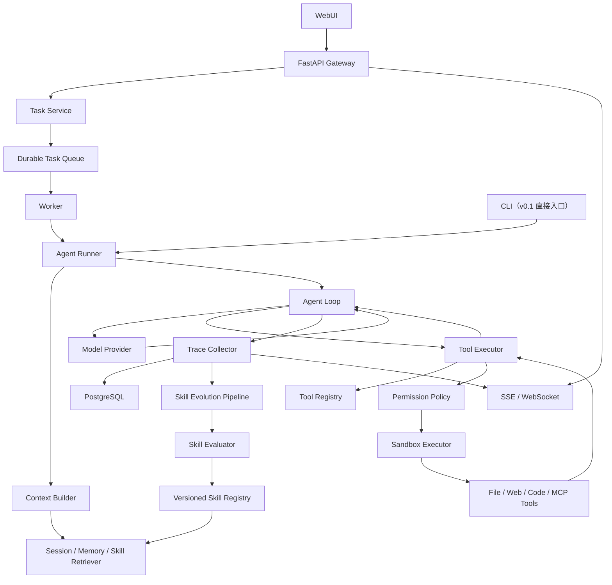
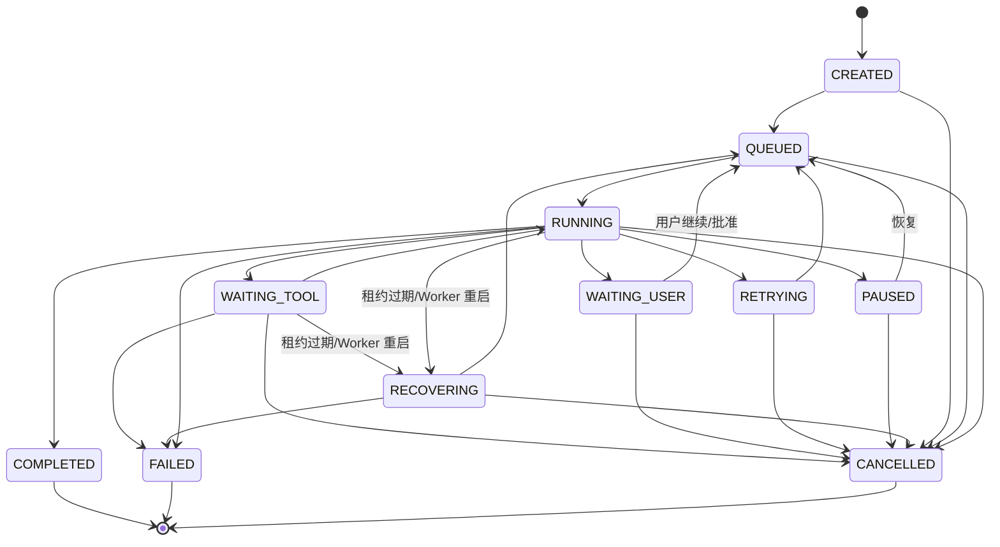

# EvoAgent：可验证自进化 Agent Runtime 五阶段设计与实现计划

> 项目定位：参考 nanobot 的工程化 Agent Runtime 设计，吸收 GenericAgent 的分层记忆与 Skill 沉淀思想，从零实现一个支持可靠长任务、安全工具调用、执行追踪，以及“可验证、可版本化、可回滚”技能进化的 Python Agent 系统。项目按五个阶段持续演进，其中前三阶段组成秋招冻结版本 v0.3，后两阶段用于长期增强和产品化。

## 1. 项目目标

EvoAgent 不是简单的聊天机器人，也不是把 nanobot 或 GenericAgent 改名后重新发布。项目重点解决以下问题：

1. 让大模型能够通过 Agent Loop 持续调用工具完成多步骤任务。
2. 让耗时任务具备持久化、暂停、恢复、取消、重试能力。
3. 记录完整执行轨迹，能够还原 Agent 在什么输入、工具结果和运行状态下做出某个可观察决策；不记录或声称获取模型隐藏的思维链。
4. 将成功任务轨迹提炼为候选 Skill，并在验证通过后复用。
5. 防止错误 Skill、危险命令和越权文件访问污染或破坏系统。
6. 通过评测数据证明 Skill 是否提升了成功率、速度和 Token 效率。

项目的核心亮点不是“接入了多少模型”，而是：

> 在通用 Agent Runtime 上实现了一套可验证的 Skill 生命周期，让 Agent 从历史成功经验中积累能力，同时保证生成的技能可测试、可审计、可回滚。

## 2. 参考项目与借鉴边界

### 2.1 主要参考 nanobot

参考内容：

- AgentLoop 与 AgentRunner 的职责拆分
- Provider 抽象与模型切换
- Tool Registry 与工具参数 Schema
- Session、Context、Memory 的分层
- MCP 工具接入
- 长任务、自动化和流式输出
- Workspace、Shell、网络请求等安全边界
- WebUI、API、Docker 部署思路

不计划完整复刻：

- 十几种聊天渠道
- 所有模型厂商适配
- 完整安装向导和多语言文档
- 与项目核心无关的 UI 设置项

### 2.2 特色参考 GenericAgent

参考内容：

- 少量原子工具组合复杂能力
- L0～L4 分层记忆思想
- 成功执行路径沉淀为 Skill/SOP
- 使用历史经验降低后续任务的探索成本
- 对 Token 效率和重复任务收敛效果进行评测

需要重新设计的部分：

- Skill 不能在生成后直接进入生产环境
- 任意代码执行必须经过权限检查和沙箱隔离
- Skill 需要版本、测试、评分、审批和回滚机制
- “自我进化”必须通过基准任务量化验证

### 2.3 开源合规

两个参考项目均采用 MIT License。如果直接复用代码，需要保留对应许可证和版权声明；如果从零实现，也应在 README 的 Acknowledgements 中明确说明架构灵感来源，避免将参考设计描述为完全原创。

## 3. 目标用户与演示场景

### 3.1 目标用户

- 希望自动完成资料收集、文件处理和报告生成的个人用户
- 希望研究 Agent Runtime、工具调用和长期记忆的开发者
- 需要构建垂直 Agent，但不想直接依赖大型编排框架的团队

### 3.2 首个演示场景：研究报告 Agent

用户输入：

> 调研三个开源 Agent 项目的架构差异，读取项目文档，提取证据，最后生成带引用的 Markdown 报告。

Agent 执行过程：

1. 拆解任务并建立检查点。
2. 搜索并抓取资料。
3. 读取网页、Markdown 或 PDF。
4. 对关键结论进行交叉验证。
5. 生成带来源的报告。
6. 将完整执行过程保存为 Trace。
7. 任务成功后提炼“开源项目对比调研”候选 Skill。
8. 使用测试任务验证该 Skill。
9. 验证通过后发布；下次相似任务优先复用。

选择这个场景的原因：工具链丰富、展示直观、风险比自动付款或操作社交账号低，并且容易建立可重复的评测集。

## 4. 总体架构



该图表示 v1.0 目标架构，不代表秋招版必须一次实现全部节点。v0.1 中 CLI 直接调用 AgentRunner；v0.2 起 API 将 Task 写入 PostgreSQL，由 Worker 领取后调用同一个 AgentRunner。v0.3 中 Durable Task Queue 仍由 PostgreSQL Job Lease 实现，Context 只加载 Session 与已审批 Skill，Sandbox 先覆盖受控 Shell/文件/网络工具，流式通道只实现 SSE；长期 Memory、MCP、pgvector、Redis、多 Worker 和 WebSocket 在后续阶段加入。

职责边界固定如下：AgentRunner 管理一次 Run 的生命周期、总超时、取消和结果汇总；ContextBuilder 只构造初始模型消息与上下文块；AgentLoop 持有 Run 内消息历史，只负责模型—工具迭代和循环终止；ToolRegistry 只负责工具注册、查找和 Schema 暴露；ToolExecutor 负责参数校验、调用、超时、结果规范化和执行顺序。v0.1 的文件与网络工具必须先通过最低路径/SSRF Guard，v0.2 再在执行管线中加入统一 Policy、Sandbox、审批与 ToolEffect。

### 4.1 核心执行链路

```text
接收任务
  → 创建 Task/Run
  → 构建上下文并检索可用 Skill
  → 调用模型
  → 解析并校验 Tool Call
  → 权限检查
  → 执行工具
  → 将结果反馈给模型
  → 重复直到完成或达到限制
  → 保存结果与完整 Trace
  → 成功任务进入 Skill 提炼管线
```

## 5. 技术框架

### 5.1 后端与运行时

| 领域 | 技术选择 | 引入阶段 | 用途 |
|---|---|---|---|
| 语言 | Python 3.12 | v0.1 | 主要开发语言 |
| 数据校验 | Pydantic | v0.1 | Tool Schema、配置、事件和接口 DTO |
| 异步运行时 | asyncio | v0.1 | 模型流式响应、取消和并行只读工具 |
| 模型协议 | OpenAI-compatible Chat Completions API | v0.1 | 固定 `/v1/chat/completions` 与 Function Calling/SSE 子集，先完成单一协议 |
| Web 框架 | FastAPI | v0.2 | REST API、SSE、依赖注入 |
| ORM | SQLAlchemy + Alembic | v0.2 | 持久化与数据库迁移 |
| 数据库 | PostgreSQL | v0.2 | Task、Run、Event、ToolEffect、Skill 与 Eval |
| 后台执行 | PostgreSQL Job Lease + 独立 Worker | v0.2 | 任务领取、heartbeat、超时接管和重启恢复 |
| 向量检索 | pgvector | v0.4 | Skill 与长期记忆的语义召回 |
| 缓存/队列 | Redis 或专业任务队列 | v0.4 | 多 Worker 扩展、限流和吞吐优化 |
| MCP | 官方 Python SDK | v0.4 | 动态接入外部工具 |

秋招版本直接从 PostgreSQL 建立持久化事件和任务租约，不经历 SQLite 到 PostgreSQL 的二次迁移。Redis 和专业任务队列只作为唤醒与扩展机制，PostgreSQL 中的任务状态、事件和工具效果记录始终是事实来源。

### 5.2 前端

| 技术 | 引入阶段/用途 |
|---|---|
| 简单 HTML/轻量前端 | v0.2 的 Trace Viewer |
| React + TypeScript | v0.3 的 Skill 差异与评测页面；v1.0 再扩展完整 WebUI |
| Vite | 前端构建与开发服务器 |
| SSE | 流式文本、工具执行进度、状态变化 |
| Mermaid/JSON Viewer | 展示任务拓扑与 Trace |

前端不是项目早期重点。秋招版只建设 Run Trace、Skill 版本差异、评测结果三个展示面，不复制完整聊天产品；v1.0 再扩展会话管理、配置中心和生态页面。

### 5.3 安全与可观测性

| 技术/机制 | 用途 |
|---|---|
| Docker Sandbox | 隔离代码与 Shell 执行 |
| Workspace Policy | 限制文件访问范围 |
| URL/SSRF Guard | 限制内网、环回和敏感地址访问 |
| OpenTelemetry（v1.0） | Agent、模型、工具调用链追踪 |
| Prometheus（v1.0） | 成功率、延迟、Token、重试次数指标 |
| 结构化日志 | 根据 task_id/run_id 检索日志 |

### 5.4 测试工具

- pytest：单元测试
- pytest-asyncio：异步逻辑测试
- respx：模型与 HTTP 请求 Mock
- Testcontainers：PostgreSQL 集成测试；v0.4 后再覆盖 Redis
- Playwright：v0.3 的三个关键展示流程和 v1.0 WebUI 回归测试
- 自定义 Eval Runner：Agent 与 Skill 回归评测

## 6. 功能清单

### 6.1 v0.1：可测试的 Agent 内核

- [x] OpenAI-compatible Provider
- [x] 流式 Agent Loop
- [x] AgentLoop、AgentRunner、ContextBuilder 职责拆分
- [x] Tool Schema、Tool Registry 与 ToolExecutor
- [x] calculator、file_read、web_fetch 等少量原子工具
- [x] file_read 的 Workspace Guard 与 web_fetch 的最低 SSRF Guard
- [x] 最大轮次、模型超时、任务总超时、取消、Token 统计与软预算
- [x] 统一运行事件结构
- [x] Mock LLM 与 Mock Tool 确定性测试
- [x] CLI 演示入口

v0.1 功能清单于 2026-09-06 完成；实现证据与已知限制见开发进度记录、学习手册和 ADR-001。

### 6.2 v0.2：可靠、可追踪的任务执行

- [x] FastAPI 与 SSE 实时进度
- [x] PostgreSQL、SQLAlchemy 与 Alembic
- [x] Session、Task、Run、Turn、ToolCall 与 RunEvent
- [x] 数据库任务租约、heartbeat 与独立 Worker
- [x] Turn/Tool 边界检查点和服务重启恢复
- [x] Provider/工具分类重试、副作用记录与幂等协议
- [x] Workspace、Shell、网络安全策略
- [x] 危险操作人工确认
- [x] 完整 Agent Trace 与基础 Trace Viewer
- [x] Docker Compose 启动和故障注入测试

v0.2 功能清单于 2026-09-08 完成；Shell 默认关闭，Compose 镜像构建由 CI 验证。适用范围和演示证据见阶段二安全边界、演示与故障注入文档。

### 6.3 v0.3：秋招冻结版——可验证 Skill 生命周期

- [ ] Trace 清洗和成功轨迹筛选
- [ ] 声明式 Skill DSL 与 Schema 校验
- [ ] 候选 Skill 自动提炼和来源追踪
- [ ] Skill 版本管理、人工审批、发布、禁用和回滚
- [ ] 无 Skill/有 Skill 两种运行模式
- [ ] 训练任务集与独立留出测试集
- [ ] 确定性断言、沙箱回放和质量门禁
- [ ] 成功率、Token、延迟与 Tool Calls 配对评测
- [ ] Skill 版本差异与评测报告页面

v0.1～v0.3 组成秋招版本。完成 v0.3 后应冻结功能范围，优先补齐测试、真实评测数据、README、架构决策记录和三个可重复 Demo。

### 6.4 v0.4：记忆、检索与协议扩展

- [ ] 上下文预算、消息裁剪与自动压缩
- [ ] 工作记忆、长期事实和会话归档
- [ ] pgvector 与 Skill/Memory 混合检索
- [ ] MCP Client、工具发现和动态注册
- [ ] 多 Worker 与 Redis/专业任务队列
- [ ] 更完整的 Docker Sandbox

### 6.5 v1.0：生产化与生态扩展

- [ ] OpenTelemetry、Prometheus 与运行趋势分析
- [ ] Skill 漂移检测、自动降权、灰度发布和自动回滚
- [ ] 多 Provider 和本地模型
- [ ] 定时任务与自动化触发器
- [ ] 浏览器自动化或单一聊天渠道
- [ ] 受控子 Agent 或多 Agent 协作
- [ ] Skill 导入、导出和共享
- [ ] 多租户与 RBAC

v0.4 和 v1.0 不属于秋招版本的必要范围。只有在 v0.3 已经稳定并有真实评测数据后再开发。

## 7. 模块设计

建议采用标准 `src layout`，源码结构如下：

```text
EvoAgent/
├─ src/
│  └─ evoagent/
│     ├─ config.py            # 类型化配置
│     ├─ cli.py               # v0.1 命令行入口
│     ├─ api/                 # REST、SSE、鉴权
│     ├─ core/
│     │  ├─ models.py         # 运行时数据契约
│     │  ├─ events.py         # RuntimeEvent 与 EventSink
│     │  ├─ loop.py           # Agent Loop
│     │  ├─ runner.py         # 单次 Run 编排
│     │  ├─ context.py        # 上下文构建与压缩
│     │  └─ state.py          # 状态机
│     ├─ providers/           # 模型 Provider
│     ├─ tools/
│     │  ├─ base.py           # Tool 抽象与元数据
│     │  ├─ registry.py       # 工具注册与发现
│     │  ├─ executor.py       # 校验、调度与结果规范化
│     │  ├─ guards.py         # v0.1 最低路径与网络保护
│     │  ├─ policy.py         # 权限检查
│     │  ├─ sandbox.py        # 隔离执行
│     │  └─ builtin/          # 内置工具
│     ├─ sessions/            # 会话和消息
│     ├─ memory/              # 工作记忆、长期记忆
│     ├─ skills/
│     │  ├─ schema.py         # Skill 数据结构
│     │  ├─ extractor.py      # 从 Trace 提炼 Skill
│     │  ├─ evaluator.py      # 测试与评分
│     │  ├─ registry.py       # 版本与发布
│     │  └─ retriever.py      # 检索与排序
│     ├─ trace/               # 轨迹采集与查询
│     ├─ mcp/                 # MCP Client
│     ├─ workers/             # 后台任务
│     ├─ db/                  # ORM 与迁移
│     └─ observability/       # 日志、指标、Tracing
├─ web/                    # React WebUI
├─ evals/                  # 数据集与评测脚本
├─ tests/
├─ docker/
├─ docs/
└─ pyproject.toml
```

目录按需创建，不在项目初始化时生成空模块。v0.1 只包含 `src/evoagent` 下的 core、providers、tools（含最低路径/网络 Guard）、CLI/配置和 tests；v0.2 增加 api、sessions、trace、workers、db 和轻量 web，并把 Guard 纳入统一 Policy/Sandbox 执行管线；v0.3 增加 skills 与 evals；memory、mcp 和完整 observability 在 v0.4/v1.0 再加入。

## 8. Agent Runtime 设计

### 8.1 Agent Loop 终止条件

以下任一条件满足时停止：

- 模型没有返回 Tool Call，且完成原因表示正常结束；`length`、`content_filter` 或协议不完整不能记为成功
- 调用显式完成工具
- 达到最大轮次
- 达到 Token 软预算或费用预算（v0.1 只在一次完整模型响应后检查累计 Token，不能中断已经发出的请求；精确费用治理后置）
- 超过任务总时限
- 用户取消任务
- 安全策略终止任务
- 连续重复调用相同工具且结果无变化

### 8.2 工具执行模式

- 只有当同一批 Tool Call **全部**声明为无副作用且可并行时才并发执行，并按模型给出的原始顺序回填结果
- 只要批次中包含写文件、Shell、发消息等有副作用或存在依赖的调用，v0.1 就保守地按原始顺序执行；后续如需更细粒度并发，应显式建立依赖图
- Tool Schema 必须经过 Pydantic 校验
- 有副作用工具根据“工具名 + 规范化参数 + 业务作用域”生成语义幂等键，并在执行前持久化 ToolEffect
- 工具结果限制最大大小，超出后摘要或保存为文件引用
- 高风险工具必须经过人工确认

唯一调用 ID 只用于追踪，不能单独保证幂等。对于外部消息、文件覆盖等副作用，系统采用 at-least-once 执行语义，并结合 ToolEffect、事务/Outbox 和外部服务提供的幂等能力避免重复；无法提供幂等保证的工具必须在恢复时请求人工确认。

工具风险等级：

| 等级 | 示例 | 默认策略 |
|---|---|---|
| R0 | 搜索、计算、只读查询 | 自动执行 |
| R1 | Workspace 内创建新文件或唯一命名 Artifact | 记录审计后执行 |
| R2 | 覆盖/修改文件、运行命令 | 策略检查或确认 |
| R3 | 发消息、删除、外部写操作 | 强制人工确认 |

工具具有声明的基础风险，但最终风险可以由参数和目标动态提升。例如同一个文件工具“创建不存在的新文件”可判为 R1，“覆盖现有文件”必须提升为 R2；运行时始终采用较高的有效风险等级。

### 8.3 任务状态机



所有状态变化必须持久化，并通过事件表或乐观锁避免重复消费导致状态回退。

可恢复检查点只建立在完整模型调用、完整 Tool Call 或完整 Agent Turn 的边界。系统不承诺从半个流式回答或执行到一半的任意 Shell 命令继续；恢复器必须从最后一个已提交快照重放后续事件，并检查 ToolEffect 后再决定执行、复用结果或请求人工确认。

## 9. Skill 自进化设计

### 9.1 Skill 数据格式

```yaml
name: compare_open_source_projects
version: 1.0.0
schema_version: 1
kind: declarative_sop
description: 对多个开源项目进行基于证据的架构比较
triggers:
  - 项目对比
  - 仓库调研
preconditions:
    allowed_tools: [web_search, web_fetch, artifact_write]
    max_effective_risk: R1
inputs:
  repositories:
    type: array[string]
    min_items: 2
steps:
  - id: discover_sources
    action: tool
    tool: web_search
    foreach: ${inputs.repositories}
    args:
      query: ${item} official README architecture
  - id: fetch_sources
    action: tool
    tool: web_fetch
    depends_on: [discover_sources]
  - id: synthesize_report
    action: model
    depends_on: [fetch_sources]
    instruction: 提取统一比较维度，交叉验证结论并生成带来源的报告
success_criteria:
  - 每个关键结论包含来源
  - 所有目标项目均被覆盖
validators:
  - report_has_citations
  - all_repositories_covered
provenance:
  source_run_ids: [run_123, run_456]
  source_trace_hash: sha256:example
```

其中 `artifact_write` 只允许以唯一名称创建当前 Run 的新 Artifact，不允许覆盖任意文件。v0.3 的 Skill 统一定义为声明式 SOP/DSL：步骤只能引用已注册工具、模型步骤和确定性验证器，不直接携带可执行 Python/Shell 代码。任意生成代码属于 v1.0 候选能力，必须经过独立容器、权限检查和更严格的人工审批。

### 9.2 Skill 生命周期

Skill 身份与 SkillVersion 分开管理。Skill 保存名称、启用状态和 `active_version_id`；每个 SkillVersion 走以下生命周期：

```text
DRAFT → EVALUATING → REVIEW_REQUIRED → ACTIVE → RETIRED
                  ↘ REJECTED
                                      RETIRED → ACTIVE（回滚目标重新激活）
```

`DISABLED`、`DEPRECATED` 属于 Skill 聚合状态；“回滚”不是版本状态，而是一次受审计的发布动作：把目标 RETIRED 版本重新置为 ACTIVE，将原 ACTIVE 版本置为 RETIRED，原子切换 `active_version_id`，并生成 PromotionDecision。这样可以避免一个版本同时出现“ACTIVE 又 ROLLED_BACK”的语义冲突，也保证同一个 Skill 至多只有一个 ACTIVE 版本。

### 9.3 质量门禁

候选 Skill 发布采用硬门禁，而不是通过加权总分抵消正确性或安全性下降：

1. Schema、步骤依赖和输入类型校验通过。
2. 敏感信息、绝对路径、临时环境信息清洗通过。
3. 所有工具均在 allowlist 中，风险等级没有提升。
4. 沙箱回放和确定性结果断言通过。
5. Skill 只能从训练任务轨迹生成，不得读取留出测试集答案。
6. 在独立留出集上，成功率不得低于无 Skill 基线。
7. 满足正确性和安全性门禁后，再比较 Token、Tool Calls 和延迟改善。
8. v0.3 必须经过人工审批；自动发布、灰度和自动回滚延后到 v1.0。

评测采用相同模型、Prompt、工具版本和任务输入的配对运行；记录重复次数、均值/中位数、失败样本和配置快照。效率指标只用于通过硬门禁后的版本排序，不能补偿成功率或安全性回退。

### 9.4 Skill 检索

按阶段逐步增强检索：

- v0.3：关键词/BM25 + 元数据过滤，优先保证行为可解释和评测稳定。
- v0.4：增加 pgvector 语义召回，形成混合检索。
- v1.0：结合历史质量、环境兼容性和新鲜度衰减进行重排。

不要一次加载大量 Skill，只向上下文注入 Top-K 摘要，真正使用时再展开全文。

## 10. 核心数据模型

| 实体 | 关键字段 |
|---|---|
| Session | id、user_id、title、created_at |
| Message | id、session_id、role、content、token_count |
| Task | id、session_id、status、goal、budget、lock_version |
| Run | id、task_id、status、provider、model、started_at、ended_at、lock_version |
| Turn | id、run_id、sequence、input、output、usage |
| ToolCall | id、turn_id、provider_call_id、tool、args、result、risk、status |
| RunEvent | id、run_id、sequence、event_type、payload、schema_version、timestamp |
| RunSnapshot | id、run_id、event_sequence、state、context_ref、created_at |
| ToolEffect | id、tool_call_id、effect_scope、semantic_key、status、result_hash、committed_at |
| Artifact | id、run_id、type、uri、content_hash、metadata |
| MemoryEntry | id、scope、type、content、embedding、confidence |
| Skill | id、name、active_version_id、status、lock_version |
| SkillVersion | id、skill_id、version、content、content_hash、lifecycle_status |
| SkillSource | id、skill_version_id、source_run_id、source_trace_hash |
| EvalCase | id、dataset_version、split、input、validators、risk_profile |
| EvalRun | id、eval_case_id、mode、skill_version_id（可空）、repeat_index、run_config_hash、metrics、passed、paired_run_id |
| PromotionDecision | id、skill_version_id、decision、reviewer、reason、created_at |

涉及并发更新的 Task、Run、Skill 增加 `lock_version` 字段实施乐观锁。v0.1 的 RuntimeEvent 是运行时领域对象，v0.2 的 RunEvent 是其持久化记录，不另造一套事件语义。大体积工具输出存入 Artifact，数据库事件只保存脱敏摘要、哈希和引用。本项目不在 v0.2 实现完整 Event Sourcing：Task/Run 行保存当前权威状态；RunEvent 是同一事务追加的审计时间线；RunSnapshot 保存可恢复上下文；ToolEffect 是副作用提交账本。恢复器综合这四类持久化数据做决定，Redis 或队列消息不能作为唯一状态依据。

数据库至少建立 `RunEvent(run_id, sequence)`、`ToolEffect(effect_scope, semantic_key)` 和 `SkillVersion(skill_id, version)` 唯一约束。Provider 返回的 Tool Call ID 只负责关联消息，不能代替 ToolEffect 的语义幂等键。

## 11. API 草案

```text
POST   /api/sessions
GET    /api/sessions/{id}
POST   /api/tasks
GET    /api/tasks/{id}
POST   /api/tasks/{id}/cancel
POST   /api/tasks/{id}/resume
GET    /api/tasks/{id}/events          # SSE
GET    /api/runs/{id}/trace

GET    /api/tools
POST   /api/tool-approvals/{id}

GET    /api/skills
GET    /api/skills/{id}
GET    /api/skills/{id}/versions/{version_id}
POST   /api/skill-versions/{version_id}/evaluate
POST   /api/skill-versions/{version_id}/approve
POST   /api/skills/{id}/disable
POST   /api/skills/{id}/rollback          # body: target_version_id

GET    /api/evals/runs
POST   /api/evals/run
GET    /api/metrics/summary
```

## 12. 分阶段实现计划

各阶段按照“可实现 → 可恢复 → 可验证 → 可扩展 → 可生产化”的价值顺序递进，不绑定具体日期。前一阶段达到验收标准后再进入下一阶段。阶段一至三组成秋招冻结版本 v0.3；进入冻结点后优先补齐测试、真实评测数据、文档和 Demo，不再临时增加渠道、多 Agent 等功能。

### 阶段一：可测试的 Agent 内核（v0.1）

阶段目标：实现最小但完整的 Agent 内核，证明模型可以通过多轮 Tool Calling 自主完成任务。

核心功能：

- 建立仓库、代码规范、pre-commit、CI 和基础配置系统
- 明确 AgentLoop、AgentRunner、ContextBuilder、Provider、ToolRegistry、ToolExecutor 的接口边界
- 实现 OpenAI-compatible Provider
- 实现支持流式响应的 Agent Loop
- 实现 Tool Schema、Registry、ToolExecutor、参数校验、分发和结果回传
- 实现 calculator、file_read、web_fetch 三个基础工具
- 为 file_read 实现 Workspace 路径保护，为 web_fetch 实现最低 URL/SSRF、重定向和大小保护
- 支持最大轮次、模型超时、工具超时、任务总超时、取消、Token 统计和软预算
- 定义统一 Message、ToolCall、ToolResult、ProviderEvent、RuntimeEvent、TokenUsage 和 RunResult 数据结构
- 使用 Mock LLM 和 Mock Tool 编写确定性测试

阶段产物：

- 一个可通过 CLI 调用的最小 Agent Runtime
- Agent 能完成“读取输入 → 调用多个工具 → 汇总最终答案”的完整链路
- 核心 Loop 覆盖正常响应、无效参数、工具失败、模型超时和最大轮次等场景
- 架构图、核心接口文档和最初的架构决策记录

完成标志：

- 更换 Provider 或 Tool 不需要修改 Agent Loop
- Agent 能稳定完成预设的组合工具测试任务
- 所有核心执行事件都具有统一的数据结构
- ProviderEvent 与 RuntimeEvent 职责分离，测试不访问真实模型或外部网络
- 路径穿越、符号链接逃逸和已知私网/重定向 SSRF 用例会被最低 Guard 拒绝

本阶段不实现 WebUI、数据库 Worker、长期记忆、MCP、Skill 和向量检索。

### 阶段二：可靠、可追踪的任务执行（v0.2）

阶段目标：将最小内核扩展为具备持久化状态、合法检查点、统一安全策略和故障恢复能力的单 Agent 执行系统。

核心功能：

- 实现 FastAPI、Task API 和 SSE 事件流
- 使用 PostgreSQL、SQLAlchemy 和 Alembic 建立 Session、Task、Run、RunEvent、RunSnapshot、ToolCall 与 ToolEffect 数据模型
- 使用 PostgreSQL Job Lease、heartbeat 和独立 Worker 完成任务领取、超时接管和重启恢复
- 记录模型调用、Tool Call、工具结果、状态变化和最终输出 Trace
- 在完整模型调用、Tool Call 和 Agent Turn 边界创建检查点
- 增加 file_write、web_search、ask_user 等常用工具
- 对 429/5xx/传输失败和无副作用工具失败实施有上限的指数退避重试；认证、参数、策略拒绝不重试，有副作用工具只有在确认未提交或具备外部幂等保证时才可重试
- 对有副作用工具实施语义幂等键、ToolEffect 记录和必要的人工恢复确认
- 将 v0.1 的最低路径/SSRF Guard 统一纳入 Permission Policy，增加 Shell 策略、完整审计、高风险操作审批和 Sandbox
- 实现轻量 Trace Viewer、Docker Compose 和故障注入测试

阶段产物：

- 一个具备 API、SSE、PostgreSQL 持久化和独立 Worker 的可运行 Agent Runtime
- 一个完整的“搜索资料并生成 Markdown 报告”演示场景
- 一个“杀死 Worker → 重启 → 从合法检查点恢复”的故障演示
- 可以按 task_id/run_id 查看事件、快照、工具效果和恢复决策

完成标志：

- 刷新或重启应用后，会话、已完成任务和运行事件不会丢失
- Worker 异常退出后任务能够从最后一个已提交快照继续
- 重复投递不会造成已提交副作用重复发生；无法确认的副作用进入人工确认
- 路径穿越、危险命令和私有/敏感地址访问会被阻止
- 一次失败能够通过 Trace 定位到具体模型请求、工具调用或状态变化

本阶段不引入 Redis、Celery/Dramatiq、pgvector、完整聊天 WebUI 和多 Worker；数据库任务租约已足以证明秋招版的可靠执行语义。

### 阶段三：可验证 Skill 生命周期（v0.3，秋招冻结版）

阶段目标：将成功轨迹提炼为可追溯、可评测、可审批和可回滚的声明式 Skill，形成区别于通用 Agent Runtime 的核心能力。

核心功能：

- 定义声明式 Skill DSL、状态机、版本结构和工具 allowlist
- 只从满足确定性成功条件的训练轨迹生成 DRAFT Skill
- 清洗密钥、绝对路径、临时环境信息、无关输出和失败分支
- 保存 SkillSource、来源 Trace 哈希、内容哈希和运行配置快照
- 实现关键词/BM25 与元数据过滤，不在本阶段引入复杂向量检索
- 在 Context Builder 中按需加载通过审批的 Skill
- 建立训练集与独立留出测试集，避免使用生成 Skill 的原任务直接证明有效性
- 实现无 Skill/有 Skill 的配对运行、沙箱回放和确定性断言
- 统计成功率、Token、Tool Calls、延迟和安全回归
- 实现 SkillVersion 的 DRAFT、EVALUATING、REVIEW_REQUIRED、ACTIVE、RETIRED、REJECTED 流转，Skill 聚合的 DISABLED/DEPRECATED 状态，以及受审计的版本回滚动作
- 实现 Skill 来源、版本差异、评测结果和人工审批页面

阶段产物：

- 从任务执行、候选 Skill 生成、留出集评测、人工审批到发布/回滚的完整闭环
- 可追溯到多个来源任务的版本化 Skill Registry
- 不少于 20～30 个可重复任务组成的训练/留出评测集
- 一个“首次探索 → 生成候选 Skill → 留出集评测 → 审批发布 → 相似任务复用”的 Demo
- 一份同时保留成功、失败和退化样本的真实评测报告

完成标志：

- 不合格 Skill 无法进入 ACTIVE 状态
- Skill 在独立留出集上的成功率不低于无 Skill 基线
- 能用真实数据回答 Skill 是否降低 Token、Tool Calls 或延迟
- 用户可以查看来源、修改、批准、禁用和回滚 Skill 版本
- Skill 不包含用户隐私、凭据、不可复现环境信息或未授权工具
- README、架构图、ADR、Docker 启动和三个核心 Demo 可由新用户复现

完成本阶段即达到秋招交付标准。后续阶段不得反向扩大 v0.3 的必做范围。

### 阶段四：记忆、检索与协议扩展（v0.4）

阶段目标：让 Agent 能够管理长上下文、跨会话复用信息，并通过标准协议扩展工具。

核心功能：

- 实现工作记忆、长期事实、会话归档等不同记忆类型
- 实现上下文预算、消息裁剪和自动压缩
- 接入 pgvector，支持长期记忆的混合检索
- 对记忆增加作用域、置信度、来源和过期策略
- 实现 MCP Client、工具发现、连接管理和动态注册
- 将 Skill 检索从 BM25/元数据过滤升级为关键词 + pgvector 混合检索
- 增加 Redis 或专业任务队列，支持多 Worker、限流和吞吐扩展
- 完善 Docker Sandbox 的 CPU、内存、时间和网络限制
- 增加 Memory 与 MCP 管理页面

阶段产物：

- 支持长会话和跨会话召回的 Agent
- 一个不修改核心代码即可接入 MCP 工具的扩展机制
- 上下文压缩前后结果一致性的回归测试

完成标志：

- 长会话不会突破配置的上下文预算
- 新会话只能召回作用域和权限允许的长期事实
- MCP 工具可以被发现、注册、调用和安全卸载
- 压缩后任务目标、约束和关键工具结果仍然保留
- 多 Worker 竞争领取任务时不会发生状态回退或重复提交 ToolEffect

### 阶段五：生产化与生态扩展（v1.0）

阶段目标：在 v0.3 的可验证 Skill 主线和 v0.4 的扩展能力稳定后，增加持续质量治理、完整可观测性和可选生态能力。

核心功能：

- 接入 OpenTelemetry、Prometheus 和结构化日志，统一模型、工具、状态机和 Skill 指标
- 对 ACTIVE Skill 实施周期回归、质量漂移检测、灰度发布、自动降权和自动回滚
- 增加其他模型 Provider 和本地模型
- 增加定时任务和自动化触发器
- 按实际需求选择浏览器自动化或一个聊天渠道
- 增加受控子 Agent 或多 Agent 协作
- 增加 Skill 导入、导出、签名和共享能力
- 完善多租户、RBAC、配额和审计策略
- 将 WebUI 扩展为会话、任务、Trace、Skill、Eval 和配置的一体化工作台

发布与打磨：

- 完善单元、集成、故障注入、压力和端到端测试
- 优化 README、架构图、部署文档、安全说明和兼容性矩阵
- 持续整理真实评测数据、性能瓶颈、回归案例和技术决策
- 提供示例配置、数据库迁移和稳定版本发布流程

完成标志：

- ACTIVE Skill 的效果下降能够被检测，并自动或手动回滚到稳定版本
- 新用户可以按照 README 独立启动并完成示例任务
- CI、数据库迁移、评测和部署流程可以重复执行
- 敏感信息不会进入日志、Trace、Memory 或 Skill
- 扩展功能通过插件或适配器接入，不破坏核心模块边界

## 13. 阶段依赖与交付边界

| 能力里程碑 | 包含阶段 | 系统达到的状态 |
|---|---|---|
| v0.1 内核原型 | 阶段一 | Agent 能通过 Tool Calling 完成多步骤任务，核心路径可确定性测试 |
| v0.2 可靠 Runtime | 阶段一～二 | 具备 API、SSE、PostgreSQL 事件、检查点恢复、安全策略和 Trace |
| v0.3 秋招冻结版 | 阶段一～三 | 具备评测门禁驱动的 Skill 生成、审批、发布、复用和回滚闭环 |
| v0.4 扩展版 | 阶段一～四 | 增加长上下文、长期记忆、混合检索、MCP 和多 Worker 能力 |
| v1.0 生产版 | 阶段一～五 | 增加质量漂移治理、完整可观测性和按需生态扩展 |

推进原则：

1. 阶段一建立可测内核，阶段二建立可靠执行事实来源，二者不能被前端和生态功能挤占。
2. 进入阶段三前，Trace、快照、ToolEffect 和任务成功条件必须完整且可判定。
3. 阶段三同时完成 Skill 生成和最小评测门禁，不允许先发布、后建设验证体系。
4. v0.3 只允许人工审批；自动发布、灰度和自动回滚属于 v1.0。
5. 长期记忆、MCP、Redis、多 Agent、聊天渠道和浏览器自动化不得进入秋招必做范围。
6. 每个阶段都保留可运行版本、自动化测试、失败样本和对应 Demo，避免最后一次性集成。

## 14. 测试与评测计划

### 14.1 测试分层

1. 单元测试：Loop、状态机、Registry、Retriever、Policy。
2. 契约测试：不同 Provider 返回统一事件格式。
3. 集成测试：v0.2 覆盖 PostgreSQL、Worker 和沙箱；v0.4 再覆盖 Redis 与 MCP。
4. 故障注入：模型超时、429、工具崩溃、Worker 重启。
5. 端到端测试：从创建任务到 Skill 发布的完整流程。
6. 安全测试：路径穿越、Prompt Injection、SSRF、命令注入。

核心模块建议保持较高覆盖率，但不以覆盖率数字代替实际场景测试。

### 14.2 评测数据集与实验协议

- v0.3 建立不少于 20～30 个可重复任务，按任务族拆分训练集与独立留出集。
- Skill Extractor 只能读取训练轨迹；留出集的输入、验证器和答案不能进入 Skill 生成上下文。
- 每个任务在相同模型、Prompt、工具、超时和预算配置下进行无 Skill/有 Skill 配对运行。
- 对存在模型随机性的任务重复运行并同时报告成功、失败和退化样本，不只展示最好结果。
- 优先使用确定性验证器；必须使用 LLM Judge 时，采用隐藏实验标签的统一 Rubric，并将其作为辅助指标。
- 每次 EvalRun 保存模型、Prompt、工具、数据集、Skill、代码提交和环境配置哈希，保证结果可追溯。

### 14.3 评测指标

| 指标 | 说明 |
|---|---|
| Task Success Rate | 任务是否满足确定性验收条件 |
| Result Quality | 引用、完整性、事实正确性 |
| Tool Accuracy | 是否选择了正确工具和参数 |
| Tool Calls | 完成任务所需调用次数 |
| Token Usage | 输入、输出和总 Token |
| Latency | 端到端耗时以及模型/工具分项耗时 |
| Recovery Rate | 故障后成功恢复比例 |
| Skill Reuse Rate | 已发布 Skill 的有效复用率 |
| Skill Regression Rate | Skill 导致效果下降的比例 |

其中 Task Success Rate 和安全回归属于硬门禁；Token、Tool Calls 和 Latency 只在硬门禁通过后用于比较效率，不能抵消正确率下降。

### 14.4 目标值说明

任何成功率、Token 降低比例都必须以真实实验结果为准，不能提前写成已实现成果。开发阶段可以设定目标，例如：

- Skill 模式成功率不低于基线
- 重复任务平均 Tool Calls 降低 20%
- 重复任务平均 Token 降低 15%
- 长任务故障恢复成功率达到 90%

以上数字是开发目标，不是预先承诺的项目结果。如果实验未达到目标，应如实记录失败原因和后续优化，而不是只展示最好的一次结果。

## 15. 安全设计

- API Key 只从环境变量或 Secret Store 读取
- 日志、Trace、Skill 入库前进行敏感信息脱敏
- 文件工具只允许访问配置的 Workspace
- 读写前解析真实路径并检查符号链接，保证最终目标仍位于 Workspace
- Shell 工具运行在受限容器中，限制 CPU、内存、时间和网络
- URL 在 DNS 解析后和每次重定向后都检查 IPv4/IPv6，默认禁止环回、云元数据和私有网段
- 外部网页内容以不可信数据区注入上下文；工具权限由独立 Policy 强制执行，不能依赖 Prompt 提醒
- 有副作用的操作必须使用语义幂等键和持久化 ToolEffect；不支持幂等的恢复操作请求人工确认
- 删除、付款、发消息等操作强制人工确认
- Skill 发布前检查是否包含密钥、绝对路径或危险命令

## 16. 范围控制

为了避免项目失控，秋招版本明确不追求：

- 支持所有模型和聊天平台
- 实现通用浏览器 Computer Use
- 训练或微调大模型
- 构建百万级 Skill 市场
- 一开始就做多 Agent 集群
- 完整复刻 nanobot 的所有功能

判断新功能是否加入的标准：它是否能强化“可靠 Agent Runtime”或“可验证 Skill 进化”这两个主题。不能强化主题的功能暂缓。

## 17. 可展示的三个 Demo

### Demo 1：多步骤研究任务（阶段一建立，阶段二产品化）

- v0.1 使用用户给出的 URL 或固定 HTTP Mock/本地资料，验证并行读取、汇总和带引用报告链路
- v0.2 接入 `web_search`，由 Agent 搜索多个官方来源，并用 API、持久化 Trace 与轻量 Trace Viewer 产品化展示

### Demo 2：任务故障恢复（阶段二）

- 任务执行过程中主动终止 Worker
- 重启服务
- 从最近检查点恢复
- 展示幂等工具没有重复执行

### Demo 3：Skill 评测门禁与复用（阶段三）

- 使用训练任务在无 Skill 模式完成多次探索
- 从成功 Trace 生成带来源哈希的 DRAFT Skill
- 在未参与生成的留出任务上运行无 Skill/有 Skill 配对评测
- 展示通过或拒绝 Skill 的硬门禁依据，并由用户人工审批
- 发布后执行新的相似任务，展示成功率、Token、耗时和 Tool Calls 对比
- 切换到退化版本触发回归失败，再演示手动回滚到稳定版本

## 18. 简历描述参考

项目名称：**EvoAgent——可验证自进化 Agent Runtime**

秋招简历只描述 v0.1～v0.3 已完成并有证据支持的能力；v0.4 的长期记忆、MCP、多 Worker 和 v1.0 的自动发布/自动回滚不得提前写入。可根据真实完成情况选择：

- 从零设计并实现 Python Agent Runtime，完成流式 Tool Calling、动态工具注册、统一运行事件和完整执行 Trace，并通过 Mock LLM/Tool 对核心 Loop 进行确定性测试。
- 基于 PostgreSQL 事件、任务租约和合法检查点实现 Worker 故障恢复，通过 ToolEffect 与语义幂等协议避免已提交副作用重复执行。
- 设计声明式 Skill DSL、来源追踪、版本审批和手动回滚流程，避免未经验证的执行经验直接进入 ACTIVE 状态。
- 构建训练/留出集隔离的 Agent 配对评测框架，从任务成功率、Token、延迟和 Tool Calls 等维度量化 Skill 复用效果。
- 对 Shell、文件和网络工具实施分级权限、Workspace 隔离、SSRF 防护与人工确认，并通过故障注入和安全用例验证边界。

最终简历必须将目标数字替换为真实实验结果，例如评测任务数、故障恢复率、重复副作用次数、成功率变化和 Token/Tool Calls 改善；没有实验数据时不使用百分比成果描述。

## 19. 面试准备重点

需要能够解释：

1. 为什么不用 LangGraph 直接实现？自己实现 Loop 的收益和代价是什么？
2. AgentLoop、AgentRunner、ContextBuilder 为什么分开？
3. 多个 Tool Call 如何并行，同时保持结果顺序和副作用安全？
4. 服务重启后如何确定从哪个状态恢复？
5. 如何避免重复发消息、重复写文件等问题？
6. 上下文压缩如何避免丢失关键目标和工具结果？
7. Skill 与普通 Prompt、Memory、RAG 文档有什么区别？
8. 如何证明 Skill 有效，而不是让模型记住了测试答案？
9. 错误 Skill 如何检测、降权和回滚？
10. Prompt Injection、SSRF 和任意代码执行如何防御？

## 20. 完成标准

### 20.1 秋招冻结版 v0.3

达到以下条件，可以认为项目具备秋招展示价值，并停止向必做范围增加功能：

- 有一个从零实现且测试充分的 Agent Loop
- 有清晰的 Provider、Tool、State、Event、Skill、Eval 模块边界
- PostgreSQL 是任务状态、运行事件、检查点和工具效果的事实来源
- 有可查看的任务状态、执行 Trace、Skill 来源和评测结果
- 有至少一个可恢复长任务 Demo
- 有声明式 Skill DSL 和完整的生成、评测、审批、发布、禁用、手动回滚生命周期
- 有不少于 20～30 个可重复评测任务
- 训练任务与留出任务隔离，Skill 不读取留出答案
- 有真实的无 Skill/有 Skill 配对数据，并保留失败和退化样本
- 有工具权限、安全策略和故障处理
- 有 Docker 启动、架构文档和演示材料
- 能清楚说明参考项目、自己的改造和设计取舍

长期记忆、pgvector、MCP、Redis、多 Worker、多 Provider、多渠道、浏览器自动化、多 Agent、OpenTelemetry 和自动发布都不是 v0.3 的完成条件。

### 20.2 完整版本 v1.0

- 在 v0.3 稳定基础上完成上下文压缩、长期记忆、混合检索和 MCP 扩展
- 支持多 Worker、吞吐扩展和更完整的资源隔离
- 对 ACTIVE Skill 实施持续回归、漂移检测、灰度发布和自动回滚
- 具备完整可观测性、兼容性矩阵、压力测试和发布流程
- 生态功能通过插件或适配器加入，不破坏核心执行和评测边界

---

最终路线总结：

> 以 nanobot 的 Agent Runtime 为工程参考，独立实现可测试内核和可靠执行事实来源；以 GenericAgent 的经验固化为灵感，将声明式 Skill 的生成、留出集评测、人工审批、版本发布和回滚合并为秋招核心闭环。项目按照“可测试内核（v0.1）→ 可靠执行（v0.2）→ 可验证 Skill（v0.3，秋招冻结）→ 记忆与协议扩展（v0.4）→ 生产化与生态（v1.0）”五阶段持续演进。
