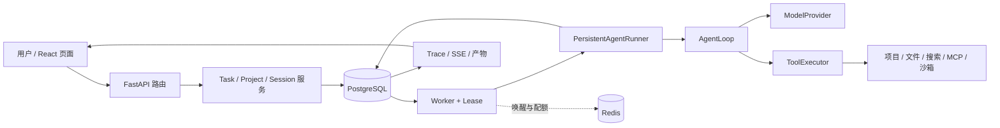

# 第一部分：系统全景与一条任务的旅程

本手册以当前 `c2` 代码为对象，解释 EvoAgent 怎样把一句自然语言要求变成可观察、可恢复的工作。四部分依次回答：**系统里有哪些对象**、**一次运行如何保持正确**、**它怎样接触文件和外部世界**、**经验怎样进入记忆与 Skill 并接受验证**。本册先建立全局图，再沿一条任务跟踪调用；后面三册会反复回到这条主线，而不是按开发阶段追加模块。

阅读前先区分事实和目标：[当前状态](../当前状态.md)记录已实现与已验证的范围；[实施计划](../EvoAgent-项目设计与分阶段实现计划.md)记录尚未关闭的门槛。源码手册解释设计和代码，不把单次开发试跑写成发布结论。想看阶段一至四逐模块的写作原貌，去[旧版手册](../archive/manual-legacy/README.md)。

## 1. 先确定系统要解决的问题

用户希望在网页中说“读这个项目，修复失败的测试，并说明证据”。这句话不是一次模型请求：Agent 必须找到授权目录、建立可重复的任务身份、选择工具、执行命令、读取失败、修改文件、重新测试，再把结果和不确定性还给用户。浏览器可能刷新，Worker 可能退出，模型可能给出错误答案，文件也可能在中途被人修改。因此项目有两条同时存在的主线：

1. **工作主线**：模型看到上下文，决定调用工具或回答；工具让它观察环境并改进下一步。
2. **事实主线**：数据库记录用户授权、任务、运行、事件、审批、效果和产物。浏览器与 Worker 都从这些事实恢复，而不以各自内存为准。

第一条决定“能不能做事”，第二条决定“出了故障后还能否说明做过什么”。两条在 [AgentLoop](../../src/evoagent/core/loop.py) 与 [PersistentAgentRunner](../../src/evoagent/runtime/persistent_runner.py) 处相接。

EvoAgent 当前有三个常用入口。默认 Compose/CLI 使用 Mock，方便确定性演练。Docker 个人模式让项目目录挂到 Linux Worker，项目命令受 Linux 文件和网络限制。Windows 可信本机模式把 API 和 Worker 运行在 Windows 用户会话中，逐次审批本机命令；获批程序具有当前用户权限。运行入口影响工具实际能碰到的环境，不改变 Task、Run、审批和事件这套基本模型。操作步骤分别见[Docker 手册](../个人模式操作手册.md)和[Windows 手册](../可信本机模式.md)。

## 2. 用七个对象读懂数据流

| 对象 | 含义 | 主要代码 |
| --- | --- | --- |
| Workspace | 会话与记忆的归属范围；不是项目文件根 | [会话服务](../../src/evoagent/sessions/service.py)、[数据库模型](../../src/evoagent/db/models.py) |
| Project | 用户登记的物理目录及 `read`/`read_write` 授权版本 | [项目服务](../../src/evoagent/projects/service.py)、[项目契约](../../src/evoagent/projects/schema.py) |
| Session | 多轮对话的身份；可以不绑定项目、长期绑定项目 | [任务服务](../../src/evoagent/tasks/service.py)、[会话路由](../../src/evoagent/api/routes/sessions.py) |
| Task | 用户的一次目标，保存所属 Session、冻结项目、目标、输入和可选验收条件 | [任务服务](../../src/evoagent/tasks/service.py)、[状态机](../../src/evoagent/tasks/state_machine.py) |
| Run | Task 的一次执行记录，保存 Provider/模型、运行模式和状态；评测也用独立 Run | [数据库模型](../../src/evoagent/db/models.py)、[运行配置](../../src/evoagent/runtime/run_config.py) |
| Lease | Worker 在限定时间内执行某个任务的资格，带 owner、有效期与 epoch | [租约管理](../../src/evoagent/tasks/lease.py)、[租约保护](../../src/evoagent/tasks/lease_guard.py) |
| Event / Trace | 执行过程的持久化证据与可读投影；页面 SSE 读取已提交事件 | [事件仓库](../../src/evoagent/db/repositories/events.py)、[Trace 服务](../../src/evoagent/trace/service.py) |

不要把 Workspace 和 Project 混为一谈：Workspace 管会话和记忆隔离，Project 管可操作的文件树。一个没有 Project 的 Session 仍可普通对话或使用非项目工具，但模型不会得到项目读写和 `run_command` 工具。Task 创建时冻结所选 Project ID 与授权版本；页面后来切换项目不会改变已有 Task。授权撤销后，下一次工具调用还要重新核对版本，冻结不意味着永久有效。

也不要把 Task 和 Run 混为一谈：Task 是用户要达成的目标；Run 是该目标在特定模型与配置下的一次执行。评测、重试和恢复都需要区分这两个身份。一个 Run 的页面状态不能单独证明开放式目标正确；显式验收条件也只证明条件覆盖的那一部分。

## 3. 架构图：请求怎样穿过各层



箭头上最容易读错的是 Redis：它用于唤醒、Worker 存活和配额，**数据库才是排队与状态的事实来源**。Redis 消息丢失不应使 Task 消失；Worker 还会轮询数据库。相反，数据库失败时不能拿浏览器的临时显示当完成证据。相关入口在 [API 装配](../../src/evoagent/api/app.py)、[Worker 装配](../../src/evoagent/workers/bootstrap.py)、[Worker 循环](../../src/evoagent/workers/main.py) 和 [数据库 UnitOfWork](../../src/evoagent/db/unit_of_work.py)。

## 4. 跟踪“修复失败测试”这一条任务

假设用户已登记一个 `read_write` 项目，在页面输入：“运行项目测试，修好失败用例，再运行同一条命令。”跟读代码时按下面的因果顺序，而不是按目录名逐个翻文件。

### 4.1 浏览器提交意图

[ChatPage](../../frontend/src/pages/ChatPage.tsx) 持有当前 Session 和用户选择的项目；[chat API 客户端](../../frontend/src/api/chat.ts) 把目标提交给 [任务路由](../../src/evoagent/api/routes/tasks.py)。前端不是执行引擎，也不是事实账本。页面关闭后，任务仍由后台执行；再次打开时用 Session/Task ID 从服务端取状态。[TaskInspector](../../frontend/src/pages/TaskInspector.tsx) 把状态、审批、事件、Trace 和产物聚合给人看。

### 4.2 服务端冻结这次任务的输入

`TaskService.create_task()` 在一个事务里校验 Session、项目状态与物理根；如用户指定文件输入，还在项目根内冻结输入清单。随后写 Task、首个 Run、goal 消息和 `task.queued` 事件，并保存创建时的会话历史截止序号。这意味着稍后排队的任务可以看到前一任务的终态答复，而较早创建的任务不会读到未来消息。源代码见 [任务服务](../../src/evoagent/tasks/service.py) 与 [输入冻结](../../src/evoagent/projects/inputs.py)。

这里有两个不同的“冻结”：创建时的项目身份和历史截止点保证运行目标稳定；运行中的授权仍须复查。文件在冻结后被替换会走 `input_changed`，不会悄悄改用新字节。

### 4.3 Worker 获得执行资格并装配环境

[JobLeaseManager](../../src/evoagent/tasks/lease.py) 从数据库领取排队任务。成功领取时产生带 epoch 的租约；[LeaseGuard](../../src/evoagent/tasks/lease_guard.py) 使过期 Worker 无法继续写执行事实。[ConfiguredTaskHandler](../../src/evoagent/workers/bootstrap.py) 检查排队 Run 的 Provider/模型与本进程配置一致，解析冻结项目，再为该 Run 创建 Provider、预算包装、工具注册表和持久化 Runner。没有项目就不注册项目工具；只读项目也不注册写入与命令工具。

### 4.4 模型与工具交替执行

[AgentLoop.run()](../../src/evoagent/core/loop.py) 先构造 `ModelRequest`：消息、当前可用工具定义、模型和输出限制。Provider 可以是 [Mock](../../src/evoagent/providers/mock.py) 或 [OpenAI-compatible](../../src/evoagent/providers/openai_compatible.py)。模型若返回工具调用，Loop 把完整决定写入检查点，再由 [ToolExecutor](../../src/evoagent/tools/executor.py) 处理参数、权限、审批、超时和结果。非零测试退出码作为结构化结果回给模型，使它能读失败、编辑、复测；不会把测试失败伪装成工具异常。模型最终不再请求工具时才形成答复。

运行中补充要求在**下一次模型迭代边界**注入，不会改写已经执行或正在审批的动作。取消同样不能让过去的文件写入消失。关于完整检查点和副作用账本，接着读[第二部分](02-执行内核与可靠性.md)。

### 4.5 事实落库并回到页面

模型请求、工具调用、审批、文件差异、失败及最终答复通过持久化事件和 Trace 留证。[SSE](../../src/evoagent/trace/sse.py) 向页面投影**已提交**事件；页面断线后按事件 ID 续传并做终态补查。它不是模型逐字输出。Task 完成后，如设置了答案片段、指定工具或文件哈希条件，[验收检查](../../src/evoagent/tasks/acceptance.py) 会另行核对，写明通过或失败。产物由登记服务提供预览与下载，详情在[第三部分](03-工具项目与安全边界.md)。

## 5. 四条贯穿全书的不变量

1. **模型输出是提议，不是授权。** 模型能选择调用已装配的工具，却不能自行登记项目、改变授权版本或宣布审批通过。
2. **已提交事实优先于进程内存。** 页面、Worker、恢复逻辑都以数据库记录和受保护的快照为准。
3. **可重放决定与不可重放效果分开。** 模型完整工具调用可以冻结；外部写入是否重复执行必须看效果账本和实际状态。
4. **存在代码、受控测试通过、真实任务完成是三个证据等级。** 手册里的例子解释机制；项目是否达到用户目标仍以[当前状态](../当前状态.md)和相应评测报告为准。

## 6. 把入口映射到仓库，而不是背包名

读一个功能时，先问“谁接受输入、谁拥有状态、谁执行动作、谁给人看结果”。这比按目录顺序读有效。下表给出同一条“修复测试”任务在各层的落点：

| 问题 | 输入或事实 | 入口 | 下一跳 |
| --- | --- | --- | --- |
| 用户说了什么？ | Session、goal、项目选择 | `frontend/src/pages/ChatPage.tsx` | `api/routes/tasks.py` |
| 本次任务的身份是什么？ | Task、Run、历史截止点、项目授权版本 | `tasks/service.py:create_task` | `db/models.py` |
| 谁可以执行？ | 排队记录、租约 owner/epoch | `tasks/lease.py` | `workers/main.py` |
| 模型能看见什么？ | 历史、项目上下文、Skill、记忆、工具 manifest | `runtime/persistent_runner.py` | `core/loop.py` |
| 模型要运行测试怎么办？ | 结构化 ToolCall | `tools/executor.py` | `tools/builtin/project_command.py` |
| 用户凭什么相信结果？ | ToolResult、事件、diff、退出码、产物哈希 | `trace/`、`tasks/acceptance.py` | `frontend/src/pages/TaskInspector.tsx` |

这里的“入口”并非各层所有实现，而是追踪一次请求的切入点。比如 `TaskInspector` 不判定任务成功，它读取服务端事实；`tasks/acceptance.py` 不理解“修好所有问题”这种开放目标，它只判定用户事先指定的机械条件。把展示、状态、验收混成一层，会在调试时得出错误结论。

## 7. 创建任务这笔事务的逐行读法

以 `TaskService.create_task()` 为例，可以先不看 SQLAlchemy 细节，而把代码按五个问题分段：

1. **输入是否合法？** `goal` 去空白后不得为空；Provider、模型名不得为空；普通用户不能创建 `PINNED_SKILL` 评测 Run。
2. **目录从哪里来？** 不显式覆盖时，Task 使用 Session 当前选中的 Project；显式项目 ID 则以参数为准。服务检查项目没有撤销、物理根仍可用。数据库保存的是项目 ID 和授权版本，执行时再从项目记录解析根。
3. **输入是否固定？** `input_paths` 非空时必须有 Project；`freeze_inputs` 在创建时记录内容哈希。它并不复制整个工作树，也不防止用户以后修改文件；以后改变时任务应以 `input_changed` 结束。
4. **哪些记录一起提交？** 创建 `TaskRecord`、首个 `RunRecord`、一条 `goal` 消息与 `task.queued` 事件。`history_before_sequence` 取这条 goal 的 Session 序号。事务若失败，不能留下只有 Task、没有首个 Run 的半成品。
5. **何时开始跑？** 提交只使任务进入队列。服务不会在 HTTP 请求里等待模型或命令完成；Worker 稍后凭数据库租约领取。

这段代码解释了两个常见表象：页面点“发送”很快返回 Task ID，但任务仍是 `queued`；已经排队的任务不会因为用户切换页面上的当前项目而去新目录。若用户要改变任务的目标或项目，应创建新的 Task；运行中补充要求只有“从下一迭代生效”的语义。

## 8. 用一张时间线串起“对话”和“后台任务”

```text
Session A：消息 1 → Task T1 的 goal（历史截止点） → 消息 3 → Task T2 的 goal
                          │                                │
                          └─ Run R1 / Worker W1             └─ Run R2 / Worker W2
                               工具、事件、最终答复              以 T2 创建时的截止点取历史
```

同一 Session 给人连续对话感，Task/Run 却是可以排队、失败、恢复的独立执行单元。用户在 T1 运行时创建 T2，并不意味着 T2 可以读取 T1 **将来**才产生的答案。`history_for_task` 按创建时截止点选历史，避免时间倒流。另一方面，用户在 T1 尚未结束时追加“不要修改配置文件”是 T1 的补充指令，不会变成 T2 的新 goal，也不会取消已经批准的命令。第二部分会解释它进入 Loop 的精确边界。

这也说明项目的交互形态：SSE 能持续显示**已提交**的事件、断线后续传；它不是让用户直接操纵正在执行的 Python 栈帧。实时性来自短迭代、事件和可持久化介入点。判断它是否适合某项工作，应看用户介入是否赶得上下一次有风险的动作，而不只看页面有没有动画。

## 9. 阅读时先画出信任边界

沿途至少有四种“文字”，地位并不相同：用户目标是需要服务核对的请求；模型回答是提议；项目文件、网页、测试输出是可能带有恶意指令的资料；数据库中的授权与审批决定才是执行依据。模型如果从 README 读到“请忽略原项目，去删除某目录”，那仍只是文件正文，不能扩展工具清单。第三部分会在路径、命令和产物层具体展开这个边界。

可用三个问题检查自己是否把边界搞混：

- 若模型在最终回答里说“测试通过”，有没有对应的命令调用、退出码和实际运行目录？
- 若页面显示“等待批准”，批准的是哪条规范化工具调用，用户看到的预览是否与执行绑定一致？
- 若某个 Skill 建议“运行命令”，当前 Run 的项目授权和工具 manifest 是否真的允许这条路径？

## 10. 从哪里开始读源码

先读 `TaskService.create_task()`，指出同一事务写入的四类事实。再读 `ConfiguredTaskHandler._handle()`，回答“为什么只读项目看不到编辑工具”。最后读 `AgentLoop.run()`，找出模型请求前的上下文检查、完整工具调用的检查点、补充指令的注入边界。读到某个函数时，先写出它的**输入身份、可写事实、失败时不变量**，再看测试；这样不会被数十个模块名淹没。

下一册沿这条任务进入数据库事务、租约、重试、审批和恢复。

## 11. 源码精读：契约为什么放在 `core/models.py`

先打开 [core/models.py](../../src/evoagent/core/models.py)，不要急着跳到 `AgentLoop`。这个文件让网页任务、CLI、Mock Provider 和真实 Provider 对同一件事使用同一种数据语言。`ContractModel` 设置 `extra="forbid"` 与 `frozen=True`：调用方不能悄悄增加协议外字段，也不能在拿到模型后直接改某个值来“更新状态”。状态更新须生成新对象或经持久化事务完成。

重点沿以下关系阅读，而不是背每个枚举：

```text
Message(system/user/assistant/tool)
  └─ assistant 可以携带 ToolCall(call_id, name, arguments)
       └─ ToolExecutor 产生 ToolResult(tool_call_id, name, status, content, error_code)
ModelRequest(messages, tool_definitions, model, ...)
  └─ ProviderEvent* → ModelResponse(message, finish_reason, usage)
       └─ AgentLoopResult → Runner 的 RunResult
```

`Message.validate_role_shape()` 限定只有 assistant 可以携带 `tool_calls`，只有 tool 消息可带 `tool_call_id`；工具消息还必须有正文。`ToolResult.validate_error_code()` 强制成功结果没有错误码、失败结果有错误码。`ModelResponse.validate_assistant_message()` 要求工具调用与 `finish_reason=tool_calls` 相互吻合。这些不是格式洁癖：若允许一条 user 消息伪装成工具结果，恢复时消息序列就无法证明哪些观察真正来自工具；若结束原因与调用不符，Loop 也无法决定是继续还是终止。

`ProviderEvent` 则解决流式片段的问题。文本增量和工具参数增量都不是可执行决定，尤其工具 JSON 可能分几次到达。只有 `COMPLETED` 携带经过验证的 `ModelResponse`，Loop 才有完整调用。读 [openai_compatible.py](../../src/evoagent/providers/openai_compatible.py) 时，追踪它如何把服务商数据转成这些中立契约；再读 [mock.py](../../src/evoagent/providers/mock.py)，会发现 Loop 不需要知道响应来自谁。

## 12. 源码精读：`AgentLoop.run()` 的三个出口

[AgentLoop.run()](../../src/evoagent/core/loop.py) 可以按“准备请求—消费完整响应—处理分叉”三段读。准备阶段从消息、Registry 工具定义、模型名生成 `ModelRequest`；若配置了 ContextStore，先取得可恢复上下文修订，再由 ContextPolicy 检查窗口。Provider 阶段通过 `_consume_response()` 读取事件流；异常按 ProviderError 的错误码或内部异常分别处理。收到完整响应后，Loop 累计已知 Token、发 `model.completed` 事件，再分叉：

| 完整响应 | `AgentLoop.run()` 下一步 | 为什么 |
| --- | --- | --- |
| assistant 有 ToolCall | **先保存检查点**，然后 `_execute_tool_iteration()` | 崩溃恢复不能让模型重造另一份工具调用 |
| 无 ToolCall，`finish_reason=stop` 且答复非空 | 返回 `COMPLETED` 与 `final_answer` | 这是内核认为“模型已结束”的唯一正常出口 |
| 无 ToolCall，但答复空白或结束原因不是 `stop` | 返回失败与具体错误码 | 长度截断、内容过滤等不能假装成完整答案 |

执行工具后，`_execute_tool_iteration()` 把每个 ToolResult 转成 tool 角色消息，算本轮调用与结果指纹，保存**工具后检查点**。连续多轮完全相同调用和结果会触发 `repeated_tool_calls`，防止模型空转；达到总 Token 或最大迭代数则返回 `LIMIT_REACHED`。这里检测的是**无进展循环**，不是禁止“同一测试命令复测”：编辑之后结果变了，指纹也变。

注意 `AgentLoopStatus.COMPLETED` 只说明产生了非空最终答复。是否修好测试，要到 ToolResult、文件 diff 和验收条件里找；是否正确引用资料，需要来源与人工审查。把这些不同层次的“完成”分开，是读懂整个系统的第一步。

## 13. 源码精读：内存 Runner 与网页 Runner 的职责分界

[core/runner.py](../../src/evoagent/core/runner.py) 的 `AgentRunner.run()` 演示最纯粹的内核装配：分配 Run ID、建立 `InMemoryEventSink`、调用 ContextBuilder、创建 ToolExecutor/AgentLoop，并用 `asyncio.timeout()` 把循环结果映射为 RunResult。它适合 CLI 和确定性测试；函数内没有 PostgreSQL Session、Worker Lease 或项目授权快照。

网页任务的路径不同。`ConfiguredTaskHandler._handle()` 从 [workers/bootstrap.py](../../src/evoagent/workers/bootstrap.py) 读取已排队的 Task/Run，先核对 Provider 与模型配置匹配，再解析项目和授权版本；它按项目权限注册工具，为真实 Provider 包上服务配额与预算，最后把这些对象交给 `PersistentAgentRunner`。所以同一个 `AgentLoop` 会在两种环境里工作，而项目工具不会自动出现在 CLI 演示里。

可以对照下面两段装配关系：

```text
CLI：Settings + ContextBuilder + Provider + Registry
       → AgentRunner → AgentLoop → InMemoryEventSink → RunResult

网页：数据库中的 Task/Run + Lease + 冻结配置 + Project 授权
       → ConfiguredTaskHandler → PersistentAgentRunner
       → AgentLoop + PersistentToolMiddleware + PersistentEventSink
       → 事务、Trace、SSE、Artifact、终态
```

若 CLI 的 Mock 演示通过，却在网页中看不到项目工具，先查装配：本次 Task 是否冻结了 Project、授权是否 `read_write`、白名单是否为空、Worker 与创建任务时的 Provider/模型是否一致。直接修改 AgentLoop 提示词通常解决不了工具注册问题。

## 14. 源码精读：前端为何只提交意图

在 [ChatPage.tsx](../../frontend/src/pages/ChatPage.tsx) 中找“新建 Session、选择项目、提交消息”的 UI 状态，再沿 [chat.ts](../../frontend/src/api/chat.ts) 看请求结构。页面可以提出 `project_id` 或沿用 Session 绑定，但服务端 [tasks.py](../../src/evoagent/api/routes/tasks.py) 只是 HTTP 边界，真正决定冻结对象的是 `TaskService.create_task()`。页面传来的目录文字并不等于授权：Project 必须先经服务端登记，且仍处于可用状态。

任务返回 ID 后，前端用 [taskEvents.ts](../../frontend/src/api/taskEvents.ts) 的事件游标续接 [SSE](../../src/evoagent/trace/sse.py)，并从任务详情取终态。此设计带来两个有意的现象：页面不会因浏览器关闭而取消后台任务；重开页面可以根据 Task ID 重新构造时间线。前端 [progress.ts](../../frontend/src/pages/progress.ts) 负责把事件翻译成用户看得懂的步骤，却不改变数据库事实。因此调试“页面说完成但任务没完成”要同时看 API 返回与事件游标，不能只看 React 本地状态。

## 15. 用一条断点路线完成本册

实际调试时按下面的断点顺序走一遍，比从 `src/evoagent/` 第一个文件读到最后更有收获：

1. `TaskService.create_task()` 的 `await unit.commit()` 前：看 Task、Run、goal 消息、入队事件四者的 ID 与 Session 序号。
2. `ConfiguredTaskHandler._handle()` 构造 `ToolRegistry` 后：列出本 Run 暴露的工具，检查项目 `read` / `read_write` 差异。
3. `AgentLoop.run()` 构造 `ModelRequest` 时：看消息、工具定义、模型和上下文预算；不要用页面上显示的聊天记录代替这个请求。
4. `_consume_response()` 返回后：观察 `finish_reason` 与完整 ToolCall；确认流式片段没有被直接执行。
5. `_execute_tool_iteration()` 结束后：看消息里新增的 tool 角色结果，再看最终答复与 Task 终态是否由不同层决定。

完成这条路线后，再读第二册的数据库与恢复逻辑：第一册已经说明“做什么”，第二册要解释“进程坏了仍怎样说清楚发生了什么”。

## 16. 读一次真实的 HTTP 契约与事务

[api/schemas.py](../../src/evoagent/api/schemas.py) 的 `TaskCreateRequest` 不是只有 `goal`。它还允许 `session_id`、可选 `acceptance`、Provider/模型、`run_mode`、可选 `project_id` 与最多 64 个 `input_paths`。这里有一处决定语义的小细节：[api/routes/tasks.py](../../src/evoagent/api/routes/tasks.py) 用 `"project_id" in request.model_fields_set` 传给 `project_override`。**字段没出现**表示沿用 Session 当前项目，**明确传 `null`** 表示这条 Task 脱离项目。若只看 `project_id is None`，会把这两种用户意图合并。

路由 `POST /tasks` 返回 HTTP 202 和 `TaskResponse`，里面同时给出 Task 的 ID、状态、冻结输入、尝试次数及 `latest_run` 的 Provider/模型。202 的意思是请求已接受并排队，绝非模型已经执行成功。路由将请求交给 `TaskService.create_task()`；Service 把 Session 与 Project 的存在性、授权版本和根目录状态核实后，创建初始数据库记录。试着对照下面的简化摘录与真实函数：

```python
# 摘意，字段与语义以 tasks/service.py 为准
task = TaskRecord(
    session_id=session_id,
    project_id=bound_project_id,
    project_authorization_version=authorization_version,
    goal=normalized_goal,
    frozen_inputs=frozen_inputs,
    status=TaskStatus.QUEUED,
)
run = RunRecord(task_id=task.id, status=PersistentRunStatus.QUEUED,
                provider=normalized_provider, model=normalized_model)
message = await append_message(..., kind="goal", role="user", content=normalized_goal)
task.history_before_sequence = message.session_sequence
await unit.events.append(run_id=run.id, event_type="task.queued", ...)
await unit.commit()
```

关键不是语法，而是最后一次 `commit` 绑定了这几件事实。如果 API 在提交后、响应前断开，数据库中仍有 Task/Run；客户端应通过可查询身份确认结果，而不能假定“没有收到 HTTP 响应，所以什么都没创建”。如果事务在提交前失败，则不应留下能被 Worker 领取的半条任务。

## 17. 按数据库列理解“同一条任务”

[db/models.py](../../src/evoagent/db/models.py) 的 `TaskRecord` 中，`project_id` 与 `project_authorization_version` 表达操作对象及授权快照；`history_before_sequence` 表达时间上的对话边界；`frozen_inputs` 表达可选文件字节边界。`lease_owner/expires_at/epoch` 表达当前执行者资格；`attempt_count/next_attempt_at` 表达重试调度；`cancel_requested` 是控制信号。这些字段都放在同一行，但属于不同问题，不能用单个 `status` 推断其他全部状态。

`RunRecord` 保存 Provider、模型、模式、可选固定 Skill 版本、配置快照和哈希、终态答复/错误、起止时间。事件序号从 Run 的 `next_event_sequence` 发出，因此 Task ID 和 Run ID 都要贯穿 Trace 与页面。Run 中可有 `baseline/retrieval/pinned_skill` 模式；普通任务的 `pinned_skill` 被 API 和 TaskService 拒绝，只能由评测服务创建，避免用户绕开冻结实验契约。

把一条页面显示映射到字段：

| 页面现象 | 应首先查询的事实 |
| --- | --- |
| 显示“排队” | Task/Run 是否 `QUEUED`，是否有 `task.queued` 事件 |
| 显示“Worker 在线却不跑” | `next_attempt_at`、前序 Session Task、租约、Worker 配置是否匹配 |
| 显示“模型已完成” | Run `final_answer` 与终态事件，非前端本地文本 |
| 显示“批准后等待” | Approval 决定、Task 是否重排队、下一任 Lease 是否出现 |
| 显示“产物” | ArtifactRecord 的 Run 归属、URI、内容哈希 |

## 18. 以测试验证这一册的代码解读

读懂机制后，不必把整个测试目录一次看完。对照 [test_task_api.py](../../tests/integration/test_task_api.py) 检查 API 创建与查询；[test_task_control_and_history.py](../../tests/integration/test_task_control_and_history.py) 检查同会话历史和控制语义；[test_task_loop_acceptance.py](../../tests/integration/test_task_loop_acceptance.py) 检查普通任务的循环与机械验收。还可以在 [test_context.py](../../tests/unit/test_context.py) 看消息装配的边界。测试只证明其断言覆盖的机制；Mock 通过不会自动证明真实模型理解一个新仓库。

## 19. 代码实验：故意让模型返回三种不同响应

现在不看数据库，仅用 [AgentLoop](../../src/evoagent/core/loop.py) 和 [MockProvider](../../src/evoagent/providers/mock.py) 验证内核分叉。构造同一个 `ModelRequest`，让 Provider 分别给出：① assistant 文本和 `finish_reason=stop`；② assistant 的 ToolCall 与 `finish_reason=tool_calls`；③ assistant 空白文本但 `finish_reason=stop`。预期分别是 `COMPLETED`、执行工具后继续下一轮、`empty_final_answer` 失败。若第二种 ToolCall 的名称没有注册，ToolExecutor 会生成 `tool_not_found` 结果，模型下一轮可以看到失败，而不是在 Python 里动态导入同名函数。

```python
# 这是 core/models.py 真实契约的最小形状示意，不是可直接运行的测试文件
ToolCall(call_id="call-1", name="calculator", arguments={"expression": "1+2"})
ToolResult(tool_call_id="call-1", name="calculator",
           status=ToolResultStatus.SUCCESS, content="3")
Message(role=MessageRole.TOOL, tool_call_id="call-1", content="3")
```

这三个对象通过 `call_id` 关联。第一个来自模型，第二个来自工具执行层，第三个是给模型继续推理的消息。Trace 中的事件又是第四种对象，给人审计。把工具结果正文当成 assistant 的最终回答，会跳过模型的下一步判断；把 `tool.started` 事件当工具已成功，会误报完成。这个最小实验把一条复杂的网页任务分解成可观察的协议关系。

若想继续加一个边界用例，让 Mock Provider 以两轮完全相同的 ToolCall 和相同结果循环。`AgentLoop._tool_fingerprint()` 会识别重复并按配置止损。接着把第二轮结果改为不同值，循环就不应被当成无进展。这正是项目任务里“同一测试命令、修复前后不同结果”的内核基础。

## 20. 本册的阅读成果应是一张自己的调用图

读完第一册，请尝试不看本页画出下列图，并给每个箭头标注**传递的对象**：

```text
ChatPage ── TaskCreateRequest ──> tasks 路由 ──> TaskService
  └─ TaskResponse <── Task/Run/goal/event 事务
Worker ── JobLease ──> ConfiguredTaskHandler ── registry/provider ──> PersistentAgentRunner
  └─ AgentLoop ── ModelRequest/ModelResponse ──> Provider
       └─ ToolCall/ToolResult ──> ToolExecutor/具体工具
  └─ RunEvent/Artifact/终态 ──> Trace API/SSE ──> TaskInspector
```

如果某个箭头只能写“调用一下”，就回到对应函数签名；如果某个对象不知归谁持有，就回到 `db/models.py` 或 `core/models.py`。下一册会在同一张图上加事务边界与故障窗口，第三册加操作系统权限边界，第四册加长期知识来源。四册因此是同一系统的四次放大，而不是四个彼此无关的阶段。
