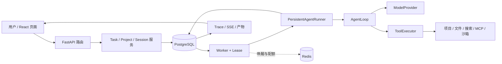

# 第一部分：系统全景与一条任务的旅程

本手册以当前 `c2` 代码为对象，解释 EvoAgent 怎样把一句自然语言要求变成可观察、可恢复的工作。四部分依次回答：**系统里有哪些对象**、**一次运行如何保持正确**、**它怎样接触文件和外部世界**、**经验怎样进入记忆与 Skill 并接受验证**。本册先建立全局图，再沿一条任务跟踪调用；后面三册会反复回到这条主线，而不是按开发阶段追加模块。

阅读前先区分事实和目标：[当前状态](../当前状态.md)记录已实现与已验证的范围；[实施计划](../EvoAgent-项目设计与分阶段实现计划.md)记录尚未关闭的门槛。源码手册解释设计和代码，不把单次开发试跑写成发布结论。想看阶段一至四逐模块的写作原貌，去[旧版手册](../archive/manual-legacy/README.md)。

## 1. 先确定系统要解决的问题

用户希望在网页中说“读这个项目，修复失败的测试，并说明证据”。这句话不是一次模型请求：Agent 必须找到授权目录、建立可重复的任务身份、选择工具、执行命令、读取失败、修改文件、重新测试，再把结果和不确定性还给用户。浏览器可能刷新，Worker 可能退出，模型可能给出错误答案，文件也可能在中途被人修改。因此项目有两条同时存在的主线：

1. **工作主线**：模型看到上下文，决定调用工具或回答；工具让它观察环境并改进下一步。
2. **事实主线**：数据库记录用户授权、任务、运行、事件、审批、效果和产物。浏览器与 Worker 都从这些事实恢复，而不以各自内存为准。

第一条决定“能不能做事”，第二条决定“出了故障后还能否说明做过什么”。两条在 [AgentLoop](../../src/evoagent/core/loop.py) 与 [PersistentAgentRunner](../../src/evoagent/runtime/persistent_runner.py) 处相接。

EvoAgent 当前有三个常用入口。默认 Compose/CLI 使用 Mock，方便确定性演练。Docker 个人模式让项目目录挂到 Linux Worker，项目命令受 Linux 文件和网络限制。Windows 可信本机模式把 API 和 Worker 运行在 Windows 用户会话中，逐次审批本机命令；获批程序具有当前用户权限。运行入口影响工具实际能碰到的环境，不改变 Task、Run、审批和事件这套基本模型。操作步骤分别见[Docker 手册](../个人模式操作手册.md)和[Windows 手册](../可信本机模式.md)。

## 2. 用七个对象读懂数据流

| 对象 | 含义 | 主要代码 |
| --- | --- | --- |
| Workspace | 会话与记忆的归属范围；不是项目文件根 | [会话服务](../../src/evoagent/sessions/service.py)、[数据库模型](../../src/evoagent/db/models.py) |
| Project | 用户登记的物理目录及 `read`/`read_write` 授权版本 | [项目服务](../../src/evoagent/projects/service.py)、[项目契约](../../src/evoagent/projects/schema.py) |
| Session | 多轮对话的身份；可以不绑定项目、长期绑定项目 | [任务服务](../../src/evoagent/tasks/service.py)、[会话路由](../../src/evoagent/api/routes/sessions.py) |
| Task | 用户的一次目标，保存所属 Session、冻结项目、目标、输入和可选验收条件 | [任务服务](../../src/evoagent/tasks/service.py)、[状态机](../../src/evoagent/tasks/state_machine.py) |
| Run | Task 的一次执行记录，保存 Provider/模型、运行模式和状态；评测也用独立 Run | [数据库模型](../../src/evoagent/db/models.py)、[运行配置](../../src/evoagent/runtime/run_config.py) |
| Lease | Worker 在限定时间内执行某个任务的资格，带 owner、有效期与 epoch | [租约管理](../../src/evoagent/tasks/lease.py)、[租约保护](../../src/evoagent/tasks/lease_guard.py) |
| Event / Trace | 执行过程的持久化证据与可读投影；页面 SSE 读取已提交事件 | [事件仓库](../../src/evoagent/db/repositories/events.py)、[Trace 服务](../../src/evoagent/trace/service.py) |

不要把 Workspace 和 Project 混为一谈：Workspace 管会话和记忆隔离，Project 管可操作的文件树。一个没有 Project 的 Session 仍可普通对话或使用非项目工具，但模型不会得到项目读写和 `run_command` 工具。Task 创建时冻结所选 Project ID 与授权版本；页面后来切换项目不会改变已有 Task。授权撤销后，下一次工具调用还要重新核对版本，冻结不意味着永久有效。

也不要把 Task 和 Run 混为一谈：Task 是用户要达成的目标；Run 是该目标在特定模型与配置下的一次执行。评测、重试和恢复都需要区分这两个身份。一个 Run 的页面状态不能单独证明开放式目标正确；显式验收条件也只证明条件覆盖的那一部分。

## 3. 架构图：请求怎样穿过各层



箭头上最容易读错的是 Redis：它用于唤醒、Worker 存活和配额，**数据库才是排队与状态的事实来源**。Redis 消息丢失不应使 Task 消失；Worker 还会轮询数据库。相反，数据库失败时不能拿浏览器的临时显示当完成证据。相关入口在 [API 装配](../../src/evoagent/api/app.py)、[Worker 装配](../../src/evoagent/workers/bootstrap.py)、[Worker 循环](../../src/evoagent/workers/main.py) 和 [数据库 UnitOfWork](../../src/evoagent/db/unit_of_work.py)。

## 4. 跟踪“修复失败测试”这一条任务

假设用户已登记一个 `read_write` 项目，在页面输入：“运行项目测试，修好失败用例，再运行同一条命令。”跟读代码时按下面的因果顺序，而不是按目录名逐个翻文件。

### 4.1 浏览器提交意图

[ChatPage](../../frontend/src/pages/ChatPage.tsx) 持有当前 Session 和用户选择的项目；[chat API 客户端](../../frontend/src/api/chat.ts) 把目标提交给 [任务路由](../../src/evoagent/api/routes/tasks.py)。前端不是执行引擎，也不是事实账本。页面关闭后，任务仍由后台执行；再次打开时用 Session/Task ID 从服务端取状态。[TaskInspector](../../frontend/src/pages/TaskInspector.tsx) 把状态、审批、事件、Trace 和产物聚合给人看。

### 4.2 服务端冻结这次任务的输入

`TaskService.create_task()` 在一个事务里校验 Session、项目状态与物理根；如用户指定文件输入，还在项目根内冻结输入清单。随后写 Task、首个 Run、goal 消息和 `task.queued` 事件，并保存创建时的会话历史截止序号。这意味着稍后排队的任务可以看到前一任务的终态答复，而较早创建的任务不会读到未来消息。源代码见 [任务服务](../../src/evoagent/tasks/service.py) 与 [输入冻结](../../src/evoagent/projects/inputs.py)。

这里有两个不同的“冻结”：创建时的项目身份和历史截止点保证运行目标稳定；运行中的授权仍须复查。文件在冻结后被替换会走 `input_changed`，不会悄悄改用新字节。

### 4.3 Worker 获得执行资格并装配环境

[JobLeaseManager](../../src/evoagent/tasks/lease.py) 从数据库领取排队任务。成功领取时产生带 epoch 的租约；[LeaseGuard](../../src/evoagent/tasks/lease_guard.py) 使过期 Worker 无法继续写执行事实。[ConfiguredTaskHandler](../../src/evoagent/workers/bootstrap.py) 检查排队 Run 的 Provider/模型与本进程配置一致，解析冻结项目，再为该 Run 创建 Provider、预算包装、工具注册表和持久化 Runner。没有项目就不注册项目工具；只读项目也不注册写入与命令工具。

### 4.4 模型与工具交替执行

[AgentLoop.run()](../../src/evoagent/core/loop.py) 先构造 `ModelRequest`：消息、当前可用工具定义、模型和输出限制。Provider 可以是 [Mock](../../src/evoagent/providers/mock.py) 或 [OpenAI-compatible](../../src/evoagent/providers/openai_compatible.py)。模型若返回工具调用，Loop 把完整决定写入检查点，再由 [ToolExecutor](../../src/evoagent/tools/executor.py) 处理参数、权限、审批、超时和结果。非零测试退出码作为结构化结果回给模型，使它能读失败、编辑、复测；不会把测试失败伪装成工具异常。模型最终不再请求工具时才形成答复。

运行中补充要求在**下一次模型迭代边界**注入，不会改写已经执行或正在审批的动作。取消同样不能让过去的文件写入消失。关于完整检查点和副作用账本，接着读[第二部分](02-执行内核与可靠性.md)。

### 4.5 事实落库并回到页面

模型请求、工具调用、审批、文件差异、失败及最终答复通过持久化事件和 Trace 留证。[SSE](../../src/evoagent/trace/sse.py) 向页面投影**已提交**事件；页面断线后按事件 ID 续传并做终态补查。它不是模型逐字输出。Task 完成后，如设置了答案片段、指定工具或文件哈希条件，[验收检查](../../src/evoagent/tasks/acceptance.py) 会另行核对，写明通过或失败。产物由登记服务提供预览与下载，详情在[第三部分](03-工具项目与安全边界.md)。

## 5. 四条贯穿全书的不变量

1. **模型输出是提议，不是授权。** 模型能选择调用已装配的工具，却不能自行登记项目、改变授权版本或宣布审批通过。
2. **已提交事实优先于进程内存。** 页面、Worker、恢复逻辑都以数据库记录和受保护的快照为准。
3. **可重放决定与不可重放效果分开。** 模型完整工具调用可以冻结；外部写入是否重复执行必须看效果账本和实际状态。
4. **存在代码、受控测试通过、真实任务完成是三个证据等级。** 手册里的例子解释机制；项目是否达到用户目标仍以[当前状态](../当前状态.md)和相应评测报告为准。

## 6. 把入口映射到仓库，而不是背包名

读一个功能时，先问“谁接受输入、谁拥有状态、谁执行动作、谁给人看结果”。这比按目录顺序读有效。下表给出同一条“修复测试”任务在各层的落点：

| 问题 | 输入或事实 | 入口 | 下一跳 |
| --- | --- | --- | --- |
| 用户说了什么？ | Session、goal、项目选择 | `frontend/src/pages/ChatPage.tsx` | `api/routes/tasks.py` |
| 本次任务的身份是什么？ | Task、Run、历史截止点、项目授权版本 | `tasks/service.py:create_task` | `db/models.py` |
| 谁可以执行？ | 排队记录、租约 owner/epoch | `tasks/lease.py` | `workers/main.py` |
| 模型能看见什么？ | 历史、项目上下文、Skill、记忆、工具 manifest | `runtime/persistent_runner.py` | `core/loop.py` |
| 模型要运行测试怎么办？ | 结构化 ToolCall | `tools/executor.py` | `tools/builtin/project_command.py` |
| 用户凭什么相信结果？ | ToolResult、事件、diff、退出码、产物哈希 | `trace/`、`tasks/acceptance.py` | `frontend/src/pages/TaskInspector.tsx` |

这里的“入口”并非各层所有实现，而是追踪一次请求的切入点。比如 `TaskInspector` 不判定任务成功，它读取服务端事实；`tasks/acceptance.py` 不理解“修好所有问题”这种开放目标，它只判定用户事先指定的机械条件。把展示、状态、验收混成一层，会在调试时得出错误结论。

## 7. 创建任务这笔事务的逐行读法

以 `TaskService.create_task()` 为例，可以先不看 SQLAlchemy 细节，而把代码按五个问题分段：

1. **输入是否合法？** `goal` 去空白后不得为空；Provider、模型名不得为空；普通用户不能创建 `PINNED_SKILL` 评测 Run。
2. **目录从哪里来？** 不显式覆盖时，Task 使用 Session 当前选中的 Project；显式项目 ID 则以参数为准。服务检查项目没有撤销、物理根仍可用。数据库保存的是项目 ID 和授权版本，执行时再从项目记录解析根。
3. **输入是否固定？** `input_paths` 非空时必须有 Project；`freeze_inputs` 在创建时记录内容哈希。它并不复制整个工作树，也不防止用户以后修改文件；以后改变时任务应以 `input_changed` 结束。
4. **哪些记录一起提交？** 创建 `TaskRecord`、首个 `RunRecord`、一条 `goal` 消息与 `task.queued` 事件。`history_before_sequence` 取这条 goal 的 Session 序号。事务若失败，不能留下只有 Task、没有首个 Run 的半成品。
5. **何时开始跑？** 提交只使任务进入队列。服务不会在 HTTP 请求里等待模型或命令完成；Worker 稍后凭数据库租约领取。

这段代码解释了两个常见表象：页面点“发送”很快返回 Task ID，但任务仍是 `queued`；已经排队的任务不会因为用户切换页面上的当前项目而去新目录。若用户要改变任务的目标或项目，应创建新的 Task；运行中补充要求只有“从下一迭代生效”的语义。

## 8. 用一张时间线串起“对话”和“后台任务”

```text
Session A：消息 1 → Task T1 的 goal（历史截止点） → 消息 3 → Task T2 的 goal
                          │                                │
                          └─ Run R1 / Worker W1             └─ Run R2 / Worker W2
                               工具、事件、最终答复              以 T2 创建时的截止点取历史
```

同一 Session 给人连续对话感，Task/Run 却是可以排队、失败、恢复的独立执行单元。用户在 T1 运行时创建 T2，并不意味着 T2 可以读取 T1 **将来**才产生的答案。`history_for_task` 按创建时截止点选历史，避免时间倒流。另一方面，用户在 T1 尚未结束时追加“不要修改配置文件”是 T1 的补充指令，不会变成 T2 的新 goal，也不会取消已经批准的命令。第二部分会解释它进入 Loop 的精确边界。

这也说明项目的交互形态：SSE 能持续显示**已提交**的事件、断线后续传；它不是让用户直接操纵正在执行的 Python 栈帧。实时性来自短迭代、事件和可持久化介入点。判断它是否适合某项工作，应看用户介入是否赶得上下一次有风险的动作，而不只看页面有没有动画。

## 9. 阅读时先画出信任边界

沿途至少有四种“文字”，地位并不相同：用户目标是需要服务核对的请求；模型回答是提议；项目文件、网页、测试输出是可能带有恶意指令的资料；数据库中的授权与审批决定才是执行依据。模型如果从 README 读到“请忽略原项目，去删除某目录”，那仍只是文件正文，不能扩展工具清单。第三部分会在路径、命令和产物层具体展开这个边界。

可用三个问题检查自己是否把边界搞混：

- 若模型在最终回答里说“测试通过”，有没有对应的命令调用、退出码和实际运行目录？
- 若页面显示“等待批准”，批准的是哪条规范化工具调用，用户看到的预览是否与执行绑定一致？
- 若某个 Skill 建议“运行命令”，当前 Run 的项目授权和工具 manifest 是否真的允许这条路径？

## 10. 从哪里开始读源码

先读 `TaskService.create_task()`，指出同一事务写入的四类事实。再读 `ConfiguredTaskHandler._handle()`，回答“为什么只读项目看不到编辑工具”。最后读 `AgentLoop.run()`，找出模型请求前的上下文检查、完整工具调用的检查点、补充指令的注入边界。读到某个函数时，先写出它的**输入身份、可写事实、失败时不变量**，再看测试；这样不会被数十个模块名淹没。

下一册沿这条任务进入数据库事务、租约、重试、审批和恢复。
