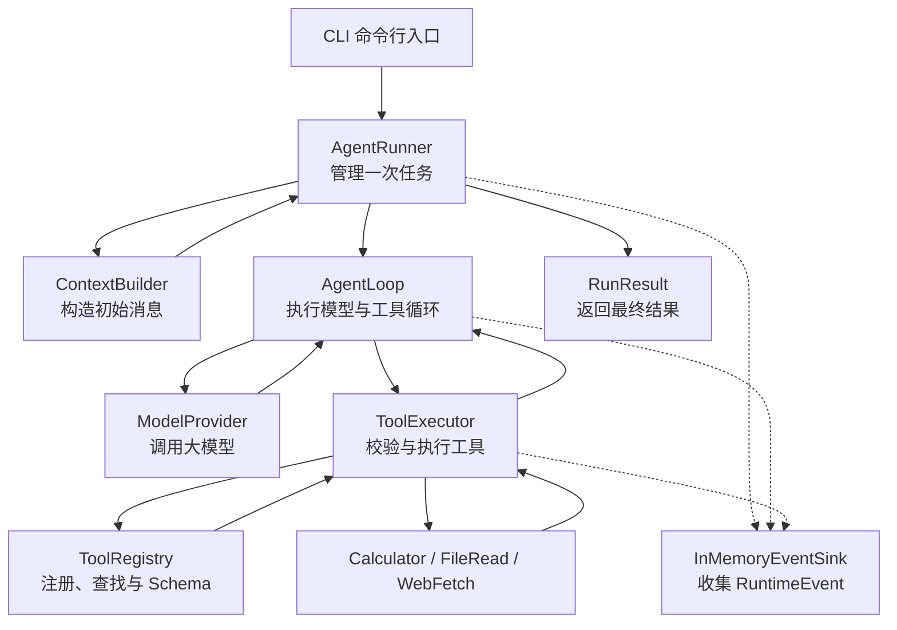

# 阶段一：可测试 Agent 内核架构与实现指南

> 文档目的：面向第一次接触 Agent Runtime 的开发者，解释 EvoAgent 第一阶段要解决的问题、基本架构、代码目录、配置项和分模块实现顺序。
>
> 当前文档只描述设计和学习路线，不包含具体实现代码。后续按照“完成一个模块、理解一个模块、再进入下一个模块”的节奏开发。

## 1. 第一阶段的目标

第一阶段不是开发一个完整的 Agent 产品，而是实现一个**可运行、可测试、可替换组件的 Agent 内核**。

最终希望在命令行输入：

```text
帮我计算 12 × (3 + 4)
```

系统可以完成：

```text
接收任务
→ 调用大模型
→ 大模型决定使用 calculator
→ 校验工具名称和参数
→ 执行 calculator
→ 将结果 84 返回给大模型
→ 大模型生成最终回答
→ 保存本次执行产生的事件和统计信息
```

当任务需要多个步骤时，系统可以持续循环：

```text
模型 → 工具 → 模型 → 工具 → 模型 → 最终答案
```

第一阶段需要证明以下能力：

1. Agent 能通过 Tool Calling 完成多步骤任务。
2. 更换 Provider 或 Tool 时不需要修改核心循环。
3. 模型输出和工具参数都有统一的数据结构。
4. 最大轮次、超时、取消和 Token 软预算能够限制 Agent。
5. 模型错误、工具错误和无效参数可以被确定性测试。
6. 每个关键执行动作都会生成统一的运行事件。

## 2. 第一阶段暂时不做什么

以下能力不属于第一阶段：

- FastAPI 和 REST API
- PostgreSQL 持久化
- 后台 Worker
- 任务暂停与重启恢复
- WebUI
- 长期记忆
- MCP
- Skill 生成、评测、发布和回滚
- pgvector
- Redis
- 多 Agent

这些功能都依赖稳定的 Agent 内核。过早加入会让问题混在一起，难以判断错误来自模型、工具、数据库还是任务调度。

## 3. 总体架构



可以将整个系统类比成一个公司：

| 模块 | 类比 | 职责 |
|---|---|---|
| CLI | 客户接待 | 接收用户输入并展示执行结果 |
| AgentRunner | 项目经理 | 管理一次任务的开始、限制和结束 |
| ContextBuilder | 资料整理员 | 根据系统规则、用户输入和外部上下文构造初始消息 |
| AgentLoop | 执行人员 | 不断进行“调用模型—执行工具—继续调用模型” |
| ModelProvider | 通信线路 | 屏蔽不同大模型接口的差异 |
| ToolRegistry | 工具目录 | 注册和查找工具，并生成提供给模型的 Schema |
| ToolExecutor | 工具调度员 | 校验调用、执行工具、处理超时并规范化结果 |
| Tool | 具体能力 | 计算、读取文件或访问网页 |
| RuntimeEvent / EventSink | 飞行记录仪 | 表示并收集模型和工具的执行过程 |
| RunResult | 项目交付物 | 保存最终答案、状态、Token 和事件 |

## 4. 一次任务的执行链路

一个最小任务的执行过程如下：

```text
CLI 接收用户输入
→ AgentRunner 创建本次运行
→ ContextBuilder 构造初始消息
→ AgentRunner 启动 AgentLoop
→ AgentLoop 请求 ModelProvider
→ Provider 返回 Tool Call
→ AgentLoop 将 Tool Call 交给 ToolExecutor
→ ToolExecutor 通过 ToolRegistry 查找工具并校验参数
→ ToolExecutor 执行 Tool 并规范化 ToolResult
→ AgentLoop 将 Tool Result 加入消息
→ AgentLoop 再次请求 Provider
→ Provider 返回最终答案
→ AgentLoop 结束
→ AgentRunner 汇总 RunResult
→ CLI 展示结果
```

需要特别区分三个概念：

- **Task**：用户希望完成的目标，例如“计算表达式并解释结果”。
- **Run**：系统执行该任务的一次尝试。
- **Turn/Iteration**：一次模型调用及其后续工具处理。

第一阶段主要在内存中管理 Run。Task 持久化和一个 Task 的多次 Run 会在第二阶段实现。

## 5. 核心模块

### 5.1 AgentRunner：管理一次任务

AgentRunner 负责一个 Run 的完整生命周期：

```text
接收用户输入
→ 构建上下文
→ 启动 AgentLoop
→ 收集事件和 Token
→ 处理任务超时或取消
→ 返回 RunResult
```

AgentRunner 不应该负责：

- calculator 如何计算
- HTTP 请求如何发送
- SSE 数据如何解析
- 模型为什么选择某个工具

这些工作分别属于 Tool、Provider 和模型本身。

如果类比 Java 项目，AgentRunner 接近 Application Service：负责用例编排，但不实现所有底层细节。

### 5.2 AgentLoop：模型与工具的循环

AgentLoop 是第一阶段最核心的算法。

其逻辑可以概括为：

```text
循环，直到满足终止条件：

    调用模型

    如果模型返回最终答案：
        结束任务

    如果模型请求调用工具：
        保存包含 Tool Call 的 assistant 消息
        将整批 Tool Call 委托给 ToolExecutor
        将一一对应的 ToolResult 加入消息历史
        继续调用模型

达到最大轮次仍未完成：
    终止任务
```

一个计算任务可能包含两轮：

```text
第 1 轮：
模型请求 calculator("12 * (3 + 4)")

工具执行：
calculator 返回 84

第 2 轮：
模型读取工具结果 84
模型返回“最终答案是 84”

AgentLoop 结束
```

AgentLoop 只依赖抽象接口：

```text
ModelProvider
ToolRegistry
ToolExecutor
RuntimeEventSink
```

因此，更换真实模型或增加工具时不需要修改 AgentLoop。

模型响应的判定规则需要固定，不能只判断“有没有文本”：

1. 只要响应中存在 Tool Call，就先保存完整 assistant 消息，再执行这一批调用；即使同时带有文本，也不能把这段文本直接当成最终答案。
2. 每个 Tool Call 都必须产生一个引用原 `call_id` 的 ToolResult；工具不存在或参数错误时也要返回失败结果，不能漏掉对应消息。
3. 只有“没有 Tool Call 且完成原因表示正常结束”才能成功完成 Run；`length`、`content_filter` 或协议不完整不能伪装成成功答案。

### 5.3 ContextBuilder：构造模型上下文

大模型本身不知道当前 Runtime 中发生了什么。ContextBuilder 负责将信息组织成模型可以理解的消息。

第一阶段需要处理的消息角色包括：

| Role | 含义 |
|---|---|
| system | 系统行为规则和安全约束 |
| user | 用户输入的任务 |
| assistant | 模型回复或模型发出的 Tool Call |
| tool | 工具执行结果 |

System Message 可以约束模型行为，但它不是安全边界。路径、URL、超时和权限限制必须由 ToolExecutor/Guard 用代码强制执行。

第一阶段的 ContextBuilder 只负责构造一个 Run 的初始消息：

- 系统提示词
- 用户输入
- 调用方显式传入的外部上下文

AgentLoop 持有并追加当前 Run 的消息历史；ToolRegistry 生成可用工具定义。ContextBuilder 不负责工具注册，也不在循环中追加 assistant/tool 消息。这样三个模块不会同时修改同一份上下文。

长期记忆、Skill 检索、上下文压缩和 Token 裁剪在后续阶段加入。

## 6. Model Provider

Provider 是大模型适配层。

不同模型服务的接口可能不同，例如：

- OpenAI
- DeepSeek
- 通义千问
- OpenRouter
- 本地 vLLM

AgentLoop 不应该分别处理每个模型厂商的 HTTP 协议。因此，需要先定义统一的 ModelProvider 接口。

第一阶段将真实接口范围固定为 **OpenAI-compatible Chat Completions** 的 `/v1/chat/completions`、Function Calling 和 SSE 流式响应子集，不同时兼容 Responses API 或厂商私有字段。

Provider 对 AgentLoop 暴露的统一契约是：

```text
输入：
    ModelRequest(messages, tool_definitions, model_settings)

输出：异步 ProviderEvent 流
    text_delta
    tool_call_delta
    usage
    completed（包含组装后的 ModelResponse 和完成原因）
```

`ProviderEvent` 是 Provider 与 AgentLoop 之间的流式传输契约；`RuntimeEvent` 是整个 Run 的可观测记录。AgentLoop 会把有意义的 ProviderEvent 转换为 RuntimeEvent，二者不能混用。

第一阶段实现两个 Provider。

### 6.1 MockProvider

MockProvider 不访问真实模型，而是按照测试预先设置的内容返回结果。

例如：

```text
第一次调用：返回 calculator Tool Call
第二次调用：返回最终答案 84
```

MockProvider 可以用于：

- 不消耗 API Key 的测试
- 稳定复现多轮工具调用
- 模拟模型超时
- 模拟错误 Tool Call
- 模拟模型一直不结束
- 区分 Runtime 错误和模型随机性

第一阶段的大部分测试应使用 MockProvider。

### 6.2 OpenAICompatibleProvider

OpenAICompatibleProvider 负责真实模型请求：

- 拼装 HTTP 请求
- 发送流式请求
- 解析 SSE
- 拼接文本 Delta
- 拼接流式 Tool Call 参数
- 统计 Token
- 将超时、401、429 和服务端错误转换为统一的 ProviderError

第一阶段只支持 OpenAI-compatible 协议，不同时适配大量模型厂商。

第一阶段不在 Provider 内自动重试。是否重试取决于错误类型、预算和幂等语义，统一重试策略放到第二阶段；v0.1 先保证错误分类和行为可测试。

## 7. Tool 与 ToolRegistry

### 7.1 Tool 的组成

每个 Tool 至少包含：

```text
名称
描述
参数 Schema
风险等级
是否有副作用
是否允许并行
执行函数
```

以 calculator 为例：

```text
名称：calculator
描述：计算数学表达式
参数：expression，必须是字符串
风险：R0，只读、无副作用
执行：解析表达式并返回计算结果
```

### 7.2 ToolRegistry 与 ToolExecutor 的职责

ToolRegistry 负责：

```text
register(tool)       注册工具
get(name)            根据名称查找工具
definitions()        生成提供给模型的工具 Schema
```

ToolExecutor 负责：

```text
execute(tool_call)   查找工具、校验参数、执行并返回 ToolResult
execute_many(calls)  仅在整批调用均无副作用且可并行时并发，否则按原顺序执行
```

模型不能直接调用 Python 函数，必须经过 ToolExecutor：

```text
模型生成 Tool Call
→ Executor 通过 Registry 检查工具是否存在
→ Pydantic 校验参数
→ 应用超时和最低安全保护
→ 调用工具
→ 将结果包装成统一格式
```

这个边界为后续增加以下能力预留位置：

- Permission Policy
- 人工审批
- Sandbox
- ToolEffect
- 幂等检查

### 7.3 第一阶段内置工具

计划逐步实现：

1. `calculator`：学习工具抽象和参数校验。
2. `file_read`：学习 Workspace 路径限制。
3. `web_fetch`：学习异步 HTTP、超时和结果截断。

不会一次实现三个工具。首先只实现 calculator。

`file_read` 和 `web_fetch` 虽然是只读工具，也不能裸奔：

- `file_read` 必须先将路径解析为绝对路径，拒绝 Workspace 外路径、路径穿越和逃逸 Workspace 的符号链接。
- `web_fetch` 只允许 HTTP/HTTPS；校验主机名和端口，DNS 解析后拒绝环回、私网、链路本地和其他敏感地址；不得自动信任重定向，每次跳转都重新校验，并限制超时与响应大小。

这些是 v0.1 的应用层最低安全前置条件，主要覆盖明确的危险输入和可重复测试用例。v0.2 再将它们纳入统一 Permission Policy、审计、审批和 Sandbox，并用网络出口限制处理 DNS 重绑定等应用层预检查无法彻底消除的问题，而不是到 v0.2 才开始做路径与 SSRF 防护。

## 8. 统一数据模型

各模块不应随意传递结构不明确的字典。第一阶段使用 Pydantic 定义统一的数据契约。

| 数据模型 | 含义 |
|---|---|
| Message | 一条 system、user、assistant 或 tool 消息 |
| ToolDefinition | 暴露给模型的工具说明和参数 Schema |
| ToolCall | 模型请求调用某个工具 |
| ToolResult | 工具执行成功或失败的结果 |
| ModelRequest | 发送给 Provider 的统一请求 |
| ModelResponse | Provider 返回的统一响应 |
| ProviderEvent | Provider 输出的流式片段或完成事件 |
| TokenUsage | 输入、输出和总 Token |
| RuntimeEvent | 一条运行事件 |
| RunResult | 一次 Run 的最终结果 |

如果类比 Java，这些对象接近：

- DTO
- 枚举
- Bean Validation 模型
- 模块之间的接口契约

Pydantic 同时负责类型声明、字段校验和 JSON Schema 生成。

其中 `ToolCall.call_id` 必须保留 Provider 给出的关联 ID，`ToolResult.tool_call_id` 必须引用它。assistant 的 Tool Call 消息先进入历史，随后按原调用顺序加入一一对应的 tool 消息，这是 OpenAI-compatible 协议能够继续下一轮的基本不变量。

## 9. 统一运行事件

即使第一阶段不使用数据库，也需要从一开始定义统一事件。

一次成功运行可能产生：

```text
run.started
model.requested
model.delta
model.completed
tool.started
tool.completed
model.requested
model.delta
model.completed
run.completed
```

异常情况下还可能出现：

```text
model.failed
tool.failed
run.cancelled
run.timeout
run.limit_reached
run.failed
```

每个事件至少包含：

```text
sequence       Run 内单调递增的事件序号
run_id         所属 Run 的关联标识
type           事件类型
timestamp      发生时间
payload        与事件相关的数据
schema_version 事件结构版本
```

第一阶段将事件保存在内存中。

`sequence` 由一个 Run 唯一的 EventSink 原子分配，而不是由 Runner、Loop、Executor 各自计数。并行工具的完成事件可以按真实完成先后记录，但 ToolResult 回填模型时仍按原始 Tool Call 顺序排列。

第二阶段接入 PostgreSQL 时，可以新增事件持久化实现，而不需要重新修改 AgentLoop 的主要逻辑。这也是事件模型需要早于数据库实现的原因。

`RuntimeEvent` 是运行时领域对象；第二阶段落库时，`RunEvent` 是保存它的数据库记录。事件 payload 采用字段白名单并在进入 EventSink 前脱敏，禁止记录 API Key、Authorization Header 或模型隐藏推理；过大的模型/工具内容只记录截断摘要和长度，后续再使用 Artifact 保存正文。

## 10. Run 的终止条件与职责归属

Agent 不可以无限调用模型和工具。

第一阶段至少需要考虑：

| 条件 | 主要负责模块 |
|---|---|
| 没有 Tool Call 且完成原因表示正常结束 | AgentLoop |
| 达到最大循环轮次 | AgentLoop |
| 达到累计 Token 软预算 | AgentLoop |
| 连续重复相同工具调用且结果没有变化 | AgentLoop |
| 单次模型调用超时 | ModelProvider |
| 达到任务总时限或用户取消 | AgentRunner |
| 工具超时、结果超限或安全拒绝 | ToolExecutor；返回类型化 ToolResult，只有不可安全恢复时才终止 |

Token 预算在 v0.1 是软限制：Provider 返回一次完整响应及 Usage 后，AgentLoop 才检查累计值并决定是否继续，不能精确中断已经发出的模型请求。如果服务端不返回 Usage，应明确记录为未知，不能伪造精确数字。

例如，模型连续调用：

```text
calculator("1 + 1")
calculator("1 + 1")
calculator("1 + 1")
```

并且每次结果都相同，Runtime 应识别无效循环并停止，而不是继续消耗 Token。

## 11. 错误应该如何分层

第一阶段需要区分以下错误：

| 错误类型 | 示例 | 默认处理 |
|---|---|---|
| 配置错误 | 缺少模型名称 | 启动时直接失败 |
| Provider 错误 | 401、429、超时 | 转为类型化错误并终止；v0.1 不自动重试 |
| Tool 不存在 | 模型调用未知工具 | 将错误结果反馈给模型 |
| Tool 参数错误 | expression 字段缺失 | 将校验错误反馈给模型 |
| 可恢复 Tool 错误 | 除零、目标网页暂时失败 | 记录事件并反馈模型，允许调整方案 |
| Tool 安全拒绝 | URL 或路径不被允许 | 不执行工具，返回 `permission_denied`；重复拒绝达到限制后终止 |
| 不可恢复 Tool 错误 | 运行时不变量破坏、执行环境失效 | 记录事件并终止 Run |
| Runtime 限制 | 达到最大轮次 | 终止 Run |
| 用户取消 | 收到取消信号 | 停止当前异步任务 |

模型可以修正的错误应作为 Tool Result 返回给模型；系统无法安全继续的错误才终止 Run。

`asyncio.CancelledError` 必须显式继续向上传播，任何兜底捕获层都不能把它包装成普通 ToolResult；由 AgentRunner 统一生成 `run.cancelled`。每个 Run 只能产生一个终态事件，超时、取消和普通失败不能重复记账。

## 12. 代码目录框架

第一阶段完成后的目标结构如下：

```text
EvoAgent/
├─ pyproject.toml
├─ README.md
├─ .gitignore
├─ .env.example
├─ .pre-commit-config.yaml
├─ .github/
│  └─ workflows/
│     └─ ci.yml
├─ src/
│  └─ evoagent/
│     ├─ __init__.py
│     ├─ config.py
│     ├─ cli.py
│     │
│     ├─ core/
│     │  ├─ models.py
│     │  ├─ events.py
│     │  ├─ context.py
│     │  ├─ loop.py
│     │  └─ runner.py
│     │
│     ├─ providers/
│     │  ├─ base.py
│     │  ├─ mock.py
│     │  └─ openai_compatible.py
│     │
│     └─ tools/
│        ├─ base.py
│        ├─ registry.py
│        ├─ executor.py
│        ├─ guards.py
│        └─ builtin/
│           ├─ calculator.py
│           ├─ file_read.py
│           └─ web_fetch.py
│
└─ tests/
   ├─ unit/
   │  ├─ test_tool_registry.py
   │  ├─ test_tool_executor.py
   │  ├─ test_tool_guards.py
   │  ├─ test_calculator.py
   │  ├─ test_context.py
   │  └─ test_agent_loop.py
   └─ integration/
      └─ test_agent_run.py
```

这只是第一阶段结束时的目标结构。开发过程中不提前创建大量空文件，而是实现到哪个模块，再创建对应目录和文件。

## 13. 技术与依赖

| 技术 | 作用 | Java 类比 |
|---|---|---|
| Python 3.12 | 主要开发语言 | JDK 版本 |
| pyproject.toml | 项目信息、构建和依赖 | pom.xml |
| Pydantic | DTO、校验和 JSON Schema | Bean Validation |
| pydantic-settings | 从环境变量加载类型化配置 | Spring Boot Configuration Properties |
| asyncio | 异步模型调用、取消和并发 | CompletableFuture / Reactor |
| httpx | 异步 HTTP 请求 | WebClient / OkHttp |
| pytest | 单元与集成测试 | JUnit |
| pytest-asyncio | 异步测试 | 异步测试支持 |
| respx | Mock HTTP 请求 | WireMock / MockWebServer |
| Ruff | 格式化和静态检查 | Checkstyle + Spotless |

第一阶段尽量保持依赖较少。核心 AgentLoop 不直接依赖 Web 框架、数据库和大型 Agent 编排框架。

## 14. 配置设计

### 14.1 第一阶段配置项

计划包含：

```text
EVOAGENT_API_KEY
EVOAGENT_BASE_URL
EVOAGENT_MODEL
EVOAGENT_PROVIDER
EVOAGENT_MAX_ITERATIONS
EVOAGENT_MODEL_TIMEOUT_SECONDS
EVOAGENT_TASK_TIMEOUT_SECONDS
EVOAGENT_TOOL_TIMEOUT_SECONDS
EVOAGENT_MAX_TOTAL_TOKENS
EVOAGENT_MAX_REPEATED_TOOL_CALLS
EVOAGENT_MAX_TOOL_RESULT_CHARS
EVOAGENT_WORKSPACE
EVOAGENT_LOG_LEVEL
```

### 14.2 建议默认值

```text
EVOAGENT_PROVIDER=mock
EVOAGENT_MAX_ITERATIONS=8
EVOAGENT_MODEL_TIMEOUT_SECONDS=60
EVOAGENT_TASK_TIMEOUT_SECONDS=300
EVOAGENT_TOOL_TIMEOUT_SECONDS=30
EVOAGENT_MAX_TOTAL_TOKENS=32000
EVOAGENT_MAX_REPEATED_TOOL_CALLS=3
EVOAGENT_MAX_TOOL_RESULT_CHARS=20000
EVOAGENT_WORKSPACE=./workspace
EVOAGENT_LOG_LEVEL=INFO
```

几个容易混淆的限制含义如下：

- `MAX_ITERATIONS` 统计模型请求次数；一次模型响应及其整批 Tool Call 算一个 Iteration。
- `MODEL_TIMEOUT_SECONDS` 限制单次模型请求，`TOOL_TIMEOUT_SECONDS` 限制单个工具调用，`TASK_TIMEOUT_SECONDS` 限制整个 Run。
- `MAX_TOTAL_TOKENS` 是所有模型调用已报告 Usage 的累计软预算，不是模型上下文窗口大小。
- `MAX_TOOL_RESULT_CHARS` 对每个 ToolResult 单独生效，避免一次结果撑爆后续上下文。

### 14.3 配置原则

- API Key 只能从环境变量或 Secret Store 读取。
- `.env` 不提交到 Git。
- `.env.example` 只保存字段名和非敏感示例。
- 测试默认使用 MockProvider，不依赖真实 API Key。
- `PROVIDER=mock` 让首次运行和测试不依赖外部服务；切换为 `openai_compatible` 时才要求 `API_KEY`、`BASE_URL` 和 `MODEL` 通过条件校验。
- 超时、最大轮次和结果长度不作为 AgentLoop 中的魔法数字。
- 相对 Workspace 路径在启动时解析一次，此后安全检查只使用规范化后的绝对路径。
- 配置加载和业务逻辑保持分离。

## 15. 测试策略

测试不是第一阶段结束后再补，而是每完成一个模块就同时完成对应测试。

### 15.1 单元测试

覆盖：

- Pydantic 数据校验
- ToolRegistry 注册和重复注册
- ToolExecutor 的参数校验、超时、结果截断和结果顺序
- Workspace 路径穿越、符号链接逃逸和 URL/SSRF 防护
- calculator 正常计算与危险表达式拒绝
- ContextBuilder 消息顺序
- AgentLoop 终止条件
- 重复 Tool Call 检测

### 15.2 Provider 契约测试

确保 MockProvider 和 OpenAICompatibleProvider 最终都能产生相同的 ProviderEvent：

```text
text_delta
tool_call_delta
usage
completed
```

Provider 契约测试使用 HTTP Mock 和固定 SSE 样本，不访问真实模型；RuntimeEvent 的转换另由 AgentLoop 测试覆盖。

固定样本至少覆盖普通文本分片、多个 Tool Call 按 index 交错分片、参数 JSON 跨分片、Usage 缺失、流提前结束和非法事件格式。

### 15.3 Agent 集成测试

使用 MockProvider 覆盖：

1. 模型直接回答。
2. 模型调用一次工具后回答。
3. 模型连续调用多个工具。
4. 模型传入错误参数后自行修正。
5. 工具执行失败后模型改变方案。
6. 模型超时。
7. 达到最大轮次。
8. 用户取消。
9. 多个可并行 Tool Call 的结果仍按原始顺序回填。
10. 达到 Token 软预算后不再发起下一次模型请求。

## 16. 分模块实现顺序

开发采用“小步提交”的方式。每个模块完成后暂停，先阅读和解释，再进入下一模块。

### 模块 0：工程初始化与配置

创建：

- `pyproject.toml`
- `.gitignore`
- `.env.example`
- `.pre-commit-config.yaml`
- `.github/workflows/ci.yml`
- 最小 README
- `config.py`
- 配置测试

需要理解：

- Python 包结构
- 虚拟环境
- 依赖管理
- 环境变量
- 为什么配置与业务代码分离

### 模块 1：核心数据契约

创建：

- `core/models.py`
- `core/events.py`
- 对应测试

需要理解：

- Pydantic
- 类型提示
- DTO
- 枚举
- 模块之间传递什么数据

### 模块 2：Tool 与 ToolRegistry

创建：

- `tools/base.py`
- `tools/registry.py`
- `tools/builtin/calculator.py`
- 对应测试

需要理解：

- 抽象类或 Protocol
- 注册表模式
- Schema
- 工具元数据
- 为什么 Registry 只管理目录而不执行工具

### 模块 3：ToolExecutor

创建：

- `tools/executor.py`
- 对应测试

需要理解：

- 参数校验与统一 ToolResult
- 先用顺序执行实现单个和多个 Tool Call 的稳定契约
- 为什么结果必须始终按原始 Tool Call 顺序回填，为模块 9 的安全并发预留空间
- 为什么模型不能直接执行 Python 函数

### 模块 4：Provider 与 MockProvider

创建：

- `providers/base.py`
- `providers/mock.py`
- 对应测试

需要理解：

- 依赖倒置
- 适配器模式
- ProviderEvent 与 RuntimeEvent 的区别
- 为什么核心测试不能依赖真实大模型

### 模块 5：ContextBuilder

创建：

- `core/context.py`
- 对应测试

需要理解：

- 模型消息结构
- system、user、assistant、tool 角色
- ContextBuilder 为什么只构造初始消息
- AgentLoop 如何追加 assistant 与 Tool Result

### 模块 6：AgentLoop

创建：

- `core/loop.py`
- AgentLoop 的确定性测试

需要理解：

- Agent 的本质循环
- Tool Calling
- 终止条件
- 工具错误如何反馈给模型
- 为什么 Loop 不依赖具体 Provider 和 Tool

### 模块 7：AgentRunner

创建：

- `core/runner.py`
- Run 级测试

需要理解：

- AgentLoop 与 AgentRunner 的区别
- 任务级超时和取消
- Token、事件和最终结果如何汇总

### 模块 8：真实 Provider 与 CLI

创建：

- `providers/openai_compatible.py`
- `cli.py`
- Provider HTTP Mock 测试

需要理解：

- HTTP SSE
- 流式响应
- Tool Call 参数为什么需要分片拼接
- 真实模型如何接入内核

### 模块 9：安全只读工具与第一阶段收尾

补充：

- `tools/guards.py`
- `file_read` 的 Workspace 路径保护
- `web_fetch` 的 URL/SSRF、重定向、超时和大小保护
- 多个声明为可并行、无副作用的 Tool Call 并行执行并有序回填
- 有副作用 Tool Call 顺序执行的基础分类（v0.1 不新增写工具）
- 重复工具调用检测
- 超时和取消测试
- 完整 CLI Demo
- 架构说明和 ADR

## 17. 推荐学习顺序

建议按照以下顺序理解代码：

```text
数据契约
→ 工具抽象
→ 工具执行器
→ 模型抽象
→ Context
→ AgentLoop
→ AgentRunner
→ 真实模型接口
```

不要一开始就把精力全部放在 HTTP 请求和 Prompt 上。第一阶段真正重要的是：

- 模块边界是否清楚
- 数据是否有统一契约
- AgentLoop 是否可以确定性测试
- Provider 和 Tool 是否可以替换
- 失败和终止条件是否可控

## 18. 第一阶段完成标准

满足以下条件后，第一阶段可以结束：

- 有一个通过 CLI 调用的最小 Agent Runtime。
- Agent 能完成“用户输入 → 模型 Tool Call → 工具执行 → 最终回答”的链路。
- Provider 和 Tool 均通过抽象接口接入，工具调用统一经过 ToolExecutor。
- 更换 Provider 或 Tool 不需要修改 AgentLoop。
- 支持流式文本事件。
- 支持最大轮次、模型超时、工具超时、任务总超时、取消、Token 统计和软预算。
- 所有关键执行动作都有统一 RuntimeEvent。
- MockProvider 可以确定性复现正常、失败和超时场景。
- 核心测试不依赖真实模型和外部网络。
- `file_read` 的路径穿越和符号链接逃逸用例会被拒绝；`web_fetch` 的已知私网/环回地址和重定向绕过用例会被拒绝，并明确记录 v0.2 才补齐的网络出口边界。
- README 能指导新用户运行测试和 CLI Demo。

## 19. 后续协作方式

每个模块按照以下流程推进：

```text
1. 说明本模块要解决的问题
2. 给出将要创建或修改的文件
3. 实现最小代码
4. 运行测试
5. 按推荐顺序阅读代码
6. 解释每个类和关键调用链
7. 总结可能的面试问题
8. 确认理解后进入下一个模块
```

第一个实现单元是“模块 0：工程初始化与配置”。在明确开始该模块前，不创建第一阶段的实现代码。
