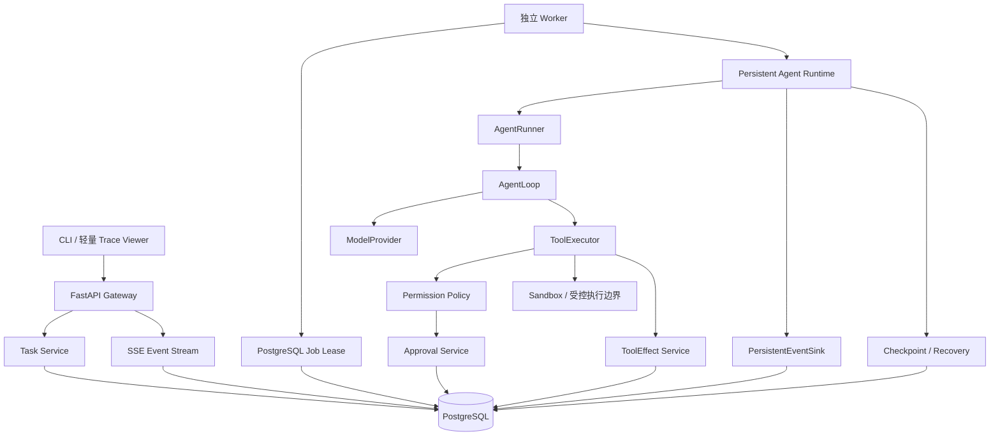
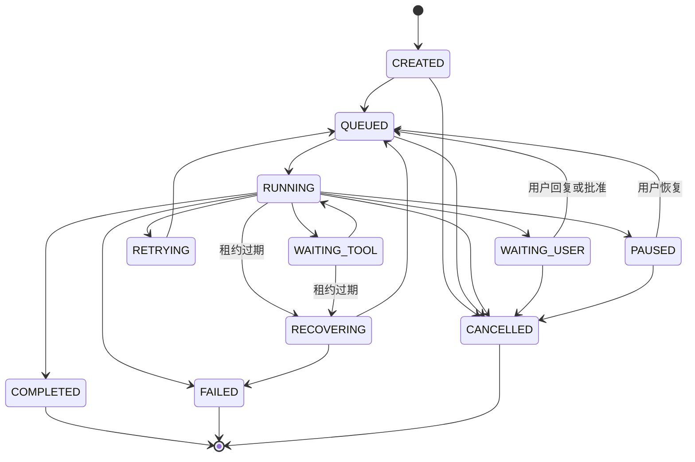

# 阶段二：可靠、可追踪的任务执行架构与实现指南

> 文档目的：面向刚完成阶段一、第一次接触数据库、任务队列和故障恢复的开发者，解释 EvoAgent 第二阶段要解决的问题、总体架构、数据模型、代码目录、配置、测试策略和分模块实现顺序。
>
> 当前状态（2026-09-08）：模块 0～12 已全部实现。本文前半部分保留设计依据，模块清单作为实现验收索引；具体代码原理见《EvoAgent 源码讲解与学习手册》第二阶段章节。

## 1. 第二阶段的目标

阶段一已经证明：一个进程内的 Agent 可以完成“模型决定—工具执行—模型继续—最终回答”。但是进程一旦退出，内存中的任务状态和事件就会消失；Worker 在工具执行过程中崩溃时，系统也不知道应该继续、重试还是等待人工处理。

第二阶段要把阶段一的“可测试内核”扩展成一个**状态可持久化、任务可领取、过程可追踪、故障可恢复的单 Agent Runtime**。

最终希望客户端提交任务后立即得到 task_id：

```text
POST /api/tasks
→ PostgreSQL 保存 Task
→ API 返回 task_id
→ 独立 Worker 领取任务
→ Agent Runtime 执行模型和工具
→ RunEvent 持续写入数据库
→ 客户端通过 SSE 查看进度
→ Worker 异常退出后，新 Worker 从合法检查点恢复
→ 客户端查看最终答案与完整 Trace
```

第二阶段需要证明以下能力：

1. API 进程和 Worker 进程职责分离，API 不在请求线程中直接跑长任务。
2. PostgreSQL 是 Task、Run、事件、快照和副作用记录的事实来源。
3. Worker 使用数据库租约领取任务，不依赖内存队列、Redis 或 Celery。
4. 任务只从完整模型调用、完整工具调用或完整 Turn 的边界恢复。
5. 重复投递不会重复提交已经确认成功的副作用。
6. 无法判断副作用是否提交时，系统停下来请求人工确认，而不是盲目重试。
7. 模型、工具和状态变化可以通过 Trace 定位。
8. 路径、网络和 Shell 能力统一经过 Permission Policy 与 Sandbox 边界。

## 2. 开始第二阶段前必须保留什么

第二阶段不是重写阶段一。下面这些 v0.1 边界继续成立：

- AgentRunner 管一次 Run 的生命周期。
- AgentLoop 只管模型与工具迭代。
- ContextBuilder 只构造上下文。
- ModelProvider 隔离模型协议。
- ToolRegistry 只注册、查找和输出 Schema。
- ToolExecutor 是工具执行的唯一入口。
- ProviderEvent 与 RuntimeEvent 分离。
- 模型生成的工具名、参数、文件路径和 URL 都是不可信输入。
- 每次 Run 只有一个终态。

第二阶段允许为持久化和恢复扩展接口，但不能把数据库 SQL、HTTP 路由、Worker 租约和 AgentLoop 混进一个大类。

开始编码前应先运行阶段一全部测试，把当前结果作为回归基线。

## 3. 第二阶段暂时不做什么

以下能力不属于第二阶段：

- Redis、Celery、Dramatiq 或 Kafka
- 多 Worker 横向扩容和吞吐优化
- 完整聊天 WebUI
- 多租户、RBAC、OAuth 和公网部署
- 长期记忆与上下文自动压缩
- pgvector 和向量检索
- MCP
- 多 Agent
- Skill 生成、评测、发布和回滚
- 自动灰度、自动回滚和完整生产监控
- 从半段 SSE 文本或执行到一半的任意命令继续

阶段二只使用一个独立 Worker，但租约协议仍按可竞争领取的正确方式设计。这样可以先证明可靠执行语义，不把问题扩大成分布式调度平台。

默认只面向本机开发环境并绑定回环地址。没有身份认证时，不得把 API 暴露到公网。

## 4. 总体架构



可以把阶段二类比成一个有档案室和轮班制度的公司：

| 模块 | 类比 | 职责 |
|---|---|---|
| FastAPI | 服务窗口 | 接收任务、查询状态、取消、恢复和输出 SSE |
| TaskService | 业务受理员 | 校验命令并驱动合法状态迁移 |
| PostgreSQL | 权威档案室 | 保存当前状态、事件、快照和副作用事实 |
| Worker | 执行岗位 | 领取有租约的任务并调用 Agent Runtime |
| Job Lease | 限时工作证 | 表明某个 Worker 暂时拥有任务执行权 |
| PersistentEventSink | 持久化飞行记录仪 | 追加不可变 RunEvent |
| Checkpoint | 已确认存档点 | 保存可以安全恢复的运行上下文 |
| RecoveryService | 接班检查员 | 根据快照、事件和 ToolEffect 决定如何继续 |
| Permission Policy | 审批规则 | 根据工具、参数和目标计算有效风险与决策 |
| Sandbox | 受控工作间 | 限制文件、网络和子进程的实际能力 |
| ToolEffect | 副作用回执 | 证明某个语义动作是否已经提交 |
| TraceService | 档案查询员 | 把模型、工具、状态和恢复决策组成时间线 |

## 5. 一次持久化任务的正常链路

```text
客户端提交任务
→ API 校验 CreateTaskRequest
→ 同一事务创建 Session/Task、首个 QUEUED Run 和 run.queued 事件
→ API 返回 202 Accepted、task_id 和 run_id
→ Worker 从 PostgreSQL 领取一条到期任务并写入租约
→ Worker 激活该 QUEUED Run，将 Task/Run 迁移到 RUNNING
→ Persistent Agent Runtime 调用阶段一 AgentRunner/AgentLoop
→ 每个 RuntimeEvent 追加为 RunEvent
→ 在合法边界写入 RunSnapshot
→ SSE 按 sequence 向客户端推送已提交事件
→ Agent 正常完成
→ 同一事务写入 run.completed，并更新 Run/Task 为 COMPLETED
→ 客户端查询 Task 或 Trace 获得最终结果
```

这里必须区分：

- **Session**：一组相关任务和消息的会话容器。
- **Task**：用户希望完成的持久化目标，可能经历多次 Run。
- **Run**：执行 Task 的一次尝试。
- **Turn**：一次完整模型调用以及它引出的工具处理。
- **Lease**：Worker 对 Task 的临时执行权，不是任务最终状态。
- **Snapshot**：可恢复状态快照，不是普通日志。
- **Event**：已经发生的事实，不允许原地修改。

## 6. 关键不变量与阶段一接口演进

### 6.1 数据库是事实来源

内存变量、SSE 连接、Worker 进程和轮询结果都可以消失。只有已经提交到 PostgreSQL 的 Task、Run、RunEvent、RunSnapshot 和 ToolEffect 能用于恢复决策。

### 6.2 状态与终态事件保持一致

例如 Run 变成 COMPLETED 时，`run.completed` 必须在同一事务中持久化。不能出现数据库状态已经完成但终态事件缺失，或终态事件存在但 Run 仍是 RUNNING。

### 6.3 Provider Call ID 不等于幂等键

Provider 的 `tool_call_id` 只负责关联 assistant ToolCall 与 tool 消息。Worker 重启或模型再次生成相同业务动作时，调用 ID 可能不同。

副作用工具必须根据：

```text
工具名 + 规范化参数 + 业务作用域
```

生成语义幂等键。

### 6.4 恢复只能发生在合法边界

系统不承诺恢复半段模型流或执行到一半的命令。只有下列状态可以形成检查点：

- 完整模型调用结束；
- 完整 ToolCall 得到确定结果；
- 完整 Agent Turn 结束；
- 进入 WAITING_USER 或 PAUSED 前。

### 6.5 阶段一接口怎样最小演进

当前 AgentRunner 会自己生成 run_id 和 InMemoryEventSink，AgentLoop 只接收初始消息。这适合 v0.1，但持久化运行需要由外部传入数据库中已经存在的 Run 身份和恢复状态。

阶段二应通过小接口扩展，而不是让核心层依赖 SQLAlchemy：

| 阶段一接口 | 阶段二扩展 | 保持不变的边界 |
|---|---|---|
| Runner 内部创建 run_id/Sink | 接收可选 RunExecutionContext；未传入时保留原行为 | Runner 仍管理一次 Run |
| Loop 从 initial_messages 开始 | 可以从版本化 LoopState 开始 | Loop 不查询数据库 |
| EventSink 只写内存 | 增加同协议 PersistentEventSink | Loop/Executor 不识别 ORM |
| Executor 直接调用 Tool | 注入 Policy、Effect、Sandbox 执行管线 | Registry 仍不执行工具 |
| 只在 Run 结束返回结果 | 合法边界调用 CheckpointHook | Snapshot 如何落库由适配层决定 |

建议引入不含 ORM 对象的 `RunExecutionContext`，最少携带 run_id、EventSink、可选 LoopState、CheckpointHook 和取消检查接口。这样 CLI 的内存运行继续可用，Worker 的持久化运行也不需要复制一套 AgentLoop。

## 7. PostgreSQL 持久化设计

### 7.1 为什么选择 PostgreSQL

阶段二既需要关系约束和事务，也需要队列式行锁、JSON 事件和唯一约束。PostgreSQL 可以同时承担业务数据库和阶段二的最小任务队列，避免过早引入第二套事实来源。

本阶段使用 SQLAlchemy 2.x 异步接口、Alembic 迁移和异步 PostgreSQL 驱动。每个并发协程使用自己的 AsyncSession，不能跨并发任务共享同一个 Session。

### 7.2 ORM 模型和领域模型必须分离

阶段一的 Pydantic 模型表示 Runtime 契约；SQLAlchemy 模型表示数据库行。二者可以有相似字段，但职责不同：

```text
Pydantic Model：模块间输入输出、校验、序列化
ORM Model：表、列、外键、索引、事务和锁
```

不要让 AgentLoop 直接依赖 ORM 对象，也不要把 AsyncSession 放进核心 Message 或 ToolCall。

### 7.3 第二阶段核心表

| 表 | 关键字段 | 作用 |
|---|---|---|
| sessions | id、title、created_at | 会话容器 |
| messages | id、session_id、role、content、created_at | 用户可见会话消息 |
| tasks | id、session_id、goal、status、cancel_requested、lease_owner、lease_expires_at、heartbeat_at、next_attempt_at、attempt_count、lock_version | 持久化任务与租约 |
| runs | id、task_id、status、provider、model、started_at、ended_at、next_event_sequence、lock_version、final_answer、error_code | 一次执行尝试 |
| turns | id、run_id、sequence、status、request_summary、response_summary、usage | 模型轮次摘要 |
| tool_calls | id、run_id、turn_id、provider_call_id、tool_name、arguments、risk、status、result_summary | 工具调用 Trace |
| run_events | id、run_id、sequence、event_type、payload、schema_version、created_at | 不可变事件时间线 |
| run_snapshots | id、run_id、event_sequence、state、context_ref、created_at | 合法恢复点 |
| tool_effects | id、tool_call_id、effect_scope、semantic_key、status、result_hash、committed_at | 副作用提交账本 |
| tool_approvals | id、task_id、tool_call_id、status、risk、reason、requested_at、decided_at | 人工审批 |
| artifacts | id、run_id、type、uri、content_hash、size_bytes、metadata | 大内容和报告引用 |

### 7.4 必须建立的数据库约束

- `run_events(run_id, sequence)` 唯一；
- `run_snapshots(run_id, event_sequence)` 唯一；
- `turns(run_id, sequence)` 唯一；
- `tool_effects(effect_scope, semantic_key)` 唯一；
- 状态字段使用受控枚举或检查约束；
- 外键明确删除策略，不允许误删 Task 时级联清空审计事实；
- Task、Run 使用 `lock_version` 做乐观锁；
- 领取任务所需的 status、next_attempt_at、lease_expires_at 建联合索引；
- 所有时间统一保存为带时区 UTC 时间。

### 7.5 事务边界

一个事务只完成一个可解释的状态变化，例如：

```text
领取任务 + 写入租约
创建 Task + 首个 QUEUED Run + run.queued
激活 Run + Task/Run 进入 RUNNING
追加事件 + 分配 sequence
写入快照 + 记录快照事件
提交 ToolEffect + 工具调用进入 SUCCEEDED
Run/Task 进入终态 + 写入终态事件
```

外部模型调用和网络工具不能在持有数据库行锁时等待，否则会造成长事务和锁竞争。

## 8. Task 与 Run 状态机



状态不能由路由函数或 Worker 随意赋值。统一的 StateMachine/TaskService 应检查：

- 当前状态是否允许目标状态；
- lock_version 是否仍是调用方读取的版本；
- 状态迁移与对应事件是否同事务提交；
- 终态是否禁止再次迁移；
- cancel_requested 是否在模型和工具边界被及时观察。

Task 表示用户目标的总体状态；Run 表示某次尝试的状态。一次恢复可以继续原 Run，也可以在无法安全续跑时结束旧 Run 并创建恢复 Run，但必须记录关联原因。第二阶段优先选择“从已提交 RunSnapshot 继续原 Run”，只有协议不兼容或状态损坏才创建新 Run。

## 9. PersistentEventSink、Trace 与 Artifact

### 9.1 PersistentEventSink

阶段一 InMemoryEventSink 仍保留给单元测试。第二阶段新增 PersistentEventSink，实现同一个 RuntimeEventSink 协议。

它负责：

- 在数据库中原子分配 Run 内 sequence；
- 复用阶段一的递归脱敏和大小限制；
- 将 RuntimeEvent 保存为 RunEvent；
- 提交后通知 SSE 轮询器有新事件；
- 保证同一 Run 的 sequence 连续且不重复。

它不负责修改 Task 状态；需要状态与事件原子提交时，由应用服务在同一个 Unit of Work 中完成。

### 9.2 Trace 不是日志文本

TraceService 根据 run_id 汇总：

```text
Run 状态
→ RunEvent 时间线
→ Turn
→ ToolCall
→ ToolEffect
→ Snapshot
→ Artifact 引用
→ 恢复和审批决策
```

日志用于开发排错；Trace 是用户可查询、结构稳定的业务审计数据。

### 9.3 Artifact

模型长输出、网页正文和生成报告不应全部塞进 RunEvent JSON。Artifact 保存正文、哈希、大小和 URI，事件只保存摘要及引用。

阶段二先实现本地 Workspace ArtifactStore，并定义可替换协议；对象存储留到后续版本。

## 10. PostgreSQL Job Lease 与独立 Worker

### 10.1 为什么不用 FastAPI BackgroundTasks

API 进程重启时，进程内后台任务会丢失，也无法可靠接管。因此 API 只写入 QUEUED Task，独立 Worker 从数据库领取。

### 10.2 领取协议

Worker 在短事务中：

```text
查找 status=QUEUED 或租约已过期的可运行 Task
→ SELECT ... FOR UPDATE SKIP LOCKED
→ 写入 lease_owner、lease_expires_at、heartbeat_at
→ 增加 attempt_count / lock_version
→ 提交事务
→ 事务外执行任务
```

`SKIP LOCKED` 适合多个消费者竞争队列式记录，但不适合普通一致性查询；因此只在领取仓储中使用。

### 10.3 heartbeat 和租约过期

Worker 执行期间定期刷新 heartbeat 和 lease_expires_at。刷新必须带 lease_owner 与 lock_version 条件；更新不到记录说明租约已经丢失，当前 Worker 必须停止继续提交结果。

Worker 崩溃后，Reaper/下一次领取会把过期任务迁移到 RECOVERING，再交给 RecoveryService 判断。

### 10.4 单 Worker 也要测试竞争

产品运行时只启动一个 Worker，但测试必须模拟两个领取者同时竞争，证明同一 Task 只有一个成功获得租约。这样以后扩展多 Worker 时不会推翻数据模型。

## 11. 检查点与恢复协议

### 11.1 Snapshot 至少保存什么

```text
run_id
最近已提交 event_sequence
当前 Task/Run 状态
完整且经过校验的消息历史或 Artifact 引用
下一 iteration
累计 Usage
重复工具调用计数
待处理 ToolCall
Provider、模型和关键运行配置哈希
工具注册表版本/签名
```

Snapshot 必须有 schema_version。恢复时发现版本不兼容，不能猜测字段，应明确失败或执行受控迁移。

### 11.2 恢复算法

```text
读取 Task、Run 和最新 Snapshot
→ 验证配置与 Snapshot Schema
→ 重放 Snapshot 之后已经提交的 RunEvent
→ 查询待处理 ToolCall 对应的 ToolEffect
→ 已确认成功：复用已保存结果
→ 确认未执行且可安全重试：重新入队
→ 执行结果不确定：进入 WAITING_USER
→ 恢复 AgentLoop 所需消息和计数
→ 写 recovery.decided 事件
→ Task 回到 QUEUED/RUNNING
```

### 11.3 不允许的恢复方式

- 只看 Task.status 就重新执行全部工具；
- 把 Provider Call ID 当成幂等证明；
- 重放半段 SSE 文本作为完整 assistant 消息；
- 对结果不确定的外部写操作自动重试；
- 修改旧事件来“修正”历史；
- Snapshot 写入数据库前就宣布检查点成功。

## 12. ToolEffect、幂等与副作用

### 12.1 ToolEffect 状态

建议最小状态：

```text
PREPARED → EXECUTING → COMMITTED
                     ↘ FAILED
                     ↘ UNKNOWN
```

- PREPARED：语义幂等键已经占位，尚未调用外部系统；
- EXECUTING：调用已经开始，进程此时崩溃可能导致结果不确定；
- COMMITTED：副作用已确认成功，并保存结果哈希或外部回执；
- FAILED：确认没有成功提交，可以按策略决定重试；
- UNKNOWN：无法确认是否提交，必须人工处理或通过外部查询核对。

### 12.2 at-least-once 与幂等

数据库租约提供的是至少一次处理，不自动提供恰好一次外部副作用。阶段二通过以下组合降低重复：

- 唯一语义幂等键；
- ToolEffect 状态机；
- 数据库事务；
- 外部服务支持时传递幂等键；
- 无法确认时停止并请求人工决策。

不要在简历或文档中声称系统实现了通用 exactly-once。

## 13. Permission Policy、审批与 Sandbox

### 13.1 有效风险不是固定常量

工具声明基础风险，Policy 再根据参数、目标和当前状态提升有效风险：

| 风险 | 示例 | 默认决定 |
|---|---|---|
| R0 | 计算、公开网页读取、Workspace 内只读 | 自动允许 |
| R1 | 在本 Run Artifact 目录创建唯一新文件 | 记录审计后允许 |
| R2 | 覆盖文件、受控命令 | 策略校验并请求确认 |
| R3 | 删除、发消息、外部写操作 | 强制人工确认；阶段二默认不提供 |

Policy 输出统一决定：

```text
ALLOW / DENY / REQUIRE_APPROVAL
```

ToolExecutor 的顺序应扩展为：

```text
参数校验
→ 计算有效风险
→ Permission Policy
→ 必要时创建 Approval 并暂停
→ 副作用工具准备 ToolEffect
→ Sandbox/受控边界执行
→ 保存结果、事件和检查点
```

### 13.2 Sandbox 的阶段二边界

阶段二建立 Sandbox 协议并提供最低实现：

- 文件：限定每个 Run 的 Workspace/Artifact 根目录，使用独占创建防止意外覆盖；
- Shell：禁止 `shell=True`，只接收 argv 列表，限制可执行程序、工作目录、环境变量、时间和输出大小；
- 网络：应用层 URLGuard 继续保留，网络工具必须经过受控出口，实际目标也要拒绝私网与敏感地址；
- 容器：Docker Compose 用于隔离 API、Worker、PostgreSQL 和受控网络，不把宿主机目录和密钥无边界挂载给工具。

这仍不是生产级恶意代码沙箱。完整容器资源隔离、seccomp、只读根文件系统和细粒度网络策略属于后续强化项。

### 13.3 审批不是同步 input()

Worker 不能停在终端等待输入。需要确认时：

```text
创建 ToolApproval
→ Task 进入 WAITING_USER
→ 释放租约
→ API 接收批准或拒绝
→ 写审批事件
→ Task 重新进入 QUEUED
→ Worker 从 Snapshot 恢复
```

## 14. 分类重试与退避

重试必须回答三个问题：

1. 失败是否可能是暂时的？
2. 这次动作是否可以安全重复？
3. 预算和最大次数是否允许？

建议策略：

| 错误 | 默认策略 |
|---|---|
| Provider 429、5xx、连接中断 | 有上限指数退避并加入随机抖动 |
| Provider 401/403、请求参数错误 | 不重试 |
| 只读工具暂时性网络错误 | 有上限重试 |
| Policy 拒绝、参数校验错误 | 不重试，反馈模型或等待用户 |
| 有副作用工具，确认未提交 | 可以按工具策略重试 |
| 有副作用工具，已 COMMITTED | 复用结果，不重复执行 |
| 有副作用工具，状态 UNKNOWN | 不自动重试，进入 WAITING_USER |

重试等待不能占用数据库锁。Task 写入 `next_attempt_at` 并进入 RETRYING/QUEUED，由 Worker 到期后重新领取。

预算至少包括最大重试次数、累计模型请求次数和任务总时限。每次决定都写入结构化事件。

## 15. FastAPI、SSE 与轻量 Trace Viewer

### 15.1 最小 API

```text
POST   /api/sessions
GET    /api/sessions/{session_id}
POST   /api/tasks
GET    /api/tasks/{task_id}
POST   /api/tasks/{task_id}/cancel
POST   /api/tasks/{task_id}/pause
POST   /api/tasks/{task_id}/resume
GET    /api/tasks/{task_id}/events
GET    /api/runs/{run_id}/trace
POST   /api/tool-approvals/{approval_id}/approve
POST   /api/tool-approvals/{approval_id}/reject
GET    /health/live
GET    /health/ready
```

创建任务返回 `202 Accepted`，因为任务只是入队，并未在 HTTP 请求内完成。

### 15.2 SSE 规则

实现时优先使用当前 FastAPI 官方提供的 `EventSourceResponse` 和 `ServerSentEvent`，不要手工拼接容易出错的 SSE 文本；依赖版本必须在模块 0 固定到包含该接口的稳定版本。

- 只发送已经提交到数据库的 RunEvent；
- SSE 的 `id` 使用 RunEvent.sequence；
- 客户端重连时使用 Last-Event-ID，从下一 sequence 补发；
- 定期发送心跳，避免空闲连接被中间层关闭；
- 慢客户端不能阻塞 Worker；
- Task 进入终态且历史事件发送完毕后关闭流；
- 断开 SSE 不取消 Task。

SSE 是数据库事件的投影，不是新的事实来源。

### 15.3 轻量 Trace Viewer

阶段二只做一个本地轻量页面：输入 task_id/run_id 后展示状态、事件时间线、模型轮次、工具调用、审批、恢复决策和 Artifact 链接。优先使用服务端模板或少量原生前端代码，不建立复杂前端工程。

## 16. 第二阶段新增工具

### 16.1 file_write

默认只允许在当前 Run 的 Artifact 目录以唯一名称创建新文件，属于 R1。覆盖已有文件提升为 R2 并要求审批。写入采用“临时文件—刷新—原子重命名”，成功后保存 Artifact 和 ToolEffect。

### 16.2 web_search

定义 SearchProvider 协议，工具只依赖统一 SearchResult。单元测试使用 MockSearchProvider；真实搜索适配器通过配置选择，密钥不进入事件。结果包含标题、URL、摘要和来源标识，后续正文仍由 web_fetch 获取。

阶段二实现时只选择一个真实搜索适配器，不同时兼容多个厂商。

### 16.3 ask_user

ask_user 不在 Worker 里调用 `input()`。它创建待回答请求，使 Task 进入 WAITING_USER；用户通过 API 回答后，答案作为有来源标记的上下文写入 Snapshot，再恢复任务。

### 16.4 受控 shell

为了验证 Shell Policy 与 Sandbox，可以提供一个范围很小的 R2 工具。它只接受 argv，不解释管道、重定向、命令替换或复合 Shell 语法；默认要求审批。阶段二 Demo 不依赖任意 Shell 执行。

## 17. 代码目录框架

阶段二完成后的目标结构如下，目录按模块逐步创建，不一次生成空文件：

```text
EvoAgent/
├─ alembic.ini
├─ docker-compose.yml
├─ migrations/
│  ├─ env.py
│  └─ versions/
├─ src/evoagent/
│  ├─ api/
│  │  ├─ app.py
│  │  ├─ dependencies.py
│  │  ├─ schemas.py
│  │  └─ routes/
│  │     ├─ sessions.py
│  │     ├─ tasks.py
│  │     ├─ events.py
│  │     ├─ traces.py
│  │     └─ approvals.py
│  ├─ db/
│  │  ├─ base.py
│  │  ├─ session.py
│  │  ├─ models.py
│  │  └─ repositories/
│  │     ├─ tasks.py
│  │     ├─ runs.py
│  │     ├─ events.py
│  │     ├─ snapshots.py
│  │     └─ effects.py
│  ├─ runtime/
│  │  ├─ persistent_runner.py
│  │  ├─ checkpoints.py
│  │  ├─ recovery.py
│  │  └─ retry.py
│  ├─ tasks/
│  │  ├─ service.py
│  │  ├─ state_machine.py
│  │  └─ lease.py
│  ├─ trace/
│  │  ├─ persistent_sink.py
│  │  ├─ service.py
│  │  └─ artifacts.py
│  ├─ workers/
│  │  ├─ main.py
│  │  └─ heartbeat.py
│  ├─ tools/
│  │  ├─ policy.py
│  │  ├─ sandbox.py
│  │  ├─ effects.py
│  │  ├─ approvals.py
│  │  └─ builtin/
│  │     ├─ file_write.py
│  │     ├─ web_search.py
│  │     ├─ ask_user.py
│  │     └─ shell.py
│  └─ web/
│     ├─ templates/
│     └─ static/
└─ tests/
   ├─ unit/
   ├─ integration/
   ├─ fault_injection/
   └─ e2e/
```

阶段一的 `core/`、`providers/` 和现有 `tools/` 继续保留。新增 `runtime/` 是持久化运行适配层，不把 SQLAlchemy 引入 `core/loop.py`。

## 18. 技术与依赖

| 类型 | 选择 | 用途 |
|---|---|---|
| Web API | FastAPI | REST、依赖注入、OpenAPI |
| ASGI Server | Uvicorn | 本地运行 API |
| ORM | SQLAlchemy 2.x asyncio | 异步数据库访问 |
| Migration | Alembic | 可版本化数据库变更 |
| Database | PostgreSQL | 状态、事件、租约、快照和副作用事实 |
| Driver | asyncpg 或 SQLAlchemy 当前支持的异步 PostgreSQL 驱动 | 异步连接 PostgreSQL |
| Template | Jinja2（若采用服务端 Trace Viewer） | 轻量页面 |
| Test HTTP | HTTPX | FastAPI 异步接口测试 |
| Containers | Docker Compose | API、Worker、PostgreSQL 与受控网络 |

版本范围应在真正实现模块 0 时根据官方稳定版再次核对并固定，不在设计文档中写死未来可能过期的补丁版本。

## 19. 配置设计

### 19.1 新增配置项

```text
EVOAGENT_DATABASE_URL
EVOAGENT_API_HOST
EVOAGENT_API_PORT
EVOAGENT_WORKER_ID
EVOAGENT_WORKER_POLL_SECONDS
EVOAGENT_LEASE_SECONDS
EVOAGENT_HEARTBEAT_SECONDS
EVOAGENT_SNAPSHOT_SCHEMA_VERSION
EVOAGENT_ARTIFACT_ROOT
EVOAGENT_MAX_RETRY_ATTEMPTS
EVOAGENT_RETRY_BASE_SECONDS
EVOAGENT_RETRY_MAX_SECONDS
EVOAGENT_SSE_POLL_SECONDS
EVOAGENT_SSE_HEARTBEAT_SECONDS
EVOAGENT_SHELL_ALLOWED_EXECUTABLES
EVOAGENT_NETWORK_EGRESS_MODE
EVOAGENT_SEARCH_PROVIDER
EVOAGENT_SEARCH_API_KEY
```

### 19.2 需要满足的配置关系

- heartbeat 间隔必须明显小于 lease 时长，建议不超过三分之一；
- retry base 小于 retry max；
- Artifact 根目录不能是磁盘根目录或仓库根目录；
- API 默认绑定 `127.0.0.1`；
- 数据库 URL 和密钥禁止写入事件或 Trace；
- 测试配置与开发配置分离；
- Worker ID 在同一环境中必须唯一；
- 真实 SearchProvider 只有被选中时才要求 API Key。

### 19.3 建议开发默认值

```text
API host：127.0.0.1
API port：8000
Worker poll：1 秒
Lease：30 秒
Heartbeat：10 秒
最大重试：3 次
退避基础：1 秒
退避上限：30 秒
SSE 数据库轮询：0.5 秒
SSE 心跳：15 秒
```

测试中使用更短时间，但不能把测试值作为生产默认值。

## 20. 测试策略

### 20.1 数据库测试原则

SQLite 不能证明 PostgreSQL 的行锁、`SKIP LOCKED`、JSON 和并发语义。纯仓储单元测试可以使用替身，但租约、唯一约束、迁移和事务测试必须运行真实 PostgreSQL。

### 20.2 单元测试

- 状态机合法和非法迁移；
- 语义幂等键规范化；
- Policy 的 ALLOW/DENY/REQUIRE_APPROVAL；
- RetryClassifier 与退避计算；
- Snapshot Schema 校验与版本拒绝；
- Trace DTO 组装；
- API Pydantic 请求/响应模型；
- file_write、ask_user、受控 shell 参数边界。

### 20.3 集成测试

- Alembic 从空数据库升级到最新版本；
- Repository CRUD、外键、唯一约束和乐观锁；
- 两个领取者竞争同一任务只有一个成功；
- heartbeat 只能由租约拥有者刷新；
- PersistentEventSink 并发追加仍保持唯一 sequence；
- Task 状态和终态事件同事务提交；
- SSE 首次订阅、断线重连和终态关闭；
- ToolEffect 已提交结果复用；
- Approval 批准/拒绝后正确恢复；
- Artifact 内容与哈希一致。

### 20.4 故障注入测试

在确定位置主动终止 Worker：

1. 模型请求前；
2. 模型完整响应后、Snapshot 前；
3. ToolEffect PREPARED 后；
4. 副作用调用开始后但提交回执前；
5. ToolEffect COMMITTED 后、tool 消息回填前；
6. Run 终态事务前。

每个场景都要断言恢复后是否重试、复用、等待人工确认或失败，不能只断言“最终又跑起来了”。

### 20.5 端到端测试

Docker Compose 启动 PostgreSQL、API 和单 Worker，完成：

- 提交研究任务并通过 SSE 看到进度；
- 生成 Markdown Artifact；
- 查询完整 Trace；
- 执行中杀死 Worker；
- 重启 Worker 并从合法快照恢复；
- 验证已提交副作用没有重复发生。

核心 CI 不调用真实模型、真实搜索服务或公网；使用 MockProvider、MockSearchProvider 和本地 HTTP 服务。

## 21. 分模块实现顺序

开发继续采用小步提交。每个模块都应包含代码、确定性测试、中文注释和学习手册说明。

### 模块 0：阶段一基线冻结与阶段二工程配置

创建或修改：

- `pyproject.toml`
- `config.py`
- 测试与 CI 配置
- Docker Compose 的最小 PostgreSQL 服务

实现：

- 核对并加入 FastAPI、Uvicorn、SQLAlchemy asyncio、Alembic 和 PostgreSQL 驱动；
- 新增数据库、API、Worker、租约和 Artifact 配置；
- 保证阶段一 129 个通过测试不回退；
- 建立阶段二测试标记和 PostgreSQL 测试入口。

完成边界：只建立环境与配置，不创建业务表，不修改 AgentLoop。

需要理解：依赖分组、异步数据库驱动、配置优先级、为什么租约参数存在约束。

### 模块 1：数据库基础设施与 Alembic

创建：

- `db/base.py`
- `db/session.py`
- `migrations/`
- 数据库健康检查与迁移测试

实现：

- AsyncEngine、async_sessionmaker 和显式事务；
- ORM 命名约定；
- Alembic 初始化、upgrade/downgrade；
- API/Worker 生命周期中正确创建和释放连接池。

完成边界：只打通连接和迁移框架，不创建全部业务 Repository。

需要理解：Engine、Connection、AsyncSession、Transaction 和 Migration 的区别；为什么 AsyncSession 不能在并发任务间共享。

### 模块 2：持久化模型与状态机

创建：

- `db/models.py`
- `tasks/state_machine.py`
- 对应 Unit/Repository 测试

实现：

- Session、Message、Task、Run、Turn、ToolCall、RunEvent、RunSnapshot、ToolEffect、ToolApproval、Artifact；
- 索引、唯一约束、外键、UTC 时间和 lock_version；
- Task/Run 合法状态迁移。

完成边界：可以通过 Repository 创建和查询数据，但还没有 Worker。

需要理解：领域模型与 ORM 模型、主键/外键/索引、乐观锁、状态机不变量。

### 模块 3：Repository、Unit of Work 与 PersistentEventSink

创建：

- `db/repositories/`
- `trace/persistent_sink.py`
- `trace/service.py`

实现：

- Repository 隔离 SQLAlchemy 查询；
- Unit of Work 管理事务；
- 原子分配 RunEvent.sequence；
- 状态变化与事件同事务提交；
- 根据 run_id 查询结构化 Trace。

完成边界：事件已经落库，但任务仍由测试直接调用，不实现租约。

需要理解：Repository 不是 ORM 的重复包装；事务边界、追加事件、并发 sequence 和 Trace 投影。

### 模块 4：Task Service 与最小 FastAPI

创建：

- `api/app.py`
- `api/dependencies.py`
- `api/schemas.py`
- sessions/tasks 路由
- `tasks/service.py`

实现：

- 创建 Session；
- 创建 Task 时同时创建首个 QUEUED Run 和初始事件；
- 查询、取消、暂停和恢复 Task；
- 统一 API 错误格式；
- liveness/readiness；
- OpenAPI 响应模型。

完成边界：POST Task 只持久化 Task、首个 Run 和初始事件并返回 202，不在 API 内执行 Agent，不实现 SSE。

需要理解：HTTP 202、依赖注入、DTO 与 ORM 分离、命令和查询、为什么 API 不能持有长任务。

### 模块 5：PostgreSQL Job Lease 与单 Worker

创建：

- `tasks/lease.py`
- `workers/main.py`
- `workers/heartbeat.py`
- 租约并发测试

实现：

- `FOR UPDATE SKIP LOCKED` 原子领取；
- lease_owner、到期时间和 heartbeat；
- 优雅停止、取消观察和租约丢失处理；
- 过期任务进入 RECOVERING。

完成边界：Worker 先执行一个简单 FakeTaskHandler，不立即接 AgentRunner。

需要理解：行锁、短事务、租约与锁的区别、崩溃接管、为什么单 Worker 仍测试竞争。

### 模块 6：Artifact、Snapshot 与可恢复 LoopState

创建或修改：

- `trace/artifacts.py`
- `runtime/checkpoints.py`
- `core/loop.py` 的最小可恢复状态接口
- Snapshot 契约测试

实现：

- ArtifactStore 协议和本地实现；
- 版本化 Snapshot；
- 将消息历史、iteration、Usage 和重复调用状态显式化为 LoopState；
- 只在合法边界保存快照。

完成边界：可以保存并重新载入 LoopState，但暂不自动处理 Worker 崩溃后的 ToolEffect。

需要理解：Snapshot 与 Event 的区别、Schema 版本、内容哈希、为什么不能恢复半段流。

### 模块 7：PersistentAgentRunner 与 RecoveryService

创建：

- `runtime/persistent_runner.py`
- `runtime/recovery.py`
- Worker 故障恢复测试

实现：

- 将 Worker、PersistentEventSink、Snapshot 和阶段一 Agent 内核连接；
- 从最新 Snapshot 加载并重放后续事件；
- 恢复完成、失败、取消和限制状态；
- 丢失租约时停止提交；
- 记录 recovery.started/decided/completed/failed。

完成边界：先正确恢复只读任务；副作用恢复在模块 9 完成。

需要理解：恢复不是重新运行全部任务、事件重放、配置哈希、恢复决策的可审计性。

### 模块 8：分类重试与预算

创建：

- `runtime/retry.py`
- Provider/Tool 错误分类扩展
- 退避测试

实现：

- RetryDecision、RetryClassifier 和指数退避抖动；
- next_attempt_at 调度；
- 最大次数、累计时间和 Token 预算；
- 不可重试错误立即失败或等待用户。

完成边界：只读模型/工具重试完成；副作用工具仍不能盲目重试。

需要理解：瞬时错误与永久错误、退避、抖动、重试风暴、预算。

### 模块 9：Permission Policy、Approval 与 ToolEffect

创建：

- `tools/policy.py`
- `tools/approvals.py`
- `tools/effects.py`
- approvals API

实现：

- 动态有效风险与三种策略决定；
- WAITING_USER 审批流；
- 语义幂等键和 ToolEffect 状态机；
- COMMITTED 结果复用、UNKNOWN 人工确认；
- ToolExecutor 在所有工具前统一接入 Policy。

完成边界：建立通用机制，不在本模块一次写完所有新工具。

需要理解：授权与认证的区别、at-least-once、幂等、为什么 exactly-once 不能靠一个 ID 保证。

### 模块 10：Sandbox 与新增工具

创建：

- `tools/sandbox.py`
- `file_write.py`
- `web_search.py`
- `ask_user.py`
- 可选受控 `shell.py`

实现：

- Run Workspace/Artifact 隔离；
- file_write 原子写与覆盖审批；
- SearchProvider/MockSearchProvider；
- ask_user 持久化暂停/恢复；
- Shell argv allowlist、超时、输出和环境限制；
- 网络工具经过受控出口并保留 URLGuard。

完成边界：不提供任意宿主机 Shell，不实现 R3 外部写工具。

需要理解：Policy 决定“能不能”，Sandbox 限制“实际能做什么”，二者缺一不可。

### 模块 11：SSE、Trace API 与轻量 Viewer

创建：

- events/traces 路由
- SSE 服务
- `web/templates` 与少量静态资源

实现：

- 按 sequence 推送已提交事件；
- Last-Event-ID 断线续传；
- 心跳、终态关闭和慢客户端隔离；
- Trace 聚合 API；
- 本地事件时间线页面。

完成边界：只做 Trace 查看，不做完整聊天产品和前端状态管理框架。

需要理解：SSE 与 WebSocket 的差异、流断开不等于任务取消、数据库投影。

### 模块 12：Docker Compose、故障注入与阶段二收尾

创建或完善：

- `docker-compose.yml`
- Dockerfile
- `tests/fault_injection/`
- `tests/e2e/`
- 第二阶段 ADR、安全说明和 Demo 文档

实现：

- 一条命令启动 PostgreSQL、API 和单 Worker；
- “搜索资料并生成 Markdown 报告”Demo；
- “杀死 Worker—重启—恢复”Demo；
- 故障注入矩阵；
- 迁移、健康检查、日志脱敏和清理说明。

完成边界：达到 v0.2 验收标准后冻结范围，不提前进入 Skill 系统。

需要理解：可复现环境、故障注入、恢复证据、为什么 Demo 必须能重复运行。

## 22. 推荐学习顺序

```text
关系数据库与事务
→ SQLAlchemy AsyncSession
→ Alembic Migration
→ Repository 与 Unit of Work
→ 状态机与乐观锁
→ PostgreSQL 行锁和 Job Lease
→ 持久化事件与 Trace
→ Snapshot 与恢复
→ 重试与退避
→ 幂等与 ToolEffect
→ Permission Policy 与 Sandbox
→ FastAPI 与 SSE
→ Docker 和故障注入
```

不要一开始先做页面。阶段二最难、也最有简历价值的是：

- 哪份数据是权威事实；
- 状态与事件如何原子提交；
- Worker 崩溃后从哪里恢复；
- 副作用如何避免重复；
- 不确定时为什么必须停下来；
- 如何用故障测试证明这些结论。

## 23. 第二阶段完成标准

满足以下条件后，阶段二才可以结束：

- FastAPI 可以创建、查询、取消、暂停和恢复 Task。
- API 创建任务时原子创建首个 QUEUED Run 并返回 202，长任务由独立 Worker 执行。
- PostgreSQL 保存 Session、Task、Run、事件、快照、工具调用、ToolEffect、审批和 Artifact 元数据。
- Alembic 可以从空数据库升级到最新 Schema，并至少验证一次 downgrade/upgrade。
- Job Lease、heartbeat 和过期接管有真实 PostgreSQL 并发测试。
- Worker 异常退出后，可以从最后一个合法 Snapshot 恢复只读任务。
- 已 COMMITTED 的副作用不会重复执行；UNKNOWN 状态进入人工确认。
- RetryPolicy 只重试明确的瞬时、幂等错误，并受次数和时间预算限制。
- Permission Policy 覆盖文件、网络和 Shell；路径穿越、危险命令和敏感地址被阻止。
- SSE 可以实时输出已提交事件，并支持 Last-Event-ID 断线续传。
- Trace 可以定位到具体模型请求、工具调用、状态迁移、审批或恢复决策。
- 核心测试不依赖真实模型、真实搜索服务和公网。
- Docker Compose 可以重复启动 API、Worker 和 PostgreSQL。
- 两个核心 Demo 可以由 README 中的命令稳定复现。
- 阶段一测试全部继续通过，AgentLoop 不依赖 FastAPI 或 SQLAlchemy。

## 24. 后续协作方式

每个模块按照以下流程推进：

```text
1. 先读本模块目标和完成边界
2. 说明要解决的问题与新增文件
3. 只实现当前模块的最小闭环
4. 运行阶段一回归测试和本模块测试
5. 对照数据流讲解代码
6. 补充源码讲解与学习手册
7. 更新开发进度与决策记录
8. 必要时新增或更新 ADR
9. 用户理解后再进入下一模块
```

第二阶段模块 0～12 已完成并进入范围冻结。下一步先复查验收证据和学习手册，再单独制定阶段三计划，不在本阶段继续扩张功能。

## 25. 官方资料核对入口

真正实现时优先阅读官方文档：

- [SQLAlchemy 2.x AsyncIO](https://docs.sqlalchemy.org/en/20/orm/extensions/asyncio.html)：确认 AsyncEngine、AsyncSession 和并发使用边界；
- [Alembic Tutorial](https://alembic.sqlalchemy.org/en/latest/tutorial.html)：确认迁移环境、revision、upgrade 和 downgrade；
- [PostgreSQL SELECT](https://www.postgresql.org/docs/current/sql-select.html)：确认 `FOR UPDATE SKIP LOCKED` 的队列式使用边界；
- [FastAPI Server-Sent Events](https://fastapi.tiangolo.com/tutorial/server-sent-events/)：确认 `EventSourceResponse`、事件 ID、心跳与 Last-Event-ID 续传。

依赖版本和 API 可能变化，因此每进入相关模块时重新核对，不仅依赖本计划中的文字。
