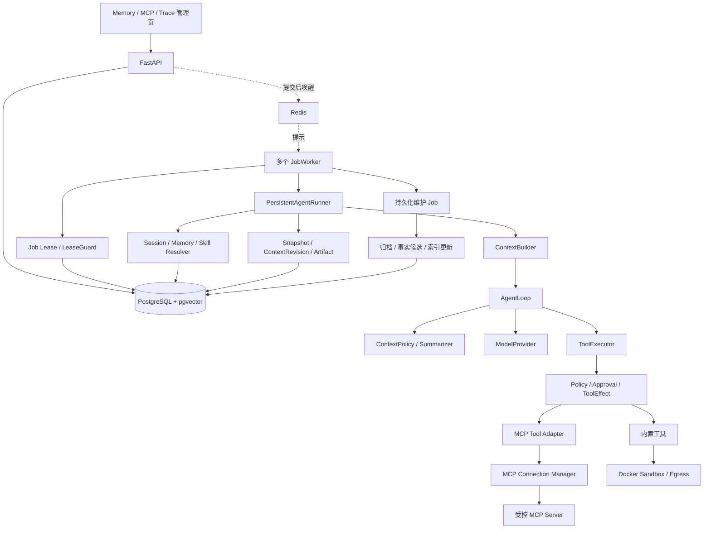

# 阶段四：记忆、检索与协议扩展架构与实现指南

> 文档目的：面向已经学习阶段一至三、第一次接触上下文压缩、长期记忆、向量检索、MCP 和多 Worker 的开发者，解释 EvoAgent 第四阶段要解决的问题、接口演进、持久化模型、安全边界、评测方法和分模块实现顺序。
>
> 当前状态（2026-09-21）：已实现模块 0～8，版本 `0.4.0.dev0`；模块 9～14 仍为计划。新增 MCP 官方 SDK 装配、受控 stdio/Streamable HTTP、分页目录、变更通知、不可变版本和本地审核元数据；尚不注册或执行 MCP 工具。PostgreSQL+vector、容器及真实模型效果证据仍待补。详见[模块 8 验收说明](阶段四-模块8验收与运行说明.md)、[ADR-010](ADR-010-MCP发现连接与目录版本.md)和[开发进度](开发进度与决策记录.md)。
>
> 依据：[总设计与分阶段计划](EvoAgent-项目设计与分阶段实现计划.md)第 6.4、12、13 节，以及[开发进度](开发进度与决策记录.md)、前三阶段实现指南、[学习手册](EvoAgent-源码讲解与学习手册.md)、ADR-001～006 与当前源码。本文中的接口名、表名和配置名，除明确标注为现有项外，均为拟定契约；实现时逐模块落实。

## 1. 第四阶段的目标

阶段一证明 Agent 可以调用模型与工具，阶段二建立可靠任务执行，阶段三建立可验证 Skill 生命周期。阶段四解决这套系统在长任务和能力扩展中遇到的限制：

- 对话和工具结果持续增长，每轮完整发送会占满模型上下文；
- Session 存在不代表新任务已经能读取历史，更不代表可以跨会话复用事实；
- BM25 能解释词面匹配，却不擅长同义表达的召回；
- 新增外部工具仍需要编写并装配 Python 工具类；
- 单 Worker 限制吞吐，直接扩容又会暴露租约与共享文件的竞争；
- 当前 Shell 是宿主进程中的受控子进程，尚无独立执行容器和完整出口限制。

本阶段要形成的主链路是：

```text
用户提交任务
→ 服务端确定 Workspace / Session 作用域
→ 冻结工具目录、历史截止点与运行配置
→ 在权限允许的集合内混合检索 Skill 和 Memory
→ 构造初始上下文，并保存命中与无命中决定
→ 每次模型请求前执行上下文预算与必要压缩
→ 统一 Executor 调用内置工具或 MCP 适配工具
→ 必要的命令在受限 Docker Sandbox 中执行
→ 多 Worker 通过 PostgreSQL 租约安全运行和接管
→ 完成后归档会话，提出可确认的长期事实
```

第四阶段需要证明八件事：

1. 每次模型请求在发送前经过包含工具 Schema 的上下文预算检查。
2. 压缩后保留任务目标、约束、关键证据和合法工具消息结构。
3. 长期事实具备来源、版本、作用域、确认状态和过期策略。
4. 新会话只能召回其允许访问的记忆，删除或撤销后不能由缓存重新注入。
5. Skill 与 Memory 的混合检索可以解释、回放和降级。
6. MCP 工具可以发现、审核启用、调用、更新和安全卸载，且不能绕过 Policy。
7. 多 Worker 竞争与接管不会让过期执行者继续提交权威状态或 ToolEffect。
8. 沙箱的 CPU、内存、进程、输出、时间和网络限制有真实容器测试。

## 2. 阶段三基线与源码核对结果

> 本节保留编写指南时的阶段三基线，用于说明阶段四的出发点；模块 0～8 已完成的改动以文首状态、第 28 节逐模块记录和最新验收说明为准。

### 2.1 当前可以复用什么

| 现有位置 | 当前实现 | 阶段四承接方式 |
|---|---|---|
| `core/context.py` | `ContextBuilder.build()` 构造基础 system、Skill、外部资料、任务消息 | 保留初始构造职责，增加类型化上下文块 |
| `core/loop.py` | Loop 独占消息历史；每轮构造完整 `ModelRequest` | 增加请求前 ContextPolicy 协议，仍不依赖 ORM |
| `core/models.py`、`runtime/checkpoints.py` | `LoopState` 与版本化快照 | 增加上下文版本和摘要引用，显式处理旧快照 |
| `runtime/run_config.py` | `RunConfigSnapshot` 与 Skill 配对比较 | 扩展记忆、检索、压缩和工具目录指纹 |
| `skills/retrieval.py` | 中英文词片 BM25、生命周期过滤、选择落库与恢复 | 保留 BM25 分支，加入向量召回和选择批次 |
| `tools/base.py`、`tools/registry.py` | Pydantic 工具参数、注册和 manifest | 适配动态 Schema，统一定义与 manifest 的来源 |
| `tools/executor.py`、`tools/effects.py` | 权限中间件、审批、ToolEffect 与结果转换 | MCP 也经过同一链路，补齐租约写入保护 |
| `tasks/lease.py`、`workers/` | 短事务领取、heartbeat、终态提交 | 增加租约代次、恢复扫描、并发限制和 Redis 唤醒 |
| `evals/` | 数据集、配对实验、确定性验证与报告 | 保留 Skill 发布门禁，另加阶段四运行时实验 |
| `frontend/` | React Skill/Eval 管理面 | 新增 Memory/MCP 页面与上下文证据入口 |

### 2.2 不能由文档推断已经实现的能力

总设计是目标架构，学习手册也保留了各模块完成时的历史说明。出现差异时，应以当前代码、测试和新执行证据确认事实。

1. **历史消息尚未接入运行上下文。** `MessageRecord` 已建表，但 `TaskService.create_task()` 当前创建 Task、Run 和事件；`PersistentAgentRunner` 初始构造使用 `task.goal` 与 Skill。不能把这描述为已经支持完整长会话。
2. **编写指南时发现的恢复装配缺口（模块 0 已修复）。** `JobWorker.run_once()` 调用 `recover_expired()` 后直接领取 QUEUED Task，没有继续调用 `RecoveryService.recover()`；现有测试直接调用恢复服务。模块 0 已补齐“RECOVERING → 恢复决定 → 再排队/等待用户”的运行闭环，并新增从 API 开始的进程停止/接管测试。
3. **租约保护尚未覆盖全部写路径。** heartbeat/finalize 有 owner 和过期检查，但 `PersistentEventSink`、CheckpointStore、ToolMiddleware 等写入接口没有携带租约代次。不能凭领取竞争测试就宣布多 Worker 已安全。
4. **Worker ID 当前固定。** Settings 默认 `worker-local`，Compose 为 `worker-compose`。复制容器前要改为每次进程启动唯一的执行者身份。
5. **动态工具需要接口适配。** `ToolRegistry.manifest()` 直接读取 `arguments_model.model_json_schema()`；只重写 MCP 工具的 `definition()` 会使模型看到的 Schema 与 manifest 不一致。Executor 当前只捕获 Pydantic 参数异常，也需要统一动态校验异常。
6. **Shell 尚无强资源边界。** `ShellSandbox` 使用 `create_subprocess_exec()` 和 `communicate()`，输出在读取后截断。它不能限制输出洪泛的峰值内存，也不能替代容器与进程树清理。
7. **向量、记忆和 MCP 尚不存在。** 当前依赖、迁移和源码没有这些完整模块；普通 PostgreSQL 镜像也不代表已安装 vector 扩展。
8. **报告证据要区分来源。** 阶段三 Demo 使用模拟完成记录；“207 passed, 4 skipped”等是开发记录中的历史本机结果，不是本文重新执行的结果，也不是真实模型效果报告。

### 2.3 进入实现的前置验收

模块 0 先重新执行现有回归、阶段三完整 Demo，并核对真实 PostgreSQL CI 和容器运行证据。总计划要求 v0.3 稳定且有真实配对数据后再扩展；当前文档不足以证明真实效果报告已经交付，必须登记报告位置、环境、配置哈希与失败样本。缺失时先补齐，不用模拟指标替代。

本文可以先完成设计，但不能把这个前置条件自动标记为完成。基线修复不扩大 v0.3 产品功能，也不提前把阶段四能力写入已完成清单。

## 3. 本阶段的范围与保留边界

### 3.1 必做范围

| 总计划能力 | 本指南对应内容 | 最小交付 |
|---|---|---|
| 上下文预算、裁剪、自动压缩 | 第 6～8 节 | 请求前预算、完整消息组处理、可恢复摘要 |
| 工作记忆、长期事实、会话归档 | 第 9～11 节 | 版本化事实、来源、作用域、过期与撤销 |
| pgvector 与 Skill/Memory 混合检索 | 第 12～13 节 | 两路召回、RRF、可解释选择、重建与降级 |
| MCP Client、发现和动态注册 | 第 14～16 节 | 受控 stdio/Streamable HTTP、目录审核、统一执行 |
| 多 Worker、Redis、限流 | 第 17～18 节 | 租约代次、数据库恢复、唤醒与有界并发 |
| Docker Sandbox | 第 19 节 | 独立执行容器、资源限制、受控出口 |
| Memory 与 MCP 管理页面 | 第 23 节 | 查询、确认、撤销、目录变更和禁用流程 |

### 3.2 不扩展到阶段五

本阶段不实现自动发布 Skill、在线 A/B、漂移降权、自动回滚、多 Provider 路由、多 Agent、定时任务、聊天渠道、浏览器自动化、Skill 市场、RBAC、多租户或完整监控平台。

MCP 首版只扩展 tools 能力，不同时实现 resources 浏览器、prompts 市场、server 发起的 sampling、elicitation 或 MCP 远程任务编排。协议支持情况需要显式声明；未实现能力不能在握手时宣告支持。

多 Worker 首版以**同一受信主机上的多个进程/容器、共享数据库和受控 Artifact 存储**为验收环境。跨主机文件存储、高可用控制平面和不可信租户执行属于后续工作。

### 3.3 前三阶段不变量继续成立

- AgentLoop 不导入 SQLAlchemy、Redis、MCP SDK 或 Docker SDK。
- ContextBuilder 构造初始消息，Loop 独占本次 Run 的消息变更。
- ToolRegistry 管目录，ToolExecutor 是模型调用工具的唯一入口。
- PostgreSQL 是状态、选择、审批、效果和恢复的事实来源。
- RuntimeEvent 与 ProviderEvent 分离；SSE 仍投影已提交事件。
- Skill 仍是指导式声明 SOP，ACTIVE 仍须通过门禁与人工发布。
- 无法确认的外部副作用仍为 UNKNOWN，不能因新增队列或协议自动重试。
- Usage 未知仍为 null；估算 Token 不替代实际消耗。

## 4. 先区分几个容易混淆的概念

| 概念 | 回答的问题 | 不应混为一谈的对象 |
|---|---|---|
| 上下文窗口 | 单次请求最多容纳多少输入与输出 | 整个 Run 的累计 Token 预算 |
| 上下文压缩 | 下一轮请求保留哪些工作信息 | 删除原始 Trace 或清除隐私数据 |
| 工作记忆 | 当前任务目标、进度、约束和待办是什么 | 可跨会话信任的长期事实 |
| 长期事实 | 哪个作用域内有哪些有来源的信息 | 获得审批的操作规程 Skill |
| 会话归档 | 历史会话发生了什么 | 模型对历史内容的真实性背书 |
| Embedding | 文本的语义向量表示 | 加密、脱敏或权限控制 |
| 混合检索 | 怎样融合关键词与语义候选 | 把两类原始分数直接相加 |
| MCP | 怎样发现和调用外部工具 | 对工具可信度、幂等性或沙箱的保证 |
| Redis 唤醒 | 提醒 Worker 数据库中可能有工作 | 任务所有权与最终状态 |
| 租约代次 | 这次领取是不是最新有效领取 | 对外部网络副作用的通用 exactly-once |

例如，“报告默认使用中文”可以是经过用户确认的 Workspace 偏好；“按三步查证报告来源”属于 Skill；“报告已经写出但数据库尚无回执”只能依据 ToolEffect 判断，不能从摘要里的“完成”两字推断。

## 5. 总体架构与职责



`RunContextResolver` 在 Run 开始前装配历史、记忆与 Skill；`ContextPolicy` 在每次请求前返回裁剪/压缩结果；`ContextCommitter` 在 runtime 层保存上下文版本与快照。Loop 只依赖无 ORM 的协议，不查询记忆数据库。

MemoryService 管事实生命周期，Retriever 管召回，EmbeddingProvider 管向量生成。MCP ConnectionManager 管连接，MCPToolAdapter 管协议翻译，PermissionPolicy 管授权。不要让一个“MemoryManager”或“MCPManager”同时承担所有职责。

## 6. 上下文预算

### 6.1 两种预算分别记录

现有 `MAX_TOTAL_TOKENS` 是 Run 内累计消耗软预算，不能解决单次请求超出上下文窗口。新增 `ContextBudget`：

```text
W = 已确认的模型上下文窗口
O = 本轮最大输出预留
S = 消息封装与计数误差安全余量
I = W - O - S

count(messages + tool_definitions + 协议封装) <= I
```

必须满足 `W > O + S`，并把 O 真正传入 `ModelRequest.max_output_tokens`。不能一边预留输出预算，一边让 Provider 使用不受控默认输出上限。

数字示例仅用于理解：W=32768、O=4096、S=1024，则输入上限 I=27648。这不是对当前模型窗口的声明；真实 Provider 必须配置核对过的窗口与计数方式。

### 6.2 TokenCounter 协议

建议定义：

```text
TokenCounter.count_request(messages, tools, model_profile)
    → TokenEstimate(count, method, tokenizer_version, confidence)
```

- MockCounter 用固定规则验证算法。
- 已支持模型使用对应 tokenizer，并把消息封装和工具 JSON 算入。
- 没有可验证 tokenizer 的兼容服务，使用保守估算与明确余量，标记 estimated。
- 无法给出可接受上界的模型，在严格模式下拒绝请求，而非宣称精确保证。
- Provider 仍返回 context-length 错误时记录估算偏差，最多执行配置允许的再压缩；不能无限重试。

验收中的“不突破预算”首先指不发出超过本地已配置输入上界的请求；对未知模型不能把字符估算包装成服务端 Token 上界证明。

### 6.3 预算分配与优先级

| 内容 | 处理原则 |
|---|---|
| 基础 system 安全规则 | 固定保留，不让模型重写 |
| 当前用户目标与显式约束 | 保留原文或可定位的无损字段 |
| 本轮冻结工具 Schema | 完整保留；首次装配超额时拒绝或按预设目录缩小 |
| 已固定 Skill | 不默默换成另一个版本；按固定渲染规则占用预算 |
| 最近完整工具消息组 | 优先保留，不能拆开调用与结果 |
| 工作记忆与旧轮次摘要 | 有来源、限长，可替代已归档消息组 |
| 召回 Memory、历史摘要、外部资料 | 按分区预算和相关性裁剪，记录未注入原因 |

默认继续只展开一个 Skill。Memory 与 Skill 独立设 Top-K 和 Token 上限，不能在同一个排行榜上互相挤占。安全规则、任务、工具 Schema 已经超预算时，返回 `context_budget_exceeded`，不删除安全规则凑长度。

## 7. 消息裁剪与自动压缩

### 7.1 工具消息按完整组处理

下面是一组不可拆分的协议单元：

```text
assistant: tool_calls = [call_a, call_b]
tool: tool_call_id = call_a
tool: tool_call_id = call_b
```

只删 assistant 或只删一个 tool 都会破坏下一轮请求。`MessageGroupBuilder` 先检查完整性，再按整组保留、归档或摘要。尚未获得全部结果的调用不参与压缩，不从半段流或半次命令创建摘要。

### 7.2 请求前执行顺序

```text
读取当前 LoopState
→ 计算完整请求预算
→ 未达触发阈值：直接使用
→ 移除低优先级可选资料块
→ 对较早的完整消息组生成候选摘要
→ 校验摘要结构、来源、约束保留和长度
→ 再计算预算
→ 原子提交 ContextRevision 与新 Snapshot
→ Loop 使用已提交结果发出下一次模型请求
```

压缩触发阈值建议为输入预算的 80%，压缩后目标为 60%，两者可配置。使用两个阈值避免每一轮都重复压缩。压缩次数、单次输入大小、输出大小、耗时与总成本也有上限。

### 7.3 结构化摘要

`WorkingMemorySummary` 建议包含：

```text
schema_version
goal_ref                  指向原始任务目标
constraints               必须保留的约束及来源 ID
confirmed_observations    观察结果及工具/Artifact 来源
open_questions            尚未确认的问题
completed_steps           已有证据的进度
pending_steps             尚未执行的动作
artifact_refs             关键产物 ID 与内容哈希
covered_group_ids         被替代的完整消息组
source_hash               原消息组规范化哈希
```

模型只提出摘要，不决定工具是否 COMMITTED、审批是否 APPROVED，也不能改写 Task 的目标。关键目标与约束由确定性代码从原数据携带，模型补充的解释必须关联有效来源。不能要求模型把所有事实“总结正确”后就无条件相信它。

### 7.4 摘要可信度与失败处理

摘要、Memory、网页和 MCP 结果仍是低信任资料，使用明确边界的 user context，不进入 system 规程区。模型输出即使来自内部 Summarizer，也不能提升原始网页内容的指令权限。

压缩失败时：

- 原完整请求仍能放下：保留原状态继续，记录降级原因；
- 只移除可选资料后能放下：使用确定性裁剪结果；
- 必须保留的信息仍超限：停止并返回明确错误，保留可诊断证据；
- 不接受“删掉未知几条消息直到成功”的隐式降级。

Summarizer 不提供工具；它使用独立、受限的请求与预算，不递归调用同一个 ContextPolicy。摘要输入自身过长时分完整消息组处理，每段保留来源范围，再做有上限的合并。

### 7.5 关键结果不能在保存前被截断掉

现有 Executor 的字符截断发生在结果回填和 ToolEffect 结果保存前。阶段四要增加受控 `ToolOutputStore`：对需要保留的大文本先脱敏、保存不可变 Artifact，模型接收限长摘要与 Artifact 引用。

提供受权限限制的 `artifact_read` 窄工具，按 Artifact ID、offset 和 limit 读取当前 Run 或明确授权来源的内容，重新校验范围与哈希。不能把返回的宿主机绝对路径交给模型，让它用通用文件工具随意读取。

输出存储失败必须如实记录；不可把已丢弃全文的结果描述为“随时可重新展开”。调用是否有副作用，与结果是否被完整保存是两个独立事实。

## 8. 上下文持久化与恢复

### 8.1 ContextRevision 与 LoopState

建议 `ContextRevision` 保存：run_id、revision、父版本、原输入 hash、请求消息 Artifact/hash、摘要 Artifact/hash、保留/移除组 ID、Token 估算、计数器版本、摘要模型配置、Usage、创建原因。

LoopState 新增 `context_revision_id`、历史截止点、已冻结检索批次引用和辅助模型消耗状态。继续保存 completed_iterations、重复调用指纹、Usage 完整性；压缩不能重置这些保护。

### 8.2 提交协议

```text
事务外生成候选摘要和受控内容文件
→ 开启短事务，校验 LeaseGuard 与父 ContextRevision
→ 写 context.compacted 事件
→ 写 ContextRevision
→ 写引用该版本的 RunSnapshot 与 snapshot.saved
→ 一次提交
→ 才允许使用新消息请求模型
```

文件和数据库不是分布式事务。文件先排他写入，数据库失败留下的不可达文件由延迟清理任务处理；只有被数据库引用且哈希匹配的文件可以用于恢复。

提交前崩溃：沿用旧快照；提交后崩溃：复用已冻结摘要，不再次调用模型重新总结。重复提交以 `(run_id, parent_revision, input_hash, policy_hash)` 幂等识别。

### 8.3 版本与哈希兼容

新增 `RunConfigSnapshot.schema_version`，缺失字段明确按旧版解析；新增字段后不能用 v2 默认值重新序列化旧记录并宣称旧 hash 无效。

LoopState/数据库 Snapshot 的版本分别明确演进。首版升级采取停机排空旧 Run 的简单方案：旧终态 Trace 继续可读；在途旧快照只由旧兼容执行器完成，或明确停止并创建新 Run。没有经过测试的 v1→v2 转换器时，不允许静默续跑。

## 9. 分层记忆与会话历史

### 9.1 三种记忆

| 类型 | 内容 | 保存位置与使用范围 |
|---|---|---|
| Working Memory | 当前任务约束、观察、进度和待办 | LoopState/ContextRevision，仅当前 Run |
| Long-term Fact | 经确认的偏好、稳定事实及来源 | MemoryEntry/MemoryVersion，可按 scope 跨 Session |
| Session Archive | 已结束会话片段的摘要和来源范围 | 版本化归档，默认只在当前 Session 使用 |

归档不是长期事实的自动发布入口。需要跨会话共享的事实必须经过独立提议与确认，并明确扩大后的作用域。

### 9.2 先补齐 MessageRecord 数据链路

阶段四不能只建 Memory 表而跳过历史写入。建议给 messages 增加 task_id、run_id、session_sequence、kind 和 content_hash：

- 创建 Task 时在同一事务保存用户目标消息；
- Run 终态时幂等保存可见答案，失败保留结构化状态而不伪造答案；
- `(session_id, session_sequence)` 唯一；按 Session 行原子分配序号；
- `(run_id, kind)` 为最终答案投影去重；
- 原始工具交互仍在 Trace/快照中，不重复伪装成用户会话消息。

每个 Task 创建时冻结 `history_before_sequence`。两个同 Session Task 并发运行时，彼此不能因完成时机不同悄悄读到新增结果；历史顺序不能仅凭相同精度的时间戳推断。

旧 Session 不从脱敏截断的事件猜测完整对话。可以根据现存 Task.goal、Run.final_answer 生成标注为 backfill 的可见历史，记录其不完整性；默认不自动生成长期事实。

### 9.3 会话归档

归档固定消息序号范围、内容哈希和摘要配置。修改历史或增加后续消息只创建新归档版本，不覆盖已被 Run 引用的归档。

归档任务由持久化维护 Job 执行。它可以在终态后排队，也可以由用户显式触发，不在 GET Session 请求时调用模型。归档失败不把已完成任务改成 FAILED。

## 10. 长期事实的数据契约与生命周期

### 10.1 MemoryEntry 与 MemoryVersion

建议把长期身份与正文版本分开：

```text
MemoryEntry
  id / scope_kind / scope_id / fact_key
  status / current_version_id / lock_version

MemoryVersion
  id / entry_id / revision / kind / content / content_hash
  lifecycle_status / confidence / confidence_method
  valid_from / expires_at / supersedes_version_id
  origin_type / created_at

MemorySource
  memory_version_id / source_run_id / source_message_id
  source_artifact_id / source_content_hash / locator
```

`fact_key` 表示一个需要解决冲突的语义位置，例如 `report.language`，不能用正文哈希充当事实身份。confidence 为 [0,1] 的来源评价，必须记录方法；模型自报 0.99 不是客观可靠概率。

### 10.2 默认状态机

```text
PROPOSED → CONFIRMED → SUPERSEDED
    ↓          ↓
 REJECTED    REVOKED / EXPIRED
```

模型提炼和自动归档只能产生 PROPOSED 事实。首版长期事实必须经本地用户确认后才能被新任务召回；用户直接录入可以在同一请求中明确确认。工作记忆和同 Session 归档不需要冒用长期事实的 CONFIRMED 状态。

修改内容创建新版本；确认新版时锁住 Entry，在一个事务中替换 current_version_id 并退休旧版。REVOKED 不通过简单“恢复”重获信任，要重新确认新版本。

### 10.3 提炼与冲突

`MemoryCandidateGenerator` 只接收当前允许的公开消息和已清洗来源，无权直接修改 current_version_id。

例如原事实为“报告使用中文”，新输入为“这一次改用英文”：一次性任务要求不能自动改写长期偏好。候选必须保留原话与范围；冲突时并列展示来源，由用户确认是否替换，不能只选 confidence 更高或时间更新的一条。

没有证据的模型自述、UNKNOWN 副作用、未决审批和 HOLDOUT 资料不得成为普通长期事实来源。来源本身被撤销时，依赖事实应失效或进入重新确认，不继续当成有效知识。

### 10.4 过期策略

会变化的事实设置 expires_at；稳定偏好可以无自动期限，但仍可撤销。过期判断在每次查询和注入时执行，不能只依赖夜间清理任务。

同一 Run 在开始时冻结逻辑读取时间和事实版本，恢复时复用选择；如果内容被显式撤销或访问权收回，则禁止再次发送。不能为了复现继续使用用户已经禁止使用的记忆。

## 11. 作用域、隐私与遗忘

### 11.1 v0.4 的作用域边界

首版只支持服务端管理的 `workspace` 和 `session` 作用域；Working Memory 隐含为 run 作用域。跨会话召回仅发生在同一 Workspace 内。

新增 WorkspaceRecord 与 Session.workspace_id，Workspace 是逻辑数据边界，不是把绝对目录当成公开 ID。现有 Session 经迁移归入一个默认本地 Workspace，不能默认变成“全局共享”。

查询上下文由 Task→Session→Workspace 在服务端解析。模型工具参数不能提供任意 scope_id，公开 API 的 scope 也必须经过服务层匹配。没有认证的 v0.4 仍只能服务受信本机用户；这套作用域过滤不等于多租户安全或 RBAC。

### 11.2 注入前检查

Memory 检索必须同时满足：当前 Workspace/Session 可见、CONFIRMED、指向当前版本、未过期、未撤销、来源可用、hash 可验证。先限制允许集合，再召回；最终注入前再检查一次，处理检索期间发生的撤销。

记忆不包含工具授权。即使确认了“经常使用某个服务”，也不能据此跳过外部写操作审批。

### 11.3 撤销与删除不混淆

- **撤销/遗忘使用**：立即禁止新召回、缓存命中和在途 Run 的后续注入；保留最小审计身份。
- **内容删除**：清理正文、向量、归档副本和可重建缓存，并追踪上下文 Artifact 中的引用；不能只删 MemoryEntry 行。

删除用持久化 Job 管理，UI 显示 pending/completed/failed。正在使用该内容的 Run 在下一请求边界停止，返回 `context_source_revoked`；用户可创建不含该事实的新 Run。历史快照可保留脱敏 tombstone，但要标记无法再完整重放。

审计记录仅保留必要 ID、操作原因和清理状态，不再次复制被删除正文。备份中是否清除由部署保留策略说明，不能用“当前索引查不到”承诺所有物理副本均已消失。

### 11.4 外部 Embedding 也是数据发送

首版默认 MockEmbedding，不自动上传记忆。真实 EmbeddingProvider 显式配置允许处理的数据类型与服务目标；敏感资料先阻断或脱敏。数据库 hash 和向量不是加密，不将密钥或私有验证器内容送入模型服务。

## 12. Embedding 与 pgvector

### 12.1 Provider 契约

```text
EmbeddingProvider.embed(texts, profile)
    → vectors + model_identity + dimension + usage_or_unknown
```

独立于 Chat ModelProvider，提供 Mock 和一个明确选择的真实实现。校验返回数量、维度、有限数值、空输入和余弦距离所需的非零向量。限制 batch、单条长度、并发与重试，取消继续传播。

### 12.2 索引身份与正文分离

建议新增 `embedding_profiles`、`retrieval_documents`、`document_embeddings`：

- Profile 固定模型标识、维度、距离度量、预处理版本；
- Document 固定来源类型、SkillVersion/MemoryVersion/Archive ID、chunk 序号、文本 hash 和 scope；
- Embedding 固定 document_id、profile_id、input_hash、向量与状态；
- `(document_id, profile_id, input_hash)` 唯一；
- 来源指向的多态关系用显式可空外键与 exactly-one 检查约束，不用无法验证的任意字符串引用。

向量是可重建派生数据，不替代不可变正文。相同维度但来自不同模型的向量也不能混用。

首版只启用一个真实 profile。向量列维度必须由迁移确定；改变维度时新建对应表/分区和索引，再重建并切换 profile。不能只改环境变量就把不同维度写入同一个 `vector(n)`。

### 12.3 索引更新闭环

Memory 确认/撤销、Skill 发布/禁用/回滚时，在同一业务事务内写入索引维护 Job。Worker 读取冻结文本，在事务外生成向量，提交时复查正文 hash 与版本状态。

旧 Job 晚完成不能覆盖新版本；撤销后到达的向量不能重新变成可查询。失败保存原因和 next_attempt_at，重复消费返回同一结果。全量重建采用新 generation，完成并验证后原子切换活动 generation。

### 12.4 精确检索优先，近似索引后置

先以小数据集验证精确距离检索，只有测量到性能瓶颈再启用 HNSW 等近似索引。近似查询的过滤可能使返回数量不足，需要有限候选扩张或受过滤集合内的精确补查；不能通过放松作用域填满 Top-K。[pgvector 官方说明](https://github.com/pgvector/pgvector)介绍了精确/近似检索与过滤行为。

SQLite 继续运行 Mock/词法检索测试；pgvector 类型、距离查询、索引和实际迁移只由 PostgreSQL+vector 环境验证。不能用 JSON 数组替身宣称向量 SQL 已通过。

## 13. Skill 与 Memory 混合检索

### 13.1 两路召回与 RRF

保留当前 BM25 tokenizer，将纯打分能力抽到通用 retrieval 模块；SkillRetrievalService 继续负责 Skill 生命周期和运行选择。

```text
确定作用域、类型、状态和兼容性允许集合
→ 关键词召回 Top-N
→ 向量召回 Top-N
→ 每路先按相关性阈值排除明显不匹配项
→ 按版本身份去重
→ RRF 融合排名
→ 稳定 tie-break
→ 再校验当前状态和 hash
→ 分区 Top-K 与上下文预算筛选
→ 保存实际注入选择与未注入原因
```

RRF（倒数排名融合）使用名次而非不可比较的原始分数：

```text
rrf(d) = Σ route_weight / (rrf_k + rank_route(d))
```

默认两路等权，rrf_k 建议 60，均写入配置版本。同分按稳定 version ID 排序。阈值在开发集上确定，不能用 HOLDOUT 调参。RRF 自身不是置信度；至少有一路达到相关性门槛才允许入选。

### 13.2 Skill 与 Memory 的过滤不同

- Skill：ENABLED + ACTIVE 指针、Schema、工具目录、风险、定义 hash；普通 Task 仍禁止指定 DRAFT。
- Memory：scope、CONFIRMED、current_version、有效期、来源与撤销状态。
- Archive：默认限本 Session，并遵守冻结历史截止点。

不要把三类内容直接拼成“高信任知识”。Skill 在既有 system 规程区，Memory/Archive 保持低信任资料区。

### 13.3 冻结完整选择批次

新增 `RetrievalBatch`，保存 run_id、purpose、query hash、scope、读取时间、index generation、profile、算法版本、降级状态和 selected_count。零命中也必须有记录。

每个 Selection 保存版本/hash、关键词命中词、向量距离、两路 rank、RRF score、最终 rank、注入文本 hash、预算丢弃原因。普通查询 API 只返回允许查看的证据，不暴露其他 scope 的过滤候选正文。

Run 首次解析形成批次，恢复复用同一批次与文本；不因向量模型、索引或 Skill 发布变化重新检索。RunConfigSnapshot 改为完整 Skill 选择列表，保留旧版单 ID 的读取兼容，修正当前 Top-K>1 只记录第一名的表达限制。

### 13.4 降级规则

向量服务超时或索引未就绪时，普通任务允许在相同硬过滤下退回 BM25，并记录 `retrieval.degraded`。权限判断失败、内容 hash 错误或 scope 无法确定时必须拒绝，不能退回无过滤查询。

正式检索实验固定 backend/profile/generation。实验中一边降级、一边正常属于配置条件改变，标记不可比较；不能把降级结果混进“混合检索改善”统计。

## 14. MCP Client 与连接管理

### 14.1 协议范围

使用官方 Python SDK，不手写整套 JSON-RPC/传输协议。第一步完成受控 stdio，随后完成 Streamable HTTP。SDK 和协议版本在模块开始时锁定并记录兼容矩阵，不依赖文档中“最新”二字。[官方 Python SDK](https://github.com/modelcontextprotocol/python-sdk)作为接口核对入口。

本指南参考 MCP 2025-11-25 的 tools 契约：发现涉及分页、工具更新通知、inputSchema 和调用结果；annotations 不能单独作为信任依据。[MCP Tools 规范](https://modelcontextprotocol.io/specification/2025-11-25/server/tools)

### 14.2 Server 配置与秘密

`MCPServerConfig` 建议包含：稳定 server_id、展示名称、transport、受控 endpoint 或 launch_profile_id、secret_ref、connection_timeout、call_timeout、并发上限、enabled、lock_version。

- UI 不接收并执行任意 shell 命令；stdio 启动使用部署者预设的 argv/image profile。
- 不在任务运行中自动 `pip install`、`npm install` 或执行任意远程包。
- 密钥只保存引用，Worker 按最小环境注入；stdio stdout 只留给协议，stderr 限长脱敏。
- Streamable HTTP 首版只接入显式配置的可信 endpoint 与凭据，不同时实现通用 OAuth 登录产品。
- URL/重定向/实际连接目标受出口策略保护；开发用本地 fixture 仅走明确命名的测试例外，不全局允许 localhost/私网。

### 14.3 ConnectionManager 生命周期

```text
DISABLED → CONNECTING → READY
                    ↘ DEGRADED
READY → DRAINING → DISABLED
```

配置状态与进程内连接健康分开。数据库记录配置/目录版本和每个 Worker 的限时健康观察，不存 Python ClientSession 对象。

ConnectionManager 负责握手、能力核对、超时、限次重连、分页发现和资源关闭。每个 Worker 进程拥有自己的连接池，每个 Run 获取版本化句柄；关闭应用时等待或取消活动调用，再关闭流和子进程。

断线后重新握手、复核目录身份；连接恢复不等于之前的写操作没有发生。只读调用可按策略重试，写调用超时或断线进入 UNKNOWN。

## 15. 动态工具适配与目录冻结

### 15.1 名称和稳定身份

MCP 原工具名可能不满足当前 ToolDefinition 的名称格式与 64 字符限制。不要直接拼接任意名字。

建立稳定映射：`mcp_<server_short_id>_<tool_slug>_<hash_suffix>`，限制总长并处理同名/截断碰撞。保存原 server_id、原 name、catalog_revision 与 input/output schema hash；不使用可编辑展示名作为副作用身份。

### 15.2 动态 Schema 接入现有 BaseTool

首版保留 BaseTool 继承约束：MCPToolAdapter 使用类型化 `ValidatedMCPArguments` 包装已校验 JSON，重写 `definition()` 和 `validate_arguments()`。

同时修改两个现有位置：

1. ToolRegistry.manifest() 从 `tool.definition().parameters` 读取模型实际看到的 Schema；元数据另包含 server、目录、策略与实现版本。
2. Executor 捕获统一 `ToolArgumentValidationError`；内置 Pydantic 和 MCP JSON Schema 的错误都转成 `invalid_arguments`，不得因为异常类型不同绕过或击穿校验。

Policy 和 ToolEffect 需要的是**解包后的规范参数**，不是 `{"payload": ...}` 包装结构；统一 `canonical_arguments()` 契约，保证审批、hash 和实际远端请求使用同一份语义参数。

按选定 JSON Schema 方言验证，禁止远程 `$ref` 访问；本地引用可在限深、限大小条件下解析。无法正确支持的 Schema 在目录审核时拒绝，不通过“接受任意 dict”假装兼容。

### 15.3 发现不等于启用

```text
tools/list 完整分页
→ 限制工具数、描述长度、Schema 深度与字节数
→ 创建不可变 CatalogRevision
→ 计算与已启用版本的差异
→ 本地审核工具白名单、风险与参数边界
→ 激活目录版本
→ 新 Run 才能注册对应适配工具
```

工具 description 是进入模型请求的数据，也可能含提示注入。先限长、结构检查和审核，不因“只是工具描述”就认为可信。

Server 的 `readOnlyHint`、`destructiveHint` 等只能作为审核提示。未经审核的工具默认禁用；缺少可信副作用分类时按外部写/R3 处理，不能依据自报只读而自动并发执行。

### 15.4 运行中变更和卸载

Run 开始时冻结 ToolCatalogSnapshot，模型看到的 Schema、实际调用适配器和 manifest 必须一致。`tools/list_changed` 只产生待审核的新目录，不直接改正在运行的 Registry。

- 正常更新：新 Run 使用新目录；在途 Run 只在旧契约可验证时继续。
- 远端不能保留旧契约：旧 Run 返回 `tool_manifest_changed`，不得借同名工具调用新语义。
- 正常卸载：DRAINING 阻止新 Run 注册，等待已有调用结束后关闭连接。
- 紧急禁用：下一次调用前检查撤销状态，取消可取消调用；未确认写结果仍为 UNKNOWN。

已审批操作绑定 Task、server、工具身份、目录/策略版本与规范参数。目录或风险升级后必须重新审批，不能复用当前仅按工具名与参数匹配的旧决定。

## 16. MCP 执行、结果与安全

### 16.1 唯一执行链路

```text
ToolCall
→ ToolExecutor 参数校验
→ LeaseGuard 与目录撤销检查
→ PermissionPolicy
→ Approval（必要时）
→ ToolEffect 占位与幂等检查
→ MCPToolAdapter.invoke()
→ ConnectionManager → tools/call
→ 输出 Schema / 大小 / 类型检查
→ Artifact 与规范 ToolResult
→ 带租约保护的效果和事件提交
```

MCP 不能在 UI 路由里直连调用，也不能在模型 Provider 回调中直接执行。

### 16.2 首版结果边界

首版只向现有文本 ModelRequest 回填文本和规范化 structuredContent。有 outputSchema 时验证结构；协议错误、工具业务错误与权限拒绝使用不同 error_code。

图片、音频和资源链接不自动下载，不伪装为“已读取内容”；按明确支持策略保存受限元数据或返回 `unsupported_mcp_content`。结果中的 URL、文件 URI 和嵌入资源不能绕过现有 Guard。

大文本使用第 7.5 节的输出存储。工具返回 `isError` 并不证明外部写没有提交；副作用分类依据调用与回执语义，无法判断仍 UNKNOWN。

### 16.3 幂等范围

外部服务支持稳定业务幂等键或查询回执时，可以通过明确适配契约接入；MCP JSON-RPC request ID 本身不保证业务幂等。

语义键至少绑定 Task、server 稳定身份、工具业务身份和规范参数；目录版本绑定到效果记录。遇到旧目录下已有未决效果时，不能换个目录 hash 生成“新键”后自动执行同一动作。

阶段四默认不扩大 Skill 的低风险工具白名单。只有经过本地审核、固定目录且可确定性回放的 MCP 工具，才可通过新增 Skill 版本和正常门禁纳入 SOP；原有 Skill 不能自动获得新工具权限。

## 17. 多 Worker：租约代次与写入保护

### 17.1 两种身份

Worker 有可读实例标签，但执行所有权使用每次启动生成的 `worker_instance_id`。Task 增加单调递增 `lease_epoch`，每次成功领取递增；JobLease 同时携带 owner 和 epoch。

租约代次用于拒绝迟到写入：Worker A 持有 epoch=7，失联后 B 领取 epoch=8；即使 A 恢复网络，epoch=7 也不得写入权威记录。这比只比较固定字符串 `worker-compose` 更可靠。

### 17.2 LeaseGuard 的事务边界

```text
开启短事务
→ 按 task_id 锁定 Task
→ 校验 owner、epoch、状态、数据库时间下的有效期
→ 写本次事件/快照/ToolEffect/终态
→ 提交
```

校验和受保护写入必须属于同一事务；先 SELECT 检查再另开事务写入仍有竞态。锁顺序统一为 Task→Run→Effect/子记录，避免服务之间反序死锁。

必须覆盖：配置和检索冻结、RuntimeEvent、Checkpoint、工具开始/结束与 Approval 创建、ToolEffect 更新、最终答案和终态。API 用户命令、恢复协调和维护 Job 使用各自明确的授权/所有权入口，不能拿一个“跳过 Guard”开关混用。

生产领取/续租使用数据库时间判断有效期，测试可注入可控时钟。heartbeat 失败后停止新模型/工具调用，取消执行任务并清理资源；数据库不可达时不继续做外部写。

### 17.3 接管不只是重新领取

恢复扫描必须遍历 RECOVERING 任务并调用恢复服务，处理所有未决效果，而非只检查第一条。每个恢复决定加锁/CAS 并幂等写入，多个扫描者不得重复建审批或反复推进状态。

首次 Run 的上下文解析也需要原子冻结。当前 Skill 选择和 RunConfigSnapshot 分两次提交，存在“无命中已决定但配置未提交”的窗口；阶段四用显式 RetrievalBatch 和 ContextEnvelope 提交协议关闭这个窗口。

### 17.4 文件和远端副作用的限制

数据库代次不能撤销已经发出的 HTTP 请求，也不能阻止持有宿主文件句柄的旧进程继续写。新的执行尝试使用 `run_id/lease_epoch` 隔离 staging 目录；输出经受控发布服务校验有效租约后，以不可覆盖的内容身份登记为 Artifact。

文件路径不能暴露共享可覆盖目标给多个旧/新执行者。无法确认外部副作用时保持 UNKNOWN，先确认停止旧执行并核对回执再重试。不得把数据库“只有一个 COMMITTED 行”宣传为外部动作只发生一次。

## 18. Redis 唤醒、限流与背压

### 18.1 首版选择

选择 **PostgreSQL 持久队列 + Redis Pub/Sub 唤醒 + Redis 原子限流**，不同时引入 Celery、Kafka 或第二套任务状态机。

Task/Run 先在 PostgreSQL 提交，再尽力发布唤醒提示。Worker 无论收到几次通知，都必须通过数据库领取；通知丢失由固定周期扫描补偿。Pub/Sub 的投递语义不适合承载唯一任务事实，因此消息只表达“可能有工作”。[Redis Pub/Sub 官方文档](https://redis.io/docs/latest/develop/pubsub/)

### 18.2 失效语义

| 故障 | 预期行为 |
|---|---|
| 数据库提交后发布通知失败 | Task 保留 QUEUED，轮询最终发现 |
| 重复/乱序通知 | 重新查询数据库，不重复执行终态任务 |
| Worker 断线错过通知 | 恢复订阅并补扫描 |
| Redis 不可用 | 普通调度退回有界数据库轮询 |
| PostgreSQL 不可用 | 不领取，不提交，不继续新的外部写调用 |
| 限流 Redis 不可用 | 需要全局配额的外部调用拒绝/延迟，不退为无限制 |

唤醒恢复可用性与限流失效策略不同，不用一个全局 fallback 开关决定。

### 18.3 有界并发和限流

每个进程使用 Semaphore 限制活动 Run 数，每个 MCP server 与模型服务设置并发上限。共享 Redis 用原子令牌桶限制请求速率，键使用服务/profile 标识，不包含密钥原文。

先实现请求频率与并发限制，不宣称精确费用治理。若引入 Token 速率预算，必须区分请求前预留、服务返回的实际 Usage 与未知值，并处理预留回收。

限流等待不占用数据库事务。Run 已开始时，短等待计入总超时并保持 heartbeat；等待超阈值则在合法边界保存快照并按明确 `rate_limited` 原因调度 next_attempt_at，不消耗网络错误重试次数，也不重放未确认写操作。

首版多 Worker 先保留持久化 ToolExecutor 的串行批次行为；提高 Run 并发不意味着同一 Run 的有副作用工具可以并行。

### 18.4 维护任务

记忆归档、候选提炼、Embedding 重建和删除使用 `maintenance_jobs` 持久化表，独立于模型 Task：kind、payload 引用、dedupe_key、status、attempts、next_attempt_at、lease owner/epoch/expiry、result_ref、error_code。

状态使用 QUEUED→RUNNING→SUCCEEDED/FAILED/CANCELLED，加有上限的 RETRYING。复用租约基础算法，但不要让索引维护 Job 伪装成一个 Agent Run。

业务变更和 Job 创建在同一事务，是派生数据更新的可靠依据；Redis 只是加速发现。任务 payload 只保存 ID/版本/hash，不复制长记忆或秘密。

## 19. 更完整的 Docker Sandbox

### 19.1 控制进程与执行容器分离

现有 API/Worker 镜像以非 root 运行，不等于工具已经在独立沙箱中执行。新增 `SandboxExecutor` 协议和 Docker 实现，ShellTool 只提交经过校验的 argv 与 Run staging 输入。

可信 sandbox-controller 持有受限 Docker 控制权限，只接受固定 SandboxSpec；API、模型和工具容器不能获取 Docker socket、任意 mount 参数或 host 网络能力。控制器属于受信计算基，不能被描述为不需要保护的普通工具。

### 19.2 固定执行规格

| 资源 | 默认策略（建议值，需实测） |
|---|---|
| 镜像 | 部署者白名单，按 digest 固定；运行时不构建任意 Dockerfile |
| 用户 | 非 root，禁止提权 |
| 文件系统 | 只读根，限量 tmpfs，仅授权输入只读挂载与独立输出目录 |
| capabilities | drop all，保留 Docker 默认 seccomp；按环境使用 AppArmor |
| CPU | 1 CPU 时间配额 |
| 内存 | 256 MiB；显式设置 swap 策略 |
| PID | 64 |
| 时间 | 30 秒，外层 Task 总超时仍有效 |
| 输出 | 流式消费并限制累计字节，不能读完再截断 |
| 磁盘 | 输出大小/文件数限额；不只依赖内存限制 |
| 网络 | 默认 none；有网络任务只能通过受控出口 |

CPU/内存限制必须实际配置和检测，不能假设容器天然有限额。[Docker 资源约束文档](https://docs.docker.com/engine/containers/resource_constraints/)是实现与测试核对依据。

### 19.3 取消、崩溃与清理

控制器把 container_id、run_id、lease_epoch、启动/结束状态写入 sandbox execution 记录。超时、取消、租约丢失均停止整个容器，确认退出后清理；控制器重启时扫描并回收过期执行容器。

“停止请求已发出”不等于“外部效果未发生”。容器退出码和日志只是执行证据；写操作未确认仍交给 ToolEffect 恢复协议。

收集产物时拒绝 symlink、设备文件、目录穿越和越界解包，限制单文件与总大小；根据内容哈希发布为 Artifact。普通 API/Worker 不把整个宿主 Workspace 挂给执行容器。

### 19.4 网络出口与 DNS 重绑定

URLGuard 继续作为应用层预检查。对网络工具建立受控 EgressTransport/代理：解析后检查全部目标地址，并将允许的目标绑定到实际连接，同时保留正确 Host/TLS 校验；重定向逐跳重新处理。

沙箱网络通过防火墙/独立网络限制只能访问出口，不能仅设置 HTTP_PROXY 而保留任意直连。公网工具禁止回环、私网、链路本地和云元数据；受信内部 MCP 服务走单独、明确地址的控制网络例外，不共享公网工具策略。

实际验收覆盖 IPv4/IPv6、重定向和解析地址切换，不能只测试 URL 字符串。Provider 的密钥连接与工具数据出口分开配置，防止把数据库/API 凭据带入沙箱。

### 19.5 平台边界

Linux Docker 环境是资源与网络隔离的正式验收环境。Windows 本地可通过 Docker Desktop/WSL2 运行相同测试；没有 Docker 时只运行契约测试并标记容器项跳过，不能宣称完整沙箱验收通过。

Docker 共享宿主内核，本阶段不承诺抵御所有容器逃逸或面向敌对多租户的强隔离。Shell 仍默认关闭，开启必须选择受支持的 Sandbox profile；严格模式缺少沙箱时拒绝执行，不自动退回宿主 Shell。

## 20. 持久化模型与迁移计划

### 20.1 新增与扩展对象

| 对象 | 关键字段/约束 | 负责模块 |
|---|---|---|
| workspaces、sessions 扩展 | Workspace 身份；Session 外键；默认本地作用域 | 4 |
| messages 扩展 | Task/Run、session_sequence、kind、hash；序号唯一 | 4 |
| context_revisions | Run+revision 唯一；父版本、输入/输出 hash、摘要引用 | 3 |
| memory_entries / versions / sources | 版本唯一、当前指针、scope、来源与有效期 | 4 |
| memory_events | 操作、actor 标签、reason、前后版本；无秘密正文 | 4 |
| session_archives | Session、消息范围、source hash、摘要引用与版本 | 5 |
| retrieval_batches / selections | Run+purpose 的冻结批次；rank 唯一；空选择可表达 | 6 |
| embedding_profiles / documents / embeddings | 模型/维度/文本身份与幂等向量记录 | 6 |
| mcp_servers / catalog_revisions / tool_bindings | 配置版本、目录 hash、本地风险与允许状态 | 8 |
| run_tool_catalogs | 每个 Run 的不可变能力清单及 hash | 9 |
| maintenance_jobs | dedupe_key 唯一；租约代次、重试与结果引用 | 4 起 |
| sandbox_executions | Run、epoch、容器身份、状态、退出与回收证据 | 10 |
| tasks / eval_experiments 扩展 | lease_epoch、Worker 实例身份及并发保护 | 1/11 |
| runs / snapshots / approvals / effects 扩展 | 配置版本、上下文引用、工具契约与执行代次 | 按依赖逐步 |

### 20.2 迁移顺序

现有迁移链截止 0004。后续按模块新增 revision，不把未来 revision 编号当成当前已存在文件：

```text
租约代次
→ 上下文版本和运行配置版本
→ Workspace / 会话序号 / Memory / 维护 Job
→ pgvector 与检索批次
→ MCP 目录和审批/效果身份
→ Sandbox 执行记录
```

外键两端在同次迁移或已完成前置迁移中存在。加非空字段采用默认值/回填/约束的显式步骤，不能让已有 v0.3 数据瞬间不合法。

vector 扩展安装由有权限的迁移角色执行，运行角色不能临时创建扩展。SQLite 路径只迁移它支持的通用结构；向量功能启动时验证 PostgreSQL 能力，缺失即明确不可用。

### 20.3 升级和回退

每个 revision 验证空库升级、带 v0.3 fixture 的升级、约束和 Schema 差异。降级在一次性测试数据库验证，向量扩展可能被其他应用共享，downgrade 不随意 DROP EXTENSION。

涉及新事实数据时，schema downgrade 可能丢数据，不作为生产日常回退方案。先关闭新功能、停止新 Job、保留旧代码兼容读取；确需回退数据库，使用已验证备份恢复步骤。当前阶段先采用停机升级，不承诺滚动混跑 v0.3/v0.4 Worker。

## 21. 运行配置、事件与可观测证据

### 21.1 配置冻结内容

RunConfigSnapshot v2 至少增加：

- ContextPolicy 版本、窗口/输出/余量、计数器和摘要模型配置；
- Memory 模式、scope、读取时间、历史截止点和冻结选择批次 hash；
- Retriever 算法、Embedding profile、generation、阈值与降级模式；
- 完整 Skill 版本列表与实际渲染 hash；
- MCP 工具目录与本地策略 hash、Sandbox profile/image digest；
- 模型和辅助调用预算、限流策略版本与有效采样参数。

冻结非敏感标识，不记录密钥、完整连接串或凭据 hash 原文。快照记录必须对应实际执行配置；当前 Worker 未传入的采样/输出字段不能仅在实验记录中填写。

### 21.2 新事件

| 事件组 | 示例 | 最少证据 |
|---|---|---|
| 上下文 | context.budget_checked / compacted / rejected | revision、Token 估算、保留范围与原因 |
| 检索 | memory.selected / none_selected、retrieval.degraded | batch、版本/hash、算法和降级码 |
| MCP | mcp.catalog_pinned / call_failed / tool_revoked | server、catalog、tool、失败分类 |
| Worker | worker.lease_lost / rate_limited | instance、epoch、恢复/等待原因 |
| Sandbox | sandbox.started / stopped / reaped | execution ID、退出原因、限额触发 |

运行事件扩展 `EventType` 枚举，并复用 sanitize_payload 与大小上限；不把长记忆、完整工具描述或凭据放进 payload。Memory/MCP 管理操作保存领域审计事件，不强挂到某一个 Run 上。

## 22. API 设计

以下均为拟新增 `/api/v1` 接口；继续复用当前 Task、审批、Skill 和 Eval 路由。

```text
GET    /sessions/{id}/messages
POST   /sessions/{id}/archives
GET    /sessions/{id}/archives

GET    /memories
POST   /memories
GET    /memories/{id}
POST   /memories/{id}/versions
POST   /memories/{id}/confirm
POST   /memories/{id}/reject
POST   /memories/{id}/revoke
POST   /memories/{id}/erase

GET    /runs/{id}/context
GET    /runs/{id}/retrieval
POST   /retrieval/reindex
GET    /maintenance-jobs/{id}

GET    /mcp/servers
POST   /mcp/servers
GET    /mcp/servers/{id}
POST   /mcp/servers/{id}/discover
GET    /mcp/servers/{id}/catalogs
POST   /mcp/servers/{id}/activate
POST   /mcp/servers/{id}/disable
GET    /tools
```

规则：

- 归档、提炼、重建、发现和删除返回 202 与持久化 Job ID；GET 不启动模型或变更状态。
- confirm、revoke、activate、disable 等写操作携带 expected_lock_version、reason 和本地 actor 标签。
- 普通 Task 可指定 memory_mode=off/read；scope 由 Session 推导，不能指定他人 scope。
- `PINNED_SKILL` 仍只属于内部评测；Memory 固定 fixture 与工具目录固定也走内部实验配置。
- GET /tools 返回当前允许暴露的模型能力，不返回 secret_ref 解析值或任意启动命令。
- 查询分页有上限，scope 不允许时不泄露隐藏对象正文、命中分数或候选数量。

稳定错误码包括：`context_budget_exceeded`、`snapshot_incompatible`、`memory_scope_denied`、`context_source_revoked`、`embedding_profile_mismatch`、`mcp_schema_unsupported`、`tool_manifest_changed`、`lease_lost`、`sandbox_unavailable`、`version_conflict`。

## 23. 最小 Memory 与 MCP 管理页面

继续使用当前 `frontend/`，不新建第二个前端工程。

### 23.1 Memory 页面

展示类型、scope、状态、来源、版本、有效期和确认记录；候选与冲突事实可逐条确认/拒绝；撤销显示影响范围，内容删除展示 Job 进度与失败原因。

不得把 confidence 显示为“事实正确率”。对跨 Session 生效的确认要展示目标 Workspace，防止把一次性要求误存成长期偏好。

### 23.2 MCP 页面

展示 Server 配置状态、各 Worker 连接健康、目录版本、工具差异、本地风险和启用状态。发现后先展示待审核目录；正常禁用显示 draining，紧急禁用显示在途调用与 UNKNOWN 处理入口。

页面不能提供任意宿主命令输入并立即执行。凭据只显示已配置/未配置，不回显内容。

### 23.3 Context/Trace 入口

从 Run 查看请求预算、压缩前后大小、关键来源、摘要版本、实际检索命中与降级原因。复用现有 Trace API/Viewer 的链接；不扩张成完整聊天产品或实时监控大屏。

写操作等待服务端成功后重新读取，沿用现有冲突处理。增加 Memory 确认/撤销、MCP 发现/审核/卸载、上下文证据查看三个浏览器流程。

## 24. 评测：不能破坏阶段三的控制变量

### 24.1 保留既有 Skill 发布门禁

`RunMode.BASELINE` 继续表示“不使用 Skill”，不能默默改成“不使用任何阶段四能力”。另设 MemoryMode、ContextPolicy 和 RetrievalProfile。

正式 Skill 配对默认关闭长期记忆写入、使用相同冻结历史/空记忆、相同压缩策略和工具目录；baseline/pinned 仍只允许 Skill 变量不同。HOLDOUT Run 不进入普通记忆索引或共享摘要，避免下一条 Case 间接读到上一条答案。

Summarizer、MemoryGenerator、Embedding 输入也不得看到 private_validators。每个 Pair 的两个 Run 使用隔离写目录和相同初始 fixture；不能让第二条读取第一条新产出的记忆或文件。

### 24.2 新增独立运行时实验

当前 EvalExperimentKind、EvalRunMode、配对报告均围绕 Skill 建立。阶段四增加独立 `runtime_experiments` / `runtime_eval_runs` 和报告 DTO，复用 Validator、Task 提交和指标计算组件，不强行把所有能力塞成 PINNED_SKILL。

`RuntimeExperimentSpec` 明确 `experiment_variable`、control/treatment 配置与唯一允许差异路径：

| 实验 | 唯一设计变量 | 固定条件 |
|---|---|---|
| 压缩一致性 | context_policy | 相同长历史、模型、工具、输入和任务约束 |
| 记忆收益 | memory_mode 或固定记忆集合 | 相同作用域、事实快照、Skill 和检索配置 |
| 检索质量 | lexical / hybrid | 相同冻结语料、相关性标注和查询集 |
| 多 Worker 吞吐 | worker_count | 相同任务队列、模型 fixture、资源和限流配额 |

不能把新增所有字段从 `RunConfigSnapshot.comparable_with()` 中全部排除以强行得到 comparable=true。配置是实验控制，实际压缩次数、命中与输出是结果证据，分别记录。

### 24.3 数据集与指标

新增长上下文、作用域/事实冲突、同义检索、MCP 故障和租约接管 fixture。每族包含正常、边界、失败与恶意输入；冻结版本与 hash，不复用看过答案的 HOLDOUT 调参。

| 维度 | 指标与判定 |
|---|---|
| 上下文 | 每次请求是否达标、目标/约束保留、工具消息完整性、摘要来源有效性 |
| 记忆 | 合法召回命中、跨 scope 泄漏数、过期/撤销命中数、冲突误覆盖数 |
| 检索 | Recall@K、MRR、无关强命中率、检索耗时和降级比例 |
| MCP | Schema 校验、目录漂移阻断、卸载后调用数、UNKNOWN 处理 |
| Worker | 唯一有效终态、拒绝旧代次写入、恢复时间、重复副作用证据 |
| Sandbox | 越界拒绝、资源限制触发、进程残留、产物限制与出口拒绝 |
| 效率 | 任务成功率、Token、工具调用、端到端延迟、辅助模型成本 |

检索命中率提升不等于任务成功率提升；压缩比例变小也不等于答案质量不变。确定性约束检查和真实任务结果都要报告。

### 24.4 成本与未知值

主模型、Summarizer、MemoryGenerator 分项记录 Usage，累计完整时再报告总模型 Token；Embedding 单列输入 Token/费用，不把不同计费方式硬合成一个数。

任一分项未知则总精确成本未知，同时保留已知部分与估算。运行时预算可以依据保守预留拒绝新增辅助请求，但不能把预留量记为真实消耗。恢复、压缩和重试不得重置已发生的成本。

小样本报告展示明细、均值/中位数与失败族，不预填提升百分比。真实模型实验必须单独保存模型身份、配置、语料和环境信息。

## 25. 代码目录框架

以下是目标位置，不要求先创建空目录：

```text
src/evoagent/
├─ core/
│  ├─ context.py                  # 扩展类型化初始上下文
│  ├─ context_policy.py           # 无 ORM 的请求前协议
│  ├─ context_budget.py           # 预算与消息组算法
│  └─ loop.py                     # 调用协议，不管理存储/连接
├─ runtime/
│  ├─ context_resolver.py         # 历史、记忆、Skill 装配
│  ├─ context_store.py            # ContextRevision + Snapshot 提交
│  ├─ run_config.py               # 版本化配置
│  └─ persistent_runner.py
├─ memory/
│  ├─ schema.py
│  ├─ lifecycle.py
│  ├─ policy.py                   # scope、来源、过期与撤销
│  ├─ service.py
│  ├─ extraction.py
│  ├─ summarization.py
│  └─ archival.py
├─ sessions/
│  └─ service.py                  # 消息投影、序号与历史截止点
├─ retrieval/
│  ├─ schema.py
│  ├─ lexical.py                  # 复用既有 BM25
│  ├─ embeddings.py
│  ├─ vector.py
│  ├─ hybrid.py
│  └─ indexing.py
├─ mcp/
│  ├─ schema.py
│  ├─ connections.py
│  ├─ discovery.py
│  ├─ adapter.py
│  └─ service.py
├─ sandbox/
│  ├─ schema.py
│  ├─ docker_executor.py
│  ├─ controller.py
│  └─ egress.py
├─ tasks/
│  ├─ lease.py
│  └─ lease_guard.py
├─ workers/
│  ├─ main.py
│  ├─ recovery.py
│  ├─ maintenance.py
│  ├─ wakeup.py
│  └─ rate_limit.py
├─ tools/
│  ├─ base.py / registry.py / executor.py / effects.py
│  └─ builtin/artifact_read.py
├─ evals/
│  ├─ runtime_experiments.py
│  └─ validators/                 # 新约束验证器
├─ db/repositories/               # 对应领域 Repository
└─ api/routes/
   ├─ memories.py
   ├─ mcp.py
   └─ contexts.py

frontend/src/pages/MemoryPage.tsx / MCPPage.tsx
tests/unit/ / integration/ / fault_injection/ / e2e/
tests/fixtures/mcp/               # 本地协议服务
docker/sandbox/                   # 固定执行镜像与出口配置
evals/datasets/                   # 新冻结评测定义
```

## 26. 技术与配置

### 26.1 技术选择

| 技术 | 用途 | 边界 |
|---|---|---|
| Pydantic / SQLAlchemy / Alembic | 继续承接契约和数据库 | 不引入另一套 ORM |
| 模型匹配的 tokenizer | 请求前计数 | 未支持模型明确估算或拒绝 |
| pgvector 与 Python 适配 | 向量存储和查询 | PostgreSQL 扩展为正式能力 |
| 官方 MCP Python SDK | 握手、tools、传输与连接 | 不重新实现整套协议 |
| JSON Schema validator | 动态参数/输出校验 | 禁止网络引用解析 |
| Redis asyncio client | 唤醒和原子限流 | 不承担业务事实 |
| Docker Engine 接口 | 受控执行容器 | 仅可信控制器访问 |
| pytest / Playwright | 确定性、容器和页面测试 | 真实模型不作为日常 CI 硬依赖 |

依赖版本在相应模块开始时根据官方支持矩阵确认，并固定直接依赖与可重现安装方式。当前 Python 支持范围先保留 `>=3.12,<3.14`；不因新增 SDK 顺手升级语言或前端框架。

### 26.2 拟新增 Settings

以下名称统一加 `EVOAGENT_` 前缀，表中值是建议而非当前代码默认值：

| 配置 | 建议值 | 作用 |
|---|---|---|
| CONTEXT_POLICY | bounded | 严格请求预算；旧版兼容运行显式 legacy |
| MODEL_CONTEXT_WINDOW | 真实模型必须显式填写 | 不猜测模型窗口 |
| MAX_OUTPUT_TOKENS | 4096 示例值 | 必须实际传给 Provider |
| CONTEXT_SAFETY_TOKENS | 1024 示例值 | 计数与封装余量 |
| CONTEXT_COMPACT_TRIGGER_RATIO | 0.8 | 压缩触发 |
| CONTEXT_COMPACT_TARGET_RATIO | 0.6 | 压缩后目标 |
| CONTEXT_MAX_COMPACTIONS | 4 | 限制辅助调用 |
| SUMMARIZER_MODEL | 空 | 未配置时仅确定性裁剪/Mock |
| MEMORY_MODE | off | 不自动跨会话召回 |
| MEMORY_WRITE_MODE | manual_confirm | 模型只能提出候选 |
| MEMORY_TOP_K / MEMORY_MAX_TOKENS | 5 / 2048 | 召回与注入限制 |
| RETRIEVAL_BACKEND | lexical | hybrid 显式启用 |
| EMBEDDING_PROVIDER | mock | 不默认发送外部资料 |
| EMBEDDING_PROFILE_ID | 空 | 启用真实向量时必填 |
| RETRIEVAL_CANDIDATE_K / RETRIEVAL_RRF_K | 20 / 60 | 召回与融合参数 |
| MCP_ENABLED | false | 按 Server 审核启用 |
| MCP_MAX_TOOLS_PER_SERVER | 50 | 发现与请求体上限 |
| MCP_CONNECT_TIMEOUT_SECONDS | 10 | 连接建立上限 |
| REDIS_URL | 空 | SecretStr；关闭时仅数据库轮询 |
| WORKER_CONCURRENCY | 1 | 单进程活动 Run 上限 |
| WORKER_SCAN_SECONDS | 5 | 唤醒丢失的补偿扫描 |
| SANDBOX_BACKEND | disabled | 开启 Shell 时必须选可用 backend |
| SANDBOX_PROFILE | 空 | 显式固定资源、镜像和网络规格 |
| NETWORK_EGRESS_MODE | guarded | v0.4 网络验收使用受控出口 |

配置信息优先保存到冻结 profile，避免几十个环境变量重复描述同一 Server 或向量模型。Secret 不进 profile 明文。

### 26.3 交叉校验

- `0 < target_ratio < trigger_ratio < 1`。
- 输出预留+安全余量必须小于窗口；分区预算不能超过总输入预算。
- hybrid 需要正确 profile、扩展、向量维度与至少可运行的词法分支。
- MCP call timeout 不大于工具上限；并发不能超过连接/部署配额。
- heartbeat 不超过 lease 的三分之一，Worker 实例身份不可重复。
- Docker 严格执行不允许 fallback 到宿主命令。
- Embedding、Summarizer 和 MCP secrets 条件启用，不要求 Mock 用户填写真实凭据。

## 27. 测试与故障注入策略

### 27.1 单元与契约测试

- 预算包含工具 Schema，未知 tokenizer 标记正确；输出预留实际传递。
- 完整工具组不被拆分，长目标本身超限能明确终止。
- 摘要来源、约束、长度校验；取消不被吞掉；辅助成本未知传播。
- Memory 状态机、scope、过期、冲突与 hash。
- BM25 回归、RRF 稳定排序、不同 embedding profile 拒绝混用。
- MCP 名称碰撞、动态 Schema、错误分类、结果大小和 annotations 不可信。
- LeaseGuard 条件、限流时钟与 Worker 实例身份。

### 27.2 真实依赖集成

PostgreSQL+vector 验证迁移、过滤、唯一约束、并发确认、目录激活、租约代次和索引重建；Redis 验证原子限流、断线和通知丢失；本地 MCP fixture 验证 stdio/HTTP 握手、分页、更新、断线与卸载。

Docker 用真实进程验证 CPU/内存/PID/输出/时间限额和网络阻断。只检查 SandboxSpec JSON 不能证明容器实际受限。

### 27.3 故障矩阵

| 注入点 | 必须断言的结果 |
|---|---|
| 摘要生成后、ContextRevision 提交前崩溃 | 旧快照仍有效，没有引用半成品 |
| 压缩提交后、下一次模型请求前崩溃 | 复用相同摘要/hash，不重新选择 |
| 首次检索无命中后崩溃并发布新 Skill | 恢复仍无命中 |
| 记忆撤销后旧 embedding Job 返回 | 不重新索引，不重新注入 |
| Memory 被删除但 Run 有旧快照 | 下一请求阻断，不能从旧文本继续发送 |
| MCP 目录改变但工具同名 | 旧审批/旧 manifest 不被复用 |
| MCP 写调用远端成功、本地断线 | UNKNOWN，不能自动再次 tools/call |
| A 租约过期、B 接管、A 迟到写回 | 事件/快照/效果/终态均拒绝旧代次 |
| Worker 重启而无人工调用 RecoveryService | 自动处理 RECOVERING，正常续跑或等待审批 |
| DB 提交后 Redis 通知丢失 | 扫描在约定时间内发现任务 |
| 两 Worker 处理同一索引 Job | 唯一最终记录，无旧版本覆盖 |
| 沙箱失联或 controller 重启 | 识别残留容器，回收或等待明确结果 |
| DNS 首次公网、实际连接改为私网 | 在连接/出口层拒绝 |

### 27.4 CI 分层

1. 快速层：Python 3.12/3.13 单元、Mock 和 SQLite 通用契约，前端类型/组件检查。
2. 服务层：真实 PostgreSQL+vector、Redis、本地 MCP fixture 与迁移。
3. 容器层：独立沙箱、两 Worker、故障注入与 Compose 完整运行。
4. 页面层：现有三个 Skill 流程，加 Memory/MCP/Context 新流程。
5. 显式实验层：真实 Provider/Embedding 和冻结报告，使用独立环境运行。

测试缺依赖要显示 skipped 和原因；正式阶段四验收所需的服务层/容器层不能全部跳过后仍标记完成。基线数字以当次实际执行为准，不要求为了凑数量编写重复实现的测试。

## 28. 分模块实现顺序

阶段四内容比阶段三横向跨度更大，建议拆成模块 0～14。每个模块保持前三阶段的“文件、实现、测试、完成边界、需要理解”格式。

依赖顺序：

```text
0 基线 → 1 租约保护 → 2 预算 → 3 可恢复压缩
→ 4 记忆模型与会话 → 5 事实与归档
→ 6 向量底座 → 7 混合检索
→ 8 MCP 连接发现 → 9 动态工具
→ 10 Docker Sandbox → 11 Redis 与多 Worker
→ 12 运行时评测 → 13 管理页面 → 14 收尾
```

模块 8/9 的协议测试使用受信本地 fixture，真实第三方 stdio Server 和 Shell 要等模块 10 完成隔离后再启用。前面模块的维护 Job 可先用单 Worker 执行，模块 11 再验证分布式竞争。

### 模块 0：v0.3 基线冻结与运行缺口修复

> 实现状态：代码与本地测试已交付；环境验收范围见[模块 0～2 说明](阶段四-模块0至2验收与运行说明.md)。

创建或修改：开发进度、README、`workers/main.py`、Worker 恢复装配、恢复端到端测试；进入实现后再修改项目版本和阶段四基础配置。

实现：重新执行现有回归、三个阶段三 Demo 流程、PostgreSQL 与真实配对证据核对；补齐 RECOVERING 扫描到 RecoveryService 的主循环路径；区分历史说明和现状。

测试：真实进程停止/接管从 API 开始，不在测试中手动调用恢复服务；只读续跑、COMMITTED 复用、UNKNOWN 等待用户；阶段三发布/回滚不回退。

完成边界：形成有证据的 v0.3 起点，尚无 Memory、MCP 或 pgvector 业务实现。

需要理解：功能类存在与进程链路已接通的区别，Mock 演示与真实效果，为什么先修基线再扩容。

### 模块 1：租约代次与统一写入保护

> 实现状态：代码与本地测试已交付；环境验收范围见[模块 0～2 说明](阶段四-模块0至2验收与运行说明.md)。

创建或修改：`tasks/lease_guard.py`、JobLease、Task migration、PersistentEventSink、CheckpointStore、ToolMiddleware、Worker identity 和恢复扫描。

实现：lease_epoch、每次启动唯一身份、数据库时间、统一短事务校验、所有运行写路径的代次保护；恢复处理全部未决效果；当前单 Worker 继续正常运行。

测试：真实 PostgreSQL 下 A 失联、B 接管、A 回来写入各类事实都失败；同标签重启也不能复用旧租约；统一锁顺序和取消清理。

完成边界：数据库事实具有完整所有权保护，尚不增加 Redis 或提高并发数；外部效果仍保留 UNKNOWN 语义。

需要理解：fencing token、租约与 CAS、检查/写入竞态、数据库保护不能撤销外部动作。

### 模块 2：上下文契约、TokenCounter 与确定性裁剪

> 实现状态：代码与本地测试已交付；环境验收范围见[模块 0～2 说明](阶段四-模块0至2验收与运行说明.md)。

创建：`core/context_policy.py`、`core/context_budget.py`，扩展 ModelRequest 有效输出配置和 Loop 请求前 Hook。

实现：消息分组、所有请求的预算检查、分区优先级、低优先级资料裁剪、上下文超限错误；先使用 MockCounter 和不调用模型的策略。

测试：大量工具 Schema、长中英文、超长任务、完整工具组、取消与 legacy CLI 兼容；确保每次 Provider 请求都经过检查。

完成边界：可在内存 Runtime 阻止超预算请求，还不自动生成摘要或建立长期事实。

需要理解：上下文窗口与累计 Token 的区别、估算与计量、为什么 Schema 也占预算。

### 模块 3：自动压缩、输出归档与快照演进

> 已实现：默认 `extractive-v1` 摘录器，80% 触发/60% 目标，辅助模型调用数与 Token 消耗均为 0；原始约束保留，完整上下文归档可追溯。ContextRevision、事件与 v2 Snapshot 同事务提交。持久化 Worker 接入，阶段一纯内存 CLI 保持原有预算策略。当前不启用生成式上下文改写，设计取舍见 ADR-008。

创建：`memory/summarization.py`、`runtime/context_store.py`、ContextRevision migration、ToolOutputStore 与 `artifact_read`。

实现：结构化摘要、来源/约束校验、双阈值与辅助预算；大输出保存引用；压缩版本与快照原子提交；RunConfigSnapshot/LoopState 的 v1/v2 读取边界。

测试：摘要失败、来源丢失、压缩前后崩溃、文件孤儿、旧快照拒绝/兼容、恢复后 Usage 和重复调用计数不变。

完成边界：长 Run 的上下文可以受限且可恢复，摘要只作为本 Run 工作信息，不进入跨会话 Memory。

需要理解：压缩不是删日志、模型生成结果不可信、文件与数据库的非原子关系、辅助模型成本。

### 模块 4：Workspace、会话消息与记忆持久化

> 已实现：迁移 0006、默认逻辑 Workspace、原子消息序号、固定历史截止点、用户输入与终态投影、版本/来源/事件以及维护任务。旧消息只编号并标记 `backfill`，不从截断事件补造对话；旧 Task 的历史截止点保持 0。SQLite 并发功能与旧数据迁移已测，PostgreSQL 实机验证待补。

创建：`sessions/service.py`、`memory/schema.py`、`memory/lifecycle.py`、Memory Repository、messages/Workspace/Memory/maintenance_jobs migration。

实现：服务端 scope、用户输入和终态答案投影、Session 序号、历史截止点、MemoryEntry/Version/Source/Event、维护 Job 基础租约；旧 Session 归属迁移。

测试：同 Session 并发提交的序号和快照隔离、重复终态投影、版本不可原地修改、作用域与外键约束、带旧数据迁移。

完成边界：可以保存、查询记忆候选和会话历史，还不从模型自动提炼或做向量召回。

需要理解：历史容器与真正历史加载的区别，逻辑 Workspace、版本身份、确定性顺序。

### 模块 5：事实提议、人工确认、归档与遗忘

> 已实现：确定性/可选 Model 原话候选、人工状态转换、版本 CAS、作用域与来源校验、有效期过滤、固定范围归档、持久化 erase/retry 和发送前撤销检查。来源暂只接受已完成非评测任务的用户 goal 消息，保守拒绝全部 EvalRun；模型自述和 Artifact 事实提取尚未开放。自动注入是模块 7 的范围。

创建：`memory/policy.py`、`service.py`、`extraction.py`、`archival.py` 和最小 Memory API。

实现：Mock/Model 候选、来源检查、冲突处理、确认/拒绝/撤销、有效期、SessionArchive；显式 erase Job 和在途 Run 的撤销检查。

测试：一次性需求不能改写长期偏好、HOLDOUT 不入普通记忆、密钥与注入阻断、过期过滤、删除后旧快照阻断、Job 重复消费。

完成边界：长期事实可管理、可审计、可停止使用，先用确定性词法查询，不依赖 Embedding。

需要理解：置信度不是概率证明、归档与事实不同、遗忘使用与物理删除不同。

### 模块 6：EmbeddingProvider、pgvector 与索引维护

**实现状态（2026-09-20）：代码与本地替身测试完成。** 迁移 `20260920_0007`；固定 `vector(1536)`，显式来源外键及 exactly-one 检查；Mock/真实 HTTP Provider、同事务维护任务、事务外计算与写前复验、旧 epoch/旧 generation 拒绝及重建切换均已实现。首版每来源一个文档，输入取前 12000 字符，单批 16 条，重建最多 64 个合法来源；超限失败，不静默截断来源集合。PostgreSQL 类型/算子测试已接入 CI，本机未执行，不能把 SQLite JSON 替身视为 pgvector 验收。

创建：`retrieval/embeddings.py`、`vector.py`、`indexing.py`、profile/document/vector 迁移、PostgreSQL+vector 测试环境。

实现：Mock 和一个真实 Embedding 实现、维度/数值校验、幂等 Job、精确距离查询、版本失效与 generation 重建；默认不启用近似索引。

测试：维度/模型不匹配、批量部分失败、撤销与 Job 竞态、旧任务晚返回、数据库迁移和 rebuild 切换。

完成边界：受控数据可以可靠生成和查询向量，不改变普通 Run 的默认 Skill 选择。

需要理解：向量是派生索引、维度固定、最终一致性、不能用向量代替权限。

### 模块 7：混合检索与 Run 上下文冻结

**实现状态（2026-09-20）：代码与本地回归完成。** 新链路由 `ContextResolver` 接入持久化 Runner；硬过滤后每路阈值和 Top-100、等权 RRF、分区 Top-K/预算、完整请求预算、Selection 原文/hash、零命中 Batch、降级事件及全量 Skill 配置指纹均已实现。恢复复用冻结文本，再检查来源是否仍允许使用。默认普通任务沿用旧词法 Skill 路径；Memory/Archive 分别开启，baseline/pinned Skill 评测旁路。详细实现与验收边界见[学习手册第 69～73 章](EvoAgent-源码讲解与学习手册.md)及[运行说明](阶段四-模块6至7验收与运行说明.md)。

创建：`retrieval/lexical.py`、`hybrid.py`、RetrievalBatch/Selection、`runtime/context_resolver.py`，扩展 SkillRetrievalService 与 Runner。

实现：硬过滤、BM25+vector、RRF、相关性阈值、分区预算、实际注入留痕、零命中冻结、BM25 降级、完整 Skill 列表指纹。

测试：同义查询、越权高分候选、低相关无命中、向量故障降级、发布/撤销竞态、重启后不重新选择。

完成边界：普通 Run 可显式开启合法长期事实召回和混合 Skill 检索，不自动写回记忆。

需要理解：召回、融合、过滤、上下文选择四者区别，RRF 分数不是信任评分。

### 模块 8：MCP 连接、发现与目录版本

**实现状态（2026-09-21）：已完成代码、本地真实协议 fixture 和回归。** 固定 `mcp==1.30.0`，项目接受 `2025-11-25`；同一任务开关 SDK Session，受信启动 profile/预设 HTTP profile/secret_ref、IP 绑定与禁止重定向、分页及 Schema 限制、list_changed 新目录、默认禁用/R3 审核历史、配置 CAS、健康 TTL 和关闭清理均已接通。迁移 `20260920_0008` 增加四张 MCP 表。API 进程在显式 discover 后持有连接，常规 Agent Worker 尚不加载 MCP 工具；后者属于模块 9。真实 stdio 子进程退出与本地 HTTP 流程已测试，公网 TLS/第三方 Server/容器隔离未验收。详见[运行说明](阶段四-模块8验收与运行说明.md)和[手册第 74～77 章](EvoAgent-源码讲解与学习手册.md)。

创建：`mcp/schema.py`、`connections.py`、`discovery.py`、Server/Catalog migration 与本地 MCP fixture。

实现：SDK 装配、stdio 与 Streamable HTTP 生命周期、分页发现、受限重连、目录 hash/diff、secret_ref、本地工具审核元数据。

测试：握手失败、分页、工具名重复、超长描述/Schema、断线、list_changed、关闭资源和不支持能力。

完成边界：可以查看外部工具目录，发现结果尚不能被普通模型直接执行。

需要理解：协议能力协商、连接状态与配置状态、发现不是授权、动态目录版本。

### 模块 9：MCPToolAdapter 与统一安全执行

创建：`mcp/adapter.py`、`service.py`，扩展 BaseTool 参数契约、Registry manifest、Executor 错误映射、Approval/Effect 身份、RunToolCatalog。

实现：稳定命名、动态 Schema 校验、规范参数、目录冻结、统一 Policy/Effect、只读重试与写入 UNKNOWN、文本/结构化结果、draining/紧急禁用。

测试：通过 Executor 的完整本地 MCP 调用、无效参数不出网、annotations 无法降权、目录变化审批失效、外部成功本地断线、卸载后无新调用。

完成边界：受信 fixture 可无核心循环改动地接入和卸载；第三方可执行 Server 在隔离完成前不启用。

需要理解：适配器、业务幂等与请求 ID、Schema hash 与实现可信度、卸载不是删除字典项。

### 模块 10：Docker Sandbox 与受控网络出口

创建：`sandbox/`、可信 controller、固定执行镜像、出口策略、执行记录与清理服务；将 ShellTool 指向 SandboxExecutor。

实现：第 19 节完整资源规格、流式输出限额、取消/租约丢失清理、epoch staging 产物发布、连接目标绑定和出口拒绝；stdio 第三方 Server 走受控启动 profile。

测试：真实容器 CPU/内存/PID/输出洪泛、进程树残留、路径/链接逃逸、容器失联、DNS 切换、绕代理直连和元数据地址。

完成边界：达到声明范围内的容器/网络隔离，仍不承诺敌对多租户强隔离或任意代码平台。

需要理解：控制平面权限、容器不是虚拟机、资源配置与实际限制、应用 Guard 与出口防线。

### 模块 11：Redis、并发 Worker 与限流

创建：`workers/wakeup.py`、`rate_limit.py`、并发调度、维护 Worker，修改 Compose 和 Eval lease 的代次保护。

实现：提交后唤醒、数据库补偿扫描、进程并发上限、原子请求限流、断线策略、优雅退出；同主机共享 Artifact 的访问与隔离；至少两个真实 Worker 进程。

测试：Redis 丢失/重复通知、Redis 与 DB 故障、相同标签多实例、旧代次写回、争抢同 Task/Job、接管后副作用处理和取消。

完成边界：双 Worker 可安全调度并度量吞吐，未实现跨主机高可用；单 Worker 无 Redis 模式仍可运行。

需要理解：持久队列与唤醒总线、背压、限流失败策略、并发数与吞吐并非线性关系。

### 模块 12：阶段四数据集与运行时评测

创建：`evals/runtime_experiments.py`、独立实验表/DTO、长历史/记忆/检索数据集和新 Validator。

实现：压缩/记忆/检索分别控制变量、fixture 隔离、成本分账、真实与 Mock 报告分开；验证既有 Skill 配对不受 Memory 污染。

测试：错误差异字段不可比较、HOLDOUT 不进入共享 Memory、第二组不读取第一组新数据、未知 Usage 传播、负面案例不被过滤。

完成边界：能用证据回答各项能力是否有效，不预承诺提升比例，也不改变 Skill 人工发布流程。

需要理解：配置与结果区分、离线检索指标与任务指标、实验泄漏和辅助调用成本。

### 模块 13：Memory / MCP 页面与上下文证据

创建：MemoryPage、MCPPage、Context 详情入口，扩展 API types/client 和浏览器测试。

实现：事实来源/冲突/确认/撤销、删除 Job 状态、Server/工具目录审核与卸载、预算和检索证据；旧 Skill/Eval 页面继续工作。

测试：TypeScript、组件空/错状态、版本冲突、秘密不回显、三个新 Playwright 流程和原三个流程回归。

完成边界：只扩展阶段四管理能力，不引入认证产品或完整聊天工作台。

需要理解：服务端事实来源、异步 Job 展示、危险状态不能用乐观 UI 假装完成。

### 模块 14：完整 Demo、ADR 与 v0.4 收尾

创建或完善：阶段四演示与安全边界、README、学习手册、开发进度、CI、迁移与部署说明、真实实验报告。

实现：四个可重复 Demo，分别为长任务压缩并恢复；同 Workspace 跨 Session 记忆与撤销；MCP 发现/调用/目录变更/卸载；双 Worker 故障接管与 Redis 故障降级。每个 Demo 同时展示失败或阻断样本。

建议在对应实现模块形成 ADR-007 起的新记录，分别固定上下文/记忆、混合检索/数据隔离、MCP 目录信任、多 Worker/Redis、Docker/网络边界。编号以实际仓库空缺为准；未实现取舍不冒充已接受事实。

测试：从全新 PostgreSQL+vector/Redis/Docker 环境执行完整链路，带旧库升级、后端回归、页面回归、故障矩阵、真实报告和 feature-off 路径。

完成边界：满足下一节标准后登记 v0.4 完成；不顺手加入自动发布、多 Agent 或公网认证。

需要理解：可复现交付、兼容性矩阵、负面证据和阶段边界。

## 29. 第四阶段完成标准

以下清单全部基于实际代码和执行证据验收，不因本文存在而打勾：

- [ ] v0.3 基线复核完成，真实模型报告、PostgreSQL 和容器证据位置明确。
- [ ] Worker 主循环能自动处理 RECOVERING，未决副作用得到正确处置。
- [ ] 每次请求发送前检查完整输入与输出预留；估算和精确计数明确区分。
- [ ] 不能压缩时明确停止；不会破坏工具消息配对或删掉任务关键约束。
- [ ] ContextRevision 和快照可恢复，压缩不重置预算或调用保护。
- [ ] Session 输入/答案持久化、序号与历史截止点能支持确定性历史读取。
- [ ] Memory 具备版本、来源、作用域、确认、冲突、过期、撤销和内容清理流程。
- [ ] 跨 scope、过期、撤销内容不能通过词法、向量、缓存或旧快照重新注入。
- [ ] pgvector 在真实 PostgreSQL 验证；profile 切换、失效和重建不会混用向量。
- [ ] Skill/Memory 混合检索可解释、可降级、可冻结，无命中也是持久事实。
- [ ] MCP stdio/HTTP 可发现、审核启用、调用和卸载，未知 Schema 明确拒绝。
- [ ] MCP 调用经过 Executor/Policy/Approval/Effect，不信任远端风险自述。
- [ ] 目录变更不会静默改变在途 Run；旧审批不能授权新工具契约。
- [ ] 双 Worker 真实竞争通过，过期执行者不能提交事件、快照、效果或终态。
- [ ] Redis 故障不丢数据库任务，限流故障不自动放开全局外部调用。
- [ ] Docker 的资源/时间/输出/网络限制及取消清理通过真实容器测试。
- [ ] Skill 配对的唯一变量与 TRAIN/HOLDOUT 隔离继续成立。
- [ ] 压缩、记忆和检索分别有冻结实验，保留失败、未知成本和不可比较样本。
- [ ] Memory/MCP 管理页与原 Skill/Eval 页面回归通过。
- [ ] 新安装、旧库升级、关闭新能力、四个 Demo 和安全限制均有准确文档。

阶段四完成代表系统具备受控扩展能力，不代表完成认证、RBAC、多租户、自动发布或生产高可用。

## 30. 推荐学习顺序

```text
回顾 LoopState / RunConfigSnapshot / ToolEffect
→ 单次窗口与累计预算
→ 完整消息组和上下文版本
→ 工作记忆、归档、长期事实
→ 来源、作用域和撤销
→ BM25、Embedding、向量距离、RRF
→ 派生索引与最终一致性
→ MCP 握手、动态 Schema 与连接生命周期
→ 租约代次、过期写入与数据库事务
→ Redis 唤醒、背压和限流
→ Docker 资源/网络边界
→ 控制变量实验与真实交付证据
```

学习验收应能结合源码回答：

1. 为什么限制总 Token 仍会遇到单次上下文超长？
2. 为什么不能把旧 tool 消息随意删掉？
3. 压缩提交前后崩溃，分别从哪里恢复？
4. 为什么确认记忆不能让其获得 system 权限？
5. 向量缓存中仍有已撤销内容时，怎样保证不再被使用？
6. 为什么 BM25 分数与余弦距离不能直接相加？
7. 为什么发现 MCP 工具不等于允许执行它？
8. 同名 MCP 工具更新后，旧审批为什么可能失效？
9. 为什么旧 Worker 的 owner 字符串相同也不能继续写？
10. Redis 消息丢了，任务为什么仍然不会丢？
11. 数据库幂等为什么不能保证外部动作只发生一次？
12. Docker 有 CPU 限制，为什么还要限制输出和磁盘？
13. 新增 Memory 如何污染原本正确的 Skill 留出实验？
14. 压缩省下的主模型 Token 是否覆盖了摘要模型成本？

## 31. 后续协作方式

每个模块沿用前三阶段的学习节奏：

```text
1. 读取开发进度、本模块目标和前置依赖
2. 对照真实源码说明新增数据契约与调用链
3. 列出迁移、兼容性和安全边界影响
4. 只实现当前模块的可验证闭环
5. 执行相关测试与必要的既有回归
6. 讲解正常、失败和恢复路径
7. 更新源码学习手册、开发进度和相关 ADR
8. 用户理解后进入下一模块
```

用户随后授权继续实现模块 3～8，现已补齐相应代码、测试与详细源码手册。后续实现单元是模块 9；PostgreSQL+vector、容器和真实效果报告仍是独立验收待办，不能由本地协议 fixture 或 Mock/SQLite 测试替代。

## 32. 官方资料核对入口

本文在编写时核对了 MCP Tools 2025-11-25、官方 Python SDK、pgvector、Redis Pub/Sub 和 Docker 资源限制说明。协议/SDK/部署版本可能继续演进，进入相应模块时重新核对并记录锁定版本。

- [MCP Tools](https://modelcontextprotocol.io/specification/2025-11-25/server/tools)：目录、分页、Schema、调用结果和 annotations 的信任边界。
- [MCP Python SDK](https://github.com/modelcontextprotocol/python-sdk)：客户端、连接生命周期与支持的传输。
- [pgvector](https://github.com/pgvector/pgvector)：向量类型、距离、精确/近似索引及过滤。
- [Redis Pub/Sub](https://redis.io/docs/latest/develop/pubsub/)：通知投递语义，不能替代数据库持久队列。
- [Docker Resource constraints](https://docs.docker.com/engine/containers/resource_constraints/)：CPU、内存与实际资源限制。

库和协议提供基础能力，本文中的审批、记忆确认、目录冻结、租约保护及模块划分是 EvoAgent 的设计选择，不能误称为这些协议自动保证的行为。
